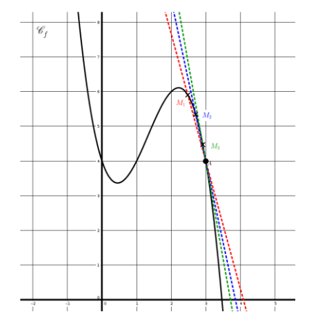
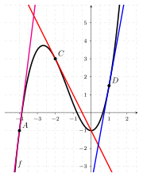

```css
```
```{=html}
<style>
:root {
  --def-color:   #2563eb;
  --prop-color:  #7c3aed;
  --theo-color:  #c026d3;
  --voc-color:   #0d9488;
  --rem-color:   #d97706;
  --ex-color:    #16a34a;
  --app-color:   #ea580c;
  --not-color:   #4f46e5;
  --meth-color:  #dc2626;
  --ill-color:   #475569;
}

.definition, .proposition, .theoreme, .vocabulaire, .remarque, .exemple, .application,
.notation, .methode, .illustration {
  margin: 1.5em 0;
  padding: 1em 1.3em 1em 1.3em;
  border-radius: 10px;
  border-left: 6px solid;
  box-shadow: 0 1px 4px rgba(0,0,0,0.08);
  font-family: "Georgia", serif;
}

.definition::before, .proposition::before, .theoreme::before, .vocabulaire::before,
.remarque::before, .exemple::before, .application::before,
.notation::before, .methode::before, .illustration::before {
  display: block;
  font-family: "Helvetica Neue", Arial, sans-serif;
  font-weight: 700;
  font-size: 0.95em;
  letter-spacing: 0.03em;
  text-transform: uppercase;
  margin-bottom: 0.6em;
}

.definition {
  background: #eff6ff;
  border-color: var(--def-color);
  color: #1e3a5f;
}
.definition::before {
  content: "📘  Définition";
  color: var(--def-color);
}

.proposition {
  background: #f5f3ff;
  border-color: var(--prop-color);
  color: #3b2467;
}
.proposition::before {
  content: "📐  Proposition";
  color: var(--prop-color);
}

.theoreme {
  background: #fdf4ff;
  border-color: var(--theo-color);
  color: #701a75;
}
.theoreme::before {
  content: "🏛️  Théorème";
  color: var(--theo-color);
}

.vocabulaire {
  background: #f0fdfa;
  border-color: var(--voc-color);
  color: #0f4c46;
}
.vocabulaire::before {
  content: "🏷️  Vocabulaire";
  color: var(--voc-color);
}

.remarque {
  background: #fffbeb;
  border-color: var(--rem-color);
  color: #6b4a06;
}
.remarque::before {
  content: "💡  Remarque";
  color: var(--rem-color);
}

.exemple {
  background: #f0fdf4;
  border-color: var(--ex-color);
  color: #14532d;
}
.exemple::before {
  content: "🔍  Exemple";
  color: var(--ex-color);
}

.application {
  background: #fff7ed;
  border: 2px dashed var(--app-color);
  border-left: 6px solid var(--app-color);
  color: #7c2d12;
}
.application::before {
  content: "✏️  Application";
  color: var(--app-color);
  font-size: 1.05em;
}

.notation {
  background: #eef2ff;
  border-color: var(--not-color);
  color: #312e81;
}
.notation::before {
  content: "🖊️  Notation";
  color: var(--not-color);
}

.methode {
  background: #fef2f2;
  border-color: var(--meth-color);
  color: #7f1d1d;
}
.methode::before {
  content: "🧭  Méthode";
  color: var(--meth-color);
}

.illustration {
  background: #f8fafc;
  border-color: var(--ill-color);
  color: #1e293b;
}
.illustration::before {
  content: "🖼️  Illustration";
  color: var(--ill-color);
}

/* Callouts "Solution" un peu plus stylés */
div.callout-caution {
  border-radius: 10px;
  box-shadow: 0 1px 4px rgba(0,0,0,0.08);
}
div.callout-caution .callout-title {
  font-family: "Helvetica Neue", Arial, sans-serif;
  font-weight: 700;
}
div.callout-caution .callout-title::before {
  content: "🔓  ";
}
</style>
```

# Nombre dérivé

## Introduction

On considère une fonction $f$ définie sur $\mathbb{R}$ dont la représentation graphique est donnée ci-contre.\
L'objectif est de rendre compte, par un nombre, comme pour les fonctions affines, des variations de cette fonction.\
Il n'est pas possible, comme pour les fonctions affines, d'avoir un nombre qui aurait le même rôle que le coefficient directeur de la droite représentative de la fonction.\
Cependant, on peut examiner ce qui se passe au voisinage d'un point. Étudions cela au « voisinage » du point $A(1;f(1))$. Pour cela, on peut zoomer sur la partie de la courbe qui nous intéresse. Il est alors possible d'approcher cette partie de courbe par une droite et d'en lire son coefficient directeur. Plus on zoome, plus la droite semble être proche de la courbe.

{width="65%" fig-align="center"}

{width="65%" fig-align="center"}

Intuitivement, on appelle nombre dérivé de la fonction en un point, le coefficient directeur de la droite la plus proche de la courbe en ce point. Cette droite se rapproche de la courbe à mesure que le point $M$ se rapproche du point $A$.

{width="65%" fig-align="center"}

## Nombre dérivé

::: {.definition}
Soit $f$ une fonction définie sur un intervalle $I$ de $\mathbb{R}$. Soient $a$ et $h$ deux réels avec $h \neq 0$ tels que $a\in I$ et $a+h\in I$.\
Le taux d'accroissement (ou taux de variation) de $f$ entre $a$ et $a+h$ est le réel noté $\tau(h)$ tel que: $$\tau(h)=\dfrac{f(a+h)-f(a)}{a+h-a}=\dfrac{f(a+h)-f(a)}{h}$$
:::

::: {.remarque}
Avec les mêmes notations, on considère deux points $A(a;f(a))$ et $B(a+h;f(a+h))$.\
Le taux d'accroissement de $f$ entre $a$ et $a+h$ correspond au coefficient directeur de la droite $(AB)$.
:::

::: {.illustration}
{width="65%" fig-align="center"}
:::

::: {.application}
On considère la fonction $f$ définie sur $\mathbb{R}$ par $f(x)=x^2$. Soit $h\in\mathbb{R}^*$. Déterminer le taux d'accroissement de $f$ entre $1$ et $1+h$.
:::

::: {.callout-caution collapse="true"}
## Solution

On note $A(1;1)$ et $M(1+h;(1+h)^2)$ deux points appartenant à la parabole représentative de $f$. Le taux d'accroissement de $f$ entre $1$ et $1+h$ est: $$\tau(h)=\dfrac{(1+h)^2-1}{h}=\dfrac{2h+h^2}{h}=2+h$$ Ce taux d'accroissement correspond au coefficient directeur de la droite $(AM)$.\
:::

::: {.definition}
En utilisant les mêmes notations:\
Si le taux d'accroissement $\dfrac{f(a+h)-f(a)}{h}$ de $f$ entre $a$ et $a+h$, tend vers un réel $\ell$ lorsque $h$ tend vers 0, on dit que:

-   $f$ est dérivable en $a$.

-   $\ell$ est appelé le nombre dérivé de $f$ en $a$ et on note $f'(a)=\ell$

On écrit alors $f'(a)=\lim\limits_{h \rightarrow 0} \dfrac{f(a+h)-f(a)}{h}$
:::

::: {.application}
On considère la fonction $f$ définie sur $\mathbb{R}$ par $f(x)=x^2$. À partir de l'application précédente, déterminer $f'(1)$.
:::

::: {.callout-caution collapse="true"}
## Solution

Le taux d'accroissement de $f$ entre 1 et $1+h$ est : $$\tau(h)=2+h$$ Or $\lim\limits_{h \rightarrow 0}(2+h)=2$ donc $f'(1)=2$.
:::

::: {.application}
Déterminer le nombre dérivé de la fonction carré en 3.
:::

::: {.definition}
Lorsqu'une fonction est dérivable en tout réel d'un intervalle, on dit qu'elle est dérivable sur cet intervalle.
:::

## Tangente à une courbe

Soit $f$ une fonction dérivable sur un intervalle $I$. Soit $A(a;f(a))$ avec $a\in I$.

::: {.definition}
On appelle tangente à la courbe représentative de $f$ en $A$ la droite passant par $A$ et de coefficient directeur $f'(a)$.
:::

::: {.proposition}
L'équation de la tangente à la courbe représentative de $f$ en $A$ est: $$y=f'(a)(x-a)+f(a)$$
:::

::: {.callout-caution collapse="true"}
## Solution

Soit $T$ la tangente à la courbe représentative de $f$ au point $A(a, f(a))$. Le coefficient directeur de $T$ est $m = f'(a)$.

L'équation de la droite est $y = f'(a)x + p$.

Comme $T$ passe par $A(a, f(a))$, on a : $$\begin{aligned}
f(a) &= f'(a)a + p \\
p &= f(a) - f'(a)a
\end{aligned}$$

On substitue $p$ dans l'équation de la tangente : $$\begin{aligned}
y &= f'(a)x + \left(f(a) - f'(a)a\right) \\
y &= f'(a)x - f'(a)a + f(a) \\
\mathbf{y} &= \mathbf{f'(a)(x - a) + f(a)}
\end{aligned}$$
:::

::: {.application}
Déterminer l'équation de la tangente à la courbe représentative de la fonction carré au point d'abscisse 3.
:::

::: {.application}
{width="70%" fig-align="center"}

Déterminer, par lecture graphique:

-   $f'(1)$

-   $f'(-2)$

-   $f'(-4)$

-   $f(0)$

-   $f(-2)$
:::

# Fonction dérivée

::: {.definition}
Soit $f$ une fonction dérivable sur un intervalle $I$.\
On appelle fonction dérivée de $f$ la fonction, notée $f'$, définie sur $I$ par $f':x \mapsto f'(x)$.
:::

::: {.proposition}
Voici les fonctions dérivées des principales fonctions :

|           **Fonction $f(x)$**           | **Ensemble de dérivabilité** | **Fonction dérivée $f'(x)$** |
|:---------------------------------------:|:----------------------------:|:----------------------------:|
|      $k \quad (k \in \mathbb{R})$       |         $\mathbb{R}$         |             $0$              |
|                   $x$                   |         $\mathbb{R}$         |             $1$              |
|                  $x^2$                  |         $\mathbb{R}$         |             $2x$             |
| $x^n \quad (n \ge 1, n \in \mathbb{N})$ |         $\mathbb{R}$         |          $nx^{n-1}$          |
|     $\frac{1}{x} \quad (x \neq 0)$      |        $\mathbb{R}^*$        |       $-\frac{1}{x^2}$       |
|    $\sqrt{x} \quad (x \geqslant 0)$     |      $\mathbb{R}^{+*}$       |    $\frac{1}{2\sqrt{x}}$     |
:::

::: {.application}
Soit $f$ la fonction définie sur $\mathbb{R}$ par $f(x)=x^4$. Déterminer la fonction dérivée de $f$.
:::

# Dérivées et opérations

::: {.proposition}
Produit par une constante et somme\
Soient $u$ et $v$ deux fonctions dérivables sur un intervalle $I$.

-   Si $f$ est une fonction de la forme $f(x) = k \times u(x)$ où $k$ est une constante, alors $f$ est dérivable sur $I$ et $$f'(x) = k \times u'(x)$$

-   Si $f$ est une fonction de la forme $f(x) = u(x) + v(x)$ alors $f$ est dérivable sur $I$ et $$f'(x) = u'(x) + v'(x)$$
:::

::: {.application}
Dériver la fonction $f$ définie sur $\mathbb{R}$ par $f(x) = -4x^2$.
:::

::: {.callout-caution collapse="true"}
## Solution

1.  **Reconnaître la forme:** $f$ est de la forme $k \times u(x)$ avec $k = -4$ et $u(x) = x^2$.

2.  **Dériver la fonction $u$:** $u'(x) = 2x$.

3.  **Donner la formule:** $f'(x) = k \times u'(x)$.

4.  **Remplacer et calculer:** $f'(x) = -4 \times (2x) = -8x$.
:::

::: {.application}
Dériver la fonction $f$ définie sur $\mathbb{R}$ par $f(x) = x^3 + x$.
:::

::: {.callout-caution collapse="true"}
## Solution

1.  **Reconnaître la forme:** $f$ est de la forme $u(x) + v(x)$ avec $u(x) = x^3$ et $v(x) = x$.

2.  **Dériver $u$ et $v$:** $u'(x) = 3x^2$ et $v'(x) = 1$.

3.  **Donner la formule:** $f'(x) = u'(x) + v'(x)$.

4.  **Remplacer et calculer:** $f'(x) = 3x^2 + 1$.
:::

::: {.proposition}
Toutes les fonctions polynômes sont dérivables sur $\mathbb{R}$.
:::

::: {.proposition}
Produit et quotient\
Soient $u$ et $v$ deux fonctions dérivables sur un intervalle $I$.

-   Si $f$ est une fonction de la forme $f(x) = u(x) \times v(x)$, alors $f$ est dérivable sur $I$ et $$f'(x) = u'(x)v(x) + u(x)v'(x)$$

-   Si $f$ est une fonction de la forme $f(x) = \frac{1}{v(x)}$ avec $v(x) \neq 0$ sur $I$, alors $f$ est dérivable sur $I$ et $$f'(x) = -\frac{v'(x)}{[v(x)]^2}$$

-   Si $f$ est une fonction de la forme $f(x) = \frac{u(x)}{v(x)}$ avec $v(x) \neq 0$ sur $I$, alors $f$ est dérivable sur $I$ et $$f'(x) = \frac{u'(x)v(x) - u(x)v'(x)}{[v(x)]^2}$$
:::

::: {.application}
Dériver la fonction $f$ définie sur $\mathbb{R}$ par $f(x) = (x^2 + 1)(4x - 3)$.
:::

::: {.callout-caution collapse="true"}
## Solution

1.  **Reconnaître la forme:** $f$ est de la forme $f(x) = u(x) \times v(x)$ avec $u(x) = x^2 + 1$ et $v(x) = 4x - 3$.

2.  **Dériver $u$ et $v$:** $u$ et $v$ sont dérivables sur $\mathbb{R}$ et $u'(x) = 2x$ et $v'(x) = 4$.

3.  **Calculer $f'(x)$:** $$\begin{aligned}
            f'(x) &= u'(x)v(x) + u(x)v'(x) \\
            &= 2x \times (4x - 3) + (x^2 + 1) \times 4 \\
            &= 8x^2 - 6x + 4x^2 + 4 \\
            &= 12x^2 - 6x + 4

    \end{aligned}$$
:::

::: {.application}
Dériver la fonction $f$ définie sur $\mathbb{R} \setminus \{3\}$ par $f(x) = \frac{2x + 1}{x - 3}$.
:::

::: {.callout-caution collapse="true"}
## Solution

1.  **Reconnaître la forme:** $f$ est de la forme $f(x) = \frac{u(x)}{v(x)}$ avec $u(x) = 2x + 1$ et $v(x) = x - 3$.

2.  **Dériver $u$ et $v$:** $u$ et $v$ sont dérivables sur $\mathbb{R} \setminus \{3\}$ et $u'(x) = 2$ et $v'(x) = 1$.

3.  **Calculer $f'(x)$:** $$\begin{aligned}
            f'(x) &= \frac{u'(x)v(x) - u(x)v'(x)}{[v(x)]^2} \\
            &= \frac{2 \times (x - 3) - (2x + 1) \times 1}{(x - 3)^2} \\
            &= \frac{2x - 6 - 2x - 1}{(x - 3)^2} \\
            &= -\frac{7}{(x - 3)^2}

    \end{aligned}$$
:::

# Dérivation de fonctions composées : $f(x) = g(ax+b)$

::: {.proposition}
Si $g$ est une fonction dérivable sur un intervalle $J$, et si $a$ et $b$ sont deux nombres réels tels que pour tout $x$ dans l'intervalle $I$, $ax+b$ appartient à $J$, alors la fonction $f : x \mapsto g(ax+b)$ est dérivable sur $I$ et, pour tout réel $x$ de $I$, on a : $$f'(x) = a \times g'(ax+ b)$$
:::

::: {.application}
Déterminer la fonction dérivée de la fonction définie sur $]-\frac{2}{5};+\infty[$ par $f(x) = \sqrt{5x+2}$.
:::

::: {.callout-caution collapse="true"}
## Solution

La fonction définie sur $]-\frac{2}{5};+\infty[$ par $f(x) = \sqrt{5x+2}$ est la composée de la fonction affine $u$ telle que $u(x)=5x+2$ par la fonction $g$ telle que $g(x)=\sqrt{x}$.

-   La fonction $u$ est dérivable sur $\mathbb{R}$ et strictement positive sur $]-\frac{2}{5};+\infty[$.

-   La fonction $g$ est dérivable sur $]0;+\infty[$ avec $g'(x) = \frac{1}{2\sqrt{x}}$.

-   Par composition, $f$ est dérivable sur $]-\frac{2}{5};+\infty[$.

Pour tout $x \in ]-\frac{2}{5};+\infty[$, on applique la formule avec $a=5$: $$f'(x) = 5 \times g'(5x+2) = 5 \times \frac{1}{2\sqrt{5x+2}} = \frac{5}{2\sqrt{5x+2}}$$
:::

::: {.application}
Déterminer la fonction dérivée de la fonction définie sur $\mathbb{R}$ par $f(x)=(3x+1)^4$.
:::

::: {.callout-caution collapse="true"}
## Solution

La fonction définie sur $\mathbb{R}$ par $f(x)=(3x+1)^4$ est la composée de la fonction affine $u$ telle que $u(x)=3x+1$ par la fonction $g$ telle que $g(x)=x^4$.

-   La fonction $u$ est dérivable sur $\mathbb{R}$.

-   La fonction $g$ est dérivable sur $\mathbb{R}$ avec $g'(x) = 4x^3$.

-   Par composition, $f$ est dérivable sur $\mathbb{R}$.

Pour tout $x$ réel, on applique la formule avec $a=3$: $$f'(x) = 3 \times g'(3x+1) = 3 \times 4(3x+1)^3 = 12(3x+1)^3$$
:::
