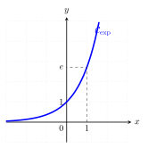
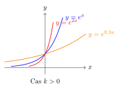
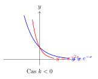

```css
```
```{=html}
<style>
:root {
  --def-color:   #2563eb;
  --prop-color:  #7c3aed;
  --theo-color:  #c026d3;
  --voc-color:   #0d9488;
  --rem-color:   #d97706;
  --ex-color:    #16a34a;
  --app-color:   #ea580c;
  --not-color:   #4f46e5;
  --meth-color:  #dc2626;
  --ill-color:   #475569;
}

.definition, .proposition, .theoreme, .vocabulaire, .remarque, .exemple, .application,
.notation, .methode, .illustration {
  margin: 1.5em 0;
  padding: 1em 1.3em 1em 1.3em;
  border-radius: 10px;
  border-left: 6px solid;
  box-shadow: 0 1px 4px rgba(0,0,0,0.08);
  font-family: "Georgia", serif;
}

.definition::before, .proposition::before, .theoreme::before, .vocabulaire::before,
.remarque::before, .exemple::before, .application::before,
.notation::before, .methode::before, .illustration::before {
  display: block;
  font-family: "Helvetica Neue", Arial, sans-serif;
  font-weight: 700;
  font-size: 0.95em;
  letter-spacing: 0.03em;
  text-transform: uppercase;
  margin-bottom: 0.6em;
}

.definition {
  background: #eff6ff;
  border-color: var(--def-color);
  color: #1e3a5f;
}
.definition::before {
  content: "📘  Définition";
  color: var(--def-color);
}

.proposition {
  background: #f5f3ff;
  border-color: var(--prop-color);
  color: #3b2467;
}
.proposition::before {
  content: "📐  Proposition";
  color: var(--prop-color);
}

.theoreme {
  background: #fdf4ff;
  border-color: var(--theo-color);
  color: #701a75;
}
.theoreme::before {
  content: "🏛️  Théorème";
  color: var(--theo-color);
}

.vocabulaire {
  background: #f0fdfa;
  border-color: var(--voc-color);
  color: #0f4c46;
}
.vocabulaire::before {
  content: "🏷️  Vocabulaire";
  color: var(--voc-color);
}

.remarque {
  background: #fffbeb;
  border-color: var(--rem-color);
  color: #6b4a06;
}
.remarque::before {
  content: "💡  Remarque";
  color: var(--rem-color);
}

.exemple {
  background: #f0fdf4;
  border-color: var(--ex-color);
  color: #14532d;
}
.exemple::before {
  content: "🔍  Exemple";
  color: var(--ex-color);
}

.application {
  background: #fff7ed;
  border: 2px dashed var(--app-color);
  border-left: 6px solid var(--app-color);
  color: #7c2d12;
}
.application::before {
  content: "✏️  Application";
  color: var(--app-color);
  font-size: 1.05em;
}

.notation {
  background: #eef2ff;
  border-color: var(--not-color);
  color: #312e81;
}
.notation::before {
  content: "🖊️  Notation";
  color: var(--not-color);
}

.methode {
  background: #fef2f2;
  border-color: var(--meth-color);
  color: #7f1d1d;
}
.methode::before {
  content: "🧭  Méthode";
  color: var(--meth-color);
}

.illustration {
  background: #f8fafc;
  border-color: var(--ill-color);
  color: #1e293b;
}
.illustration::before {
  content: "🖼️  Illustration";
  color: var(--ill-color);
}

/* Callouts "Solution" un peu plus stylés */
div.callout-caution {
  border-radius: 10px;
  box-shadow: 0 1px 4px rgba(0,0,0,0.08);
}
div.callout-caution .callout-title {
  font-family: "Helvetica Neue", Arial, sans-serif;
  font-weight: 700;
}
div.callout-caution .callout-title::before {
  content: "🔓  ";
}
</style>
```

# Fonction exponentielle

## Définition

::: {.proposition}
(Admise)\
Il existe une unique fonction $f$ définie et dérivable sur $\mathbb{R}$ telle que $f(0)=1$ et $f'=f$.\
:::

::: {.definition}
Cette fonction est appelée fonction exponentielle et se note $\exp$.
:::

::: {.remarque}
Par sa propriété d'être égale à sa dérivée, la fonction exponentielle joue un rôle très important dans la résolution des équations différentielles (cf. terminale).
:::

::: {.application}
Pour chacune des fonctions suivantes définies sur $\mathbb{R}$, déterminer l'expression de sa fonction dérivée :

-   $f(x)=5\exp(x)+x$

-   $g(x)=(3x-1)\exp(x)$\
:::

::: {.callout-caution collapse="true"}
## Solution

-   $f(x)=5\exp(x)+x \implies f'(x)=5\exp(x)+1$

-   $g(x)=(3x-1)\exp(x)$\
    $g'(x)=3\exp(x)+(3x-1)\exp(x)$\
    donc $g'(x)=(3x+2)\exp(x)$
:::

## Propriétés algébriques

::: {.proposition}
(Propriété admise)\
Pour tous réels $x$ et $y$, $\exp(x+y)=\exp(x) \times \exp(y)$.
:::

::: {.remarque}
Cette relation permet de transformer une somme en un produit et réciproquement.
:::

::: {.proposition}
Pour tous réels $x$ et $y$ et pour tout entier relatif $n$ :

-   $\exp(-x) = \dfrac{1}{\exp(x)}$

-   $\exp(x-y) = \dfrac{\exp(x)}{\exp(y)}$

-   $(\exp(x))^n = \exp(nx)$
:::

::: {.callout-caution collapse="true"}
## Solution

-   Pour tout réel $x$ : $$\begin{aligned}
        \exp(x-x) &= \exp(0) = 1 \\
        \text{Or, } \exp(x-x) &= \exp(x + (-x)) = \exp(x) \times \exp(-x) \\
        \text{D'où } \exp(x) \times \exp(-x) &= 1 \\
        \exp(-x) &= \dfrac{1}{\exp(x)}

    \end{aligned}$$

-   Pour tous réels $x$ et $y$ : $$\begin{aligned}
        \exp(x-y) &= \exp(x + (-y)) \\
        &= \exp(x) \times \exp(-y) \\
        &= \exp(x) \times \dfrac{1}{\exp(y)} \\
        &= \dfrac{\exp(x)}{\exp(y)}

    \end{aligned}$$
:::

::: {.application}
Simplifier les expressions suivantes :

-   $A = \exp(x+1) \times \exp(x-1)$

-   $B = (\exp(x))^2 \times \exp(3x)$

-   $C = \dfrac{\exp(x-1)}{\exp(x+2)}$
:::

::: {.callout-caution collapse="true"}
## Solution

-   $A = \exp(x+1) \times \exp(x-1) = \exp(x+1+x-1) = \exp(2x)$

-   $B = (\exp(x))^2 \times \exp(3x) = \exp(2x) \times \exp(3x) = \exp(5x)$

-   $C = \dfrac{\exp(x-1)}{\exp(x+2)} = \exp((x-1)-(x+2)) = \exp(-3)$
:::

# Notation e

## Définition

::: {.definition}
L'image de 1 par la fonction exponentielle est notée $e$. Ainsi, $\exp(1)=e$.\
À la calculatrice, $e \approx 2{,}718$.
:::

::: {.notation}
Pour tout réel $x$, on note $\exp(x) = e^x$.
:::

## Propriétés

::: {.proposition}
Pour tous réels $x$, $y$ et tout entier relatif $n$ :

-   $e^0=1$ et $e^1=e$

-   $e^{x+y} = e^x \times e^y$

-   $e^{-x} = \dfrac{1}{e^x}$

-   $e^{x-y} = \dfrac{e^x}{e^y}$

-   $(e^x)^n = e^{nx}$

-   $\sqrt{e} = e^{1/2}$
:::

# Exponentielle et suite géométrique

::: {.proposition}
Soit $k \in \mathbb{R}$. La suite $(u_n)$ définie pour tout entier naturel $n$ par $u_n = e^{nk}$ est une suite géométrique de raison $e^k$ et de premier terme $u_0=1$.
:::

::: {.application}
Soit $u_n = 10e^{3n}$.

1.  Calculer $u_0$

2.  Montrer que $(u_n)$ est une suite géométrique dont on précisera le premier terme et la raison.

3.  Sachant que $e^3\approx 20$, justifier que la suite $(u_n)$ est croissante.
:::

::: {.callout-caution collapse="true"}
## Solution

1.  $u_0 = 10e^{3 \times 0} = 10e^0 = 10$.

2.  $u_{n+1} = 10e^{3(n+1)} = 10e^{3n+3} = 10e^{3n} \times e^3 = u_n \times e^3$. La suite est géométrique de raison $e^3$ et de premier terme $u_0=10$.

3.  Comme $u_0 = 10 > 0$ et $e^3 > 1$, la suite est strictement croissante.
:::

# Étude de la fonction exponentielle

## Signe et sens de variation

::: {.proposition}
La fonction exponentielle est strictement positive sur $\mathbb{R}$ : pour tout réel $x$, $e^x > 0$.
:::

::: {.callout-caution collapse="true"}
## Solution

D'après la propriété algébrique : $$\begin{aligned}
e^x &= e^{x/2 + x/2} \\
e^x &= (e^{x/2})^2
\end{aligned}$$ Un carré étant toujours positif ou nul, $e^x \geqslant 0$. Comme la fonction exponentielle ne s'annule jamais (puisque $e^x \times e^{-x} = 1$), on en déduit que $e^x > 0$.
:::

::: {.proposition}
La fonction exponentielle est strictement croissante sur $\mathbb{R}$.
:::

::: {.callout-caution collapse="true"}
## Solution

La fonction exponentielle est dérivable sur $\mathbb{R}$ et sa dérivée est elle-même ($f'=f$).\
Or, on vient de démontrer que pour tout réel $x$, $e^x > 0$.\
La dérivée étant strictement positive sur $\mathbb{R}$, la fonction exponentielle est strictement croissante sur $\mathbb{R}$.
:::

## Représentation graphique

{width="70%" fig-align="center"}

La courbe $\mathcal{C}_{\exp}$ passe par les points $A(0;1)$ et $B(1;e)$. Elle est située strictement au-dessus de l'axe des abscisses. La tangente en $A(0;1)$ a pour coefficient directeur $e^0=1$. Son équation est $y=x+1$.

::: {.application}
Soit $f$ la fonction définie sur $\mathbb{R}$ par $f(x)=(x+1)e^x$.

1.  Calculer la dérivée de la fonction $f$.

2.  Dresser le tableau de variations de la fonction $f$.

3.  Déterminer une équation de la tangente à la courbe de $f$ au point d'abscisse 0.

4.  Tracer la courbe représentative de la fonction $f$ en vous aidant de la calculatrice.
:::

## Résolution d'équations et d'inéquations

::: {.proposition}
Pour tous réels $x$ et $y$ :

-   $e^x = e^y \iff x = y$

-   $e^x < e^y \iff x < y$
:::

::: {.application}
Résoudre les équations et inéquations suivantes :

1.  $e^{2x+1}=e^{x-1}$

2.  $e^{x^2-3}-e^{-2x}=0$

3.  $e^{2x+1}\leqslant e^{x-2}$

4.  $e^{4x-1} \geqslant 1$

5.  $e^{x^2-4}>1$
:::

# Fonction $x \mapsto e^{ax+b}$

::: {.proposition}
Soient $a$ et $b$ deux réels. La fonction $f$ définie sur $\mathbb{R}$ par $f(x) = e^{ax+b}$ est dérivable sur $\mathbb{R}$ et pour tout réel $x$ : $$f'(x) = a e^{ax+b}$$
:::

::: {.exemple}
Soit $f(x) = e^{4x+3}$, alors $f'(x) = 4e^{4x+3}$.
:::

::: {.proposition}
Soit $k \in \mathbb{R}$ et $f$ la fonction définie sur $\mathbb{R}$ par $f(x) = e^{kx}$.

-   Si $k > 0$, alors $f$ est strictement croissante sur $\mathbb{R}$.

-   Si $k < 0$, alors $f$ est strictement décroissante sur $\mathbb{R}$.
:::

::: {.callout-caution collapse="true"}
## Solution

$f$ est dérivable sur $\mathbb{R}$ et $f'(x) = k e^{kx}$.\
Comme $e^{kx} > 0$ pour tout réel $x$, $f'(x)$ est du signe de $k$ :

-   Si $k > 0$, alors $f'(x) > 0$ et $f$ est strictement croissante.

-   Si $k < 0$, alors $f'(x) < 0$ et $f$ est strictement décroissante.
:::

::: {.illustration}
Représentations graphiques selon le signe de $k$ :

{width="70%" fig-align="center"} {width="70%" fig-align="center"}
:::

::: {.application}
Soit $f$ la fonction définie sur $\mathbb{R}$ par $f(x)=xe^{-\frac{x}{2}}$.

1.  Calculer la dérivée de la fonction $f$.

2.  Dresser le tableau de variations de la fonction $f$.
:::
