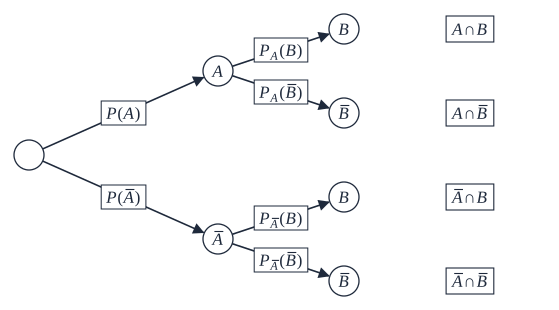
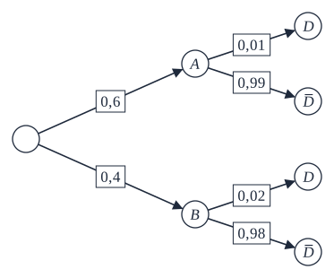
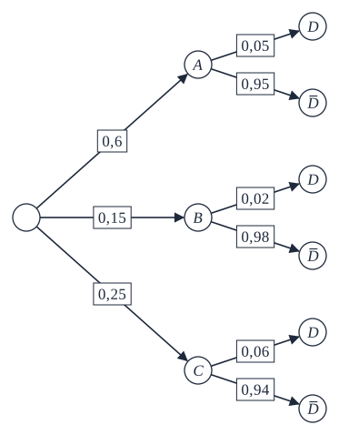
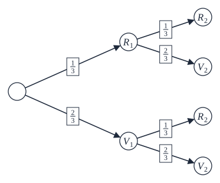

```css
```
```{=html}
<style>
:root {
  --def-color:   #2563eb;
  --prop-color:  #7c3aed;
  --voc-color:   #0d9488;
  --rem-color:   #d97706;
  --ex-color:    #16a34a;
  --app-color:   #ea580c;
  --not-color:   #4f46e5;
  --meth-color:  #dc2626;
  --ill-color:   #475569;
}

.definition, .proposition, .vocabulaire, .remarque, .exemple, .application,
.notation, .methode, .illustration {
  margin: 1.5em 0;
  padding: 1em 1.3em 1em 1.3em;
  border-radius: 10px;
  border-left: 6px solid;
  box-shadow: 0 1px 4px rgba(0,0,0,0.08);
  font-family: "Georgia", serif;
}

.definition::before, .proposition::before, .vocabulaire::before,
.remarque::before, .exemple::before, .application::before,
.notation::before, .methode::before, .illustration::before {
  display: block;
  font-family: "Helvetica Neue", Arial, sans-serif;
  font-weight: 700;
  font-size: 0.95em;
  letter-spacing: 0.03em;
  text-transform: uppercase;
  margin-bottom: 0.6em;
}

.definition {
  background: #eff6ff;
  border-color: var(--def-color);
  color: #1e3a5f;
}
.definition::before {
  content: "📘  Définition";
  color: var(--def-color);
}

.proposition {
  background: #f5f3ff;
  border-color: var(--prop-color);
  color: #3b2467;
}
.proposition::before {
  content: "📐  Proposition";
  color: var(--prop-color);
}

.vocabulaire {
  background: #f0fdfa;
  border-color: var(--voc-color);
  color: #0f4c46;
}
.vocabulaire::before {
  content: "🏷️  Vocabulaire";
  color: var(--voc-color);
}

.remarque {
  background: #fffbeb;
  border-color: var(--rem-color);
  color: #6b4a06;
}
.remarque::before {
  content: "💡  Remarque";
  color: var(--rem-color);
}

.exemple {
  background: #f0fdf4;
  border-color: var(--ex-color);
  color: #14532d;
}
.exemple::before {
  content: "🔍  Exemple";
  color: var(--ex-color);
}

.application {
  background: #fff7ed;
  border: 2px dashed var(--app-color);
  border-left: 6px solid var(--app-color);
  color: #7c2d12;
}
.application::before {
  content: "✏️  Application";
  color: var(--app-color);
  font-size: 1.05em;
}

.notation {
  background: #eef2ff;
  border-color: var(--not-color);
  color: #312e81;
}
.notation::before {
  content: "🖊️  Notation";
  color: var(--not-color);
}

.methode {
  background: #fef2f2;
  border-color: var(--meth-color);
  color: #7f1d1d;
}
.methode::before {
  content: "🧭  Méthode";
  color: var(--meth-color);
}

.illustration {
  background: #f8fafc;
  border-color: var(--ill-color);
  color: #1e293b;
}
.illustration::before {
  content: "🖼️  Illustration";
  color: var(--ill-color);
}

/* Callouts "Solution" un peu plus stylés */
div.callout-caution {
  border-radius: 10px;
  box-shadow: 0 1px 4px rgba(0,0,0,0.08);
}
div.callout-caution .callout-title {
  font-family: "Helvetica Neue", Arial, sans-serif;
  font-weight: 700;
}
div.callout-caution .callout-title::before {
  content: "🔓  ";
}
</style>
```


\gdef\N{\mathbb{N}}

Dans tout le chapitre, on considère une expérience aléatoire d'univers $\Omega$, deux événements $A$ et $B$ de cette expérience et $P$ une probabilité sur $\Omega$.

# Probabilité conditionnelle

Dans cette partie, on suppose que $P(A)\neq 0$.

## Définition

::: {.definition}
La probabilité que l'événement $B$ se réalise sachant que l'événement $A$ est réalisé est appelée une probabilité conditionnelle. On la note $P_A(B)$ (se lit « $P$ de $B$ sachant $A$ »).
:::

::: {.exemple}
Le tableau ci-dessous concerne l'ensemble des adhérents « jeunes » d'un club de tennis :

|         | Benjamins | Minimes | Cadets | Total |
|---------|:---------:|:-------:|:------:|:-----:|
| Filles  | 16        | 22      | 14     | 52    |
| Garçons | 28        | 44      | 36     | 108   |
| Total   | 44        | 66      | 50     | 160   |

On prend au hasard la fiche d'un des adhérents et on considère les événements :

- $M$ : « L'adhérent est un minime » ;
- $G$ : « L'adhérent est un garçon » ;
- etc.

Donner la notation probabiliste ainsi que la valeur de la probabilité des événements suivants :

1. L'adhérent est minime sachant que c'est un garçon.
2. L'adhérent est un garçon sachant qu'il est minime.
3. L'adhérent est un cadet sachant que c'est une fille.
4. L'adhérent est une fille sachant qu'elle est benjamine.
:::

:::{.callout-caution collapse="true"}
## Solution

1. $P_G(M)=\dfrac{44}{108}=\dfrac{11}{27}$
2. $P_M(G)=\dfrac{44}{66}=\dfrac{2}{3}$
3. $P_F(C)=\dfrac{14}{52}=\dfrac{7}{26}$
4. $P_B(F)=\dfrac{16}{44}=\dfrac{4}{11}$
:::

## Propriétés

::: {.proposition}
**(admise)**

$$
P(A \cap B)=P(A)\times P_A(B)
$$
:::

::: {.remarque}
De la proposition précédente, on déduit également :

$$
P_A(B)=\dfrac{P(A\cap B)}{P(A)}
$$
:::

::: {.exemple}
À la montagne, 80 % des vacanciers pratiquent le ski alpin et 20 % la randonnée en raquettes. 60 % des skieurs et 50 % des marcheurs sont des hommes.

On choisit un vacancier au hasard et on considère les événements suivants :

- $S$ : « Le vacancier choisi pratique le ski » ;
- $H$ : « Le vacancier choisi est un homme ».

Donner la notation probabiliste ainsi que la valeur de la probabilité de l'événement « Le vacancier choisi est un homme qui pratique le ski ».
:::

:::{.callout-caution collapse="true"}
## Solution

$P(S\cap H)=P(S)\times P_S(H)=0{,}8 \times 0{,}6=0{,}48$
:::

# Arbres pondérés

## Règles de calcul sur un arbre

::: {.proposition}
**(admise)**

Dans un arbre pondéré :

- la somme des probabilités des branches issues d'un même nœud est égale à 1 ;
- la probabilité de l'événement correspondant à un chemin de l'arbre est égale au produit des probabilités inscrites sur les branches du chemin.
:::

::: {.illustration}
{fig-alt="Arbre pondéré général : A et A barre au premier niveau, B et B barre au second, avec les probabilités P(A), P(A barre) et les probabilités conditionnelles sur les branches" fig-align="center"}
:::

::: {.application}
Un fabricant de smartphones achète ses écrans chez deux fournisseurs :

- 60 % des écrans proviennent du fournisseur A ;
- le fournisseur A a un taux d'écrans défectueux de 1 % ;
- le fournisseur B a un taux d'écrans défectueux de 2 %.

On prélève au hasard un smartphone dans le stock du fabricant. On note :

- $A$ : « L'écran provient du fournisseur A » ;
- $B$ : « L'écran provient du fournisseur B » ;
- $D$ : « L'écran est défectueux ».

1. Représenter la situation à l'aide d'un arbre pondéré.
2. Donner la notation probabiliste ainsi que la valeur de la probabilité des événements suivants :
    a. « Le smartphone provient du fournisseur A et est défectueux » ;
    b. « Le smartphone provient du fournisseur B et n'est pas défectueux ».
:::

:::{.callout-caution collapse="true"}
## Solution

**1.**

{fig-alt="Arbre pondéré : A (0,6) puis D (0,01) ou D barre (0,99) ; B (0,4) puis D (0,02) ou D barre (0,98)" fig-align="center"}

**2.**

a. $P(A\cap D)=0{,}6 \times 0{,}01=0{,}006$. La probabilité que l'écran provienne du fournisseur A et soit défectueux est $0{,}006$.

b. $P(B\cap \overline{D})=0{,}4 \times 0{,}98=0{,}392$. La probabilité que l'écran provienne du fournisseur B et ne soit pas défectueux est $0{,}392$.
:::

## Formule des probabilités totales

::: {.definition}
Une partition de l'univers est un ensemble d'événements deux à deux incompatibles et dont la réunion est l'univers.
:::

::: {.exemple}
On lance un dé à six faces. L'univers est $\Omega=\{1;2;3;4;5;6\}$. On considère les événements :

- $A$ : « le résultat est pair » ;
- $B$ : « le résultat est impair ».

$A$ et $B$ forment une partition de $\Omega$.
:::

::: {.vocabulaire}
On dit aussi que les événements de la partition forment un système complet d'événements.
:::

::: {.remarque}
- Deux événements sont dits incompatibles si leur intersection est vide.
- Un événement $A$ et son événement contraire $\overline{A}$ forment une partition de l'univers.
:::

::: {.exemple}
Reprenons l'exemple précédent :

- $A=\{2;4;6\}$
- $B=\{1;3;5\}$

D'une part $A\cap B=\{2;4;6\}\cap\{1;3;5\}= \varnothing$ et d'autre part $A\cup B=\{2;4;6\}\cup\{1;3;5\}=\Omega$. $A$ et $B$ forment bien une partition de l'univers.

D'autre part $A \cap \overline{A}=\varnothing$ et $A\cup \overline{A}=\Omega$. De même, $A$ et $\overline{A}$ forment bien une partition de $\Omega$.
:::

## Cas particulier des probabilités totales

::: {.proposition}
**(admise)**

Soit $A$ un événement tel que $P(A)\neq 0$ (et donc $P(\overline{A})\neq 0$).

La probabilité d'un événement $B$ est donnée par la formule :

$$
P(B)=P(A\cap B)+P(\overline{A}\cap B) = P(A)\times P_A(B)+P(\overline{A})\times P_{\overline{A}}(B)
$$
:::

::: {.remarque}
Sur un arbre pondéré, la probabilité d'un événement $B$ s'obtient en additionnant les probabilités des chemins conduisant à la réalisation de $B$.
:::

::: {.application}
Reprenons l'application sur les écrans de smartphone.

Calculer la probabilité qu'un écran soit défectueux.
:::

:::{.callout-caution collapse="true"}
## Solution

Les événements $A$ et $B$ forment une partition de l'univers, donc d'après la formule des probabilités totales :

$$
P(D)=P(A\cap D)+P(B\cap D)=0{,}6\times 0{,}01 +0{,}4 \times 0{,}02 = 0{,}014
$$
:::

## Cas général

::: {.proposition}
**(admise)**

Soit $n \in \N^*$.

On considère une expérience aléatoire d'univers $\Omega$.

Soit $A_1$, $A_2$, ..., $A_n$ un système complet d'événements.

Pour tout événement $B$ de $\Omega$, on a :

$$
P(B)=P(A_1\cap B)+P(A_2\cap B)+\dots+P(A_n\cap B)
$$
:::

::: {.remarque}
D'après la proposition précédente, on a donc :

$$
P(B)=P(A_1) \times P_{A_1}(B)+P(A_2) \times P_{A_2}(B)+ \dots+P(A_n) \times P_{A_n}(B)
$$
:::

::: {.remarque}
Sur un arbre pondéré, la probabilité d'un événement correspondant à plusieurs chemins est égale à la somme des probabilités des chemins correspondant à cet événement.
:::

::: {.application}
Une entreprise fabrique des trottinettes électriques. Chacune d'entre elles est fabriquée sur l'un des trois sites A, B ou C de l'entreprise. Le site A assure 60 % de la production totale, le site B produit 15 % des trottinettes et le site C produit le reste.

Une étude a montré que, parmi les trottinettes provenant du site A, 5 % sont défectueuses contre 2 % pour celles du site B et 6 % pour celles du site C.

On choisit au hasard une trottinette dans l'ensemble de la production.

On note $A$, $B$, $C$ et $D$ les événements :

- $A$ : « la trottinette provient du site A » ;
- $B$ : « la trottinette provient du site B » ;
- $C$ : « la trottinette provient du site C » ;
- $D$ : « la trottinette est défectueuse ».

1. Justifier que les événements $A$, $B$ et $C$ forment une partition de l'univers.
2. Construire un arbre pondéré décrivant la situation.
3. Calculer la probabilité que la trottinette provienne du site A et soit défectueuse.
4. Calculer la probabilité que la trottinette soit défectueuse.
:::

:::{.callout-caution collapse="true"}
## Solution

**1.** Une trottinette ne peut avoir été fabriquée simultanément sur deux sites, donc les événements $A$, $B$ et $C$ sont incompatibles deux à deux. De plus, les sites A, B et C constituent la totalité des sites de l'entreprise, donc $A\cup B \cup C=\Omega$. Les événements $A$, $B$ et $C$ forment donc une partition de l'univers.

**2.**

{fig-alt="Arbre pondéré : A (0,6), B (0,15), C (0,25), puis D ou D barre avec 0,05/0,95, 0,02/0,98 et 0,06/0,94" fig-align="center"}

**3.** $P(A\cap D)=P(A)\times P_A(D)=0{,}6 \times 0{,}05=0{,}03$

**4.** Les événements $A$, $B$ et $C$ forment une partition de l'univers donc, d'après la formule des probabilités totales :

$$
P(D)=P(A\cap D)+P(B\cap D)+P(C\cap D)=0{,}6\times 0{,}05+0{,}15 \times 0{,}02+0{,}25 \times 0{,}06=0{,}048
$$
:::

# Notion d'indépendance

Dans cette partie, on suppose que $P(A)\neq 0$ et $P(B)\neq 0$.

## Événements indépendants

::: {.definition}
On dit que deux événements $A$ et $B$ sont indépendants lorsque

$$
P(B)=P_A(B)
$$
:::

::: {.remarque}
- L'égalité $P(B)=P_A(B)$ signifie que la réalisation de l'événement $A$ ne modifie pas la probabilité que l'événement $B$ se réalise.
- De manière symétrique, si $A$ et $B$ sont indépendants, on a également :

  $$
  P(A)=P_B(A)
  $$

- Il ne faut pas confondre événements indépendants et événements incompatibles.
:::

::: {.proposition}
$A$ et $B$ sont indépendants si et seulement si $P(A\cap B)=P(A) \times P(B)$.
:::

:::{.callout-caution collapse="true"}
## Solution

- $\Rightarrow$ Supposons que $A$ et $B$ sont indépendants.

  D'après la proposition du paragraphe « Propriétés », $P(A\cap B)=P(A) \times P_A(B)$.

  Or $A$ et $B$ sont indépendants donc $P_A(B)=P(B)$.

  Donc $P(A\cap B)=P(A) \times P(B)$.

- $\Leftarrow$ Supposons que $P(A\cap B)=P(A) \times P(B)$.

  D'après la proposition du paragraphe « Propriétés », $P(A\cap B)=P(A) \times P_A(B)$.

  Donc $P(A)\times P(B)=P(A) \times P_A(B)$ et donc $P(B)=P_A(B)$.

  Donc les événements $A$ et $B$ sont indépendants.
:::

::: {.application}
On tire au hasard une carte dans un jeu de 32 cartes. On considère les événements :

- $A$ : « la carte tirée est un as » ;
- $B$ : « la carte tirée est un cœur ».

Montrer que les événements $A$ et $B$ sont indépendants.
:::

:::{.callout-caution collapse="true"}
## Solution

- $P(A)=\dfrac{4}{32}=\dfrac{1}{8}$
- $P(B)=\dfrac{8}{32}=\dfrac{1}{4}$
- L'événement $A\cap B$ est « la carte tirée est l'as de cœur ».

  $P(A\cap B)=\dfrac{1}{32}$

Ainsi $P(A)\times P(B)=\dfrac{1}{8}\times\dfrac{1}{4}=\dfrac{1}{32}=P(A\cap B)$ et donc les événements $A$ et $B$ sont indépendants.
:::

::: {.proposition}
**(admise)**

Si $A$ et $B$ sont deux événements indépendants, alors $\overline{A}$ et $B$, $A$ et $\overline{B}$, ainsi que $\overline{A}$ et $\overline{B}$ sont également indépendants.
:::

## Succession de deux épreuves indépendantes

::: {.definition}
Lorsque deux expériences aléatoires se succèdent et que les résultats de la première expérience n'ont aucune influence sur les résultats de la seconde, on dit qu'il s'agit d'une succession de deux épreuves indépendantes.
:::

::: {.exemple}
Une urne contient deux boules vertes et une boule rouge.

On tire successivement et avec remise deux boules.

Le résultat du second tirage n'est pas influencé par celui du premier tirage car il y a remise. C'est une succession de deux épreuves indépendantes.

Soit $i\in \{1;2\}$. On note :

- $R_i$ : « La boule tirée est rouge au $i$-ième tirage » ;
- $V_i$ : « La boule tirée est verte au $i$-ième tirage ».

{fig-alt="Arbre de deux tirages avec remise : R1 (1/3) ou V1 (2/3), puis R2 (1/3) ou V2 (2/3)" fig-align="center"}

On remarque que la probabilité d'obtenir deux boules rouges est :

$$
P((R_1;R_2))=P(R_1)\times P(R_2)=\dfrac{1}{3}\times \dfrac{1}{3}=\dfrac{1}{9}
$$
:::

::: {.proposition}
**(admise)**

Lorsque deux épreuves sont indépendantes, la probabilité d'un couple de résultats est égale au produit des probabilités de chacun d'entre eux.
:::
