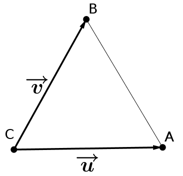
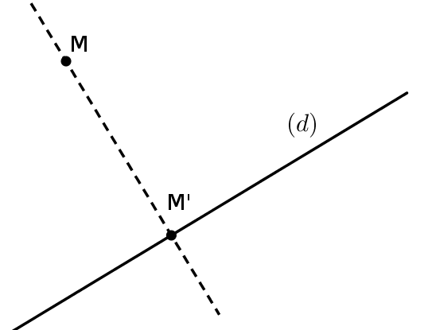
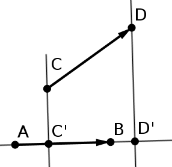
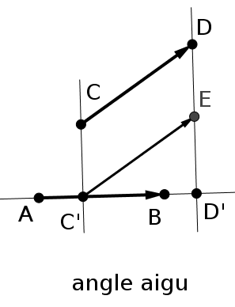
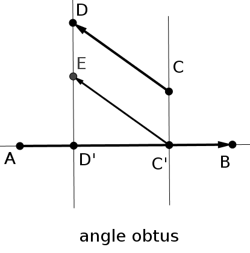
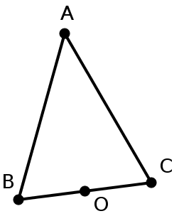
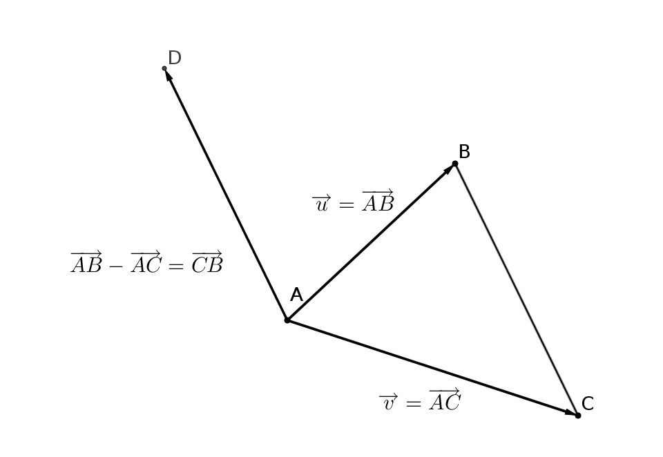
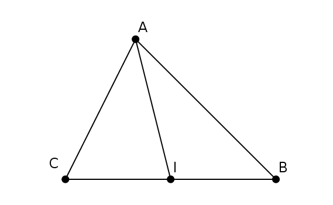

```css
```
```{=html}
<style>
:root {
  --def-color:   #2563eb;
  --prop-color:  #7c3aed;
  --theo-color:  #c026d3;
  --voc-color:   #0d9488;
  --rem-color:   #d97706;
  --ex-color:    #16a34a;
  --app-color:   #ea580c;
  --not-color:   #4f46e5;
  --meth-color:  #dc2626;
  --ill-color:   #475569;
}

.definition, .proposition, .theoreme, .vocabulaire, .remarque, .exemple, .application,
.notation, .methode, .illustration {
  margin: 1.5em 0;
  padding: 1em 1.3em 1em 1.3em;
  border-radius: 10px;
  border-left: 6px solid;
  box-shadow: 0 1px 4px rgba(0,0,0,0.08);
  font-family: "Georgia", serif;
}

.definition::before, .proposition::before, .theoreme::before, .vocabulaire::before,
.remarque::before, .exemple::before, .application::before,
.notation::before, .methode::before, .illustration::before {
  display: block;
  font-family: "Helvetica Neue", Arial, sans-serif;
  font-weight: 700;
  font-size: 0.95em;
  letter-spacing: 0.03em;
  text-transform: uppercase;
  margin-bottom: 0.6em;
}

.definition {
  background: #eff6ff;
  border-color: var(--def-color);
  color: #1e3a5f;
}
.definition::before {
  content: "📘  Définition";
  color: var(--def-color);
}

.proposition {
  background: #f5f3ff;
  border-color: var(--prop-color);
  color: #3b2467;
}
.proposition::before {
  content: "📐  Proposition";
  color: var(--prop-color);
}

.theoreme {
  background: #fdf4ff;
  border-color: var(--theo-color);
  color: #701a75;
}
.theoreme::before {
  content: "🏛️  Théorème";
  color: var(--theo-color);
}

.vocabulaire {
  background: #f0fdfa;
  border-color: var(--voc-color);
  color: #0f4c46;
}
.vocabulaire::before {
  content: "🏷️  Vocabulaire";
  color: var(--voc-color);
}

.remarque {
  background: #fffbeb;
  border-color: var(--rem-color);
  color: #6b4a06;
}
.remarque::before {
  content: "💡  Remarque";
  color: var(--rem-color);
}

.exemple {
  background: #f0fdf4;
  border-color: var(--ex-color);
  color: #14532d;
}
.exemple::before {
  content: "🔍  Exemple";
  color: var(--ex-color);
}

.application {
  background: #fff7ed;
  border: 2px dashed var(--app-color);
  border-left: 6px solid var(--app-color);
  color: #7c2d12;
}
.application::before {
  content: "✏️  Application";
  color: var(--app-color);
  font-size: 1.05em;
}

.notation {
  background: #eef2ff;
  border-color: var(--not-color);
  color: #312e81;
}
.notation::before {
  content: "🖊️  Notation";
  color: var(--not-color);
}

.methode {
  background: #fef2f2;
  border-color: var(--meth-color);
  color: #7f1d1d;
}
.methode::before {
  content: "🧭  Méthode";
  color: var(--meth-color);
}

.illustration {
  background: #f8fafc;
  border-color: var(--ill-color);
  color: #1e293b;
}
.illustration::before {
  content: "🖼️  Illustration";
  color: var(--ill-color);
}

/* Callouts "Solution" un peu plus stylés */
div.callout-caution {
  border-radius: 10px;
  box-shadow: 0 1px 4px rgba(0,0,0,0.08);
}
div.callout-caution .callout-title {
  font-family: "Helvetica Neue", Arial, sans-serif;
  font-weight: 700;
}
div.callout-caution .callout-title::before {
  content: "🔓  ";
}
</style>
```

# Rappels : angles orientés de vecteurs

::: {.definition}
Soient $\overrightarrow{u}$ et $\overrightarrow{v}$ deux vecteurs non nuls. On note $\mathcal{C}$ le cercle trigonométrique de centre $O$.\
On pose $\overrightarrow{u}=\overrightarrow{OM}$ et $\overrightarrow{v}=\overrightarrow{ON}$.\
Les demi-droites $[OM)$ et $[ON)$ coupent respectivement le cercle trigonométrique $\mathcal{C}$ en $A$ et $B$.\
Les vecteurs $\overrightarrow{OA}$ et $\overrightarrow{OB}$ sont unitaires et respectivement de même direction et de même sens que $\overrightarrow{u}$ et $\overrightarrow{v}$.\
On appelle alors mesure de l'angle orienté $(\overrightarrow{u},\overrightarrow{v})$, toute mesure de l'angle orienté $(\overrightarrow{OA},\overrightarrow{OB})$.
:::

::: {.proposition}
-   $(\overrightarrow{u},\overrightarrow{u})=0[2 \pi]$ et $(\overrightarrow{u};-\overrightarrow{u})=\pi [2 \pi]$.

-   Relation de Chasles: $(\overrightarrow{u},\overrightarrow{v})+(\overrightarrow{v},\overrightarrow{w})=(\overrightarrow{u},\overrightarrow{w})[2\pi]$.

-   $(\overrightarrow{v},\overrightarrow{u})=-(\overrightarrow{u},\overrightarrow{v})[2\pi]$.

-   $(-\overrightarrow{u},-\overrightarrow{v})=(\overrightarrow{u},\overrightarrow{v})[2\pi]$.

-   $(-\overrightarrow{u},\overrightarrow{v})=(\overrightarrow{u},-\overrightarrow{v})=(\overrightarrow{u},\overrightarrow{v})+\pi [2\pi]$
:::

# Définition du produit scalaire

::: {.definition}
On appelle produit scalaire de $\overrightarrow{u}$ et $\overrightarrow{v}$ le nombre réel, noté $\overrightarrow{u}\cdot\overrightarrow{v}$ et défini par:

$$\overrightarrow{u}\cdot\overrightarrow{v}=\left\{
 \begin{aligned}
||\overrightarrow{u}|| \times ||\overrightarrow{v}|| \times \cos(\overrightarrow{u};\overrightarrow{v})~&\text{si}~\overrightarrow{u}\neq\overrightarrow{0}~\text{et}~\overrightarrow{v}\neq\overrightarrow{0}  \\
0~&\text{si}~\overrightarrow{u}=\overrightarrow{0}~\text{ou}~\overrightarrow{v}=\overrightarrow{0}
 \end{aligned}
 \right.$$

Le produit scalaire d'un vecteur $\overrightarrow{u}$ par lui-même $(\overrightarrow{u}\cdot\overrightarrow{u})$ est appelé carré scalaire de $\overrightarrow{u}$ et se note $\overrightarrow{u}^2$.
:::

::: {.remarque}
Le produit scalaire est donc une nouvelle opération dont les arguments sont des vecteurs et le résultat est un réel.
:::

::: {.application}
On considère le triangle équilatéral $ABC$ ci-contre avec $AB=2$. On note $\overrightarrow{u}=\overrightarrow{CA}$ et $\overrightarrow{v}=\overrightarrow{CB}$\
Calculer $\overrightarrow{u}\cdot\overrightarrow{v}$
:::

::: {.callout-caution collapse="true"}
## Solution

On a donc $||\overrightarrow{u}||=||\overrightarrow{v}||=2$ et $(\overrightarrow{u};\overrightarrow{v})=\dfrac{\pi}{3}$.\
Ainsi $\overrightarrow{u}\cdot\overrightarrow{v}=2\times 2 \times \cos(\overrightarrow{u};\overrightarrow{v})=2$
:::

#### Illustration:
{width="35%" fig-align="center"}

# Autres expressions du produit scalaire

## Cas des vecteurs colinéaires

::: {.proposition}
-   Si $\overrightarrow{u}$ et $\overrightarrow{v}$ sont deux vecteurs colinéaires de même sens alors $$\overrightarrow{u}\cdot\overrightarrow{v}=||\overrightarrow{u}||\times ||\overrightarrow{v}||$$

-   Si $\overrightarrow{u}$ et $\overrightarrow{v}$ sont deux vecteurs colinéaires de sens contraire alors $$\overrightarrow{u}\cdot\overrightarrow{v}=-||\overrightarrow{u}||\times ||\overrightarrow{v}||$$
:::

::: {.callout-caution collapse="true"}
## Solution

-   Si $\overrightarrow{u}$ et $\overrightarrow{v}$ sont deux vecteurs colinéaires de même sens alors $(\overrightarrow{u},\overrightarrow{v})=0$, et donc $\cos(\overrightarrow{u};\overrightarrow{v})=1$.\
    Ainsi $\overrightarrow{u}\cdot\overrightarrow{v}=||\overrightarrow{u}||\times ||\overrightarrow{v}||$

-   Si $\overrightarrow{u}$ et $\overrightarrow{v}$ sont deux vecteurs colinéaires de sens contraire alors $(\overrightarrow{u},\overrightarrow{v})=\pi$, et donc $\cos(\overrightarrow{u};\overrightarrow{v})=-1$.\
    Ainsi $\overrightarrow{u}\cdot\overrightarrow{v}=-||\overrightarrow{u}||\times ||\overrightarrow{v}||$
:::

::: {.remarque}
Pour tout vecteur $\overrightarrow{u}$, $\overrightarrow{u}^2=||\overrightarrow{u}||^2$
:::

## Avec des projetés orthogonaux

::: {.definition}
Soit $(d)$ une droite et soit $M$ un point n'appartenant pas à cette droite.\
On dit que le point $M'$ de la droite $(d)$ est le projeté orthogonal de $M$ sur $(d)$ si les droites $(MM')$ et $(d)$ sont perpendiculaires.
:::

::: {.illustration}
{width="45%" fig-align="center"}
:::

::: {.proposition}
Soient $A,B,C$ et $D$ quatre points du plan.\
Si $C'$ et $D'$ sont les projetés orthogonaux de $C$ et $D$ sur $(AB)$, alors: $$\overrightarrow{AB}\cdot\overrightarrow{CD}=\overrightarrow{AB}\cdot\overrightarrow{C'D'}$$
:::

::: {.illustration}
{width="45%" fig-align="center"}
:::

::: {.callout-caution collapse="true"}
## Solution

Soit $E$ le point tel que $\overrightarrow{C'E}=\overrightarrow{CD}$\
On a alors $\overrightarrow{AB}\cdot\overrightarrow{CD}=\overrightarrow{AB}\cdot\overrightarrow{C'E}=AB\times C'E\times \cos(\overrightarrow{AB};\overrightarrow{C'E})$

-   Si l'angle $(\overrightarrow{AB};\overrightarrow{C'E})$ est droit, alors $\cos(\overrightarrow{AB};\overrightarrow{C'E})=0$ et donc $\overrightarrow{AB}\cdot\overrightarrow{CD}=\overrightarrow{AB}\cdot\overrightarrow{C'D'}=0$

-   Si l'angle $(\overrightarrow{AB};\overrightarrow{C'E})$ est aigu (inférieur à $\dfrac{\pi}{2}$) alors $\overrightarrow{AB}$ et $\overrightarrow{C'D'}$ sont colinéaires et de même sens et dans ce cas $\cos(\overrightarrow{AB};\overrightarrow{C'E})=\dfrac{C'D'}{C'E}$\
    Ainsi:\
    $\overrightarrow{AB}\cdot\overrightarrow{CD}=AB \times C'E \times \dfrac{C'D'}{C'E}=AB\times C'D'=\overrightarrow{AB}\cdot\overrightarrow{C'D'}$.

    ::: center
    {width="45%" fig-align="center"}
    :::

-   Si l'angle $(\overrightarrow{AB};\overrightarrow{C'E})$ est obtus (supérieur à $\dfrac{\pi}{2}$) alors $\overrightarrow{AB}$ et $\overrightarrow{C'D'}$ sont colinéaires de sens contraire et dans ce cas $\cos(\overrightarrow{AB};\overrightarrow{C'E})=-\dfrac{C'D'}{C'E}$\
    Ainsi $\overrightarrow{AB}\cdot\overrightarrow{CD}=-AB \times C'E \times \dfrac{C'D'}{C'E}=-AB\times C'D'=\overrightarrow{AB}\cdot\overrightarrow{C'D'}$.

    ::: center
    {width="45%" fig-align="center"}
    :::
:::

::: {.application}
Soit $ABC$ un triangle isocèle en $A$ tel que $AB=3$ et $BC=4$. $O$ est le milieu du segment $[BC]$.\
Calculer $\overrightarrow{BA}\cdot\overrightarrow{BC}$ puis $\overrightarrow{CA}\cdot\overrightarrow{BC}$.
:::

::: {.callout-caution collapse="true"}
## Solution

Comme $ABC$ est isocèle en $A$, $(AO)$ est perpendiculaire à $(BC)$, donc $O$ est le projeté orthogonal de $A$ sur $(BC)$.\
Ainsi $\overrightarrow{BA}\cdot\overrightarrow{BC}=\overrightarrow{BO}\cdot\overrightarrow{BC}=BO\times BC=2\times 4=8$.\
De même $\overrightarrow{CA}\cdot\overrightarrow{BC}=\overrightarrow{CO}\cdot\overrightarrow{BC}=-CO\times BC=-2\times 4=-8$
:::

::: {.illustration}
{width="35%" fig-align="center"}
:::

## Dans un repère

::: {.proposition}
Soit $(O;\overrightarrow{i},\overrightarrow{j})$ un repère du plan.

Si $\overrightarrow{u}\begin{pmatrix} x \\ y \end{pmatrix}$ et $\overrightarrow{v}\begin{pmatrix} x' \\ y' \end{pmatrix}$ alors $\overrightarrow{u}\cdot\overrightarrow{v}=xx'+yy'$.
:::

::: {.callout-caution collapse="true"}
## Solution

Soient $A$ et $B$ deux points tels que $\overrightarrow{OA}=\overrightarrow{u}$ et $\overrightarrow{OB}=\overrightarrow{v}$.\
Alors $\overrightarrow{OA} \begin{pmatrix} x \\ y \end{pmatrix}$ et $\overrightarrow{OB} \begin{pmatrix} x' \\ y' \end{pmatrix}$

-   Commençons par étudier le cas où $\overrightarrow{u}$ et $\overrightarrow{v}$ sont colinéaires.\
    Dans ce cas il existe un réel $k$ tel que $\overrightarrow{OB}=k\overrightarrow{OA}$. Ainsi $\overrightarrow{OB}\begin{pmatrix} kx \\ ky \end{pmatrix}$

    -   Si $\overrightarrow{OA}$ et $\overrightarrow{OB}$ sont colinéaires et de même sens, alors $k>0$ et $OB=kOA$.\
        On a alors $\overrightarrow{OA}\cdot\overrightarrow{OB}=OA\times OB=k\times OA\times OA=kOA^2$

    -   Si $\overrightarrow{OA}$ et $\overrightarrow{OB}$ sont colinéaires de sens contraire, alors $k<0$ et $OB=-kOA$.\
        On a alors $\overrightarrow{OA}\cdot\overrightarrow{OB}=-OA\times OB=k\times OA\times OA=k OA^2$

    Finalement, dans les deux cas $\overrightarrow{OA}\cdot\overrightarrow{OB}=k OA^2=k(x^2+y^2)=kxx+kyy=xx'+yy'$

-   Attaquons maintenant le cas de deux vecteurs quelconques.\
    On considère le point $H$, projeté orthogonal de $B$ sur $(OA)$. D'après ce qui précède, $\overrightarrow{OA}\cdot\overrightarrow{OB}=\overrightarrow{OA}\cdot\overrightarrow{OH}=xx_H+yy_H$.\
    Dans le triangle rectangle $OBH$, d'après le théorème de Pythagore, on a: $OB^2=OH^2+HB^2$.\
    Dans le triangle rectangle $BHA$, d'après le théorème de Pythagore, on a: $BA^2=HB^2+HA^2$.\
    Finalement, on a: $HB^2=OB^2-OH^2=BA^2-HA^2$. Ainsi: $$\begin{aligned}
     x'^2+y'^2-(x_H^2+y_H^2)&=(x-x')^2+(y-y')^2-[(x-x_H)^2+(y-y_H)^2] \\
     x'^2+y'^2-(x_H^2+y_H^2)&=x^2+x'^2-2xx'+y^2+y'^2-2yy'-[x^2+x_H^2-2xx_H+y^2+y_H^2-2yy_H] \\
     -x_H^2-y_H^2&=x^2-2xx'+y^2-2yy'-x^2-x_H^2+2xx_H-y^2-y_H^2+2yy_H \\
     0&= -2xx'-2yy'+2xx_H+2yy_H \\
     xx_H+yy_H&=xx'+yy'
    \end{aligned}$$ D'où $\overrightarrow{OA}\cdot\overrightarrow{OB}=xx'+yy'$
:::

# Règles de calcul

::: {.proposition}
-   **Symétrie** : $\overrightarrow{u}\cdot\overrightarrow{v}=\overrightarrow{v}\cdot\overrightarrow{u}$.

-   **Bilinéarité** : $\overrightarrow{u}\cdot(\overrightarrow{v}+\overrightarrow{w})=\overrightarrow{u}\cdot\overrightarrow{v}+\overrightarrow{u}\cdot\overrightarrow{w}$  ;   $(\overrightarrow{u}+\overrightarrow{v})\cdot\overrightarrow{w}=\overrightarrow{u}\cdot\overrightarrow{w}+\overrightarrow{v}\cdot\overrightarrow{w}$.

-   **Homogénéité** : $\overrightarrow{u}\cdot(k\overrightarrow{v})=k\times (\overrightarrow{u}\cdot\overrightarrow{v})$  ;   $(k\overrightarrow{u})\cdot\overrightarrow{v}=k\times (\overrightarrow{u}\cdot\overrightarrow{v})$.

-   **Identités remarquables**:

    -   $(\overrightarrow{u}+\overrightarrow{v})^2=\overrightarrow{u}^2+2\overrightarrow{u}\cdot\overrightarrow{v}+\overrightarrow{v}^2$

    -   $(\overrightarrow{u}-\overrightarrow{v})^2=\overrightarrow{u}^2-2\overrightarrow{u}\cdot\overrightarrow{v}+\overrightarrow{v}^2$

    -   $(\overrightarrow{u}-\overrightarrow{v})\cdot(\overrightarrow{u}+\overrightarrow{v})=\overrightarrow{u}^2-\overrightarrow{v}^2$
:::

::: {.callout-caution collapse="true"}
## Solution

Nous ne démontrerons ici que quelques-unes de ces propriétés. Le reste des démonstrations est laissé en exercice.\
On note: $\overrightarrow{u} \begin{pmatrix} x \\ y \end{pmatrix}$, $\overrightarrow{v} \begin{pmatrix} x' \\ y' \end{pmatrix}$ et $\overrightarrow{w}\begin{pmatrix} x'' \\ y'' \end{pmatrix}$

-   $\overrightarrow{v}+\overrightarrow{w}\begin{pmatrix} x'+x'' \\ y'+y'' \end{pmatrix}$. Ainsi $\overrightarrow{u}\cdot(\overrightarrow{v}+\overrightarrow{w})=x(x'+x'')+y(y'+y'')=xx'+yy'+xx''+yy''=\overrightarrow{u}\cdot\overrightarrow{v}+\overrightarrow{u}\cdot\overrightarrow{w}$

-   $(\overrightarrow{u}-\overrightarrow{v})^2=(\overrightarrow{u}-\overrightarrow{v})\cdot(\overrightarrow{u}-\overrightarrow{v})=(\overrightarrow{u}-\overrightarrow{v})\cdot\overrightarrow{u}-(\overrightarrow{u}-\overrightarrow{v})\cdot\overrightarrow{v}=\overrightarrow{u}^2-\overrightarrow{v}\cdot\overrightarrow{u}-\overrightarrow{u}\cdot\overrightarrow{v}+\overrightarrow{v}^2=\overrightarrow{u}^2-2\overrightarrow{u}\cdot\overrightarrow{v}+\overrightarrow{v}^2$
:::

::: {.remarque}
Ceci nous donne deux nouvelles expressions du produit scalaire :
:::

::: {.proposition}
-   $\overrightarrow{u}\cdot\overrightarrow{v}=\dfrac{1}{2}\left[ ||\overrightarrow{u}+\overrightarrow{v}||^2-||\overrightarrow{u}||^2-||\overrightarrow{v}||^2 \right]$

-   $\overrightarrow{u}\cdot\overrightarrow{v}=\dfrac{1}{2}\left[ ||\overrightarrow{u}||^2+||\overrightarrow{v}||^2-||\overrightarrow{u}-\overrightarrow{v}||^2\right]$
:::

::: {.methode}
Il n'est pas forcément facile de retenir ces deux formules, il peut être plus simple d'apprendre à les retrouver à l'aide des identités remarquables.
:::

::: {.callout-caution collapse="true"}
## Solution

-   $(\overrightarrow{u}+\overrightarrow{v})^2= ||\overrightarrow{u}+\overrightarrow{v}||^2=\overrightarrow{u}^2+\overrightarrow{v}^2+2\overrightarrow{u}\cdot\overrightarrow{v}=||\overrightarrow{u}||^2+||\overrightarrow{v}||^2+2\overrightarrow{u}\cdot\overrightarrow{v}$\
    D'où $\overrightarrow{u}\cdot\overrightarrow{v}=\dfrac{1}{2}\left[ ||\overrightarrow{u}+\overrightarrow{v}||^2-||\overrightarrow{u}||^2-||\overrightarrow{v}||^2 \right]$

-   $(\overrightarrow{u}-\overrightarrow{v})^2= ||\overrightarrow{u}-\overrightarrow{v}||^2=\overrightarrow{u}^2+\overrightarrow{v}^2-2\overrightarrow{u}\cdot\overrightarrow{v}=||\overrightarrow{u}||^2+||\overrightarrow{v}||^2-2\overrightarrow{u}\cdot\overrightarrow{v}$\
    D'où $\overrightarrow{u}\cdot\overrightarrow{v}=\dfrac{1}{2}\left[ ||\overrightarrow{u}||^2+||\overrightarrow{v}||^2-||\overrightarrow{u}-\overrightarrow{v}||^2\right]$
:::

::: {.remarque}
Dans un triangle $ABC$ dont on connaît les mesures des trois côtés, on peut écrire la formule\
$\overrightarrow{u}\cdot\overrightarrow{v}=\dfrac{1}{2}\left[ ||\overrightarrow{u}||^2+||\overrightarrow{v}||^2-||\overrightarrow{u}-\overrightarrow{v}||^2\right]$ sous la forme:

$\overrightarrow{AB}\cdot\overrightarrow{AC}=\dfrac{1}{2}\left( AB^2+AC^2-BC^2 \right)$
:::

::: {.illustration}
{width="65%" fig-align="center"}
:::

::: {.application}
On considère un triangle $ABC$ tel que $AB=2$, $BC=3$ et $AC=4$. Déterminer $\overrightarrow{AB}\cdot\overrightarrow{AC}$.
:::

# Orthogonalité

::: {.definition}
On dit que deux vecteurs $\overrightarrow{u}$ et $\overrightarrow{v}$ sont orthogonaux si $\overrightarrow{u}\cdot\overrightarrow{v}=0$.
:::

::: {.definition}
Un vecteur normal à une droite $(d)$ est un vecteur non nul orthogonal à un vecteur directeur de $(d)$.
:::

# Relation métrique dans le triangle

Dans toute cette partie, on considère le triangle ci-dessous:

{width="65%" fig-align="center"}

::: {.theoreme}
**Al-Kashi**

Soit $ABC$ un triangle quelconque.

$BC^2=AB^2+AC^2-2AB\times AC\times \cos(\hat{A})$

De même on a: $AB^2=AC^2+BC^2-2AC\times BC\times \cos(\hat{C})$ et $AC^2=AB^2+BC^2-2AB\times BC\times \cos(\hat{B})$
:::

::: {.callout-caution collapse="true"}
## Solution

$\overrightarrow{BC}=\overrightarrow{BA}+\overrightarrow{AC}=\overrightarrow{AC}-\overrightarrow{AB}$\
Ainsi, $BC^2=(\overrightarrow{BC}^2)=(\overrightarrow{AC}-\overrightarrow{AB})^2=AC^2+AB^2-2\overrightarrow{AC}\cdot\overrightarrow{AB}=AC^2+AB^2-2AC\times AB\times \cos(\hat{A})$
:::

# Ensemble de points

::: {.proposition}
Soient $A$ et $B$ deux points et soit $I$ le milieu du segment $[AB]$.

Pour tout point $M$:

$\overrightarrow{MA}\cdot\overrightarrow{MB}=MI^2-\dfrac{1}{4} AB^2$
:::

::: {.callout-caution collapse="true"}
## Solution

Pour tout point $M$, d'après la relation de Chasles:

$\overrightarrow{MA}=\overrightarrow{MI}+\overrightarrow{IA}$ et $\overrightarrow{MB}=\overrightarrow{MI}+\overrightarrow{IB}$

Comme $I$ est le milieu de $[AB]$, $\overrightarrow{IB}=-\overrightarrow{IA}$ et donc $\overrightarrow{MB}=\overrightarrow{MI}-\overrightarrow{IA}$.\
Ainsi $\overrightarrow{MA}\cdot\overrightarrow{MB}=(\overrightarrow{MI}+\overrightarrow{IA})\cdot(\overrightarrow{MI}-\overrightarrow{IA})=\overrightarrow{MI}^2-\overrightarrow{IA}^2=MI^2-IA^2$.\
Comme $IA=\dfrac{1}{2}AB$, alors $\overrightarrow{MA}\cdot\overrightarrow{MB}= MI^2-\left(\dfrac{1}{2}AB \right)^2=MI^2-\dfrac{1}{4}AB^2$
:::

::: {.application}
Soient $A$ et $B$ deux points donnés tels que $AB=6$. Déterminer l'ensemble des points $M$ qui vérifient $\overrightarrow{MA}\cdot\overrightarrow{MB}=5$.\
:::

::: {.callout-caution collapse="true"}
## Solution

On note $I$ le milieu de $[AB]$\
$\overrightarrow{MA}\cdot\overrightarrow{MB}=MI^2-\dfrac{1}{4}AB^2=5$ Ainsi $MI^2=5+\dfrac{1}{4}AB^2=5+\dfrac{1}{4}\cdot 36=9$. Ainsi l'ensemble des points $M$ est le cercle de centre $I$ et de rayon 3.
:::

::: {.proposition}
Soient $A$ et $B$ deux points distincts.\
L'ensemble des points $M$ tels que $\overrightarrow{MA}\cdot\overrightarrow{MB}=0$ est le cercle de diamètre $[AB]$.
:::

::: {.callout-caution collapse="true"}
## Solution

On note $I$ le milieu de $[AB]$, alors d'après la proposition précédente, pour tout point $M$ du plan $\overrightarrow{MA}\cdot\overrightarrow{MB}=0 \Leftrightarrow MI^2=\dfrac{1}{4}AB^2$ c'est-à-dire $MI=\dfrac{1}{2}AB$ c'est-à-dire $IM=IA$.\
Ainsi l'ensemble cherché est le cercle de centre $I$ qui passe par $A$ c'est-à-dire le cercle de diamètre $[AB]$.
:::
