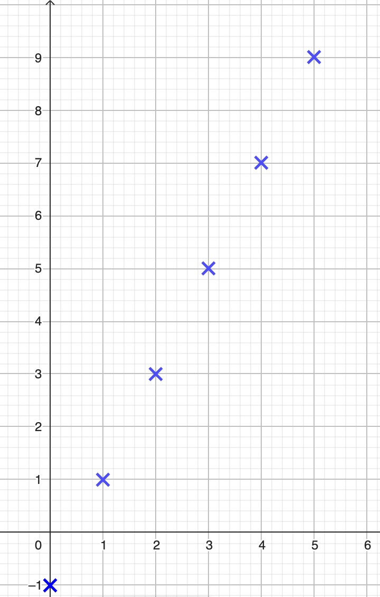
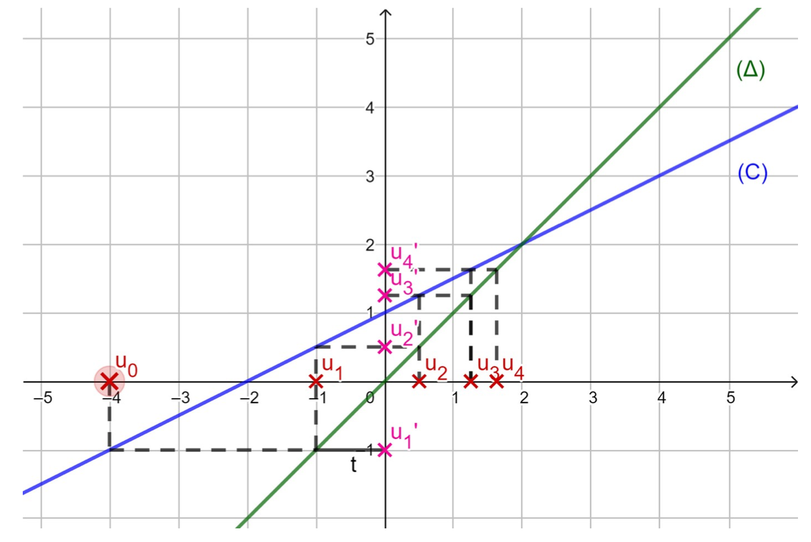
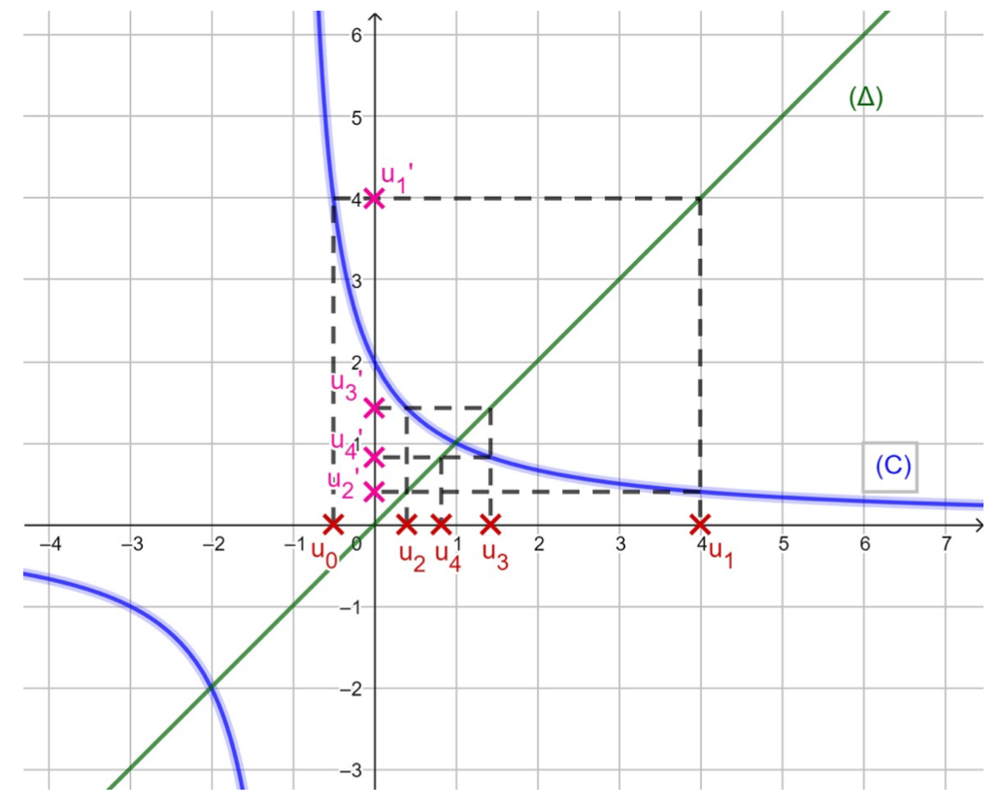
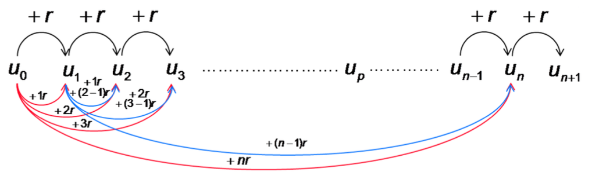
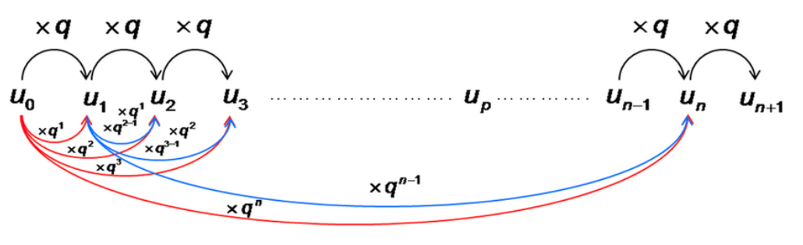
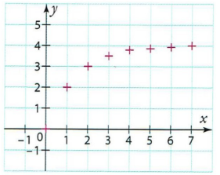
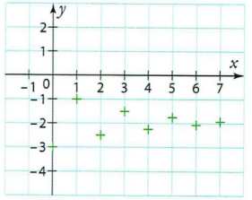
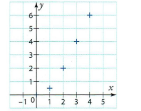
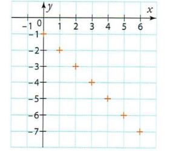
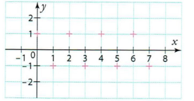

```css
```
```{=html}
<style>
:root {
  --def-color:   #2563eb;
  --prop-color:  #7c3aed;
  --voc-color:   #0d9488;
  --rem-color:   #d97706;
  --ex-color:    #16a34a;
  --app-color:   #ea580c;
  --not-color:   #4f46e5;
  --meth-color:  #dc2626;
  --ill-color:   #475569;
}

.definition, .proposition, .vocabulaire, .remarque, .exemple, .application,
.notation, .methode, .illustration {
  margin: 1.5em 0;
  padding: 1em 1.3em 1em 1.3em;
  border-radius: 10px;
  border-left: 6px solid;
  box-shadow: 0 1px 4px rgba(0,0,0,0.08);
  font-family: "Georgia", serif;
}

.definition::before, .proposition::before, .vocabulaire::before,
.remarque::before, .exemple::before, .application::before,
.notation::before, .methode::before, .illustration::before {
  display: block;
  font-family: "Helvetica Neue", Arial, sans-serif;
  font-weight: 700;
  font-size: 0.95em;
  letter-spacing: 0.03em;
  text-transform: uppercase;
  margin-bottom: 0.6em;
}

.definition {
  background: #eff6ff;
  border-color: var(--def-color);
  color: #1e3a5f;
}
.definition::before {
  content: "📘  Définition";
  color: var(--def-color);
}

.proposition {
  background: #f5f3ff;
  border-color: var(--prop-color);
  color: #3b2467;
}
.proposition::before {
  content: "📐  Proposition";
  color: var(--prop-color);
}

.vocabulaire {
  background: #f0fdfa;
  border-color: var(--voc-color);
  color: #0f4c46;
}
.vocabulaire::before {
  content: "🏷️  Vocabulaire";
  color: var(--voc-color);
}

.remarque {
  background: #fffbeb;
  border-color: var(--rem-color);
  color: #6b4a06;
}
.remarque::before {
  content: "💡  Remarque";
  color: var(--rem-color);
}

.exemple {
  background: #f0fdf4;
  border-color: var(--ex-color);
  color: #14532d;
}
.exemple::before {
  content: "🔍  Exemple";
  color: var(--ex-color);
}

.application {
  background: #fff7ed;
  border: 2px dashed var(--app-color);
  border-left: 6px solid var(--app-color);
  color: #7c2d12;
}
.application::before {
  content: "✏️  Application";
  color: var(--app-color);
  font-size: 1.05em;
}

.notation {
  background: #eef2ff;
  border-color: var(--not-color);
  color: #312e81;
}
.notation::before {
  content: "🖊️  Notation";
  color: var(--not-color);
}

.methode {
  background: #fef2f2;
  border-color: var(--meth-color);
  color: #7f1d1d;
}
.methode::before {
  content: "🧭  Méthode";
  color: var(--meth-color);
}

.illustration {
  background: #f8fafc;
  border-color: var(--ill-color);
  color: #1e293b;
}
.illustration::before {
  content: "🖼️  Illustration";
  color: var(--ill-color);
}

/* Callouts "Solution" un peu plus stylés */
div.callout-caution {
  border-radius: 10px;
  box-shadow: 0 1px 4px rgba(0,0,0,0.08);
}
div.callout-caution .callout-title {
  font-family: "Helvetica Neue", Arial, sans-serif;
  font-weight: 700;
}
div.callout-caution .callout-title::before {
  content: "🔓  ";
}
</style>
```

\gdef\R{\mathbb{R}}

\gdef\N{\mathbb{N}}

# Généralités sur les suites

## Définition

::: {.definition}
Une suite $u$, notée aussi $(u_n)_{n\in\N}$, est une fonction définie sur $\N$ ou une partie de $\N$ et à valeurs dans $\R$.

$$
u : \left\{
\begin{array}{ccc}
\N & \to & \R \\
n & \mapsto & u(n)=u_n
\end{array}
\right.
$$
:::

::: {.notation}
Les termes de la suite se notent $u_0, u_1, \dots, u_n$.  
$u_n$ est le terme d'indice $n$.
:::

::: {.exemple}
Soit $u$ la suite définie sur $\N$ par $u_n=2n-1$.  
Le terme d'indice $0$ (le premier terme !) est $u_0=2\times 0-1=-1$.  
Le terme d'indice $1$ est $u_1=2\times 1-1=1$.
:::

## Les différents modes de génération d'une suite

### Suites définies à partir d'une fonction (mode explicite)

::: {.definition}
Une suite $u$ est définie par une formule explicite lorsque $u_n$ s'exprime en fonction de l'entier $n$. On note alors $u_n=f(n)$ où $f$ est une fonction.
:::

::: {.exemple}
La suite $(u_n)$ définie sur $\N$ par $u_n=2n-1$ est définie par l'expression du terme général en fonction de $n$. On peut alors définir la fonction associée $f : x \mapsto 2x-1$ et écrire $u_n=f(n)$.
:::

::: {.remarque}
Dans ce cas, chaque terme peut alors se calculer indépendamment des autres en remplaçant $n$ par sa valeur dans l'expression. On peut aussi utiliser le tableau de valeurs de la fonction associée.
:::

::: {.exemple}
Les suites $(u_n)$, $(v_n)$ et $(w_n)$ définies sur $\N$ par $u_n=2n+1$, $v_n=2^n$ et $w_n=n^3$.

$u_{100}=2\times 100+1=201$  
$v_5=2^5=32$  
$w_{20}=20^3=8000$
:::

### Suites définies par une relation de récurrence (mode récurrent)

::: {.definition}
Une suite $u$ est définie par une relation de récurrence lorsqu'elle est définie par la donnée de :

- son (ou ses) premier(s) terme(s) ;
- une relation permettant de calculer un terme à partir d'un ou plusieurs termes précédents.
:::

::: {.notation}
On note alors $u_{n+1}=f(u_n)$ où $f$ est une fonction.
:::

::: {.remarque}
Dans ce cas, chaque terme s'obtient de proche en proche. C'est pourquoi la connaissance du terme initial est indispensable.
:::

::: {.exemple}
Soit $(u_n)$ la suite définie sur $\N$ par

$$
\begin{cases}
u_0=-5 \\
u_{n+1}=2u_n+3
\end{cases}
$$

Ses premiers termes sont :

$u_0=-5$  
$u_1=2\times u_0+3=-7$  
$u_2=2\times u_1+3=-11$
:::

## Représentation graphique

::: {.definition}
Dans un repère, la représentation graphique d'une suite $(u_n)_{n\in\N}$ est l'ensemble des points de coordonnées $(n;u_n)$ pour $n\in\N$.
:::

### Suites définies à partir d'une fonction (mode explicite)

:::::: {.exemple}
::::: {.columns}

:::: {.column width="50%"}
Soit $(u_n)_{n\in\N}$ la suite définie par $u_n=2n-1$.

On commence par remplir le tableau de valeurs :

| $n$   | $0$  | $1$ | $2$ | $3$ | $4$ | $5$ |
|-------|------|-----|-----|-----|-----|-----|
| $u_n$ | $-1$ | $1$ | $3$ | $5$ | $7$ | $9$ |
::::

:::: {.column width="50%"}
On a alors ce nuage de points associé au tableau :

{fig-alt="Nuage de points de la suite définie par u_n = 2n - 1" fig-align="center"}
::::

:::::
::::::

::: {.remarque}
On peut définir la suite $u$ à l'aide de sa fonction associée. Pour tout $n\in\N$, $u_n=f(n)$ avec $f(x)=2x-1$.

$f$ est une fonction affine, sa représentation est donc une droite. Pour tracer la représentation de la suite, on trace les points de cette droite qui ont pour abscisse un entier naturel.
:::

### Suites définies par une relation de récurrence

::: {.methode}
On considère la suite $u$ telle que $u_{n+1}=f(u_n)$ où $f$ est une fonction.

On construit de proche en proche les termes de la suite $u$ en se servant de la courbe représentative de la fonction $f$ appelée $(C)$ et de la droite $(\Delta)$ d'équation $y=x$ :

- placer $u_0$ sur l'axe des abscisses ;
- construire $u_1=f(u_0)$ sur l'axe des ordonnées ;
- reporter $u_1$ sur l'axe des abscisses en utilisant $(\Delta)$ ;
- recommencer.
:::

::: {.application}
Soit $(u_n)$ la suite définie sur $\N$ par

$$
\begin{cases}
u_0=-4 \\
u_{n+1}=1+\dfrac{1}{2}u_n
\end{cases}
$$

Construire les premiers termes de la suite $(u_n)$ puis conjecturer les variations et la limite en $+\infty$.
:::

:::{.callout-caution collapse="true"}
## Solution

Soit $f$ la fonction définie sur $[0;+\infty[$ par $f(x)=1+\dfrac{1}{2}x$. Ainsi, $f(u_n)=u_{n+1}$.

$(C)$ : $y=\dfrac{1}{2}x+1$  
$(\Delta)$ : $y=x$ (appelée première bissectrice)

{fig-alt="Construction des premiers termes de la suite sur la courbe de f et la droite y = x" fig-align="center"}

Grâce à cette représentation graphique, on peut conjecturer :

- la suite $(u_n)$ est strictement croissante sur $\N$ ;
- $\lim\limits_{n\to+\infty}u_n=2$.

Ces conjectures doivent bien sûr être confirmées ou infirmées.
:::

:::::: {.exemple}
Soit $(u_n)$ la suite définie sur $\N$ par

$$
\begin{cases}
u_0=-\dfrac{1}{2} \\
u_{n+1}=\dfrac{2}{1+u_n}
\end{cases}
$$

::::: {.columns}

:::: {.column width="50%"}
Soit $f$ la fonction définie sur $[0;+\infty[$ par $f(x)=\dfrac{2}{1+x}$. Ainsi, $f(u_n)=u_{n+1}$.

$(C)$ : $y=\dfrac{2}{1+x}$  
$(\Delta)$ : $y=x$

Grâce à cette représentation graphique, on peut conjecturer :

- la suite $(u_n)$ est non monotone sur $\N$ ;
- $\lim\limits_{n\to+\infty}u_n=1$.
::::

:::: {.column width="50%"}
{fig-alt="Construction des premiers termes de la suite sur la courbe de f et la droite y = x" fig-align="center"}
::::

:::::
::::::

# Sens de variation d'une suite

## Définitions

::: {.definition}
Une suite $(u_n)_{n\in\N}$ est **croissante** si pour tout $n\in\N$, $u_{n+1}\geqslant u_n$.  
Une suite $(u_n)_{n\in\N}$ est **décroissante** si pour tout $n\in\N$, $u_{n+1}\leqslant u_n$.  
Une suite $(u_n)_{n\in\N}$ est **constante** si pour tout $n\in\N$, $u_{n+1}=u_n$.  
Une suite $(u_n)_{n\in\N}$ croissante ou décroissante est dite **monotone**.
:::

::: {.remarque}
On définit de même une suite strictement croissante (ou strictement décroissante) en utilisant une inégalité stricte.
:::

## Étude du sens de variation

::: {.methode}
Lorsqu'on cherche à déterminer les variations d'une suite $(u_n)_{n\in\N}$ on peut :

1. étudier le signe de la différence $u_{n+1}-u_n$ :

    - si $u_{n+1}-u_n\geqslant 0$ alors $u_{n+1}\geqslant u_n$ et donc $(u_n)$ est croissante ;
    - si $u_{n+1}-u_n\leqslant 0$ alors $u_{n+1}\leqslant u_n$ et donc $(u_n)$ est décroissante.

2. si la suite est définie par $u_n=f(n)$ où $f$ est une fonction connue, étudier les variations de $f$ sur $[0;+\infty[$ :

    - si $f$ est croissante alors $(u_n)$ est croissante ;
    - si $f$ est décroissante alors $(u_n)$ est décroissante.

3. si la suite est toujours strictement positive, comparer le quotient $\dfrac{u_{n+1}}{u_n}$ à $1$ :

    - si $\dfrac{u_{n+1}}{u_n}\geqslant 1$ alors $(u_n)$ est croissante ;
    - si $\dfrac{u_{n+1}}{u_n}\leqslant 1$ alors $(u_n)$ est décroissante.
:::

::: {.application}
1. Soit $(u_n)_{n\in\N}$ la suite définie par $u_n=\dfrac{n+1}{2^n}$.
2. Soit $(v_n)_{n\in\N}$ la suite définie par $v_n=\dfrac{3}{n+2}$.
3. Soit $(w_n)_{n\in\N}$ la suite définie par $w_n=\dfrac{3^n}{4^{n+2}}$.
4. Soit $(z_n)_{n\in\N}$ la suite définie par $z_n=(-1)^n$.
:::

:::{.callout-caution collapse="true"}
## Solution

**1.** Soit $(u_n)_{n\in\N}$ la suite définie par $u_n=\dfrac{n+1}{2^n}$.

$$
\begin{align*}
u_{n+1}-u_n&=\dfrac{n+2}{2^{n+1}}-\dfrac{n+1}{2^n} \\
&=\dfrac{n+2-2(n+1)}{2^{n+1}} \\
&=\dfrac{n+2-2n-2}{2^{n+1}} \\
&=\dfrac{-n}{2^{n+1}}
\end{align*}
$$

Comme $2^{n+1}>0$ et $-n\leqslant 0$, alors $u_{n+1}-u_n\leqslant 0$.

La suite $(u_n)_{n\in\N}$ est donc décroissante sur $\N$.

**2.** Soit $(v_n)_{n\in\N}$ la suite définie par $v_n=\dfrac{3}{n+2}$.

Soit $f$ la fonction associée à $(v_n)$ définie sur $[0;+\infty[$ par $f(x)=\dfrac{3}{x+2}$.

La fonction $f$ est dérivable sur $\R^+$ et $f'(x)=-\dfrac{3}{(x+2)^2}<0$.

Ainsi la fonction $f$ est décroissante sur $\R^+$, et donc la suite $(v_n)_{n\in\N}$ est décroissante.

**3.** Soit $(w_n)_{n\in\N}$ la suite définie par $w_n=\dfrac{3^n}{4^{n+2}}$.

$(w_n)_{n\in\N}$ est à termes strictement positifs.

$$
\begin{align*}
\dfrac{w_{n+1}}{w_n}&=\dfrac{\dfrac{3^{n+1}}{4^{n+3}}}{\dfrac{3^n}{4^{n+2}}} \\
&=\dfrac{3^{n+1}}{4^{n+3}}\times\dfrac{4^{n+2}}{3^n} \\
&=\dfrac{3^{n+1}}{3^n}\times\dfrac{4^{n+2}}{4^{n+3}} \\
&=3\times\dfrac{1}{4} \\
&=\dfrac{3}{4}
\end{align*}
$$

Ainsi, pour tout $n$ entier naturel, on a $\dfrac{w_{n+1}}{w_n}<1$ donc la suite $(w_n)_{n\in\N}$ est strictement décroissante.

**4.** Soit $(z_n)_{n\in\N}$ la suite définie par $z_n=(-1)^n$.

Les termes de la suite $(z_n)$ valent alternativement $1$ et $-1$.

Donc, cette suite n'est pas monotone.
:::

# Suites arithmétiques

## Définition et expression du terme général

::: {.definition}
Une suite $(u_n)_{n\in\N}$ est arithmétique s'il existe un réel $r$, appelé raison de la suite, tel que pour tout $n\in\N$, on a $u_{n+1}=u_n+r$.
:::

::: {.proposition}
Soit $(u_n)_{n\in\N}$ une suite arithmétique de raison $r$.

Pour tout $n\in\N$, $u_n=u_0+rn$.

Pour tout $n\in\N$ et pour tout $p\in\N$, $u_n=u_p+r(n-p)$.
:::

:::{.callout-caution collapse="true"}
## Solution

Soit $(u_n)_{n\in\N}$ une suite arithmétique de raison $r$.

{fig-alt="Schéma : on passe de u_0 à u_n en ajoutant n fois la raison r" fig-align="center"}
:::

::: {.methode}
Pour démontrer qu'une suite $(u_n)_{n\in\N}$ est arithmétique, on peut :

1. montrer que, pour tout $n\in\N$, $u_{n+1}-u_n$ est égal à une constante $r$ ;
2. montrer que, pour tout $n\in\N$, $u_n$ peut s'écrire sous la forme $a\times n+b$ avec $a$ et $b$ deux réels.

Pour démontrer qu'une suite $(u_n)_{n\in\N}$ n'est pas arithmétique, on peut calculer les premiers termes de la suite et comparer les différences de deux termes consécutifs.
:::

::: {.application}
Les suites suivantes sont-elles arithmétiques ?

1. Soit $(u_n)_{n\in\N}$ la suite définie par

   $$
   \begin{cases}
   u_0=1 \\
   u_{n+1}=(u_n+1)^2-u_n^2-u_n
   \end{cases}
   $$

2. Soit $(v_n)_{n\in\N}$ la suite définie par $v_n=(n+1)^2-(n-2)^2$.
3. Soit $(w_n)_{n\in\N}$ la suite définie par

   $$
   \begin{cases}
   w_0=1 \\
   w_{n+1}=\dfrac{w_n}{1+w_n}
   \end{cases}
   $$
:::

:::{.callout-caution collapse="true"}
## Solution

**1.** Soit $n\in\N$.

$$
\begin{align*}
u_{n+1}-u_n&=(u_n+1)^2-u_n^2-u_n-u_n \\
&=u_n^2+2u_n+1-u_n^2-2u_n \\
&=1
\end{align*}
$$

Donc la suite $(u_n)$ est arithmétique de raison $r=1$.

**2.** Soit $n\in\N$.

$$
\begin{align*}
v_n&=(n+1)^2-(n-2)^2 \\
&=n^2+2n+1-(n^2-4n+4) \\
&=6n-3
\end{align*}
$$

Donc la suite $(v_n)$ est arithmétique de raison $r=6$ et de premier terme $v_0=-3$.

**3.** $w_0=1$, $w_1=\dfrac{1}{2}$ et $w_2=\dfrac{1}{3}$.

$w_1-w_0=-\dfrac{1}{2}$ et $w_2-w_1=-\dfrac{1}{6}$.

Donc $w_1-w_0\neq w_2-w_1$.

Ainsi, la suite $(w_n)$ n'est pas arithmétique.
:::

## Sens de variation

::: {.proposition}
Soit $(u_n)_{n\in\N}$ une suite arithmétique de raison $r$.

- Si $r>0$, alors la suite est strictement croissante ;
- Si $r<0$, alors la suite est strictement décroissante ;
- Si $r=0$, alors la suite est constante.
:::

:::{.callout-caution collapse="true"}
## Solution

Soit $(u_n)_{n\in\N}$ une suite arithmétique de raison $r$.

Pour tout $n\in\N$, $u_{n+1}-u_n=r$.

- Si $r>0$, alors $u_{n+1}-u_n>0$ et donc la suite est strictement croissante ;
- Si $r<0$, alors $u_{n+1}-u_n<0$ et donc la suite est strictement décroissante ;
- Si $r=0$, alors $u_{n+1}-u_n=0$ et donc la suite est constante.
:::

::: {.exemple}
1. Soit $(u_n)_{n\in\N}$ la suite définie par $u_{n+1}=3+u_n$.

   La suite est arithmétique de raison $r=3>0$. Donc la suite $(u_n)$ est strictement croissante.

2. Soit $(v_n)_{n\in\N}$ la suite définie par $v_{n+1}+2=v_n$.

   La suite est arithmétique de raison $r=-2<0$. Donc la suite $(v_n)$ est strictement décroissante.
:::

## Somme des premiers entiers

::: {.proposition}
Pour tout $n\in\N^*$,

$$
\sum_{i=1}^n i=1+2+3+\dots+n=\dfrac{n(n+1)}{2}
$$
:::

:::{.callout-caution collapse="true"}
## Solution

Méthode de Gauss (mathématicien allemand du XVIII^e^-XIX^e^ siècle).

On écrit la somme dans l'ordre croissant des termes puis dans l'ordre décroissant des termes :

$$
\begin{align*}
S&=1+2+3+\dots+(n-2)+(n-1)+n \\
S&=n+(n-1)+(n-2)+\dots+3+2+1
\end{align*}
$$

Par somme, membre à membre, on obtient :

$$
\begin{align*}
2S&=(1+n)+(1+n)+(1+n)+\dots+(1+n)+(1+n)+(1+n) \\
2S&=n(n+1)
\end{align*}
$$

Donc $S=\dfrac{n(n+1)}{2}$.
:::

::: {.application}
Calculer la somme $S=2+5+8+11+14+\dots+296$.
:::

:::{.callout-caution collapse="true"}
## Solution

On considère la somme $S=2+5+8+11+14+\dots+296$.

On pose

$$
(u_n)_{n\in\N} :
\begin{cases}
u_0=2 \\
u_{n+1}=u_n+3
\end{cases}
$$

$S$ est la somme des $99$ premiers termes de la suite $(u_n)$.

$S=u_0+u_1+u_2+u_3+\dots+u_{98}$

$S=u_0+(u_0+3)+(u_0+2\times 3)+(u_0+3\times 3)+\dots+(u_0+98\times 3)$  [On exprime chaque terme $u_n$ en fonction de $n$]{style="color:blue"}

$S=99u_0+3(1+2+3+\dots+98)$  [On regroupe les termes $u_0$ et on factorise par le facteur commun (la raison)]{style="color:blue"}

$S=99\times 2+3\times\dfrac{98\times 99}{2}$  [On applique la formule de Gauss]{style="color:blue"}

$S=14751$
:::

# Suites géométriques

## Définition et expression du terme général

::: {.definition}
Une suite $(u_n)_{n\in\N}$ est géométrique s'il existe un réel $q$, appelé raison de la suite, tel que pour tout $n\in\N$, on a $u_{n+1}=q\times u_n$.
:::

::: {.proposition}
Soit $(u_n)_{n\in\N}$ une suite géométrique de raison $q$.

Pour tout $n\in\N$, $u_n=u_0\times q^n$.

Pour tout $n\in\N$ et pour tout $p\in\N$, $u_n=u_p\times q^{n-p}$.
:::

:::{.callout-caution collapse="true"}
## Solution

Soit $(u_n)_{n\in\N}$ une suite géométrique de raison $q$.

{fig-alt="Schéma : on passe de u_0 à u_n en multipliant n fois par la raison q" fig-align="center"}
:::

::: {.methode}
Pour démontrer qu'une suite $(u_n)_{n\in\N}$ est géométrique, on peut :

1. montrer que, pour tout $n\in\N$, $u_{n+1}=q\times u_n$ ;
2. montrer que, pour tout $n\in\N$, $\dfrac{u_{n+1}}{u_n}$ est égal à une constante $q$ si tous les termes de la suite sont non nuls ;
3. montrer que, pour tout $n\in\N$, $u_n$ peut s'écrire sous la forme $a\times b^n$ avec $a$ et $b$ des réels.

Pour démontrer qu'une suite $(u_n)_{n\in\N}$ n'est pas géométrique, on peut calculer les premiers termes de la suite et comparer les quotients de deux termes consécutifs.
:::

::: {.application}
Les suites suivantes sont-elles géométriques ?

1. Soit $(u_n)_{n\in\N}$ la suite définie par $u_0=2$ et $u_{n+1}=\dfrac{u_n}{2}$.
2. Soit $(v_n)_{n\in\N}$ la suite définie par $v_n=\dfrac{1}{4^n}$.
3. Soit $(w_n)_{n\in\N}$ la suite définie par $w_n=\dfrac{1}{n+1}$.
:::

:::{.callout-caution collapse="true"}
## Solution

**1.** Soit $n\in\N$, $u_{n+1}=u_n\times\dfrac{1}{2}$.

Donc la suite $(u_n)$ est géométrique de raison $q=\dfrac{1}{2}$.

**2.** Soit $n\in\N$, $v_n\neq 0$ et

$$
\dfrac{v_{n+1}}{v_n}=\dfrac{\dfrac{1}{4^{n+1}}}{\dfrac{1}{4^n}}=\dfrac{1}{4^{n+1}}\times\dfrac{4^n}{1}=\dfrac{1}{4}
$$

Donc la suite $(v_n)$ est géométrique de raison $q=\dfrac{1}{4}$.

**3.** $w_0=1$, $w_1=\dfrac{1}{2}$ et $w_2=\dfrac{1}{3}$.

$\dfrac{w_1}{w_0}=\dfrac{1}{2}$ et $\dfrac{w_2}{w_1}=\dfrac{2}{3}$.

Donc $\dfrac{w_1}{w_0}\neq\dfrac{w_2}{w_1}$.

Ainsi, la suite $(w_n)$ n'est pas géométrique.
:::

## Sens de variation

::: {.proposition}
Soit $(u_n)_{n\in\N}$ une suite géométrique de raison $q$ et de premier terme $u_0\neq 0$.

- Si $q>1$ :
  - si $u_0>0$, alors la suite est strictement croissante ;
  - si $u_0<0$, alors la suite est strictement décroissante.
- Si $0<q<1$ :
  - si $u_0>0$, alors la suite est strictement décroissante ;
  - si $u_0<0$, alors la suite est strictement croissante.
- Si $q=0$ ou $q=1$, alors la suite est constante.
- Si $q<0$, alors la suite n'est pas monotone.
:::

:::{.callout-caution collapse="true"}
## Solution

Soit $n\in\N$,

$$
u_{n+1}-u_n=u_0\times q^{n+1}-u_0\times q^n=u_0\times q^n(q-1)
$$

- Si $q>1$, alors $q-1>0$ et $q^n>0$ :
  - si $u_0>0$, alors $u_{n+1}-u_n>0$ et donc la suite est strictement croissante ;
  - si $u_0<0$, alors $u_{n+1}-u_n<0$ et donc la suite est strictement décroissante.
- Si $0<q<1$, alors $q-1<0$ et $q^n>0$ :
  - si $u_0>0$, alors $u_{n+1}-u_n<0$ et donc la suite est strictement décroissante ;
  - si $u_0<0$, alors $u_{n+1}-u_n>0$ et donc la suite est strictement croissante.
- Si $q=0$ ou $q=1$, alors $u_{n+1}-u_n=0$ et donc la suite est constante.
- Si $q<0$, alors les termes de la suite sont alternativement positifs et négatifs et donc la suite n'est pas monotone.
:::

::: {.application}
Étudier la monotonie des suites suivantes :

1. Soit $(u_n)_{n\in\N}$ la suite définie par $u_0=2$ et $u_{n+1}=2u_n$.
2. Soit $(v_n)_{n\in\N}$ la suite définie par $v_0=-5$ et $v_{n+1}=0{,}5\,v_n$.
:::

:::{.callout-caution collapse="true"}
## Solution

**1.** Soit $(u_n)_{n\in\N}$ la suite définie par $u_0=2$ et $u_{n+1}=2u_n$.

La suite $(u_n)$ est géométrique de raison $q=2>1$ et de premier terme $u_0=2>0$.

Donc la suite $(u_n)$ est croissante.

**2.** Soit $(v_n)_{n\in\N}$ la suite définie par $v_0=-5$ et $v_{n+1}=0{,}5\,v_n$.

La suite $(v_n)$ est géométrique de raison $q=0{,}5\in\,]0;1[$ et de premier terme $v_0=-5<0$.

Donc la suite $(v_n)$ est croissante.
:::

## Somme des premières puissances

::: {.proposition}
Pour tout réel $q\neq 1$ et pour tout $n\in\N^*$,

$$
\sum_{i=0}^n q^i=1+q+q^2+\dots+q^n=\dfrac{1-q^{n+1}}{1-q}
$$
:::

:::{.callout-caution collapse="true"}
## Solution

$$
\begin{align*}
S&=1+q+q^2+\dots+q^n \\
qS&=q+q^2+q^3+\dots+q^{n+1}
\end{align*}
$$

On soustrait les deux égalités, membre à membre, et on obtient :

$$
S-qS=1+q+q^2+\dots+q^n-q-q^2-q^3-\dots-q^{n+1}
$$

Donc $S-qS=1-q^{n+1}$.

Comme $q\neq 1$ alors $S=\dfrac{1-q^{n+1}}{1-q}$.
:::

::: {.application}
Calculer la somme $S=4-8+16-32+64-\dots+4096-8192$.
:::

:::{.callout-caution collapse="true"}
## Solution

$$
\begin{align*}
S&=(-2)^2+(-2)^3+(-2)^4+(-2)^5+(-2)^6+\dots+(-2)^{12}+(-2)^{13} \\
&=(-2)^2\left(1+(-2)+(-2)^2+(-2)^3+(-2)^4+\dots+(-2)^{11}\right) \\
&=4\times\dfrac{1-(-2)^{12}}{1-(-2)} \\
&=-5460
\end{align*}
$$

On peut aussi poser

$$
(u_n)_{n\in\N} :
\begin{cases}
u_0=4 \\
u_{n+1}=-2u_n
\end{cases}
$$

et $S$ est alors la somme des $12$ premiers termes de la suite $(u_n)$.
:::

# Notion intuitive de limite d'une suite

## Limite finie

::: {.definition}
Une suite $(u_n)$ a pour limite un réel $l$ lorsque $n$ tend vers $+\infty$ si les termes $u_n$ deviennent tous aussi proches de $l$ que l'on veut en prenant $n$ suffisamment grand.

On dit que $(u_n)$ **converge** vers $l$ et on note $\lim\limits_{n\to+\infty}u_n=l$.
:::

:::::: {.illustration}
::::: {.columns}

:::: {.column width="50%"}
{fig-alt="Suite dont les termes se rapprochent de 4" fig-align="center"}

On observe que les termes successifs de $(u_n)$ semblent se rapprocher d'une valeur limite : $4$. On dit alors que la suite $(u_n)$ tend vers $4$ lorsque $n$ tend vers $+\infty$ et on note $\lim\limits_{n\to+\infty}u_n=4$.
::::

:::: {.column width="50%"}
{fig-alt="Suite dont les termes se rapprochent de -2" fig-align="center"}

On observe que les termes successifs de $(u_n)$ semblent se rapprocher d'une valeur limite : $-2$. On dit alors que la suite $(u_n)$ tend vers $-2$ lorsque $n$ tend vers $+\infty$ et on note $\lim\limits_{n\to+\infty}u_n=-2$.
::::

:::::
::::::

## Limite infinie

::: {.definition}
Une suite $(u_n)$ a pour limite $+\infty$ (respectivement $-\infty$) lorsque $n$ tend vers $+\infty$ si les termes $u_n$ deviennent tous aussi grands (respectivement petits) que l'on veut en prenant $n$ suffisamment grand.

On dit que $(u_n)$ **diverge** et on note $\lim\limits_{n\to+\infty}u_n=+\infty$ (respectivement $-\infty$).
:::

:::::: {.illustration}
::::: {.columns}

:::: {.column width="50%"}
{fig-alt="Suite dont les termes deviennent de plus en plus grands" fig-align="center"}

On observe que les termes successifs de $(u_n)$ semblent être de plus en plus grands. On dit alors que la suite $(u_n)$ tend vers $+\infty$ lorsque $n$ tend vers $+\infty$ et on note $\lim\limits_{n\to+\infty}u_n=+\infty$.
::::

:::: {.column width="50%"}
{fig-alt="Suite dont les termes deviennent de plus en plus petits" fig-align="center"}

On observe que les termes successifs de $(u_n)$ semblent être de plus en plus petits. On dit alors que la suite $(u_n)$ tend vers $-\infty$ lorsque $n$ tend vers $+\infty$ et on note $\lim\limits_{n\to+\infty}u_n=-\infty$.
::::

:::::
::::::

## Suites sans limite

::: {.definition}
Certaines suites n'ont pas de limite. On dit alors que la suite diverge.
:::

:::::: {.illustration}
::::: {.columns}

:::: {.column width="50%"}
C'est le cas de la suite $(u_n)$ définie sur $\N$ par $u_n=(-1)^n$. Les termes de la suite $(u_n)$ prennent alternativement les valeurs $-1$ et $1$.
::::

:::: {.column width="50%"}
{fig-alt="Suite dont les termes alternent entre -1 et 1" fig-align="center"}
::::

:::::
::::::
