```css
```
```{=html}
<style>
:root {
  --def-color:   #2563eb;
  --prop-color:  #7c3aed;
  --theo-color:  #c026d3;
  --voc-color:   #0d9488;
  --rem-color:   #d97706;
  --ex-color:    #16a34a;
  --app-color:   #ea580c;
  --not-color:   #4f46e5;
  --meth-color:  #dc2626;
  --ill-color:   #475569;
}

.definition, .proposition, .theoreme, .vocabulaire, .remarque, .exemple, .application,
.notation, .methode, .illustration {
  margin: 1.5em 0;
  padding: 1em 1.3em 1em 1.3em;
  border-radius: 10px;
  border-left: 6px solid;
  box-shadow: 0 1px 4px rgba(0,0,0,0.08);
  font-family: "Georgia", serif;
}

.definition::before, .proposition::before, .theoreme::before, .vocabulaire::before,
.remarque::before, .exemple::before, .application::before,
.notation::before, .methode::before, .illustration::before {
  display: block;
  font-family: "Helvetica Neue", Arial, sans-serif;
  font-weight: 700;
  font-size: 0.95em;
  letter-spacing: 0.03em;
  text-transform: uppercase;
  margin-bottom: 0.6em;
}

.definition {
  background: #eff6ff;
  border-color: var(--def-color);
  color: #1e3a5f;
}
.definition::before {
  content: "📘  Définition";
  color: var(--def-color);
}

.proposition {
  background: #f5f3ff;
  border-color: var(--prop-color);
  color: #3b2467;
}
.proposition::before {
  content: "📐  Proposition";
  color: var(--prop-color);
}

.theoreme {
  background: #fdf4ff;
  border-color: var(--theo-color);
  color: #701a75;
}
.theoreme::before {
  content: "🏛️  Théorème";
  color: var(--theo-color);
}

.vocabulaire {
  background: #f0fdfa;
  border-color: var(--voc-color);
  color: #0f4c46;
}
.vocabulaire::before {
  content: "🏷️  Vocabulaire";
  color: var(--voc-color);
}

.remarque {
  background: #fffbeb;
  border-color: var(--rem-color);
  color: #6b4a06;
}
.remarque::before {
  content: "💡  Remarque";
  color: var(--rem-color);
}

.exemple {
  background: #f0fdf4;
  border-color: var(--ex-color);
  color: #14532d;
}
.exemple::before {
  content: "🔍  Exemple";
  color: var(--ex-color);
}

.application {
  background: #fff7ed;
  border: 2px dashed var(--app-color);
  border-left: 6px solid var(--app-color);
  color: #7c2d12;
}
.application::before {
  content: "✏️  Application";
  color: var(--app-color);
  font-size: 1.05em;
}

.notation {
  background: #eef2ff;
  border-color: var(--not-color);
  color: #312e81;
}
.notation::before {
  content: "🖊️  Notation";
  color: var(--not-color);
}

.methode {
  background: #fef2f2;
  border-color: var(--meth-color);
  color: #7f1d1d;
}
.methode::before {
  content: "🧭  Méthode";
  color: var(--meth-color);
}

.illustration {
  background: #f8fafc;
  border-color: var(--ill-color);
  color: #1e293b;
}
.illustration::before {
  content: "🖼️  Illustration";
  color: var(--ill-color);
}

/* Callouts "Solution" un peu plus stylés */
div.callout-caution {
  border-radius: 10px;
  box-shadow: 0 1px 4px rgba(0,0,0,0.08);
}
div.callout-caution .callout-title {
  font-family: "Helvetica Neue", Arial, sans-serif;
  font-weight: 700;
}
div.callout-caution .callout-title::before {
  content: "🔓  ";
}
</style>
```

# Angles orientés de vecteurs

## Cercle trigonométrique, mesures d'arcs orientés

::: {.definition}
On appelle cercle trigonométrique un cercle de centre $O$ de rayon 1, orienté dans le sens direct.
:::

::: {.remarque}
Par convention, le sens direct (noté +), est le sens inverse de celui des aiguilles d'une montre.
:::

#### Enroulement de la droite des réels:

Dans le plan muni d'un repère orthonormal $(O,A,B)$, on considère le cercle trigonométrique $C$.\
Soit $P$ le point tel que $\overrightarrow{AP}=\overrightarrow{OB}$ et soit $d$ la droite orientée, perpendiculaire à l'axe des abscisses, qui passe par $A$, munie du repère $(A,P)$.\
En enroulant cette droite $d$ autour du cercle $C$, on obtient une correspondance entre un point $N$ de la droite et un point $M$ du cercle.

::: {.definition}
Soit $C$ le cercle trigonométrique et $M$ un point de ce cercle.\
La mesure en radian de l'angle $\widehat{AOM}$ est la longueur de l'arc $\overset{\frown}{AM}$ intercepté par cet angle.\
Le symbole associé à cette mesure est rad.
:::

::: {.exemple}
Sur le schéma ci-contre, le point $N$ de coordonnée 3 sur la droite $d$, se retrouve après enroulement de $d$ sur $C$ en $M$ tel que la longueur de l'arc $\overset{\frown}{AM}$ est égale à $AN$

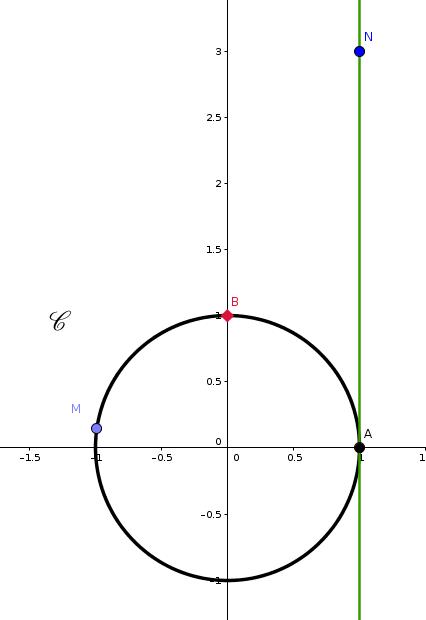{width="55%" fig-align="center"}
:::

::: {.remarque}
-   Comme le cercle trigonométrique est de rayon 1, son périmètre est de longueur $2\pi$.

-   Le point de $d$ de coordonnée $2\pi$ se retrouve ainsi en $A$.\
    Cela correspond à un tour complet, soit un angle de 360°.

Par proportionnalité entre angle et arc intercepté, on obtient les correspondances suivantes:

|    Coordonnées de $N$ sur $d$     |     |     |     |     |     |
|:---------------------------------:|:---:|:---:|:---:|:---:|:---:|
| Mesure de l'angle $\widehat{AOM}$ |     |     |     |     |     |
:::

::: {.callout-caution collapse="true"}
## Solution

|    Coordonnées de $N$ sur $d$     | $-\dfrac{\pi}{2}$ |      0      | $\dfrac{\pi}{2}$ |     $\pi$     |    $2\pi$     |
|:---------------------------------:|:-----------------:|:-----------:|:----------------:|:-------------:|:-------------:|
| Mesure de l'angle $\widehat{AOM}$ |   $-90^{\circ}$   | $0^{\circ}$ |   $90^{\circ}$   | $180^{\circ}$ | $360^{\circ}$ |
:::

::: {.remarque}
Plusieurs points de la droite $d$ correspondent à un même point du cercle $C$ car la droite peut s'enrouler plusieurs fois.

Par exemple:

-   Les points de $d$ de coordonnée $\dfrac{\pi}{3}$ et $\dfrac{7\pi}{3}$ correspondent tous les deux à un même point sur $C$.

-   Les points de $d$ de coordonnée $-\dfrac{\pi}{2}$ et $\dfrac{3\pi}{2}$ correspondent tous les deux à un même point sur $C$.

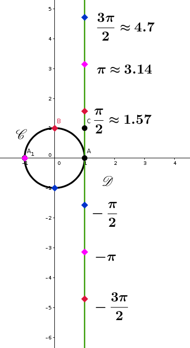{width="65%" fig-align="center"}
:::

::: {.proposition}
Soient $A$ et $M$ deux points du cercle trigonométrique.\
Si $l$ est une mesure de l'arc orienté $\overset{\frown}{AM}$, alors toutes les mesures de cet arc sont de la forme $l+2k \pi$, où $k\in \mathbb{Z}$.\
On note alors $\overset{\frown}{AM}=l+2k\pi$ $(k\in \mathbb{Z})$ ou $\overset{\frown}{AM}=l[2 \pi]$.\
La deuxième notation se lit "$l$ modulo $2\pi$".
:::

::: {.exemple}
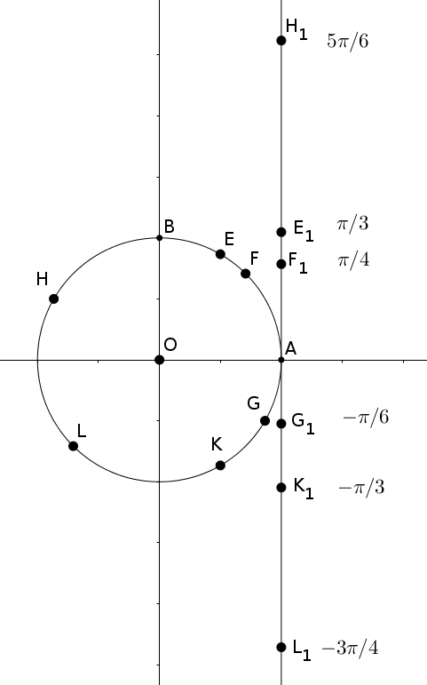{width="65%" fig-align="center"}

-   $\overset{\frown}{AE}=\dfrac{\pi}{3}[2\pi]$;

-   $\overset{\frown}{AF}=\dfrac{\pi}{4}[2\pi]$;

-   $\overset{\frown}{AG}=-\dfrac{\pi}{6}[2\pi]$;

-   $\overset{\frown}{AH}=\dfrac{5\pi}{6}[2\pi]$;

-   $\overset{\frown}{AK}=-\dfrac{\pi}{3}[2\pi]$;

-   $\overset{\frown}{AL}=-\dfrac{3\pi}{4}[2\pi]$;
:::

## Angles orientés de vecteurs 

::: {.definition}
Soient $\overrightarrow{u}$ et $\overrightarrow{v}$ deux vecteurs unitaires ($||\overrightarrow{u}||=||\overrightarrow{v}||=1$).\
Il existe deux points $M$ et $N$ du cercle trigonométrique tels que $\overrightarrow{OM}=\overrightarrow{u}$ et $\overrightarrow{ON}=\overrightarrow{v}$.\
On appelle mesure de l'angle orienté de vecteurs $(\overrightarrow{u};\overrightarrow{v})$ toute mesure de l'arc orienté $\overset{\frown}{MN}$.
:::

::: {.illustration}
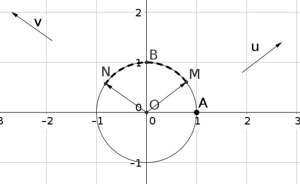{width="65%" fig-align="center"}
:::

::: {.definition}
Soient $\overrightarrow{u}$ et $\overrightarrow{v}$ deux vecteurs non nuls. On note $C$ le cercle trigonométrique de centre $O$.\
On pose $\overrightarrow{u}=\overrightarrow{OM}$ et $\overrightarrow{v}=\overrightarrow{ON}$.\
Les demi-droites $[OM)$ et $[ON)$ coupent respectivement le cercle trigonométrique $C$ en $A$ et $B$.\
Les vecteurs $\overrightarrow{OA}$ et $\overrightarrow{OB}$ sont unitaires et respectivement de même direction et de même sens que $\overrightarrow{u}$ et $\overrightarrow{v}$.\
On appelle alors mesure de l'angle orienté $(\overrightarrow{u},\overrightarrow{v})$, toute mesure de l'angle orienté $(\overrightarrow{OA},\overrightarrow{OB})$.
:::

::: {.illustration}
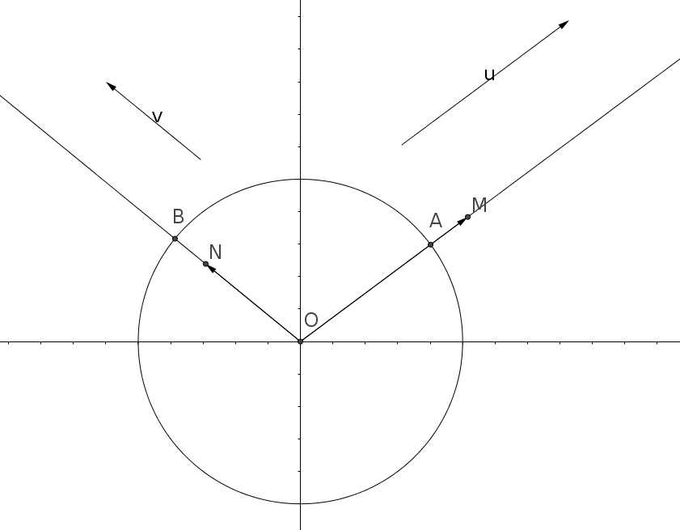{width="65%" fig-align="center"}
:::

::: {.definition}
Une seule mesure de l'angle orienté $(\overrightarrow{u},\overrightarrow{v})$ appartient à l'intervalle $]-\pi;\pi]$. Cette mesure est appelée mesure principale de l'angle $(\overrightarrow{u},\overrightarrow{v})$.
:::

::: {.application}
Trouver la mesure principale de l'angle $\dfrac{17\pi}{3}$
:::

::: {.callout-caution collapse="true"}
## Solution

Deux méthodes pour déterminer la mesure principale d'un angle:

On sait que la mesure principale est de la forme $\dfrac{17\pi}{3} +2k\pi$ et qu'elle doit être dans l'intervalle $]-\pi;\pi]$. On a donc:

$$\begin{aligned}
 -\pi &< \dfrac{17\pi}{3} +2k\pi \leqslant\pi \\
 -1 &< \dfrac{17}{3}+2k \leqslant 1 \\
 -1-\dfrac{17}{3} &< 2k \leqslant 1-\dfrac{17}{3} \\
 -\dfrac{20}{3} &< 2k \leqslant-\dfrac{14}{3} \\
 -\dfrac{10}{3} &< k \leqslant-\dfrac{7}{3}
\end{aligned}$$ Or on sait que $k\in \mathbb{Z}$ et que $-\dfrac{10}{3} \approx -3{,}3$ et $-\dfrac{7}{3} \approx -2{,}3$ donc nécessairement $k=-3$.\
La mesure principale de l'angle est donc $\dfrac{17\pi}{3}+2\times (-3)\pi=\dfrac{17\pi}{3} -6 \pi=\dfrac{17\pi - 18 \pi}{3}=-\dfrac{\pi}{3}$

On décompose $\dfrac{17\pi}{3}$ afin de faire apparaître le nombre de tours « en trop »:

$$\begin{aligned}
    \dfrac{17\pi}{3}&=\dfrac{(3\times 6 -1)\pi}{3} \\
    &=\dfrac{3\times 6}{3} \pi -\dfrac{1}{3}\pi \\
    &= 6\pi - \dfrac{1}{3} \pi \\
    &= 3\times 2\pi - \dfrac{\pi}{3}
\end{aligned}$$ Ainsi $\dfrac{17\pi}{3}=-\dfrac{\pi}{3} [2\pi]$.
:::

# Trigonométrie

## Cosinus et sinus

::: {.definition}
On dit qu'un repère $(O;\overrightarrow{i},\overrightarrow{j})$ du plan orienté est orthonormal direct si:

$||\overrightarrow{i}||=||\overrightarrow{j}||=1$ et $(\overrightarrow{i},\overrightarrow{j})=+\dfrac{\pi}{2}[2\pi]$
:::

::: {.definition}
Soient $C$ le cercle trigonométrique de centre $O$ et $A$ et $B$ deux points du cercle $C$ tels que le repère $(O;\overrightarrow{OA},\overrightarrow{OB})$ soit orthonormal direct.\
Soit $x$ un réel.\
Il existe un unique point $M$ du cercle trigonométrique $C$ tel que $(\overrightarrow{OA};\overrightarrow{OM})=x[2\pi]$.\
On appelle cosinus et sinus de $x$ (notés $\cos(x)$ et $\sin(x)$) les coordonnées du point $M$ dans le repère $(O;\overrightarrow{OA},\overrightarrow{OB})$.

-   $\cos(x)$: abscisse du point $M$.

-   $\sin(x)$: ordonnée du point $M$.
:::

::: {.illustration}
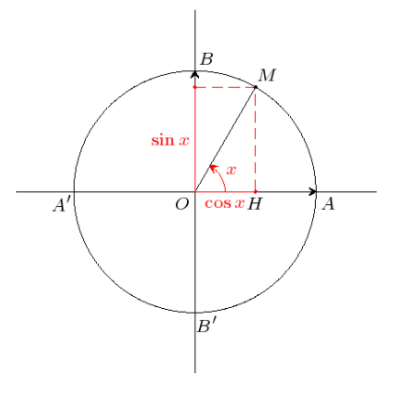{width="65%" fig-align="center"}
:::

## Résultats à retenir

::: {.proposition}
Pour tout $x\in \mathbb{R}$ et pour tout $k\in\mathbb{Z}$:

-   $\cos(x+2k\pi)=\cos(x)$

-   $\sin(x+2k\pi)=\sin(x)$

-   $\cos^2(x)+\sin^2(x)=1$

-   $-1 \leqslant\cos(x) \leqslant 1$

-   $-1 \leqslant\sin(x) \leqslant 1$

On rappelle que si $\cos(x)\neq0$, alors $\tan(x)=\dfrac{\sin(x)}{\cos(x)}$

Quelques valeurs de cosinus, sinus et tangente sont à retenir:

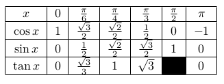{width="65%" fig-align="center"}
:::

::: {.remarque}
Pour retenir tous les résultats de ce tableau, on peut s'aider du cercle trigonométrique :

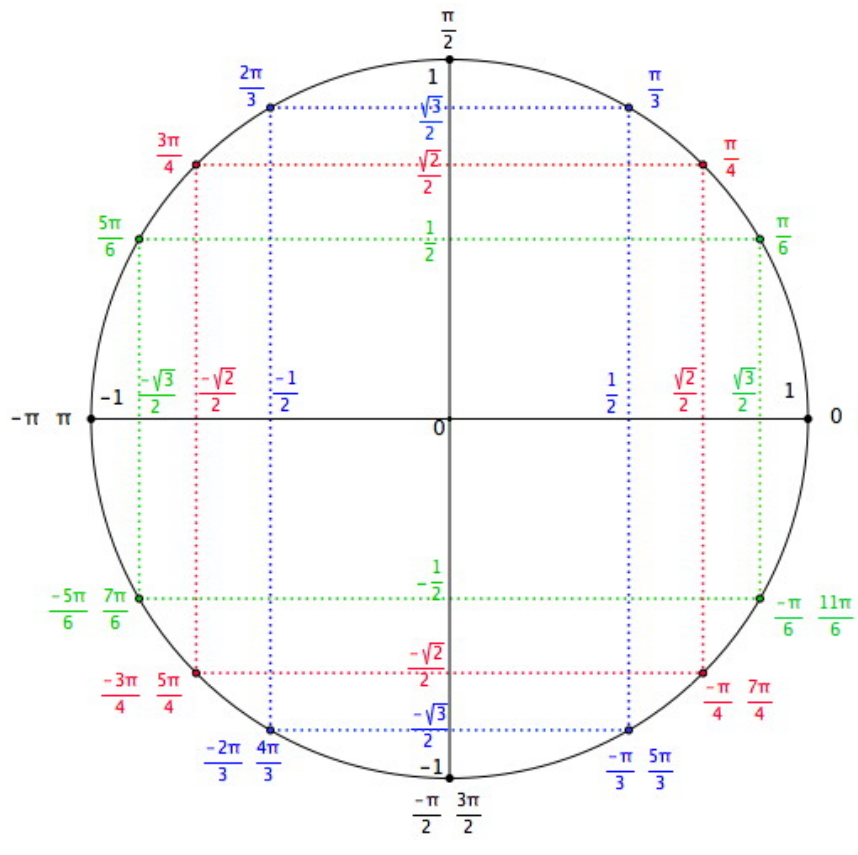{width="65%" fig-align="center"}
:::

::: {.application}
Calculer $\sin(\alpha)$ et $\cos(\beta)$ sachant que:

-   $\cos(\alpha)=0{,}6$ et $-\frac{\pi}{2}<\alpha<0$

-   $\sin(\beta)=0{,}8$ et $\frac{\pi}{2}<\beta<\pi$
:::

::: {.callout-caution collapse="true"}
## Solution

$$\begin{aligned}
 \cos^2(\alpha)+\sin^2(\alpha)=1 \\
 0{,}6^2+\sin^2(\alpha)=1 \\
 \sin^2(\alpha)=1-0{,}6^2\\
  \sin^2(\alpha)=0{,}64 \\
  \sin(\alpha)=-0{,}8 \text{ car } \sin(\alpha)<0 \text{ sur } \left]-\tfrac{\pi}{2};0\right[
\end{aligned}$$

$$\begin{aligned}
  \cos^2(\beta)+\sin^2(\beta)=1 \\
  \cos^2(\beta)+0{,}8^2=1 \\
  \cos^2(\beta)=1-0{,}64\\
  \cos^2(\beta)=0{,}36 \\
  \cos(\beta)=-0{,}6 \text{ car } \cos(\beta)<0 \text{ sur } \left]\tfrac{\pi}{2};\pi\right[
\end{aligned}$$
:::

## Angles associés

Dans toute cette partie, $x$ désigne un réel et $M$ le point associé au réel $x$ sur le cercle trigonométrique.

### Cosinus et sinus de $-x$

::: {.proposition}
$\cos(-x)=\cos(x)$\
$\sin(-x)=-\sin(x)$

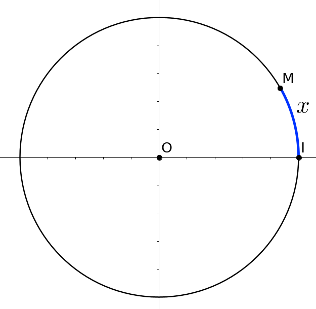{width="35%" fig-align="center"}
:::

### Cosinus et sinus de $\pi-x$

::: {.proposition}
$\cos(\pi-x)=-\cos(x)$\
$\sin(\pi-x)=\sin(x)$

{width="35%" fig-align="center"}
:::

### Cosinus et sinus de $\pi+x$

::: {.proposition}
$\cos(\pi+x)=-\cos(x)$\
$\sin(\pi+x)=-\sin(x)$

{width="35%" fig-align="center"}
:::

### Cosinus et sinus de $\dfrac{\pi}{2}-x$

::: {.proposition}
$\cos \left(\dfrac{\pi}{2}-x\right)=\sin(x)$\
$\sin \left(\dfrac{\pi}{2}-x\right)=\cos(x)$

{width="35%" fig-align="center"}
:::

### Cosinus et sinus de $\dfrac{\pi}{2}+x$

::: {.proposition}
$\cos\left(\dfrac{\pi}{2}+x\right)=-\sin(x)$\
$\sin\left(\dfrac{\pi}{2}+x\right)=\cos(x)$

{width="35%" fig-align="center"}
:::

### Exemples

-   $\cos\left(\dfrac{2\pi}{3} \right)=\cos\left(\pi-\dfrac{\pi}{3} \right)=-\cos\left(\dfrac{\pi}{3} \right)=-\dfrac{1}{2}$

-   $\cos\left(\dfrac{7\pi}{6} \right)=\cos\left(\pi+\dfrac{\pi}{6} \right)=-\cos\left(\dfrac{\pi}{6} \right)=-\dfrac{\sqrt{3}}{2}$

-   $\sin \left( -\dfrac{\pi}{4} \right)=-\sin \left( \dfrac{\pi}{4} \right) = -\dfrac{\sqrt{2}}{2}$

## Formules d'addition et de duplication des cosinus et sinus

::: {.proposition}
Soient $a$ et $b$ des réels.

-   $\cos (a-b) = \cos(a) \cos(b) + \sin(a) \sin(b)$\

-   $\cos (a+b) = \cos(a) \cos(b) - \sin(a) \sin(b)$\

-   $\sin (a+b) = \sin(a) \cos(b) + \sin(b) \cos(a)$\

-   $\sin (a-b) = \sin(a) \cos(b) - \sin(b) \cos(a)$\
:::

::: {.proposition}
Pour tout réel $x$,\

-   $\cos(2x)=\cos^2(x) - \sin^2(x)=2\cos^2(x)-1$\

-   $\sin(2x)=2\sin(x)\cos(x)$
:::

::: {.application}
Déterminer la valeur exacte de $A=\cos \left(\dfrac{13\pi}{2}\right) + \sin \left(\dfrac{19\pi}{3}\right)$
:::

## Résolution d'équations trigonométriques

::: {.proposition}
Soient $a$ et $b$ des réels.

$\cos (a) = \cos (b) \Longleftrightarrow \left\lbrace \begin{array}{l}
b= a + 2k\pi, \quad k \in \mathbb{Z}\\ \qquad \text{ou} \\ b = -a + 2k\pi, \quad k \in \mathbb{Z}
\end{array} \right.$

$\sin (a) = \sin (b) \Longleftrightarrow \left\lbrace \begin{array}{l}
b= a + 2k\pi, \quad k \in \mathbb{Z}\\ \qquad \text{ou} \\ b = \pi-a + 2k\pi, \quad k \in \mathbb{Z}
\end{array} \right.$
:::

::: {.application}
Résoudre dans $\mathbb{R}$ l'équation $\cos(2x)=\cos\left(x-\dfrac{\pi}{3}\right)$.
:::

::: {.callout-caution collapse="true"}
## Solution

$$\begin{aligned}
\cos(2x)=\cos\left(x-\dfrac{\pi}{3}\right) &\Leftrightarrow 2x=x-\dfrac{\pi}{3}+2k\pi (k \in \mathbb{Z}) \text{ ou } 2x=-\left(x-\dfrac{\pi}{3}\right)+2k\pi (k \in \mathbb{Z}) \\
&\Leftrightarrow  x=-\dfrac{\pi}{3}+2k\pi (k\in \mathbb{Z}) \text{ ou } 3x = \dfrac{\pi}{3}+2k\pi (k \in \mathbb{Z}) \\
&\Leftrightarrow  x=-\dfrac{\pi}{3}+2k\pi (k\in \mathbb{Z}) \text{ ou } x= \dfrac{\pi}{9}+\dfrac{2k\pi}{3} (k \in \mathbb{Z})
\end{aligned}$$ $S=\left\{ -\dfrac{\pi}{3}+2k\pi ; \dfrac{\pi}{9}+\dfrac{2k\pi}{3} | k \in \mathbb{Z}\right\}$
:::

::: {.application}
Résoudre dans $\mathbb{R}$ l'équation $\sin(3x)=\sin\left(2x-\dfrac{\pi}{4} \right)$.
:::

::: {.callout-caution collapse="true"}
## Solution

$$\begin{aligned}
\sin(3x)=\sin\left(2x-\dfrac{\pi}{4} \right) &\Leftrightarrow 3x=2x-\dfrac{\pi}{4}+2k\pi (k\in \mathbb{Z}) \text{ ou } 3x=\pi-\left(2x-\dfrac{\pi}{4}\right)+2k\pi (k \in \mathbb{Z}) \\
&\Leftrightarrow x=-\dfrac{\pi}{4} +2k\pi (k\in \mathbb{Z}) \text{ ou } 5x= \dfrac{5\pi}{4} +2k\pi (k\in \mathbb{Z}) \\
&\Leftrightarrow x=-\dfrac{\pi}{4} +2k\pi (k\in \mathbb{Z}) \text{ ou } x=\dfrac{\pi}{4}+\dfrac{2k\pi}{5} (k \in \mathbb{Z})
\end{aligned}$$ $S= \left\{ -\dfrac{\pi}{4} +2k\pi ; \dfrac{\pi}{4}+\dfrac{2k\pi}{5} | k \in \mathbb{Z}\right\}$
:::

# Fonctions trigonométriques

## Parité et périodicité d'une fonction

::: {.definition}
Soit $f$ une fonction définie sur un intervalle $I$ de $\mathbb{R}$ et $\mathcal{C}$ sa courbe représentative dans un repère orthogonal $(O,I,J)$ du plan.\
La fonction $f$ est:

-   **paire** si pour tout $x$ de $I$, $-x$ appartient à $I$ et $f(-x)=f(x)$.\
    Sa courbe représentative $\mathcal{C}$ est alors symétrique par rapport à l'axe des ordonnées.

-   **impaire** si pour tout $x$ de $I$, $-x$ appartient à $I$ et $f(-x)= - f(x)$.\
    Sa courbe représentative $\mathcal{C}$ est alors symétrique par rapport à l'origine $O$ du repère.

-   **périodique** de période $T$ ($T$ réel non nul), si pour tout $x$ de $I$, $x+T$ et $x-T$ appartiennent à $I$ et $f(x+T)=f(x)$.\
    Sa courbe représentative $\mathcal{C}$ est alors invariante par translation de vecteur $T\overrightarrow{i}$ ou $- T\overrightarrow{i}$.
:::

::: {.application}
On a représenté ci-dessous, dans un repère orthogonal, la fonction $f$ définie sur $\mathbb{R}$ par $$f(x)= \sin ^{2}(x) + \cos (2x)$$

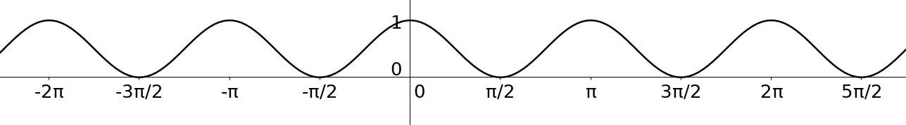{width="65%" fig-align="center"}

1.  Conjecturer graphiquement la parité de $f$ et une période de $f$.

2.  Démontrer ces conjectures par le calcul.
:::

::: {.application}
Soit $f$ la fonction définie sur $\mathbb{R}$ par $f(x)=\cos (4x)-\sin ^{2}(x)$.

1.  Étudier la parité de $f$. Interpréter graphiquement le résultat.

2.  Conjecturer graphiquement la période de $f$ et démontrer cette conjecture par le calcul.
:::

## La fonction sinus

::: {.definition}
La fonction sinus, notée $\sin$, est la fonction définie sur $\mathbb{R}$ par $x \mapsto \sin (x)$.
:::

::: {.proposition}
La fonction sinus est impaire. En effet, pour tout réel $x$, $\sin (-x) =-\sin (x)$.
:::

::: {.definition}
La courbe représentative de la fonction sinus est une sinusoïde. Elle est symétrique par rapport à l'origine du repère.
:::

::: {.proposition}
La fonction sinus est bornée. En effet, pour tout réel $x$, $-1 \le \sin (x) \le 1$.
:::

::: {.proposition}
La fonction sinus est $2\pi$-périodique. En effet, pour tout réel $x$, $\sin (x + 2\pi) = \sin (x)$.\
Sa courbe représentative est donc invariante par translation de vecteur $2\pi \overrightarrow{i}$ ou $-2\pi \overrightarrow{i}$
:::

::: {.illustration}
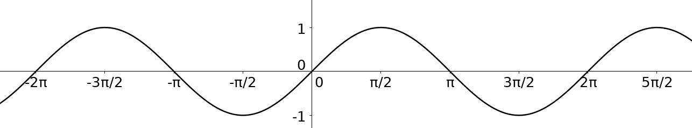{width="65%" fig-align="center"}
:::

#### Étude des variations de la fonction sinus:

La fonction sinus est $2\pi$-périodique. On peut donc restreindre l'étude à un intervalle de $\mathbb{R}$ d'amplitude $2\pi$. On en déduit ensuite les variations sur $\mathbb{R}$.\
De plus la fonction sinus est impaire. On peut donc restreindre l'étude à l'intervalle $[0;\pi]$ d'amplitude $\pi$.\
On déduit ensuite les variations sur $[-\pi;\pi]$ par symétrie.\
On étudie donc la fonction sinus sur $[0;\pi]$: On peut conjecturer à l'aide de la courbe représentative de la fonction sinus que celle-ci est croissante sur $\left[0;\dfrac{\pi}{2}\right]$ et décroissante sur $\left[\dfrac{\pi}{2};\pi\right]$

-   Soient $x$ et $x_1$ deux réels de $\left[0;\dfrac{\pi}{2}\right]$ tels que $x<x_1$. On appelle $M$ et $M_1$ les points du cercle trigonométrique respectivement associés à ces réels. Ces points sont sur le quart de cercle en haut à droite:

    ::: center
    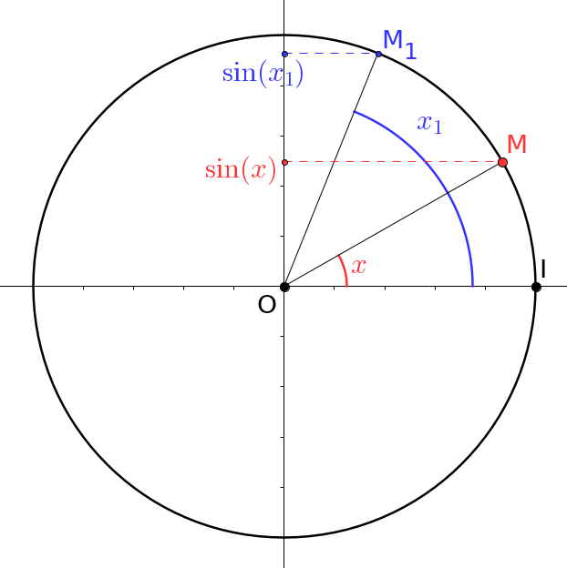{width="55%" fig-align="center"}
    :::

    On remarque ainsi que le point $M_1$ est "plus haut" que le point $M$. L'ordonnée de ce premier est donc supérieure à celle de ce dernier. Autrement dit, $\sin(x_1) > \sin(x)$. Ainsi la fonction sinus est croissante sur $\left[0;\dfrac{\pi}{2}\right]$

-   Soient $x$ et $x_1$ deux réels de $\left[\dfrac{\pi}{2};\pi\right]$ tels que $x<x_1$. On appelle $M$ et $M_1$ les points du cercle trigonométrique respectivement associés à ces réels. Ces points sont sur le quart de cercle en haut à gauche :

    ::: center
    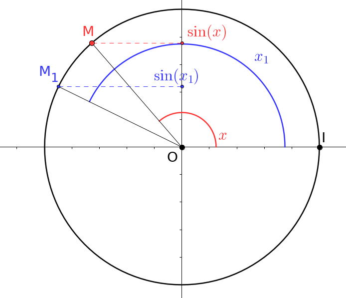{width="55%" fig-align="center"}
    :::

    On remarque ainsi que le point $M_1$ est "plus bas" que le point $M$. L'ordonnée de ce premier est donc inférieure à celle de ce dernier. Autrement dit, $\sin(x_1) < \sin(x)$. Ainsi la fonction sinus est décroissante sur $\left[\dfrac{\pi}{2};\pi\right]$.

## La fonction cosinus

::: {.definition}
La fonction cosinus, notée $\cos$, est la fonction définie sur $\mathbb{R}$ par $x \mapsto \cos (x)$.
:::

::: {.proposition}
La fonction cosinus est paire. En effet, pour tout réel $x$, $\cos (-x) =\cos (x)$.
:::

::: {.definition}
La courbe représentative de la fonction cosinus est une sinusoïde. Elle est symétrique par rapport à l'axe des ordonnées.
:::

::: {.proposition}
La fonction cosinus est bornée. En effet, pour tout réel $x$, $-1 \le \cos (x) \le 1$.
:::

::: {.proposition}
La fonction cosinus est $2\pi$-périodique. En effet, pour tout réel $x$, $\cos (x + 2\pi) = \cos (x)$.\
Sa courbe représentative est donc invariante par translation de vecteur $2\pi \overrightarrow{i}$ ou $-2\pi \overrightarrow{i}$.
:::

::: {.illustration}
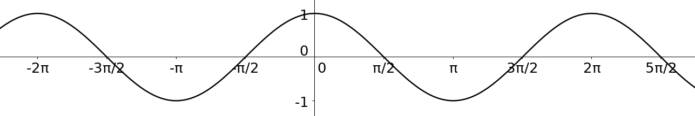{width="65%" fig-align="center"}
:::

#### Étude des variations de la fonction cosinus:

La fonction cosinus est $2\pi$-périodique. On peut donc restreindre l'étude à un intervalle de $\mathbb{R}$ d'amplitude $2\pi$. On en déduit ensuite les variations sur $\mathbb{R}$\
De plus la fonction cosinus est paire. On peut donc restreindre l'étude à l'intervalle $[0;\pi]$ d'amplitude $\pi$.\
On déduit ensuite les variations sur $[-\pi;\pi]$ par symétrie.\
On étudie donc la fonction cosinus sur $[0;\pi]$: On peut conjecturer à l'aide de la courbe représentative de la fonction cosinus que celle-ci est décroissante sur l'intervalle $[0;\pi]$.\
Soient $x$ et $x_1$ deux réels de $[0;\pi]$ tels que $x<x_1$. On appelle $M$ et $M_1$ les points du cercle trigonométrique associés à ces deux réels. Trois cas sont possibles:

-   $x$ et $x_1$ font partie de $\left[0;\dfrac{\pi}{2}\right]$

    ::: center
    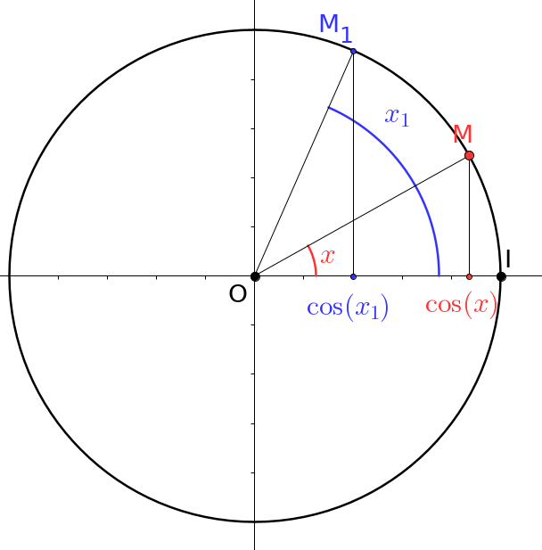{width="35%" fig-align="center"}
    :::

-   $x$ fait partie de $\left[0;\dfrac{\pi}{2}\right]$ et $x_1$ de $\left[\dfrac{\pi}{2};\pi \right]$

    ::: center
    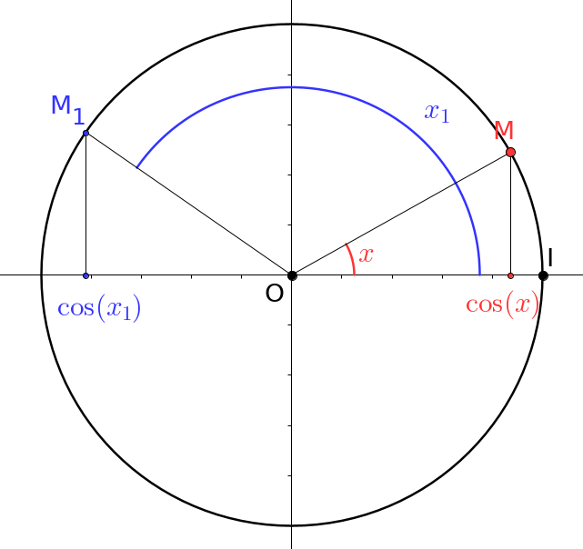{width="35%" fig-align="center"}
    :::

-   $x$ et $x_1$ font partie de $\left[\dfrac{\pi}{2};\pi \right]$

    ::: center
    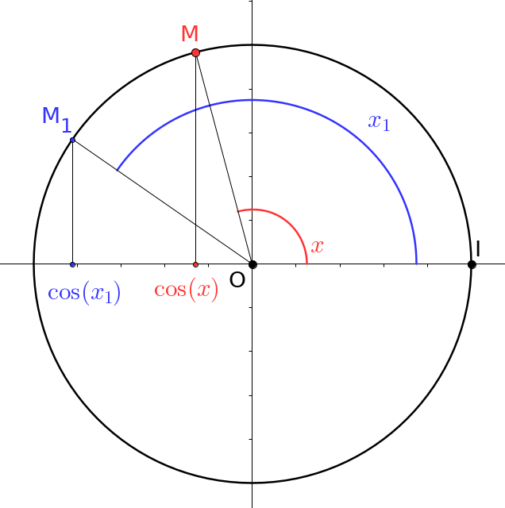{width="35%" fig-align="center"}
    :::

Dans tous les cas, on remarque que l'abscisse du point $M$ est supérieure à celle de $M_1$. Autrement dit, $\cos(x)>\cos(x_1)$.\
En résumé, sur $[0;\pi]$, la fonction cosinus est décroissante.
