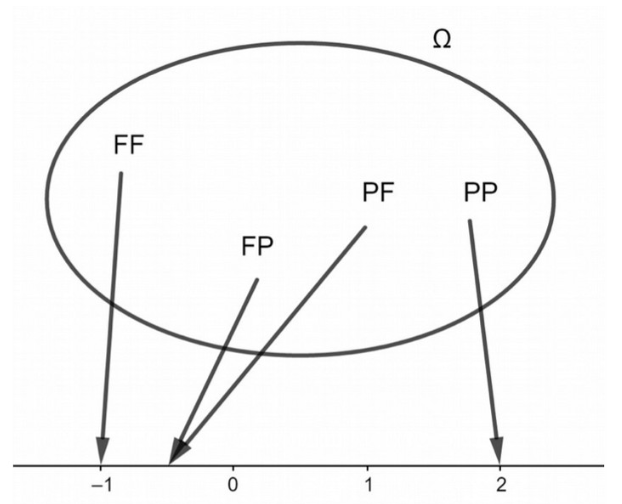

```css
```
```{=html}
<style>
:root {
  --def-color:   #2563eb;
  --prop-color:  #7c3aed;
  --theo-color:  #c026d3;
  --voc-color:   #0d9488;
  --rem-color:   #d97706;
  --ex-color:    #16a34a;
  --app-color:   #ea580c;
  --not-color:   #4f46e5;
  --meth-color:  #dc2626;
  --ill-color:   #475569;
}

.definition, .proposition, .theoreme, .vocabulaire, .remarque, .exemple, .application,
.notation, .methode, .illustration {
  margin: 1.5em 0;
  padding: 1em 1.3em 1em 1.3em;
  border-radius: 10px;
  border-left: 6px solid;
  box-shadow: 0 1px 4px rgba(0,0,0,0.08);
  font-family: "Georgia", serif;
}

.definition::before, .proposition::before, .theoreme::before, .vocabulaire::before,
.remarque::before, .exemple::before, .application::before,
.notation::before, .methode::before, .illustration::before {
  display: block;
  font-family: "Helvetica Neue", Arial, sans-serif;
  font-weight: 700;
  font-size: 0.95em;
  letter-spacing: 0.03em;
  text-transform: uppercase;
  margin-bottom: 0.6em;
}

.definition {
  background: #eff6ff;
  border-color: var(--def-color);
  color: #1e3a5f;
}
.definition::before {
  content: "📘  Définition";
  color: var(--def-color);
}

.proposition {
  background: #f5f3ff;
  border-color: var(--prop-color);
  color: #3b2467;
}
.proposition::before {
  content: "📐  Proposition";
  color: var(--prop-color);
}

.theoreme {
  background: #fdf4ff;
  border-color: var(--theo-color);
  color: #701a75;
}
.theoreme::before {
  content: "🏛️  Théorème";
  color: var(--theo-color);
}

.vocabulaire {
  background: #f0fdfa;
  border-color: var(--voc-color);
  color: #0f4c46;
}
.vocabulaire::before {
  content: "🏷️  Vocabulaire";
  color: var(--voc-color);
}

.remarque {
  background: #fffbeb;
  border-color: var(--rem-color);
  color: #6b4a06;
}
.remarque::before {
  content: "💡  Remarque";
  color: var(--rem-color);
}

.exemple {
  background: #f0fdf4;
  border-color: var(--ex-color);
  color: #14532d;
}
.exemple::before {
  content: "🔍  Exemple";
  color: var(--ex-color);
}

.application {
  background: #fff7ed;
  border: 2px dashed var(--app-color);
  border-left: 6px solid var(--app-color);
  color: #7c2d12;
}
.application::before {
  content: "✏️  Application";
  color: var(--app-color);
  font-size: 1.05em;
}

.notation {
  background: #eef2ff;
  border-color: var(--not-color);
  color: #312e81;
}
.notation::before {
  content: "🖊️  Notation";
  color: var(--not-color);
}

.methode {
  background: #fef2f2;
  border-color: var(--meth-color);
  color: #7f1d1d;
}
.methode::before {
  content: "🧭  Méthode";
  color: var(--meth-color);
}

.illustration {
  background: #f8fafc;
  border-color: var(--ill-color);
  color: #1e293b;
}
.illustration::before {
  content: "🖼️  Illustration";
  color: var(--ill-color);
}

/* Callouts "Solution" un peu plus stylés */
div.callout-caution {
  border-radius: 10px;
  box-shadow: 0 1px 4px rgba(0,0,0,0.08);
}
div.callout-caution .callout-title {
  font-family: "Helvetica Neue", Arial, sans-serif;
  font-weight: 700;
}
div.callout-caution .callout-title::before {
  content: "🔓  ";
}
</style>
```

# Variables aléatoires

## Exemple

::: {.application}
On lance 2 fois de suite une pièce de monnaie supposée équilibrée. On appelle $P$ l'événement « on obtient pile » et $F$ l'événement « on obtient face ». Une éventualité se présente comme un couple de lettres éventuellement identiques. L'univers $\Omega$ de cette expérience est $\Omega=\{PP,FF,PF,FP\}$. Toutes ces issues sont équiprobables.

On décide que :

-   si on obtient 2 fois pile, on gagne 2 € ;

-   si on obtient 2 fois face, on perd 1 € ;

-   dans tous les autres cas, on perd 0,50 €.

{width="35%" fig-align="center"}
:::

::: {.callout-caution collapse="true"}
## Solution

La fonction $X$ qui, à chaque issue de $\Omega$ associe le gain du joueur, prend comme valeurs : $x_1=2$, $x_2=-1$ et $x_3=-0,5$.\
L'événement « $X$ prend la valeur 2 » se note $(X=2)$.\
Sa probabilité $p_1=P(X=2)=\frac{1}{4}$. De même, $p_2=P(X=-1)=\frac{1}{4}$ et $p_3=P(X=-0,5)=\frac{1}{2}$.\
On résume en général la loi de probabilité de X dans un tableau.

| $x_i$ |      $2$      |     $-1$      |   $-0{,}5$    |
|:-----:|:-------------:|:-------------:|:-------------:|
| $p_i$ | $\frac{1}{4}$ | $\frac{1}{4}$ | $\frac{1}{2}$ |
:::

## Loi de probabilité

::: {.definition}
Soit $\Omega$ l'univers d'une expérience aléatoire.\
Une variable aléatoire $X$ sur $\Omega$ est une fonction définie de $\Omega$ dans $\mathbb{R}$.\
Si $x_i$ désigne la valeur prise par $X$, on note $(X=x_i)$ l'événement « $X$ prend la valeur $x_i$ »\
La loi de probabilité de la variable $X$ associe à chaque valeur $x_i$ la probabilité de l'événement $(X=x_i)$.

On présente habituellement cette loi sous forme d'un tableau :

|     $x_i$      | $x_1$ | $x_2$ | \... | $x_n$ |
|:--------------:|:-----:|:-----:|:----:|:-----:|
| $P(\{X=x_i\})$ | $p_1$ | $p_2$ | \... | $p_n$ |
:::

::: {.remarque}
Comme pour toute loi de probabilité, on a toujours : $\displaystyle\sum_{i=1}^n p_i=1$
:::

::: {.notation}
Soit $a$ un réel.\
On note $\{X \geqslant a\}$ l'événement « la variable aléatoire $X$ prend une valeur supérieure ou égale à la valeur a ».\
On peut définir de la même manière les événements $\{X>a\}$, $\{X<a\}$ et $\{X \leqslant a\}$
:::

# Espérance, variance et écart-type

## Espérance

::: {.definition}
Soit $X$ une variable aléatoire de loi de probabilité:

|     $x_i$      | $x_1$ | $x_2$ | \... | $x_n$ |
|:--------------:|:-----:|:-----:|:----:|:-----:|
| $P(\{X=x_i\})$ | $p_1$ | $p_2$ | \... | $p_n$ |

On appelle espérance de $X$ le nombre réel, noté $E(X)$, défini par :\
$$E(X)=\displaystyle\sum_{i=1}^n x_i \times P(X=x_i)$$
:::

::: {.remarque}
$E(X)$ s'interprète comme la valeur moyenne des valeurs prises par $X$ lorsque l'expérience est répétée un grand nombre de fois.
:::

::: {.application}
Reprenons l'application 1:

| $x_i$ |      $2$      |     $-1$      |   $-0{,}5$    |
|:-----:|:-------------:|:-------------:|:-------------:|
| $p_i$ | $\frac{1}{4}$ | $\frac{1}{4}$ | $\frac{1}{2}$ |

Calculer l'espérance de $X$ et interpréter le résultat.
:::

::: {.callout-caution collapse="true"}
## Solution

$E(X)=2 \times \frac{1}{4}+(-1)\times \frac{1}{4}+(-0,5)\times\frac{1}{2}=0$.\
Sur un grand nombre de parties, le joueur gagne en moyenne 0 € par partie : le jeu est équitable.
:::

::: {.vocabulaire}
-   Si l'espérance est nulle, on dit que le jeu est équitable.

-   Si l'espérance est positive, on dit que le jeu est favorable au joueur.

-   Si l'espérance est négative, on dit que le jeu est défavorable au joueur.
:::

## Variance et écart-type

::: {.definition}
Soit $X$ une variable aléatoire dont la loi de probabilité est:

|     $x_i$      | $x_1$ | $x_2$ | \... | $x_n$ |
|:--------------:|:-----:|:-----:|:----:|:-----:|
| $P(\{X=x_i\})$ | $p_1$ | $p_2$ | \... | $p_n$ |

On appelle variance de $X$ le nombre réel positif, noté $V(X)$, défini par : $$V(X)=\displaystyle\sum_{i=1}^n[x_i-E(X)]^2\times P(X=x_i)$$
:::

::: {.proposition}
Formule de König-Huygens\
$$V(X)=\displaystyle\sum_{i=1}^n x_i^2 \times P(X=x_i)-[E(X)]^2$$
:::

::: {.callout-caution collapse="true"}
## Solution

Si la variable aléatoire $X$ prend respectivement les valeurs $x_1,x_2,...,x_n$ avec les probabilités $p_1,p_2,...,p_n$, alors la variable aléatoire $X^2$ prend respectivement les valeurs $x_1^2,...,x_n^2$ avec les probabilités $p_1,...,p_n$. Ainsi: $$\begin{aligned}
 V(X)&= \sum \limits_{{i=1}}^{n}[x_i-E(X)]^2\times p_i \\
 &= \sum \limits_{{i=1}}^{n} (x_i^2-2\times E(X)\times x_i+E(X)^2)p_i \\
 &= \sum \limits_{{i=1}}^{n} \left(x_i^2p_i-2\times E(X)\times x_ip_i+E(X)^2p_i\right) \\
 &= \sum \limits_{{i=1}}^{n} x_i^2p_i + \sum \limits_{{i=1}}^{n} -2\times E(X)\times x_ip_i + \sum \limits_{{i=1}}^{n} E(X)^2p_i \\
 &= E(X^2)-2 E(X)\times \sum \limits_{{i=1}}^{n} x_ip_i + E(X)^2 \times \sum \limits_{{i=1}}^{n} p_i \\
 &= E(X^2)-2 E(X)\times E(X) + E(X)^2 \\
 &= E(X^2)-E(X)^2
\end{aligned}$$
:::

::: {.application}
Reprenons l'application 1:

| $x_i$ |      $2$      |     $-1$      |   $-0{,}5$    |
|:-----:|:-------------:|:-------------:|:-------------:|
| $p_i$ | $\frac{1}{4}$ | $\frac{1}{4}$ | $\frac{1}{2}$ |

Calculer la variance de $X$
:::

::: {.callout-caution collapse="true"}
## Solution

$V(X)=2^2\times \frac{1}{4}+(-1)^2\times \frac{1}{4}+(-0,5)^2 \times \frac{1}{2}-0^2=1,375$.
:::

::: {.definition}
Soit $X$ une variable aléatoire dont la loi de probabilité est:

|     $x_i$      | $x_1$ | $x_2$ | \... | $x_n$ |
|:--------------:|:-----:|:-----:|:----:|:-----:|
| $P(\{X=x_i\})$ | $p_1$ | $p_2$ | \... | $p_n$ |

On appelle écart-type de X le nombre réel positif, noté $\sigma(X)$, défini par :\
$$\sigma(X)=\sqrt{V(X)}$$
:::

::: {.remarque}
Comme en statistiques, l'écart-type permet de se donner une idée de la dispersion des valeurs prises par une variable autour de son espérance en tenant compte des probabilités.\
Plus l'écart-type est « grand », plus les valeurs prises par la variable aléatoire sont « éloignées » de l'espérance. Dans le cas d'un gain, plus il est grand, plus le jeu est risqué.
:::

# Propriétés des indicateurs

::: {.definition}
Soient $a$ et $b$ deux réels.\
On définit une nouvelle variable aléatoire en associant à chaque issue donnant la valeur $x_i$, le nombre $ax_i+b$.\
Cette nouvelle variable se note $aX+b$.
:::

::: {.exemple}
Reprenons l'application 1. On change les règles du jeu : on multiplie les gains par 10 et on instaure une mise de 5 euros.\
On note $Y$ la nouvelle variable aléatoire représentant le gain du joueur. On a donc $Y=10X-5$.\
Les valeurs prises par $Y$ sont $15, -15$ et $-10$.
:::

::: {.proposition}
Linéarité de l'espérance\
Soit $X$ une variable aléatoire et $a$ et $b$ deux réels.\
$$E(aX+b)=aE(X)+b$$
:::

::: {.callout-caution collapse="true"}
## Solution

Soit $X$ une variable aléatoire dont la loi de probabilité est:

|     $x_i$      | $x_1$ | $x_2$ | \... | $x_n$ |
|:--------------:|:-----:|:-----:|:----:|:-----:|
| $P(\{X=x_i\})$ | $p_1$ | $p_2$ | \... | $p_n$ |

Soient $a$ et $b$ deux réels. La variable aléatoire $aX+b$ suit la loi de probabilité:

|      $a x_i +b$       | $ax_1+b$ | $ax_2+b$ | \... | $ax_n+b$ |
|:---------------------:|:--------:|:--------:|:----:|:--------:|
| $P(\{aX+b= ax_i+b\})$ |  $p_1$   |  $p_2$   | \... |  $p_n$   |

On peut remarquer que seules les valeurs de la variable aléatoire changent, pas les probabilités correspondantes.\
Par définition de l'espérance on a: $$\begin{aligned}
        E(aX+b)&=\displaystyle\sum_{i=1}^n (ax_i+b) \times P(X=x_i)\\
        &=\displaystyle\sum_{i=1}^n [ ax_i \times P(X=x_i)+b \times P(X=x_i)]\\
        &=a\displaystyle\sum_{i=1}^n  x_i \times P(X=x_i)+b\displaystyle\sum_{i=1}^n  P(X=x_i)\\
        &=aE(X)+b

\end{aligned}$$
:::

::: {.proposition}
Soit $X$ une variable aléatoire et $a$ et $b$ deux réels.

$V(aX+b)=a^2V(X)$
:::

::: {.callout-caution collapse="true"}
## Solution

Avec les mêmes notations: $$\begin{aligned}
 V(aX+b)&= E((aX+b)^2)-[E(aX+b)]^2 \\
 &= E(a^2X^2+2abX+b^2)-[aE(X)+b]^2 \\
 &= a^2E(X^2) + 2abE(X)+b^2-[a^2E(X)^2+2abE(X)+b^2] \\
 &= a^2E(X^2)+2abE(X)+b^2-a^2E(X)^2-2abE(X)-b^2 \\
 &= a^2E(X^2) -a^2E(X)^2 \\
 &= a^2(E(X^2)-E(X)^2) \\
 &=a^2V(X)
\end{aligned}$$
:::
