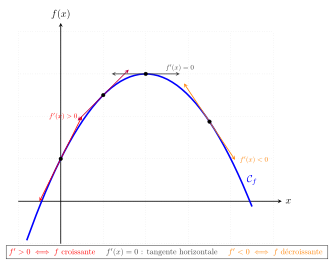
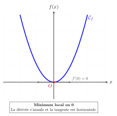
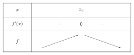

```css
```
```{=html}
<style>
:root {
  --def-color:   #2563eb;
  --prop-color:  #7c3aed;
  --theo-color:  #c026d3;
  --voc-color:   #0d9488;
  --rem-color:   #d97706;
  --ex-color:    #16a34a;
  --app-color:   #ea580c;
  --not-color:   #4f46e5;
  --meth-color:  #dc2626;
  --ill-color:   #475569;
}

.definition, .proposition, .theoreme, .vocabulaire, .remarque, .exemple, .application,
.notation, .methode, .illustration {
  margin: 1.5em 0;
  padding: 1em 1.3em 1em 1.3em;
  border-radius: 10px;
  border-left: 6px solid;
  box-shadow: 0 1px 4px rgba(0,0,0,0.08);
  font-family: "Georgia", serif;
}

.definition::before, .proposition::before, .theoreme::before, .vocabulaire::before,
.remarque::before, .exemple::before, .application::before,
.notation::before, .methode::before, .illustration::before {
  display: block;
  font-family: "Helvetica Neue", Arial, sans-serif;
  font-weight: 700;
  font-size: 0.95em;
  letter-spacing: 0.03em;
  text-transform: uppercase;
  margin-bottom: 0.6em;
}

.definition {
  background: #eff6ff;
  border-color: var(--def-color);
  color: #1e3a5f;
}
.definition::before {
  content: "📘  Définition";
  color: var(--def-color);
}

.proposition {
  background: #f5f3ff;
  border-color: var(--prop-color);
  color: #3b2467;
}
.proposition::before {
  content: "📐  Proposition";
  color: var(--prop-color);
}

.theoreme {
  background: #fdf4ff;
  border-color: var(--theo-color);
  color: #701a75;
}
.theoreme::before {
  content: "🏛️  Théorème";
  color: var(--theo-color);
}

.vocabulaire {
  background: #f0fdfa;
  border-color: var(--voc-color);
  color: #0f4c46;
}
.vocabulaire::before {
  content: "🏷️  Vocabulaire";
  color: var(--voc-color);
}

.remarque {
  background: #fffbeb;
  border-color: var(--rem-color);
  color: #6b4a06;
}
.remarque::before {
  content: "💡  Remarque";
  color: var(--rem-color);
}

.exemple {
  background: #f0fdf4;
  border-color: var(--ex-color);
  color: #14532d;
}
.exemple::before {
  content: "🔍  Exemple";
  color: var(--ex-color);
}

.application {
  background: #fff7ed;
  border: 2px dashed var(--app-color);
  border-left: 6px solid var(--app-color);
  color: #7c2d12;
}
.application::before {
  content: "✏️  Application";
  color: var(--app-color);
  font-size: 1.05em;
}

.notation {
  background: #eef2ff;
  border-color: var(--not-color);
  color: #312e81;
}
.notation::before {
  content: "🖊️  Notation";
  color: var(--not-color);
}

.methode {
  background: #fef2f2;
  border-color: var(--meth-color);
  color: #7f1d1d;
}
.methode::before {
  content: "🧭  Méthode";
  color: var(--meth-color);
}

.illustration {
  background: #f8fafc;
  border-color: var(--ill-color);
  color: #1e293b;
}
.illustration::before {
  content: "🖼️  Illustration";
  color: var(--ill-color);
}

/* Callouts "Solution" un peu plus stylés */
div.callout-caution {
  border-radius: 10px;
  box-shadow: 0 1px 4px rgba(0,0,0,0.08);
}
div.callout-caution .callout-title {
  font-family: "Helvetica Neue", Arial, sans-serif;
  font-weight: 700;
}
div.callout-caution .callout-title::before {
  content: "🔓  ";
}
</style>
```

# Variations d'une fonction

## Théorème

::: {.theoreme}
Soit $f$ une fonction définie et dérivable sur un intervalle $I$ de $\mathbb{R}$.

-   $f$ est strictement croissante sur $I$ si pour tout réel $x$ de $I$, $f'(x)> 0$ (sauf éventuellement en un nombre fini de valeurs où $f'(x)$ s'annule).

-   $f$ est strictement décroissante sur $I$ si pour tout réel $x$ de $I$, $f'(x)< 0$ (sauf éventuellement en un nombre fini de valeurs où $f'(x)$ s'annule).

-   $f$ est constante sur $I$ si et seulement si pour tout réel $x$ de $I$, $f'(x)= 0$
:::

::: {.remarque}
La fonction $f$ est croissante (resp. décroissante) sur $I$ si et seulement si pour tout réel $x$ de $I$, $f'(x)\geqslant 0$ (resp. $f'(x)\leqslant 0$).
:::

::: {.illustration}
{width="70%" fig-align="center"}
:::

::: {.methode}
Pour étudier les variations d'une fonction sur un intervalle $I$:

1.  On calcule la fonction dérivée $f'$ de $f$.

2.  On étudie le signe de la dérivée $f'$

3.  On déduit les variations de $f$ dans un tableau.
:::

::: {.remarque}
Lorsque l'on demande le tableau de variations d'une fonction, on ajoute dans le tableau les images des réels en lesquels il y a un changement de sens de variation.
:::

::: {.application}
Pour les fonctions suivantes, tracer le tableau de variations.

1.  $f$ est la fonction définie sur $\mathbb{R}$ par $f(x)=\dfrac{1}{2}x^2-x-1$.

2.  $g$ est la fonction définie sur $\mathbb{R}$ par $g(x)=x^3-6x^2+9x+2$.

3.  $h$ est la fonction définie sur $\mathbb{R}\setminus \{2\}$ par $h(x)=\dfrac{(x-3)^2}{x-2}$

4.  $t$ est la fonction définie sur $\mathbb{R}$ par $t(x)=\dfrac{3x-2x^2}{x^2-3x+3}$
:::

# Extremums d'une fonction

## Extremum local

::: {.definition}
Soit $f$ une fonction définie sur un intervalle $I$.

-   $f$ admet un minimum local en $x_0$ s'il existe un intervalle ouvert $J$ contenant $x_0$ et inclus dans $I$ tel que pour tout $x$ de $J$, $f(x)\geqslant f(x_0)$.

-   $f$ admet un maximum local en $x_0$ s'il existe un intervalle ouvert $J$ contenant $x_0$ et inclus dans $I$ tel que pour tout $x$ de $J$, $f(x)\leqslant f(x_0)$.
:::

::: {.vocabulaire}
Un minimum local ou un maximum local est appelé un extremum local.
:::

::: {.illustration}
{width="70%" fig-align="center"}

On a représenté ci-contre le graphe d'une fonction $f$ définie sur $[-4;3]$.

-   Le maximum de $f$ sur $[-4;3]$ est 2, atteint en $-1$ et en 3.

-   Le minimum de $f$ sur $[-4;3]$ est $-2$, atteint en $-3$.

-   $-1$ est un minimum local (atteint en 2) et $-2$ un minimum local (atteint en $-3$).

-   $2$ est un maximum local (atteint en $-1$).
:::

## Dérivée et extremum local

::: {.proposition}
Soit $f$ une fonction définie et dérivable sur un intervalle ouvert $I$. Soit $x_0$ un réel de $I$.\
Si $f$ admet un extremum local en $x_0$ alors $f'(x_0)=0$
:::

::: {.exemple}
Soit $f$ la fonction définie sur $\mathbb{R}$ par $f(x) = x^2$. $f$ est une fonction polynôme, elle est donc dérivable sur $\mathbb{R}$. Pour tout réel $x$, sa fonction dérivée est : $f'(x) = 2x$.

1.  On cherche la valeur $x_0$ telle que $f'(x_0) = 0$. $2x = 0 \iff x = 0$

2.  -   Sur $]-\infty ; 0[$, $f'(x) < 0$, donc $f$ est strictement décroissante.

    -   Sur $]0 ; +\infty[$, $f'(x) > 0$, donc $f$ est strictement croissante.

3.  La dérivée $f'$ s'annule en changeant de signe en $x_0 = 0$. Par conséquent, $f$ admet un minimum local (et global) en $0$. Ce minimum vaut $f(0) = 0^2 = 0$.

{width="70%" fig-align="center"}
:::

::: {.remarque}
La réciproque est fausse.
:::

::: {.exemple}
Soit $f$ la fonction définie sur $\mathbb{R}$ par $f(x) = x^3$. $f$ est dérivable sur $\mathbb{R}$ et pour tout réel $x$, on a : $f'(x) = 3x^2$.

1.  $f'(x) = 0 \iff 3x^2 = 0 \iff x = 0$. La courbe $\mathcal{C}_f$ admet donc une tangente horizontale à l'origine.

2.  Pour tout $x \neq 0$, $x^2 > 0$, donc $f'(x) > 0$. La dérivée est positive avant $0$ et reste positive après $0$. Elle ne change pas de signe.

3.  La fonction $f$ est strictement croissante sur $\mathbb{R}$. Bien que $f'(0) = 0$, $f$ n'admet ni maximum local ni minimum local en $0$.

{width="70%" fig-align="center"}
:::

::: {.proposition}
Soit $f$ une fonction définie et dérivable sur un intervalle ouvert $I$. Soit $x_0$ un réel de $I$.\
Si $f'(x_0)=0$ et si $f'$ change de signe en $x_0$ (on dit que $f'$ s'annule en changeant de signe en $x_0$) alors $f$ admet un extremum local en $x_0$.
:::

::: {.illustration}
-   $f$ admet un minimum local en $x_0$

    {width="70%" fig-align="center"}

-   $f$ admet un maximum local en $x_0$

    {width="70%" fig-align="center"}
:::
