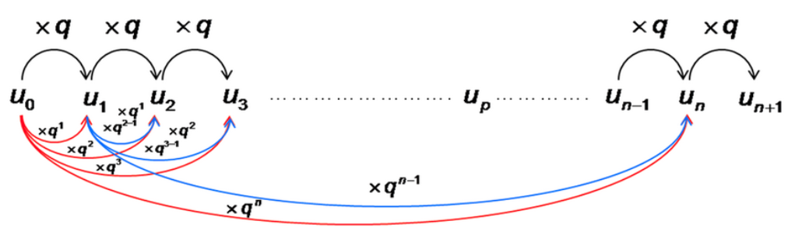
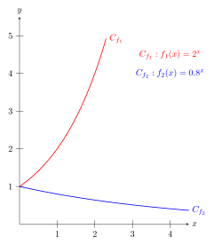
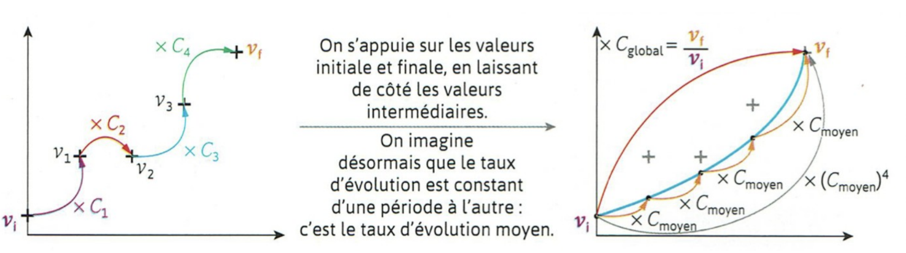

```css
```
```{=html}
<style>
:root {
  --def-color:   #2563eb;
  --prop-color:  #7c3aed;
  --theo-color:  #c026d3;
  --voc-color:   #0d9488;
  --rem-color:   #d97706;
  --ex-color:    #16a34a;
  --app-color:   #ea580c;
  --not-color:   #4f46e5;
  --meth-color:  #dc2626;
  --ill-color:   #475569;
}

.definition, .proposition, .theoreme, .vocabulaire, .remarque, .exemple, .application,
.notation, .methode, .illustration {
  margin: 1.5em 0;
  padding: 1em 1.3em 1em 1.3em;
  border-radius: 10px;
  border-left: 6px solid;
  box-shadow: 0 1px 4px rgba(0,0,0,0.08);
  font-family: "Georgia", serif;
}

.definition::before, .proposition::before, .theoreme::before, .vocabulaire::before,
.remarque::before, .exemple::before, .application::before,
.notation::before, .methode::before, .illustration::before {
  display: block;
  font-family: "Helvetica Neue", Arial, sans-serif;
  font-weight: 700;
  font-size: 0.95em;
  letter-spacing: 0.03em;
  text-transform: uppercase;
  margin-bottom: 0.6em;
}

.definition {
  background: #eff6ff;
  border-color: var(--def-color);
  color: #1e3a5f;
}
.definition::before {
  content: "📘  Définition";
  color: var(--def-color);
}

.proposition {
  background: #f5f3ff;
  border-color: var(--prop-color);
  color: #3b2467;
}
.proposition::before {
  content: "📐  Proposition";
  color: var(--prop-color);
}

.theoreme {
  background: #fdf4ff;
  border-color: var(--theo-color);
  color: #701a75;
}
.theoreme::before {
  content: "🏛️  Théorème";
  color: var(--theo-color);
}

.vocabulaire {
  background: #f0fdfa;
  border-color: var(--voc-color);
  color: #0f4c46;
}
.vocabulaire::before {
  content: "🏷️  Vocabulaire";
  color: var(--voc-color);
}

.remarque {
  background: #fffbeb;
  border-color: var(--rem-color);
  color: #6b4a06;
}
.remarque::before {
  content: "💡  Remarque";
  color: var(--rem-color);
}

.exemple {
  background: #f0fdf4;
  border-color: var(--ex-color);
  color: #14532d;
}
.exemple::before {
  content: "🔍  Exemple";
  color: var(--ex-color);
}

.application {
  background: #fff7ed;
  border: 2px dashed var(--app-color);
  border-left: 6px solid var(--app-color);
  color: #7c2d12;
}
.application::before {
  content: "✏️  Application";
  color: var(--app-color);
  font-size: 1.05em;
}

.notation {
  background: #eef2ff;
  border-color: var(--not-color);
  color: #312e81;
}
.notation::before {
  content: "🖊️  Notation";
  color: var(--not-color);
}

.methode {
  background: #fef2f2;
  border-color: var(--meth-color);
  color: #7f1d1d;
}
.methode::before {
  content: "🧭  Méthode";
  color: var(--meth-color);
}

.illustration {
  background: #f8fafc;
  border-color: var(--ill-color);
  color: #1e293b;
}
.illustration::before {
  content: "🖼️  Illustration";
  color: var(--ill-color);
}

/* Callouts "Solution" un peu plus stylés */
div.callout-caution {
  border-radius: 10px;
  box-shadow: 0 1px 4px rgba(0,0,0,0.08);
}
div.callout-caution .callout-title {
  font-family: "Helvetica Neue", Arial, sans-serif;
  font-weight: 700;
}
div.callout-caution .callout-title::before {
  content: "🔓  ";
}
</style>
```

# Suites géométriques

## Définition et expression du terme général

::: {.definition}
Une suite $(u_n)_{n\in \mathbb{N}}$ est géométrique s'il existe un réel q, appelé raison de la suite, tel que pour tout $n\in \mathbb{N}$, on a $u_{n+1}=q \times u_n$.
:::

::: {.proposition}
Soit $(u_n)_{n\in \mathbb{N}}$ une suite géométrique de raison q.\
Pour tout $n\in \mathbb{N}$, $u_n=u_0\times q^n$.\
Pour tout $n\in \mathbb{N}$, et pour tout $p\in \mathbb{N}$, $u_n=u_p\times q^{n-p}$.
:::

::: {.callout-caution collapse="true"}
## Solution

Soit $(u_n)_{n\in \mathbb{N}}$ une suite géométrique de raison q.\

{width="45%" fig-align="center"}
:::

::: {.methode}
Pour démontrer qu'une suite $(u_n)_{n\in \mathbb{N}}$ est géométrique, on peut :

1.  montrer que, pour tout ${n\in \mathbb{N}}$, $u_{n+1}=q \times u_n$ ;

2.  montrer que, pour tout ${n\in \mathbb{N}}$, $\frac{u_{n+1}}{u_n}$ est égal à une constante $q$ si tous les termes de la suite sont non nuls ;

3.  montrer que, pour tout ${n\in \mathbb{N}}$, $u_n$ peut s'écrire sous la forme $a\times b^n$ avec $a$ et $b$ des réels.

Pour démontrer qu'une suite $(u_n)_{n\in \mathbb{N}}$ n'est pas géométrique, on peut calculer les premiers termes de la suite et comparer les quotients de deux termes consécutifs.
:::

::: {.application}
Les suites suivantes sont-elles géométriques?

1.  Soit $(u_n)_{n\in \mathbb{N}}$ la suite définie par $u_0=2$ et $u_{n+1}=\frac{u_n}{2}$\

2.  Soit $(v_n)_{n\in \mathbb{N}}$ la suite définie par $v_n=\frac{1}{4^n}$.\

3.  Soit $(w_n)_{n\in \mathbb{N}}$ la suite définie par $w_n=\frac{1}{n+1}$\
:::

::: {.callout-caution collapse="true"}
## Solution

1.  Soit $(u_n)_{n\in \mathbb{N}}$ la suite définie par $u_0=2$ et $u_{n+1}=\frac{u_n}{2}$\
    Soit ${n\in \mathbb{N}}$, $u_{n+1}=u_n \times \frac{1}{2}$\
    Donc la suite $(u_n)$ est géométrique de raison $q=\frac{1}{2}$.

2.  Soit $(v_n)_{n\in \mathbb{N}}$ la suite définie par $v_n=\frac{1}{4^n}$.\
    Soit ${n\in \mathbb{N}}$, $v_n \ne 0$ et $\frac{v_{n+1}}{v_n}=\frac{\frac{1}{4^{n+1}}}{\frac{1}{4^n}}=\frac{1}{4^{n+1}} \times \frac{4^n}{1}=\frac{1}{4}$\
    Donc la suite $(v_n)$ est géométrique de raison $q=\frac{1}{4}$.

3.  Soit $(w_n)_{n\in \mathbb{N}}$ la suite définie par $w_n=\frac{1}{n+1}$\
    $w_0=1$, $w_1=\frac{1}{2}$ et $w_2=\frac{1}{3}$\
    $\frac{w_1}{w_0}=\frac{1}{2}$ et $\frac{w_2}{w_1}=\frac{2}{3}$\
    Donc $\frac{w_1}{w_0}\ne \frac{w_2}{w_1}$\
    Ainsi, la suite $(w_n)$ n'est pas géométrique.
:::

## Sens de variation

::: {.proposition}
Soit $(u_n)_{n\in \mathbb{N}}$ une suite géométrique de raison q et de premier terme $u_0 \ne 0$.

-   Si $q>1$ :

    -   si $u_0>0$, alors la suite est strictement croissante ;

    -   si $u_0<0$, alors la suite est strictement décroissante.

-   Si $0<q<1$ :

    -   si $u_0>0$, alors la suite est strictement décroissante ;

    -   si $u_0<0$, alors la suite est strictement croissante.

-   Si $q=0$ ou $q=1$, alors la suite est constante.

-   Si $q<0$, alors la suite n'est pas monotone.
:::

::: {.callout-caution collapse="true"}
## Solution

Soit $n\in \mathbb{N}$, $u_{n+1}-u_n=u_0 \times q^{n+1}-u_0 \times q^n=u_0 \times q^n(q-1)$

-   Si $q>1$, alors $q-1>0$ et $q^n>0$ :

    -   si $u_0>0$, alors $u_{n+1}-u_n>0$ et donc la suite est strictement croissante ;

    -   si $u_0<0$, alors $u_{n+1}-u_n<0$ et donc la suite est strictement décroissante.

-   Si $0<q<1$, alors $q-1<0$ et $q^n>0$ :

    -   si $u_0>0$, alors $u_{n+1}-u_n<0$ et donc la suite est strictement décroissante ;

    -   si $u_0<0$, alors $u_{n+1}-u_n>0$ et donc la suite est strictement croissante.

-   Si $q=0$ ou $q=1$, alors $u_{n+1}-u_n=0$ et donc la suite est constante.

-   Si $q<0$, alors les termes de la suite sont alternativement positifs et négatifs et donc la suite n'est pas monotone.
:::

::: {.application}
Etudier la monotonie des suites suivantes:

1.  Soit $(u_n)_{n\in \mathbb{N}}$ la suite définie par $u_0=2$ et $u_{n+1}=2{u_n}$\

2.  Soit $(v_n)_{n\in \mathbb{N}}$ la suite définie par $u_0=-5$ et $v_{n+1}=0,5v_n$.\
:::

::: {.callout-caution collapse="true"}
## Solution

1.  Soit $(u_n)_{n\in \mathbb{N}}$ la suite définie par $u_0=2$ et $u_{n+1}=2{u_n}$\
    La suite $(u_n)$ est géométrique de raison $q=2>1$ et de premier terme $u_0=2>0$.\
    Donc la suite $(u_n)$ est croissante.

2.  Soit $(v_n)_{n\in \mathbb{N}}$ la suite définie par $u_0=-5$ et $v_{n+1}=0,5v_n$.\
    La suite $(v_n)$ est géométrique de raison $q=0,5 \in ]0;1[$ et de premier terme $v_0=-5<0$.\
    Donc la suite $(v_n)$ est croissante.
:::

# Fonction exponentielle

## Définition

::: {.definition}
La fonction définie sur $\mathbb{R}$ par $f(x)=a^x$ avec $a>0$, s'appelle fonction exponentielle de base $a$.
:::

::: {.remarque}
-   Lorsque $x$ est un nombre entier, $a^x$ correspond à une puissance de $a$.

-   Avec la calculatrice, il est possible de calculer les valeurs d'une fonction exponentielle de base $a$.
:::

::: {.remarque}
Il est possible de faire l'analogie entre une suite géométrique et une fonction exponentielle de base $a$:\

-   Suite géométrique: $\forall n \in \mathbb{N},~u_n=u_0\times q^n$

-   Fonction exponentielle de base $a$: $\forall x \in \mathbb{R},~f(x)=k\times a^x$.

On peut constater que les fonctions $x \mapsto k\times a^x$ sont les prolongements des suites géométrique dans le cas où l'exposant est réel.
:::

## Sens de variations et courbe représentative

::: {.proposition}
Soit $a\in \mathbb{R}^{+*}$. Soit $f$ la fonction définie sur $\mathbb{R}^+$ par $f(x)=a^x$

-   Si $0<a<1$ alors $f$ est strictement croissante sur $\mathbb{R}^+$

-   Si $a=1$ alors $f$ est constante sur $\mathbb{R}^+$

-   Si $a>1$ alors $f$ est strictement croissante sur $\mathbb{R}^+$
:::

::: {.proposition}
-   Quel que soit $a$, la fonction exponentielle de base $a$ passe toujours par le point $A(0;1)$.

-   Le rapport entre les images de deux nombres séparés d'un écart donné est constant. Ceci est caractéristique d'une croissance exponentielle continue.
:::

::: {.exemple}
On considère les fonctions définie sur $\mathbb{R}^+$ par $f_1(x)=2^x$ et $f_2(x)=0.8^x$

<figure id="fig:fonctions_exp">
<p> <span id="fig:fonctions_exp" label="fig:fonctions_exp"></span></p>
</figure>
:::

::: {.proposition}
Soient $a>0$ et $k>0$.\
La fonction $g$ définie sur $\mathbb{R}^+$ par $g(x)=k\times a^x$ a le même sens de variation que la fonction $f$ définie sur $\mathbb{R}+$ par $f(x)=a^x$.
:::

## Propriétés algébriques

::: {.proposition}
Soient $a$ et $b$ deux réels strictement positifs et $x$ et $y$ deux réels.

-   $a^0=1$

-   $a^1=a$

-   $a^{-x}=\dfrac{1}{a^x}$

-   $a^{x+y}=a^x \times a^y$

-   $\dfrac{a^x}{a^y}=a^{x-y}$

-   $(a^x)^y=a^{xy}$

-   $\dfrac{a^x}{b^x}=\left(\dfrac{a}{b} \right)^x$

-   $a^x \times b^x=(ab)^x$
:::

# Racine n-ième et taux d'évolution moyen

::: {.definition}
Pour tout nombre entier $n$ positif et non nul, on appelle racine n-ième d'un nombre réel $a>0$ le nombre $a^{\frac{1}{n}}$.
:::

::: {.proposition}
Soit $k\geqslant 0$.\
L'équation $x^n=k$ admet une unique solution réelle positive: $x=k^{\frac{1}{n}}$
:::

::: {.exemple}
La solution positive de l'équation $x^5=13$ est $x=13^{\frac{1}{5}}$
:::

::: {.definition}
Le taux d'évolution moyen $t_moyen$ d'une quantité qui passe d'une valeur initiale $v_i$ à une valeur finale $v_f$ sur $n$ périodes est le taux qui, s'il était identique sur chaque période, permettrait de passer de $v_i$ à $v_f$.
:::

::: {.notation}
On note:\

-   $C_1$, $C_2$, \..., $C_n$ les coefficient multiplicateur liés aux évolutions successives.

-   $C_{moyen}$ est le coefficient multiplicateur moyen

-   $C_{global}$ est le coefficient multiplicateur de la valeur initiale à la valeur finale.\
    En particulier $C_{global}=\dfrac{v_f}{v_i}$
:::

::: {.illustration}
{width="45%" fig-align="center"}
:::

::: {.proposition}
-   $C_{moyen}=(C_{global})^{\frac{1}{n}}= \left(\dfrac{v_f}{v_i} \right)^{\frac{1}{n}}$

-   $t_{moyen}=C_{moyen}-1=(1+t_{global})^{\frac{1}{n}}-1$
:::

::: {.exemple}
Le prix d'un article était de 350 euros en 2019. Il a augmenté de 20 % en 2020, puis baissé de 10 % en 2021, puis augmenté de 30 % en 2022 et enfin augmenté de 10 % en 2023.\
Quel est le taux d'évolution moyen sur cette période de 4 ans ?
:::

::: {.callout-caution collapse="true"}
## Solution

-   $C_1=1.2$, $C_2=0.9$, $C_3=1.3$ et $C_4=1.1$\
    Le coefficient multiplicateur global est $C_{global}=C_1\times C_2 \times C_3 \times C_4=1.5444$

-   Le coefficient multiplicateur moyen est $C_{moyen}=(C_{global})^{\frac{1}{4}}=1.5444^{\frac{1}{4}}$

-   Le taux d'évolution moyen est $t_{moyen}=C_{moyen}-1=1.5444^{\frac{1}{4}}-1=11.48\%$

Le taux d'évolution moyen sur cette période de 4 ans est une augmentation de 11,48 % c'est-à-dire qu'en moyenne le prix de cet article a augmenté de 11,48 % chaque année pendant 4 ans.
:::
