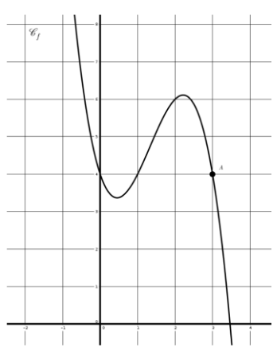
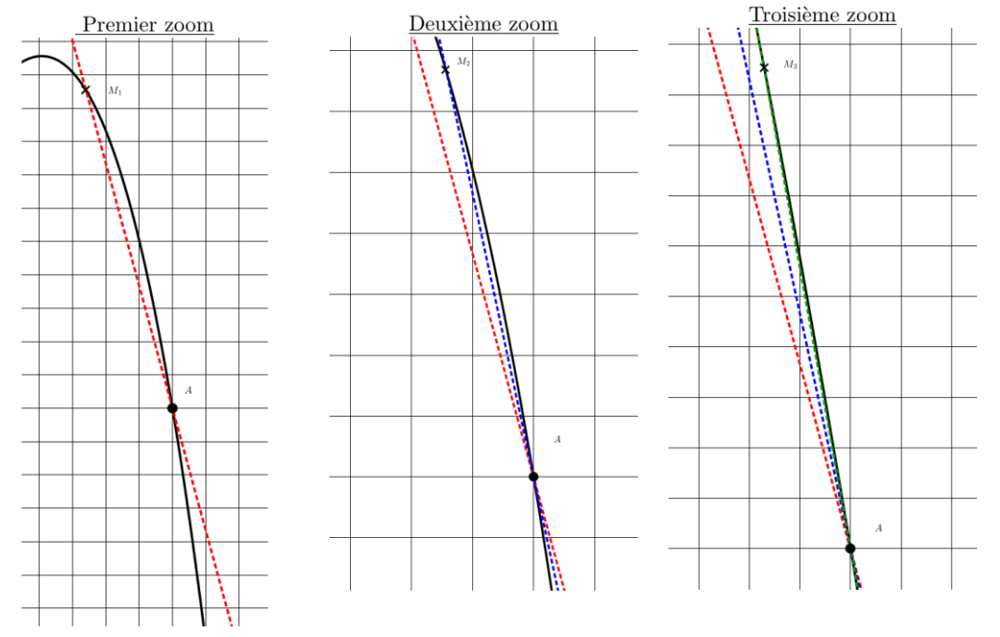
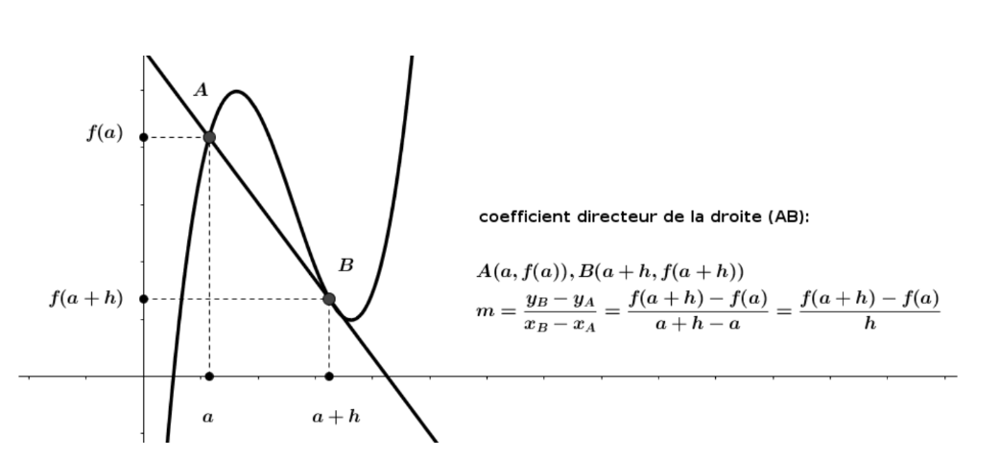
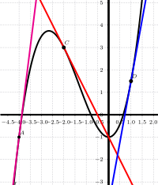
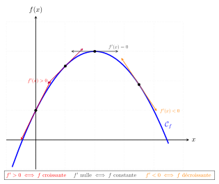
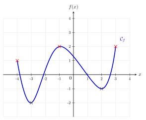
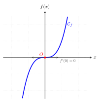
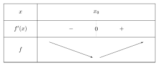

```css
```
```{=html}
<style>
:root {
  --def-color:   #2563eb;
  --prop-color:  #7c3aed;
  --theo-color:  #c026d3;
  --voc-color:   #0d9488;
  --rem-color:   #d97706;
  --ex-color:    #16a34a;
  --app-color:   #ea580c;
  --not-color:   #4f46e5;
  --meth-color:  #dc2626;
  --ill-color:   #475569;
}

.definition, .proposition, .theoreme, .vocabulaire, .remarque, .exemple, .application,
.notation, .methode, .illustration {
  margin: 1.5em 0;
  padding: 1em 1.3em 1em 1.3em;
  border-radius: 10px;
  border-left: 6px solid;
  box-shadow: 0 1px 4px rgba(0,0,0,0.08);
  font-family: "Georgia", serif;
}

.definition::before, .proposition::before, .theoreme::before, .vocabulaire::before,
.remarque::before, .exemple::before, .application::before,
.notation::before, .methode::before, .illustration::before {
  display: block;
  font-family: "Helvetica Neue", Arial, sans-serif;
  font-weight: 700;
  font-size: 0.95em;
  letter-spacing: 0.03em;
  text-transform: uppercase;
  margin-bottom: 0.6em;
}

.definition {
  background: #eff6ff;
  border-color: var(--def-color);
  color: #1e3a5f;
}
.definition::before {
  content: "📘  Définition";
  color: var(--def-color);
}

.proposition {
  background: #f5f3ff;
  border-color: var(--prop-color);
  color: #3b2467;
}
.proposition::before {
  content: "📐  Proposition";
  color: var(--prop-color);
}

.theoreme {
  background: #fdf4ff;
  border-color: var(--theo-color);
  color: #701a75;
}
.theoreme::before {
  content: "🏛️  Théorème";
  color: var(--theo-color);
}

.vocabulaire {
  background: #f0fdfa;
  border-color: var(--voc-color);
  color: #0f4c46;
}
.vocabulaire::before {
  content: "🏷️  Vocabulaire";
  color: var(--voc-color);
}

.remarque {
  background: #fffbeb;
  border-color: var(--rem-color);
  color: #6b4a06;
}
.remarque::before {
  content: "💡  Remarque";
  color: var(--rem-color);
}

.exemple {
  background: #f0fdf4;
  border-color: var(--ex-color);
  color: #14532d;
}
.exemple::before {
  content: "🔍  Exemple";
  color: var(--ex-color);
}

.application {
  background: #fff7ed;
  border: 2px dashed var(--app-color);
  border-left: 6px solid var(--app-color);
  color: #7c2d12;
}
.application::before {
  content: "✏️  Application";
  color: var(--app-color);
  font-size: 1.05em;
}

.notation {
  background: #eef2ff;
  border-color: var(--not-color);
  color: #312e81;
}
.notation::before {
  content: "🖊️  Notation";
  color: var(--not-color);
}

.methode {
  background: #fef2f2;
  border-color: var(--meth-color);
  color: #7f1d1d;
}
.methode::before {
  content: "🧭  Méthode";
  color: var(--meth-color);
}

.illustration {
  background: #f8fafc;
  border-color: var(--ill-color);
  color: #1e293b;
}
.illustration::before {
  content: "🖼️  Illustration";
  color: var(--ill-color);
}

/* Callouts "Solution" un peu plus stylés */
div.callout-caution {
  border-radius: 10px;
  box-shadow: 0 1px 4px rgba(0,0,0,0.08);
}
div.callout-caution .callout-title {
  font-family: "Helvetica Neue", Arial, sans-serif;
  font-weight: 700;
}
div.callout-caution .callout-title::before {
  content: "🔓  ";
}
</style>
```

# Nombre dérivé

## Introduction

On considère une fonction $f$ définie sur $\mathbb{R}$ dont la représentation graphique est donnée ci-contre.\
L'objectif est de rendre compte, par un nombre, comme pour les fonctions affines, des variations de cette fonction.\
Il n'est pas possible, comme pour les fonctions affines, d'avoir un nombre qui aurait le même rôle que le coefficient directeur de la droite représentative de la fonction.\
Cependant, on peut examiner ce qui se passe au voisinage d'un point. Étudions cela au « voisinage » du point $A(1;f(1))$. Pour cela, on peut zoomer sur la partie de la courbe qui nous intéresse. Il est alors possible d'approcher cette partie de courbe par une droite et d'en lire son coefficient directeur. Plus on zoome, plus la droite semble être proche de la courbe.

{width="65%" fig-align="center"}

{width="65%" fig-align="center"}

Intuitivement, on appelle nombre dérivé de la fonction en un point, le coefficient directeur de la droite la plus proche de la courbe en ce point. Cette droite se rapproche de la courbe à mesure que le point $M$ se rapproche du point $A$.

{width="65%" fig-align="center"}

## Nombre dérivé

::: {.definition}
Soit $f$ une fonction définie sur un intervalle $I$ de $\mathbb{R}$. Soit $a$ et $h$ deux réels avec $h \neq 0$ tels que $a\in I$ et $a+h\in I$.\
Le taux d'accroissement (ou taux de variation) de $f$ entre $a$ et $a+h$ est le réel noté $\tau(h)$ tel que: $$\tau(h)=\dfrac{f(a+h)-f(a)}{a+h-a}=\dfrac{f(a+h)-f(a)}{h}$$
:::

::: {.remarque}
Avec les mêmes notations, on considère deux points $A(a;f(a))$ et $B(a+h;f(a+h))$.\
Le taux d'accroissement de $f$ entre $a$ et $a+h$ correspond au coefficient directeur de la droite $(AB)$.
:::

::: {.illustration}
{width="65%" fig-align="center"}
:::

::: {.application}
On considère la fonction $f$ définie sur $\mathbb{R}$ par $f(x)=x^2$. Soit $h\in\mathbb{R}^*$. Déterminer le taux d'accroissement de $f$ entre $1$ et $1+h$.
:::

::: {.callout-caution collapse="true"}
## Solution

On note $A(1;1)$ et $M(1+h;(1+h)^2)$ deux points appartenant à la parabole représentative de $f$. Le taux d'accroissement de $f$ entre $1$ et $1+h$ est: $$\tau(h)=\dfrac{(1+h)^2-1}{h}=\dfrac{2h+h^2}{h}=2+h$$ Ce taux d'accroissement correspond au coefficient directeur de la droite $(AM)$.\
:::

::: {.remarque}
Si une fonction $f$ modélise une évolution, alors le taux d'accroissement correspond à la vitesse moyenne, en valeur absolue, de cette évolution entre $a$ et $b$.
:::

::: {.definition}
En utilisant les mêmes notations:\
Si le taux d'accroissement $\dfrac{f(a+h)-f(a)}{h}$ de $f$ entre $a$ et $a+h$, tend vers un réel $l$ lorsque $h$ tend vers 0, on dit que:

-   $f$ est dérivable en $a$.

-   $l$ est appelé le nombre dérivé de $f$ en $a$ et on note $f'(a)=l$

On écrit alors $f'(a)=\lim\limits_{h \rightarrow 0} \dfrac{f(a+h)-f(a)}{h}$
:::

::: {.application}
On considère la fonction $f$ définie sur $\mathbb{R}$ par $f(x)=x^2$. A partir de l'application précédente, déterminer $f'(1)$.

Or $\lim\limits_{h \rightarrow 0}2+h=2$ donc $f'(1)=2$.
:::

::: {.callout-caution collapse="true"}
## Solution

Le taux d'accroissement de $f$ en 1 est: $$\tau(h)=2+h$$
:::

::: {.remarque}
Si une fonction $f$ modélise une évolution, alors $f'(a)$ correspond à la vitesse instantanée, en valeur absolue, de cette évolution lorsque $x=a$.
:::

::: {.application}
Déterminer le nombre dérivé de la fonction carré en 3.
:::

::: {.definition}
Lorsqu'une fonction est dérivable en tout réel d'un intervalle, on dit qu'elle est dérivable sur cet intervalle.
:::

## Tangente à une courbe

Soit $f$ une fonction dérivable sur un intervalle $I$. Soit $A(a;f(a))$ avec $a\in I$.

::: {.definition}
On appelle tangente à la courbe représentative de $f$ en $A$ la droite passant par $A$ et de coefficient directeur $f'(a)$.
:::

::: {.application}
Déterminer l'équation de la tangente à la courbe représentative de la fonction carrée au point d'abscisse 3.
:::

::: {.application}
{width="70%" fig-align="center"}

Déterminer, par lecture graphique:

-   $f'(1)$

-   $f'(-2)$

-   $f'(-4)$

-   $f(0)$

-   $f(-2)$
:::

# Fonction dérivée

::: {.definition}
Soit $f$ une fonction dérivable sur un intervalle $I$.\
On appelle fonction dérivée de $f$ la fonction, notée $f'$, définie sur $I$ par $f:x \mapsto f'(x)$.
:::

::: {.proposition}
Voici les fonctions dérivée des principales fonctions:

|     **Fonction $f(x)$**      | **Ensemble de Dérivabilité** | **Fonction Dérivée $f'(x)$** |
|:----------------------------:|:----------------------------:|:----------------------------:|
| $k \quad (k \in \mathbb{R})$ |         $\mathbb{R}$         |             $0$              |
|             $x$              |         $\mathbb{R}$         |             $1$              |
|            $x^2$             |         $\mathbb{R}$         |             $2x$             |
|            $x^3$             |         $\mathbb{R}$         |            $3x^2$            |
:::

::: {.application}
Soit $f$ la fonction définie sur $\mathbb{R}$ par $f(x)=x^4$. Déterminer la fonction dérivée de $f$.
:::

# Dérivées et opérations

::: {.proposition}
Produit par une constante et somme\
Soient $u$ et $v$ deux fonctions dérivables sur un intervalle $I$.

-   Si $f$ est une fonction de la forme $f(x) = k \times u(x)$ où $k$ est une constante, alors $f$ est dérivable sur $I$ et $$f'(x) = k \times u'(x)$$

-   Si $f$ est une fonction de la forme $f(x) = u(x) + v(x)$ alors $f$ est dérivable sur $I$ et $$f'(x) = u'(x) + v'(x)$$
:::

::: {.application}
Dériver la fonction $f$ définie sur $\mathbb{R}$ par $f(x) = -4x^2$.
:::

::: {.callout-caution collapse="true"}
## Solution

1.  **Reconnaître la forme:** $f$ est de la forme $k \times u(x)$ avec $k = -4$ et $u(x) = x^2$.

2.  **Dériver la fonction $u$:** $u'(x) = 2x$.

3.  **Donner la formule:** $f'(x) = k \times u'(x)$.

4.  **Remplacer et calculer:** $f'(x) = -4 \times (2x) = -8x$.
:::

::: {.application}
Dériver la fonction $f$ définie sur $\mathbb{R}$ par $f(x) = x^3 + x$.
:::

::: {.callout-caution collapse="true"}
## Solution

1.  **Reconnaître la forme:** $f$ est de la forme $u(x) + v(x)$ avec $u(x) = x^3$ et $v(x) = x$.

2.  **Dériver $u$ et $v$:** $u'(x) = 3x^2$ et $v'(x) = 1$.

3.  **Donner la formule:** $f'(x) = u'(x) + v'(x)$.

4.  **Remplacer et calculer:** $f'(x) = 3x^2 + 1$.
:::

# Variations d'une fonction

## Théorème

::: {.theoreme}
Soit $f$ une fonction définie et dérivable sur un intervalle $I$ de $\mathbb{R}$.

-   $f$ est strictement croissante sur $I$ si et seulement si pour tout réel $x$ de $I$, $f'(x)> 0$ (sauf éventuellement en un nombre fini de valeurs où $f'(x)$ s'annule).

-   $f$ est strictement décroissante sur $I$ si et seulement si pour tout réel $x$ de $I$, $f'(x)< 0$ (sauf éventuellement en un nombre fini de valeurs où $f'(x)$ s'annule).

-   $f$ est constante sur $I$ si et seulement si pour tout réel $x$ de $I$, $f'(x)= 0$
:::

::: {.remarque}
La fonction $f$ est croissante (resp. décroissante) sur $I$ si et seulement si pour tout réel $x$ de $I$, $f'(x)\geqslant 0$ (resp. $f(x)\leqslant 0$).
:::

::: {.illustration}
{width="70%" fig-align="center"}
:::

::: {.methode}
Pour étudier les variations d'une fonction sur un intervalle $I$:

1.  On calcule la fonction dérivée $f'$ de $f$.

2.  On étudie le signe de la dérivée $f'$

3.  On déduit les variations de $f$ dans un tableau.
:::

::: {.application}
Etudier les variations de $f$ où $f$ est la fonction définie sur $\mathbb{R}$ par $f(x)=\dfrac{1}{2}x^2-x-1$..
:::

# Extremums d'une fonction

## Extremum local

::: {.definition}
Soit $f$ une fonction définie sur un intervalle $I$.

-   $f$ admet un minimum local en $x_0$ s'il existe un intervalle ouvert $J$ inclus dans $I$ tel que pour tout $x$ de $J$, $f(x)\geqslant f(x_0)$.

-   $f$ admet un maximum local en $x_0$ s'il existe un intervalle ouvert $J$ inclus dans $I$ tel que pour tout $x$ de $J$, $f(x)\leqslant f(x_0)$.
:::

::: {.vocabulaire}
Un minimum local ou un maximum local est appelé un extremum local.
:::

::: {.illustration}
{width="70%" fig-align="center"}

On a représenté ci-contre le graphe d'une fonction $f$ définie sur $[-4;3]$.

-   Le maximum de $f$ sur $[-4;3]$ est 2 atteint en -1 et 3.

-   Le minimum de $f$ sur $[-4;3]$ est -2 atteint en -3.

-   -1 est un minimum local.

-   1 est un maximum local.
:::

## Dérivée et extremum local

::: {.proposition}
Soit $f$ une fonction définie et dérivable sur un intervalle ouvert $I$. Soit $x_0$ un réel de $I$.\
Si $f$ admet un extremum local en $x_0$ alors $f'(x_0)=0$
:::

::: {.exemple}
Soit $f$ la fonction définie sur $\mathbb{R}$ par $f(x) = x^2$. $f$ est une fonction polynôme, elle est donc dérivable sur $\mathbb{R}$. Pour tout réel $x$, sa fonction dérivée est : $f'(x) = 2x$.

1.  On cherche la valeur $x_0$ telle que $f'(x_0) = 0$. $2x = 0 \iff x = 0$

2.  -   Sur $]-\infty ; 0[$, $f'(x) < 0$, donc $f$ est strictement décroissante.

    -   Sur $]0 ; +\infty[$, $f'(x) > 0$, donc $f$ est strictement croissante.

3.  La dérivée $f'$ s'annule en changeant de signe en $x_0 = 0$. Par conséquent, $f$ admet un minimum local (et global) en $0$. Ce minimum vaut $f(0) = 0^2 = 0$.

{width="70%" fig-align="center"}
:::

::: {.remarque}
La réciproque est fausse.
:::

::: {.exemple}
Soit $f$ la fonction définie sur $\mathbb{R}$ par $f(x) = x^3$. $f$ est dérivable sur $\mathbb{R}$ et pour tout réel $x$, on a : $f'(x) = 3x^2$ .

1.  $f'(x) = 0 \iff 3x^2 = 0 \iff x = 0$. La courbe $\mathcal{C}_f$ admet donc une tangente horizontale à l'origine .

2.  Pour tout $x \neq 0$, $x^2 > 0$, donc $f'(x) > 0$. La dérivée est positive avant $0$ et reste positive après $0$. Elle ne change pas de signe.

3.  La fonction $f$ est strictement croissante sur $\mathbb{R}$. Bien que $f'(0) = 0$, $f$ n'admet ni maximum local ni minimum local en $0$ .

{width="70%" fig-align="center"}
:::

::: {.proposition}
Soit $f$ une fonction définie et dérivable sur un intervalle ouvert $I$. Soit $x_0$ un réel de $I$.\
Si $f'(x_0)=0$ et si $f'$ change de signe en $x_0$ (on dit que $f'$ s'annule en changeant de signe en $x_0$) alors $f$ admet un extremum local en $x_0$.
:::

::: {.illustration}
-   $f$ admet un minimum local en $x_0$

    {width="70%" fig-align="center"}

-   $f$ admet un maximum local en $x_0$

    {width="70%" fig-align="center"}
:::
