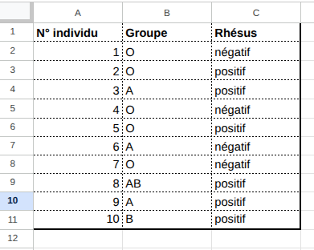
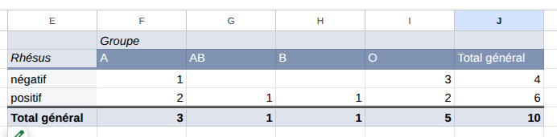
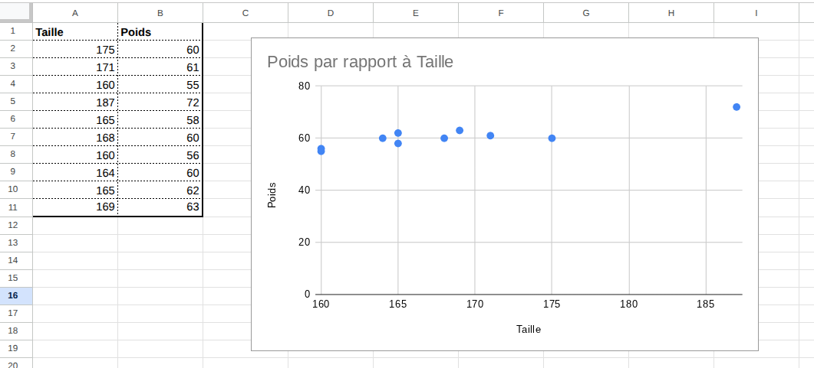
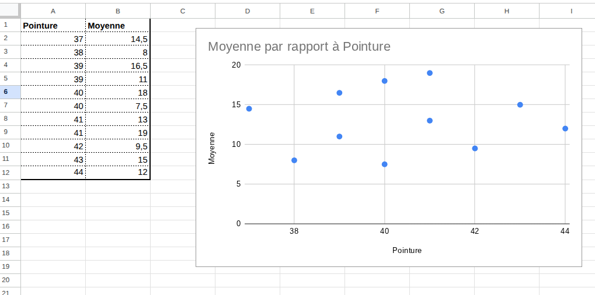
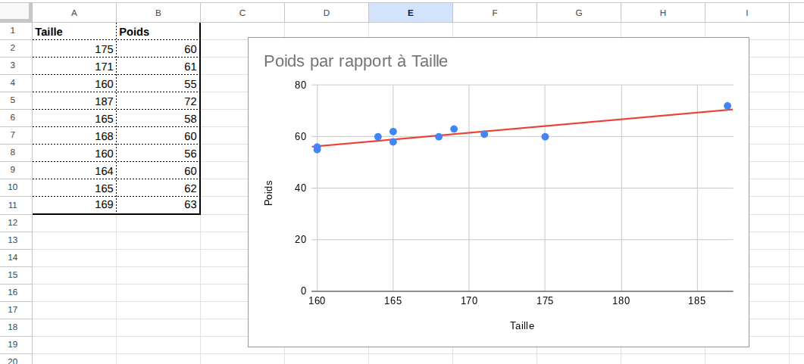
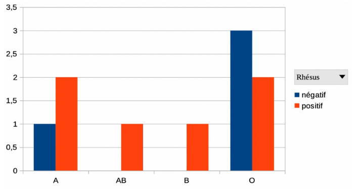
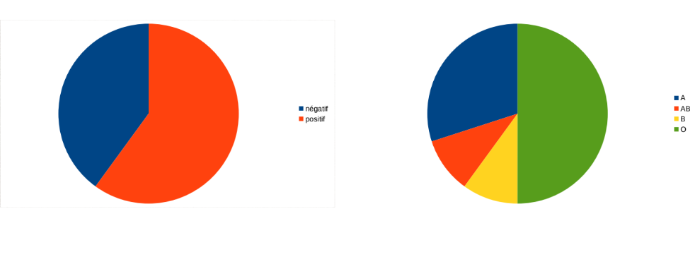

```css
```
```{=html}
<style>
:root {
  --def-color:   #2563eb;
  --prop-color:  #7c3aed;
  --theo-color:  #c026d3;
  --voc-color:   #0d9488;
  --rem-color:   #d97706;
  --ex-color:    #16a34a;
  --app-color:   #ea580c;
  --not-color:   #4f46e5;
  --meth-color:  #dc2626;
  --ill-color:   #475569;
}

.definition, .proposition, .theoreme, .vocabulaire, .remarque, .exemple, .application,
.notation, .methode, .illustration {
  margin: 1.5em 0;
  padding: 1em 1.3em 1em 1.3em;
  border-radius: 10px;
  border-left: 6px solid;
  box-shadow: 0 1px 4px rgba(0,0,0,0.08);
  font-family: "Georgia", serif;
}

.definition::before, .proposition::before, .theoreme::before, .vocabulaire::before,
.remarque::before, .exemple::before, .application::before,
.notation::before, .methode::before, .illustration::before {
  display: block;
  font-family: "Helvetica Neue", Arial, sans-serif;
  font-weight: 700;
  font-size: 0.95em;
  letter-spacing: 0.03em;
  text-transform: uppercase;
  margin-bottom: 0.6em;
}

.definition {
  background: #eff6ff;
  border-color: var(--def-color);
  color: #1e3a5f;
}
.definition::before {
  content: "📘  Définition";
  color: var(--def-color);
}

.proposition {
  background: #f5f3ff;
  border-color: var(--prop-color);
  color: #3b2467;
}
.proposition::before {
  content: "📐  Proposition";
  color: var(--prop-color);
}

.theoreme {
  background: #fdf4ff;
  border-color: var(--theo-color);
  color: #701a75;
}
.theoreme::before {
  content: "🏛️  Théorème";
  color: var(--theo-color);
}

.vocabulaire {
  background: #f0fdfa;
  border-color: var(--voc-color);
  color: #0f4c46;
}
.vocabulaire::before {
  content: "🏷️  Vocabulaire";
  color: var(--voc-color);
}

.remarque {
  background: #fffbeb;
  border-color: var(--rem-color);
  color: #6b4a06;
}
.remarque::before {
  content: "💡  Remarque";
  color: var(--rem-color);
}

.exemple {
  background: #f0fdf4;
  border-color: var(--ex-color);
  color: #14532d;
}
.exemple::before {
  content: "🔍  Exemple";
  color: var(--ex-color);
}

.application {
  background: #fff7ed;
  border: 2px dashed var(--app-color);
  border-left: 6px solid var(--app-color);
  color: #7c2d12;
}
.application::before {
  content: "✏️  Application";
  color: var(--app-color);
  font-size: 1.05em;
}

.notation {
  background: #eef2ff;
  border-color: var(--not-color);
  color: #312e81;
}
.notation::before {
  content: "🖊️  Notation";
  color: var(--not-color);
}

.methode {
  background: #fef2f2;
  border-color: var(--meth-color);
  color: #7f1d1d;
}
.methode::before {
  content: "🧭  Méthode";
  color: var(--meth-color);
}

.illustration {
  background: #f8fafc;
  border-color: var(--ill-color);
  color: #1e293b;
}
.illustration::before {
  content: "🖼️  Illustration";
  color: var(--ill-color);
}

/* Callouts "Solution" un peu plus stylés */
div.callout-caution {
  border-radius: 10px;
  box-shadow: 0 1px 4px rgba(0,0,0,0.08);
}
div.callout-caution .callout-title {
  font-family: "Helvetica Neue", Arial, sans-serif;
  font-weight: 700;
}
div.callout-caution .callout-title::before {
  content: "🔓  ";
}
</style>
```

# Comparer deux caractères d'une même série statistiques

## Tableau croisé dynamique

::: {.definition}
Un tableau croisé (ou tableau à double entrée) est un tableau qui permet d'étudier simultanément deux caractères dans une population. Il peut contenir des effectifs ou des proportions exprimées en pourcentages.
:::

::: {.exemple}
On recense dans une population de 10 individus deux caractères qui sont le groupe sanguin et le rhésus.

{width="65%" fig-align="center"}

On peut étudier le lien entre le rhésus et le groupe sanguin d'un individu.

{width="45%" fig-align="center"}
:::

::: {.remarque}
La dernière ligne et la dernière colonne sont appelées les marges du tableau, elles contiennent les effectifs marginaux, c'est-à-dire les effectifs totaux d'une valeur d'un caractère, par ligne ou colonne.
:::

## Nuage de points

::: {.definition}
Dans un nuage de points, chaque individu de la population est représenté par un point et deux caractères sont utilisés pour l'abscisse et l'ordonnée de chaque point.
:::

::: {.remarque}
Un nuage de points permet de visualiser graphiquement le lien entre les deux caractères.
:::

::: {.exemple}
Le tableau suivant donne la taille et le poids des 11 joueuses de football de l'équipe de France qui ont débuté la rencontre face à l'équipe de Norvège lors d'un match amical le 11 novembre 2022.

{width="65%" fig-align="center"}

La forme allongée du nuage de points traduit une corrélation entre les deux variables taille et poids : les deux grandeurs sont liées mais il n'y a pas pour autant de causalité directe.
:::

::: {.exemple}
Le tableau suivant donne la moyenne générale en mathématiques (sur 20) et le pointure de chaussures de 11 élèves d'une classe de Première lors du premier trimestre.

{width="65%" fig-align="center"}

L'absence de forme privilégiée du nuage de points (les points sont dispersés sans tendance générale) traduit une absence de corrélation entre la pointure et la moyenne générale : les deux grandeurs sont totalement indépendantes.
:::

## Ajustement affine

Lorsque le nuage de point a une forme allongée, on cherche à déterminer une droite qui « passerait » presque par tous les points. Cet ajustement permet entre autre d'interpoler et d'extrapoler des valeurs:

-   L'interpolation consiste me à estimer la valeur de $y$ pour une valeur de $x$ située à l'intérieur de l'intervalle des données mesurées (entre la plus petite et la plus grande valeur de $x$ du nuage).

-   L'extrapolation consiste à estimer la valeur de $y$ pour une valeur de $x$ située à l'extérieur de cet intervalle (en deçà du minimum ou au-delà du maximum observés).

::: {.remarque}
L'interpolation est généralement fiable si la corrélation est forte. L'extrapolation est beaucoup plus risquée, car le modèle affine peut ne plus être valable en dehors de la plage d'étude (effet de saturation, changement de comportement, etc.).
:::

::: {.exemple}
Reprenons l'exemple sur la taille et le poids des 11 joueuses de football:

{width="65%" fig-align="center"}

On peut interpoler qu'une joueuse de 1m80 pèserait environ 68kg.
:::

::: {.definition}
Soit une série statistique à deux variables quantitative $(X, Y)$ mesurées sur un échantillon de $n$ individus, représentée par les couples de données $(x_i, y_i)$ pour $i \in \{1, \dots, n\}$.

Le point moyen du nuage de points, généralement noté $G$, est le point dont les coordonnées $(\bar{x}, \bar{y})$ sont respectivement les moyennes arithmétiques des valeurs de $X$ et de $Y$ :

$$G\left(\bar{x} \,; \bar{y}\right)$$

avec : $$\bar{x} = \dfrac{x_1+x_2+...+x_n}{n} \quad \text{et} \quad \bar{y} = \dfrac{y_1+y_2+...+y_n}{n}$$
:::

# Comparer le même caractère sur plusieurs populations

La comparaison des populations se fait en plaçant des barres côte à côte dans un même diagramme en barres, ou en plaçant des deux diagrammes circulaires côte à côte avec la même légende. Lorsque les données sont regroupées dans un tableau croisé, les fonctionnalités du tableur permettent de les représenter sous forme de diagramme en barres ou de diagrammes circulaires. On sélectionne la (ou les) série(s) de données que l'on veut représenter.

::: {.exemple}
Reprenons l'exemple sur les groupes sanguins:

Diagramme en barres:

{width="65%" fig-align="center"}

Diagramme circulaire:

{width="65%" fig-align="center"}
:::
