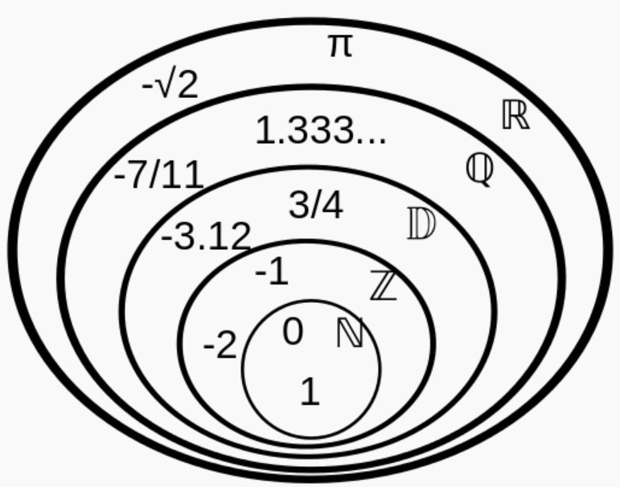

```css
```
```{=html}
<style>
:root {
  --def-color:   #2563eb;
  --prop-color:  #7c3aed;
  --voc-color:   #0d9488;
  --rem-color:   #d97706;
  --ex-color:    #16a34a;
  --app-color:   #ea580c;
  --not-color:   #4f46e5;
  --meth-color:  #dc2626;
  --ill-color:   #475569;
}

.definition, .proposition, .vocabulaire, .remarque, .exemple, .application,
.notation, .methode, .illustration {
  margin: 1.5em 0;
  padding: 1em 1.3em 1em 1.3em;
  border-radius: 10px;
  border-left: 6px solid;
  box-shadow: 0 1px 4px rgba(0,0,0,0.08);
  font-family: "Georgia", serif;
}

.definition::before, .proposition::before, .vocabulaire::before,
.remarque::before, .exemple::before, .application::before,
.notation::before, .methode::before, .illustration::before {
  display: block;
  font-family: "Helvetica Neue", Arial, sans-serif;
  font-weight: 700;
  font-size: 0.95em;
  letter-spacing: 0.03em;
  text-transform: uppercase;
  margin-bottom: 0.6em;
}

.definition {
  background: #eff6ff;
  border-color: var(--def-color);
  color: #1e3a5f;
}
.definition::before {
  content: "📘  Définition";
  color: var(--def-color);
}

.proposition {
  background: #f5f3ff;
  border-color: var(--prop-color);
  color: #3b2467;
}
.proposition::before {
  content: "📐  Proposition";
  color: var(--prop-color);
}

.vocabulaire {
  background: #f0fdfa;
  border-color: var(--voc-color);
  color: #0f4c46;
}
.vocabulaire::before {
  content: "🏷️  Vocabulaire";
  color: var(--voc-color);
}

.remarque {
  background: #fffbeb;
  border-color: var(--rem-color);
  color: #6b4a06;
}
.remarque::before {
  content: "💡  Remarque";
  color: var(--rem-color);
}

.exemple {
  background: #f0fdf4;
  border-color: var(--ex-color);
  color: #14532d;
}
.exemple::before {
  content: "🔍  Exemple";
  color: var(--ex-color);
}

.application {
  background: #fff7ed;
  border: 2px dashed var(--app-color);
  border-left: 6px solid var(--app-color);
  color: #7c2d12;
}
.application::before {
  content: "✏️  Application";
  color: var(--app-color);
  font-size: 1.05em;
}

.notation {
  background: #eef2ff;
  border-color: var(--not-color);
  color: #312e81;
}
.notation::before {
  content: "🖊️  Notation";
  color: var(--not-color);
}

.methode {
  background: #fef2f2;
  border-color: var(--meth-color);
  color: #7f1d1d;
}
.methode::before {
  content: "🧭  Méthode";
  color: var(--meth-color);
}

.illustration {
  background: #f8fafc;
  border-color: var(--ill-color);
  color: #1e293b;
}
.illustration::before {
  content: "🖼️  Illustration";
  color: var(--ill-color);
}

/* Callouts "Solution" un peu plus stylés */
div.callout-caution {
  border-radius: 10px;
  box-shadow: 0 1px 4px rgba(0,0,0,0.08);
}
div.callout-caution .callout-title {
  font-family: "Helvetica Neue", Arial, sans-serif;
  font-weight: 700;
}
div.callout-caution .callout-title::before {
  content: "🔓  ";
}
</style>
```

\gdef\R{\mathbb{R}}

\gdef\N{\mathbb{N}}

\gdef\Z{\mathbb{Z}}

\gdef\D{\mathbb{D}}

\gdef\Q{\mathbb{Q}}

# Introduction

Les nombres que l'on connaît aujourd'hui sont partagés en 6 ensembles :

- L'ensemble des entiers naturels est noté $\N$.

  $\N=\{0;1;2;\dots;105;\dots\}$
- L'ensemble des entiers relatifs est noté $\Z$.

  $\Z=\{\dots;-45;-44;\dots;-2;-1;0;1;2;3;\dots;208;\dots\}$
- L'ensemble des décimaux est noté $\D$. Ce sont les nombres qui ont un nombre fini de chiffres après la virgule.

  Par exemple, $12.6523$ et $\dfrac{1}{4}$ sont des décimaux, mais $\dfrac{1}{3}=0.3333\dots$ n'est pas un décimal.
- L'ensemble des rationnels est noté $\Q$. Ce sont les quotients de deux entiers relatifs (non nul pour le dénominateur).

  Par exemple, $\dfrac{4}{-5}=-\dfrac{4}{5}$ est un rationnel.
- L'ensemble de tous les nombres que vous connaissez est noté $\R$, l'ensemble des nombres réels.
- L'ensemble des irrationnels est constitué des nombres réels qui ne sont pas rationnels. Il est noté $\mathbb{I}=\R\setminus\Q$.

  Par exemple, $\sqrt{2}$, $\sqrt{3}$, $\pi$, $\dots$ sont des irrationnels.

::: {.illustration}
{fig-alt="Schéma d'inclusion des ensembles de nombres" fig-align="center" width="40%"}
:::

::: {.notation}
Pour signifier qu'un élément appartient à un ensemble, on utilise le symbole $\in$.

- $4\in\N$ signifie que $4$ appartient à l'ensemble des entiers naturels.
- $\dfrac{1}{2}\notin\Z$ signifie que $\dfrac{1}{2}$ n'appartient pas à l'ensemble des entiers relatifs.
:::

::: {.notation}
Pour signifier qu'un ensemble est inclus dans un autre, on utilise le symbole $\subset$.

- $\N\subset\Z$ signifie que tout entier naturel est aussi un entier relatif.
- $\Z\subset\D$ signifie que tout entier relatif est aussi un décimal.
- $\dots$
:::

# Ensemble des décimaux

## Définitions

::: {.definition}
L'ensemble des nombres pouvant s'écrire sous la forme $\dfrac{a}{10^n}$ avec $a\in\Z$ et $n\in\N$ est appelé **ensemble des nombres décimaux**. Cet ensemble est noté $\D$.
:::

::: {.application}
Montrer que $-1.23\in\D$, $\dfrac{19}{40}\in\D$ et $\dfrac{1}{3}\notin\D$.
:::

:::{.callout-caution collapse="true"}
## Solution

**1.** $-1.23$ est un décimal car $-1.23=\dfrac{-123}{100}=\dfrac{-123}{10^2}$.

$-1.23$ est bien un décimal car il s'écrit sous la forme $\dfrac{a}{10^n}$ avec $a=-123$ et $n=2$.

**2.** $\dfrac{19}{40}$ est un décimal car $\dfrac{19}{40}=\dfrac{19\times 25}{40\times 25}=\dfrac{475}{1000}=\dfrac{475}{10^3}$.

$\dfrac{19}{40}$ est bien un décimal car il s'écrit sous la forme $\dfrac{a}{10^n}$ avec $a=475$ et $n=3$.

**3.** $\dfrac{1}{3}$ n'est pas un décimal car on ne peut pas l'écrire sous la forme $\dfrac{a}{10^n}$ avec $a\in\Z$ et $n\in\N$.

Pour le démontrer, on utilise une démonstration par l'absurde :

Supposons au contraire que $\dfrac{1}{3}\in\D$. Il existe donc $a\in\Z$ et $n\in\N$ tels que $\dfrac{1}{3}=\dfrac{a}{10^n}$.

Ainsi, $10^n=3a$ et donc $10^n$ est divisible par $3$.

Or, pour être divisible par $3$, la somme des chiffres d'un entier doit être un multiple de $3$. Or la somme des chiffres de $10^n$ est $1$ et $1$ n'est pas un multiple de $3$. On arrive donc à une contradiction.
:::

## Encadrer et arrondir à l'aide d'un décimal

::: {.definition}
- Encadrer un nombre $x$, c'est trouver deux nombres $a$ et $b$ tels que $a<x<b$.

  La différence $b-a$ est appelée l'amplitude de l'encadrement.
- Arrondir un nombre, c'est lui trouver la valeur décimale la plus proche à une précision donnée.
:::

::: {.application}
- Donner un encadrement d'amplitude $10^{-3}$ de $\sqrt{2}$.
- Donner une valeur approchée à $10^{-1}$ de $\pi$.
:::

:::{.callout-caution collapse="true"}
## Solution

- $1.414\leqslant\sqrt{2}\leqslant 1.415$ est un encadrement d'amplitude $10^{-3}$ de $\sqrt{2}$. En effet : $1.415-1.414=0.001=10^{-3}$.
- $3.1$ est une valeur approchée de $\pi$ à $10^{-1}$.
:::

# Ensemble des entiers naturels et relatifs

## Multiples, diviseurs d'un nombre

::: {.definition}
$a$ désigne un nombre de $\Z$ et $b$ un nombre de $\N$ non nul ($a\in\Z$, $b\in\N^*$).

Dire que $a$ est un multiple de $b$ signifie qu'il existe un entier relatif $k$ ($k\in\Z$) tel que $a=k\times b$.

On dit aussi que $b$ est un diviseur de $a$ ou que $a$ est divisible par $b$.
:::

::: {.exemple}
- $-8$ est un multiple de $4$ car $-8=-2\times 4$. Ainsi, $-8$ est divisible par $4$ ou $4$ est un diviseur de $-8$.
- $5$ n'est pas un multiple de $2$. En effet, $5=2.5\times 2$, mais $2.5\notin\Z$.
:::

::: {.proposition}
Soit $b\in\N$.

La somme de deux multiples de $b$ est un multiple de $b$.
:::

:::{.callout-caution collapse="true"}
## Solution

Soit $b\in\N$. Soit $a$ et $a'$ deux multiples de $b$. Il existe alors deux entiers relatifs $k$ et $k'$ tels que :

- $a=k\times b$, $k\in\Z$
- $a'=k'\times b$, $k'\in\Z$

Alors $a+a'=k\times b+k'\times b=(k+k')\times b$ avec $k+k'\in\Z$. Donc $a+a'$ est bien un multiple de $b$.
:::

::: {.exemple}
On considère $b=4$. Alors $8$ et $12$ sont des multiples de $4$ ($8=4\times 2$ et $12=4\times 3$). $8+12=20$ est alors un multiple de $4$. En effet, $20=4\times 5$.
:::

## Nombres pairs, nombres impairs

::: {.definition}
- Un nombre pair est un nombre entier multiple de $2$. Autrement dit, $a\in\Z$ est pair s'il existe $k\in\Z$ tel que $a=2\times k$.
- Un nombre impair est un nombre entier qui n'est pas un multiple de $2$. Autrement dit son reste dans la division euclidienne par $2$ est $1$. Ainsi, $a\in\Z$ est impair s'il existe $k\in\Z$ tel que $a=2k+1$.
:::

::: {.proposition}
- Le produit de deux nombres est pair si au moins l'un de ces deux nombres est pair.
- Le produit de deux nombres impairs est impair.
- La somme de deux nombres de même parité est paire.
:::

:::{.callout-caution collapse="true"}
## Solution

Soit $a$ et $b$ deux entiers.

**Produit de deux nombres dont l'un est pair**

Si $a$ est pair, alors par définition, il existe un entier $k$ tel que $a=2k$.

Le produit $ab$ s'écrit alors :

$$
ab=(2k)b=2(kb)
$$

Puisque $k$ et $b$ sont des entiers, leur produit $kb$ est aussi un entier. Ainsi, $ab$ est de la forme $2\times(\text{un entier})$, ce qui signifie que $ab$ est pair.

**Produit de deux nombres impairs**

Soient $a$ et $b$ deux nombres entiers impairs.

Puisque $a$ est impair, par définition, il existe un entier $k$ tel que :

$$
a=2k+1
$$

Puisque $b$ est impair, par définition, il existe un entier $m$ tel que :

$$
b=2m+1
$$

Maintenant, calculons le produit $ab$ :

$$
\begin{align*}
ab&=(2k+1)(2m+1) \\
&=4km+2k+2m+1 \\
&=2(2km+k+m)+1
\end{align*}
$$

Posons $K=2km+k+m$. Puisque $k$ et $m$ sont des entiers, la somme et le produit d'entiers sont des entiers, donc $K$ est également un entier.

L'expression du produit $ab$ devient alors :

$$
ab=2K+1
$$

Par définition, tout nombre entier qui peut s'écrire sous la forme $2K+1$ (où $K$ est un entier) est un nombre impair.

**Somme de deux nombres de même parité**

- Supposons que $a$ et $b$ sont tous les deux pairs.

  Puisque $a$ est pair, par définition, il existe un entier $k$ tel que $a=2k$. Puisque $b$ est pair, par définition, il existe un entier $m$ tel que $b=2m$.

  Maintenant, calculons la somme $a+b$ :

  $$
  \begin{align*}
  a+b&=2k+2m \\
  &=2(k+m)
  \end{align*}
  $$

  Posons $K=k+m$. Puisque $k$ et $m$ sont des entiers, leur somme $k+m$ est aussi un entier. Donc $K$ est un entier.

  L'expression de la somme $a+b$ devient alors $a+b=2K$. Par définition, tout nombre entier qui peut s'écrire sous la forme $2K$ (où $K$ est un entier) est un nombre pair.

- Supposons que $a$ et $b$ sont tous les deux impairs.

  Puisque $a$ est impair, par définition, il existe un entier $k$ tel que $a=2k+1$. Puisque $b$ est impair, par définition, il existe un entier $m$ tel que $b=2m+1$.

  Maintenant, calculons la somme $a+b$ :

  $$
  \begin{align*}
  a+b&=(2k+1)+(2m+1) \\
  &=2k+2m+2 \\
  &=2(k+m+1)
  \end{align*}
  $$

  Posons $K=k+m+1$. Puisque $k$ et $m$ sont des entiers, leur somme $k+m+1$ est aussi un entier. Donc $K$ est un entier.

  L'expression de la somme $a+b$ devient alors $a+b=2K$. Par définition, tout nombre entier qui peut s'écrire sous la forme $2K$ (où $K$ est un entier) est un nombre pair.
:::

::: {.application}
Montrer que le carré d'un nombre pair est pair.
:::

:::{.callout-caution collapse="true"}
## Solution

Soit $a\in\Z$ pair. Alors il existe $k\in\Z$ tel que $a=2k$. De plus $a^2=(2k)^2=4k^2=2\times 2k^2$. On pose $K=2k^2$ et alors $a^2=2K$. Donc $a^2$ est pair.
:::

::: {.application}
Montrer que le carré d'un nombre impair est impair.
:::

## Critères de divisibilité

::: {.proposition}
**(admise)**

Un nombre entier est divisible :

- par $2$ lorsque son chiffre des unités est $0$, $2$, $4$, $6$ ou $8$ ;
- par $5$ lorsque son chiffre des unités est $0$ ou $5$ ;
- par $3$ lorsque la somme de ses chiffres est divisible par $3$ ;
- par $9$ lorsque la somme de ses chiffres est divisible par $9$.
:::

## Nombres premiers

### Définition

::: {.definition}
Un nombre premier est un entier naturel qui a exactement deux diviseurs : $1$ et lui-même.
:::

::: {.remarque}
Liste des nombres premiers inférieurs à $65$ :

$$
2 ; 3 ; 5 ; 7 ; 11 ; 13 ; 17 ; 19 ; 23 ; 29 ; 31 ; 37 ; 41 ; 43 ; 47 ; 53 ; 59 ; 61
$$
:::

::: {.exemple}
- $1$ n'est pas un nombre premier car il n'admet qu'un seul diviseur : $1$.
- $0$ n'est pas un nombre premier car il est divisible par n'importe quel nombre entier non nul.
- $6$ n'est pas un nombre premier car il est divisible par $1$, $2$, $3$ et $6$.
:::

::: {.definition}
On dit que deux nombres entiers sont premiers entre eux lorsque les seuls diviseurs qu'ils ont en commun sont $1$ et $-1$.
:::

### Décomposition en produit de facteurs premiers

::: {.proposition}
**(admise)**

Tout nombre entier naturel supérieur ou égal à deux se décompose en produit de facteurs premiers et cette décomposition est unique (à l'ordre près des facteurs).
:::

::: {.application}
Décomposer $84$ en produit de facteurs premiers.
:::

:::{.callout-caution collapse="true"}
## Solution

**Première méthode : à vue**

On recherche le plus grand premier diviseur de $84$ et on recherche ensuite tous les diviseurs premiers : $84=7\times 12$. Or $12=4\times 3=2^2\times 3$. Ainsi $84=2^2\times 3\times 7$.

**Deuxième méthode : on cherche les diviseurs premiers par ordre croissant**

:::: {.columns}

::: {.column width="35%"}
$$
\begin{array}{r|l}
84 & 2 \\
42 & 2 \\
21 & 3 \\
7 & 7 \\
1 &
\end{array}
$$
:::

::: {.column width="65%"}
- $84$ est divisible par $2$ : $84=2\times 42$
- $42$ est divisible par $2$ : $42=2\times 21$ donc $84=2\times 2\times 21$
- $21$ est divisible par $3$ : $21=3\times 7$ donc $84=2^2\times 3\times 7$
- $7$ est premier, donc la décomposition en produit de facteurs premiers est $84=2^2\times 3\times 7$
:::

::::
:::

# Ensemble des rationnels

::: {.definition}
Un nombre rationnel est un nombre qui peut s'écrire sous la forme d'une fraction $\dfrac{a}{b}$ avec $a\in\Z$ et $b\in\Z$, $b\neq 0$.
:::

::: {.exemple}
$\dfrac{1}{3}\in\Q$ ; $\dfrac{14}{21}\in\Q$ et $\dfrac{14}{21}=\dfrac{2}{3}$ ; $\dfrac{2.5}{0.7}\in\Q$ car $\dfrac{2.5}{0.7}=\dfrac{25}{7}$.
:::

::: {.proposition}
Tout nombre rationnel non nul admet une unique écriture fractionnaire irréductible $\dfrac{p}{q}$ où $p$ et $q$ sont premiers entre eux.
:::

::: {.application}
Donner l'écriture fractionnaire irréductible de $\dfrac{25}{15}$ et de $\dfrac{18}{45}$.
:::

:::{.callout-caution collapse="true"}
## Solution

- $\dfrac{25}{15}=\dfrac{5\times 5}{3\times 5}=\dfrac{5}{3}$. $5$ et $3$ sont premiers entre eux, donc l'écriture fractionnaire irréductible de $\dfrac{25}{15}$ est $\dfrac{5}{3}$.
- $\dfrac{18}{45}=\dfrac{9\times 2}{9\times 5}=\dfrac{2}{5}$. $2$ et $5$ sont premiers entre eux, donc l'écriture fractionnaire irréductible de $\dfrac{18}{45}$ est $\dfrac{2}{5}$.
:::

::: {.proposition}
**(admise)**

Un nombre rationnel admet un développement décimal périodique à partir d'un certain rang.
:::

::: {.exemple}
$\dfrac{1}{3}=0.33333\dots3333\dots$ ; $\dfrac{13193}{49950}=0.26412412412\dots412\dots$ ; $2=2.000\dots000\dots$
:::

# Ensemble des réels

## Généralités

Il existe des nombres qui n'ont pas un développement décimal périodique. C'est le cas par exemple du nombre $\pi\simeq 3.1416\dots$ Ils appartiennent à l'ensemble des irrationnels.

::: {.definition}
Les nombres qui ne peuvent pas être exprimés par une fraction sont dits irrationnels. On le note $\mathbb{I}$.
:::

::: {.definition}
L'ensemble des réels $\R$ est la réunion de l'ensemble des rationnels $\Q$ et des irrationnels $\mathbb{I}$.
:::

::: {.proposition}
**(admise)**

- À tout point d'une droite graduée est associé un unique nombre réel, son abscisse.
- Réciproquement, à tout nombre réel est associé un unique point d'une droite graduée.
:::

::: {.proposition}
Le nombre réel $\sqrt{2}$ est un irrationnel.
:::

:::{.callout-caution collapse="true"}
## Solution

On raisonne par l'absurde. Supposons que $\sqrt{2}$ soit rationnel.

Il existe alors deux entiers $a\in\N^*$ et $b\in\N^*$ tels que :

$$
\sqrt{2}=\dfrac{a}{b} \quad\text{avec}\quad \gcd(a,b)=1
$$

En élevant au carré, on obtient :

$$
2=\dfrac{a^2}{b^2} \implies a^2=2b^2 \quad\text{(1)}
$$

Ainsi, $a^2$ est pair, ce qui implique que $a$ est pair. Il existe donc un entier $k\in\N^*$ tel que $a=2k$.

En substituant cette expression de $a$ dans l'égalité (1) :

$$
(2k)^2=2b^2 \implies 4k^2=2b^2 \implies b^2=2k^2
$$

On en déduit que $b^2$ est pair, et donc que $b$ est pair.

$a$ et $b$ étant tous les deux pairs, ils admettent $2$ comme diviseur commun. Cela contredit le fait que la fraction $\dfrac{a}{b}$ soit irréductible ($\gcd(a,b)=1$).

Par conséquent, l'hypothèse de départ est fausse : $\sqrt{2}$ est irrationnel.
:::

## Racine carrée

### Définitions

::: {.definition}
Soit $x$ un réel positif.

La racine carrée de $x$, notée $\sqrt{x}$, est l'unique nombre réel positif dont le carré est $x$.
:::

::: {.exemple}
Comme $2^2=4$, on a $\sqrt{4}=2$. On a également $\sqrt{0}=0$ et $\sqrt{1}=1$.
:::

::: {.remarque}
La racine carrée d'un nombre négatif n'a pas de sens. En effet, il n'existe pas de nombre réel qui, mis au carré, est négatif.
:::

::: {.proposition}
- Pour tout nombre réel $x$ positif, $\left(\sqrt{x}\right)^2=x$.
- Pour tout nombre réel $x$, $\sqrt{x^2}=x$ si $x>0$ et $\sqrt{x^2}=-x$ si $x<0$.
:::

::: {.exemple}
$\left(\sqrt{7}\right)^2=7$ et $\sqrt{(-5)^2}=5$
:::

### Calculs

::: {.proposition}
Soit $a$ et $b$ deux réels positifs avec $b\neq 0$.

- $\sqrt{a\times b}=\sqrt{a}\times\sqrt{b}$
- $\sqrt{\dfrac{a}{b}}=\dfrac{\sqrt{a}}{\sqrt{b}}$
:::

::: {.definition}
On dit qu'une **racine carrée** (ou radical) admet une **écriture simplifiée** lorsque deux conditions sont remplies :

1. Le nombre sous le radical est le plus petit entier possible. Cela signifie qu'il ne contient plus de facteurs carrés parfaits (autres que $1$).
2. Le dénominateur (s'il y en a un) est un nombre entier sans radical.
:::

::: {.application}
Donner les écritures simplifiées de $\sqrt{12}$ et de $\sqrt{\dfrac{27}{8}}$.
:::

:::{.callout-caution collapse="true"}
## Solution

**1.**

$$
\sqrt{12}=\sqrt{4\times 3}=\sqrt{4}\times\sqrt{3}=\mathbf{2\sqrt{3}}
$$

**2.**

$$
\begin{align*}
\sqrt{\dfrac{27}{8}}&=\dfrac{\sqrt{27}}{\sqrt{8}} \\
&=\dfrac{\sqrt{9\times 3}}{\sqrt{4\times 2}} \\
&=\dfrac{3\sqrt{3}}{2\sqrt{2}} \\
&=\dfrac{3\sqrt{3}\times\sqrt{2}}{2\sqrt{2}\times\sqrt{2}} \\
&=\dfrac{3\sqrt{6}}{2\times 2} \\
&=\mathbf{\dfrac{3\sqrt{6}}{4}}
\end{align*}
$$
:::

## Les puissances

::: {.definition}
Soit $a$ un réel et $m$ un entier.

- Si $m>0$, alors $a^m=\underbrace{a\times a\times a\times a\times\dots\times a}_{m\text{ facteurs}}$
- Si $m<0$, alors $a^m=\dfrac{1}{a^{-m}}$
- Par convention, pour $a\neq 0$, $a^0=1$
:::

::: {.exemple}
- $5^3=5\times 5\times 5=125$
- $5^{-3}=\dfrac{1}{5^3}=\dfrac{1}{125}$
:::

::: {.proposition}
Soit $a$ et $b$ deux réels non nuls et soit $m$ et $n$ deux entiers relatifs.

- $a^m\times a^n=a^{m+n}$
- $(a^n)^m=a^{n\times m}$
- $(a\times b)^m=a^m\times b^m$
- $\left(\dfrac{a}{b}\right)^m=\dfrac{a^m}{b^m}$
- $\dfrac{a^m}{a^n}=a^{m-n}$
:::

::: {.application}
Calculer :

- $2^3\times 2^2$
- $x\times x^2$
- $(3x)^2$
- $\left(\dfrac{2}{x^2}\right)^2$
- $\dfrac{4^5}{4^7}$
:::

:::{.callout-caution collapse="true"}
## Solution

- $2^3\times 2^2=8\times 4=32$
- $x\times x^2=x^1\times x^2=x^{2+1}=x^3$
- $(3x)^2=3x\times 3x=9x^2$
- $\left(\dfrac{2}{x^2}\right)^2=\dfrac{2^2}{(x^2)^2}=\dfrac{4}{x^4}$
- $\dfrac{4^5}{4^7}=4^{5-7}=4^{-2}=\dfrac{1}{4^2}=\dfrac{1}{16}$
:::
