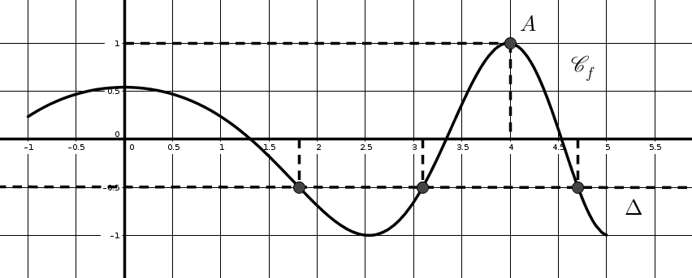
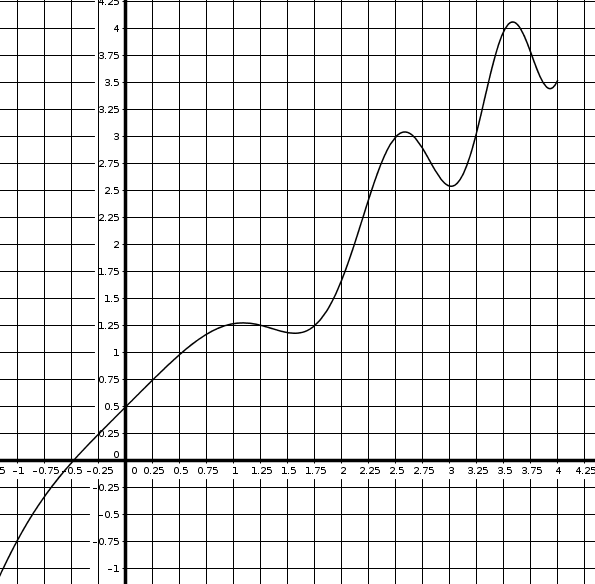
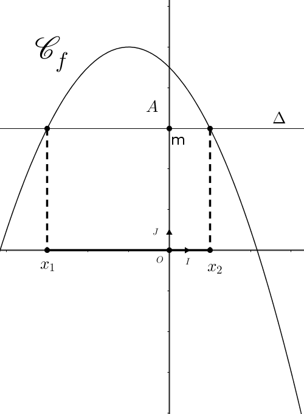
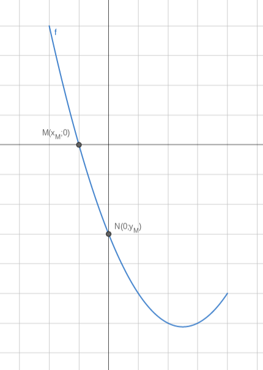
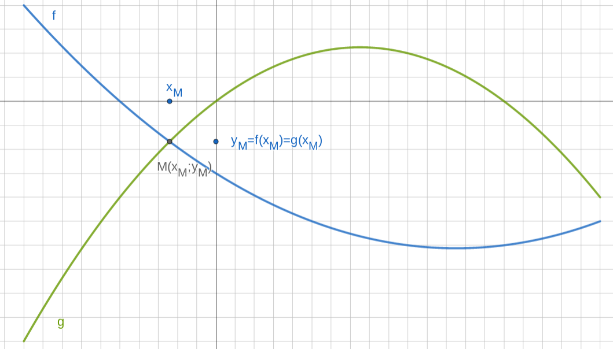
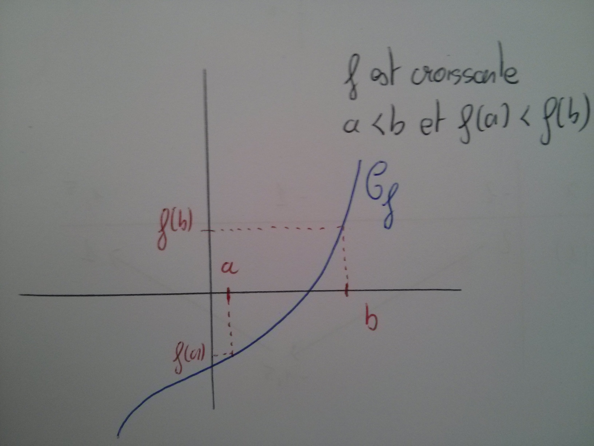
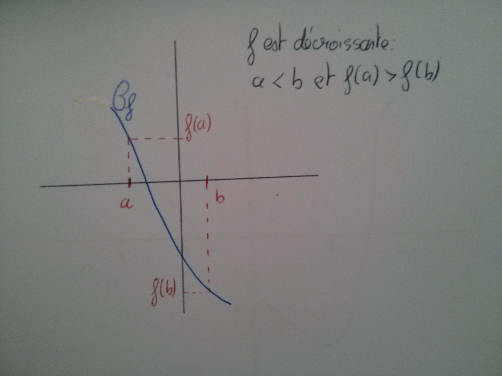
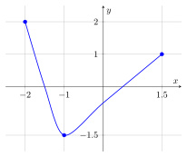

```css
```
```{=html}
<style>
:root {
  --def-color:   #2563eb;
  --prop-color:  #7c3aed;
  --theo-color:  #c026d3;
  --voc-color:   #0d9488;
  --rem-color:   #d97706;
  --ex-color:    #16a34a;
  --app-color:   #ea580c;
  --not-color:   #4f46e5;
  --meth-color:  #dc2626;
  --ill-color:   #475569;
}

.definition, .proposition, .theoreme, .vocabulaire, .remarque, .exemple, .application,
.notation, .methode, .illustration {
  margin: 1.5em 0;
  padding: 1em 1.3em 1em 1.3em;
  border-radius: 10px;
  border-left: 6px solid;
  box-shadow: 0 1px 4px rgba(0,0,0,0.08);
  font-family: "Georgia", serif;
}

.definition::before, .proposition::before, .theoreme::before, .vocabulaire::before,
.remarque::before, .exemple::before, .application::before,
.notation::before, .methode::before, .illustration::before {
  display: block;
  font-family: "Helvetica Neue", Arial, sans-serif;
  font-weight: 700;
  font-size: 0.95em;
  letter-spacing: 0.03em;
  text-transform: uppercase;
  margin-bottom: 0.6em;
}

.definition {
  background: #eff6ff;
  border-color: var(--def-color);
  color: #1e3a5f;
}
.definition::before {
  content: "📘  Définition";
  color: var(--def-color);
}

.proposition {
  background: #f5f3ff;
  border-color: var(--prop-color);
  color: #3b2467;
}
.proposition::before {
  content: "📐  Proposition";
  color: var(--prop-color);
}

.theoreme {
  background: #fdf4ff;
  border-color: var(--theo-color);
  color: #701a75;
}
.theoreme::before {
  content: "🏛️  Théorème";
  color: var(--theo-color);
}

.vocabulaire {
  background: #f0fdfa;
  border-color: var(--voc-color);
  color: #0f4c46;
}
.vocabulaire::before {
  content: "🏷️  Vocabulaire";
  color: var(--voc-color);
}

.remarque {
  background: #fffbeb;
  border-color: var(--rem-color);
  color: #6b4a06;
}
.remarque::before {
  content: "💡  Remarque";
  color: var(--rem-color);
}

.exemple {
  background: #f0fdf4;
  border-color: var(--ex-color);
  color: #14532d;
}
.exemple::before {
  content: "🔍  Exemple";
  color: var(--ex-color);
}

.application {
  background: #fff7ed;
  border: 2px dashed var(--app-color);
  border-left: 6px solid var(--app-color);
  color: #7c2d12;
}
.application::before {
  content: "✏️  Application";
  color: var(--app-color);
  font-size: 1.05em;
}

.notation {
  background: #eef2ff;
  border-color: var(--not-color);
  color: #312e81;
}
.notation::before {
  content: "🖊️  Notation";
  color: var(--not-color);
}

.methode {
  background: #fef2f2;
  border-color: var(--meth-color);
  color: #7f1d1d;
}
.methode::before {
  content: "🧭  Méthode";
  color: var(--meth-color);
}

.illustration {
  background: #f8fafc;
  border-color: var(--ill-color);
  color: #1e293b;
}
.illustration::before {
  content: "🖼️  Illustration";
  color: var(--ill-color);
}

/* Callouts "Solution" un peu plus stylés */
div.callout-caution {
  border-radius: 10px;
  box-shadow: 0 1px 4px rgba(0,0,0,0.08);
}
div.callout-caution .callout-title {
  font-family: "Helvetica Neue", Arial, sans-serif;
  font-weight: 700;
}
div.callout-caution .callout-title::before {
  content: "🔓  ";
}
</style>
```

# Notions de fonctions

## Fonctions

::: {.definition}
Soit $E$ une partie de l'ensemble des nombres réels $\mathbb{R}$.

Définir une fonction $f$ sur $E$ c'est associer à chaque réel $x$ de $E$ un unique nombre réel, que l'on note $f(x)$.
:::

::: {.exemple}
On considère $E=[-2;2]$ et la fonction $f$ qui à chaque réel $x$ de $E$ associe son double $2x$.

Par exemple, au nombre 1, on associe 2:

Compléter le tableau:

|             |      |          |      |     |     |     |     |
|:-----------:|:----:|:--------:|:----:|:---:|:---:|:---:|:---:|
| **Départ**  | $-2$ | $-1{,}5$ |      |     |     | 1,5 |  2  |
|             |      |          |      |     |     |     |     |
| **Arrivée** |      |          | $-2$ |  0  |  2  |     |     |
:::

::: {.callout-caution collapse="true"}
## Solution

|             |      |          |      |     |     |     |     |
|:-----------:|:----:|:--------:|:----:|:---:|:---:|:---:|:---:|
| **Départ**  | $-2$ | $-1{,}5$ | $-1$ |  0  |  1  | 1,5 |  2  |
|             |      |          |      |     |     |     |     |
| **Arrivée** | $-4$ |   $-3$   | $-2$ |  0  |  2  |  3  |  4  |
:::

::: {.notation}
On note $$\begin{aligned}
                              f: E &\rightarrow \mathbb{R}\\
                              x &\mapsto f(x)

\end{aligned}$$

Dans notre exemple, on note: $$\begin{aligned}
                              f: [-2;2] &\rightarrow \mathbb{R}\\
                              x &\mapsto 2x

\end{aligned}$$
:::

::: {.vocabulaire}
$E$ est appelé **ensemble de définition** de la fonction $f$.

On lit: "la fonction $f$, définie pour $x$ appartenant à $E$, qui à tout nombre $x$ associe le nombre $f(x)$".
:::

::: {.remarque}
$f(x)$ désigne un nombre, $f$ désigne la correspondance entre $x$ et $f(x)$.
:::

## Tableau de valeurs

Le tableau de valeurs de la fonction $f$ donne, en première ligne, différentes valeurs de la variable $x$ et, en deuxième ligne, les nombres $f(x)$ qui leur sont associés.

::: {.exemple}
Pour la fonction: $$\begin{aligned}
 f: [-1;3] &\rightarrow \mathbb{R}\\
           x &\mapsto x^2-1
\end{aligned}$$ Compléter le tableau de valeurs suivant:

|  **Départ : $x$**   | $-1$ |  0  |  1  | 1,5 |  2  | 2,5 |  3  |
|:-------------------:|:----:|:---:|:---:|:---:|:---:|:---:|:---:|
| **Arrivée: $f(x)$** |      |     |     |     |     |     |     |
:::

::: {.callout-caution collapse="true"}
## Solution

|   **Départ : $x$**   | $-1$ |  0   |  1  | 1,5  |  2  | 2,5  |  3  |
|:--------------------:|:----:|:----:|:---:|:----:|:---:|:----:|:---:|
| **Arrivée : $f(x)$** |  0   | $-1$ |  0  | 1,25 |  3  | 5,25 |  8  |
:::

## Image, antécédent

::: {.definition}
Soit une fonction $f$ définie sur un ensemble $E$:

$$\begin{aligned}
                              f: E &\rightarrow \mathbb{R}\\
                              x &\mapsto f(x)
\end{aligned}$$

**L'image** de $x$ par la fonction $f$ est le nombre $f(x)$.

Le nombre $x$ est un **antécédent** du nombre $f(x)$
:::

::: {.exemple}
Pour la fonction $$\begin{aligned}
 f: [-1;3] &\rightarrow \mathbb{R}\\
           x &\mapsto x^2-1
\end{aligned}$$

1.  1,25 est l'image de 1,5 car $f(1{,}5)=1{,}25$

2.  2 est un antécédent de 3 car $f(2)=3$
:::

# Courbe représentative et résolutions graphiques

## Courbe représentative

Soit une fonction $f$ définie sur $E$ une partie de $\mathbb{R}$. Dans le repère du plan $(O,I,J)$, on peut représenter les points de coordonnées $M(x;f(x))$ pour tout $x \in E$

::: {.definition}
On appelle courbe représentative de la fonction $f$, l'ensemble de tous ces points $M(x;f(x))$.

On la note $C_f$.
:::

::: {.remarque}
Pour tracer l'allure de la courbe représentative d'une fonction, on commence par remplir un tableau de valeurs, puis on place dans un repère les points ainsi obtenus, pour ensuite les relier (sans règle s'il ne s'agit pas d'une droite).
:::

::: {.application}
Tracer la représentation graphique de la fonction:

$$\begin{aligned}
 f: [-5;6] &\rightarrow \mathbb{R}\\
           x &\mapsto \dfrac{1}{5}x^2-x+2
\end{aligned}$$
:::

::: {.definition}
On appelle équation de la courbe représentative de $f$ l'équation $y=f(x)$ pour $x\in E$.
:::

::: {.remarque}
L'équation de la courbe représentative d'une fonction $f$ est une condition pour qu'un point $N$ de coordonnées $N(x_N;y_N)$ appartienne à une courbe:

Le point $N(x_N;y_N)$ appartient à la courbe représentative de $f$ si et seulement si $y_N=f(x_N)$ avec $x_N\in E$
:::

::: {.exemple}
Soit $f$ la fonction définie sur $\mathbb{R}^*$ par $f(x)=\dfrac{2x+1}{x}$

-   Un point $M(x,y)$ appartient à la courbe si ses coordonnées vérifient $y=f(x)$ et $x\in \mathbb{R}^*$.

-   L'équation de la courbe représentative de $f$ est donc $y=\dfrac{2x+1}{x},~x\in \mathbb{R}^*$

-   Le point $P(2;4)$ n'appartient pas à la courbe car $f(2)=\dfrac{5}{2} \neq 4$

-   Le point $Q\left(5;\dfrac{11}{5}\right)$ appartient à la courbe car $f(5)=\dfrac{11}{5}$. Ainsi on a bien $y_Q=f(x_Q)$
:::

::: {.application}
Soit $f$ la fonction définie sur $[0;5]$ par $f(x)=3x-5$.

1.  Donner l'équation de la courbe représentative de la fonction $f$\

2.  Le point $N(1;-3)$ appartient-il à la courbe représentative de $f$ ?\

3.  Le point $T(2;1)$ appartient-il à la courbe représentative de $f$?

4.  Le point $R(-1;-8)$ appartient-il à la courbe représentative de la fonction $f$?\
:::

::: {.callout-caution collapse="true"}
## Solution

1.  Donner l'équation de la courbe représentative de la fonction $f$\
    L'équation de la courbe représentative de $f$ est $y=f(x)$ donc $y=3x-5$ pour $x\in [0;5]$

2.  Le point $N(1;-3)$ appartient-il à la courbe représentative de $f$ ?\
    Le point $N$ appartient à la courbe représentative de $f$ si ses coordonnées vérifient l'équation de la courbe c'est-à-dire si $y_N=f(x_N)$ ou encore $y_N=3x_N-5$\
    Or $y_N=-3$ et $3x_N-5=-2$ donc $y_N \neq f(x_N)$. Donc le point $N$ n'appartient pas à la courbe représentative de $f$.

3.  Le point $T(2;1)$ appartient-il à la courbe représentative de $f$?

    Le point $T$ appartient à la courbe représentative de $f$ si ses coordonnées vérifient l'équation de la courbe c'est-à-dire si $y_T=f(x_T)$ ou encore $y_T=3x_T-5$\
    Or $y_T=1$ et $3x_T-5=1$ donc $y_T = f(x_T)$. Donc le point $T$ appartient à la courbe représentative de $f$.

4.  Le point $R(-1;-8)$ appartient-il à la courbe représentative de la fonction $f$?\
    Le point $R$ n'appartient pas à la courbe représentative de $f$ car son abscisse n'appartient pas au domaine de définition de $f$: $-1 \notin [0;5]$
:::

## Lecture et résolutions graphiques

### Lecture graphique

Sur un graphique, on lit l'ensemble des images sur l'axe des ordonnées, et l'ensemble des antécédents sur l'axe des abscisses.

On considère ci-contre la courbe représentative d'une fonction $f$ définie sur $[-1;5]$.

On souhaite trouver graphiquement l'image du nombre $4$ par $f$ et le(s) antécédent(s) de $-0{,}5$.

1.  Pour trouver l'image du nombre 4, on trace la parallèle à l'axe des ordonnées passant par le point $(4;0)$. Cette droite coupe $C_f$ en un point $A$.

    On trace ensuite la parallèle à l'axe des abscisses passant par $A$. Elle coupe l'axe des ordonnées en $f(4)$.

    Ainsi, l'image de $4$ par $f$ est $1$.

2.  Pour trouver le(s) antécédent(s) de $-0{,}5$ par $f$, on trace la droite $\Delta$, parallèle à l'axe des abscisses et passant par le point de coordonnées $(0;-0{,}5)$

    Le(s) antécédent(s) de $-0{,}5$ par $f$ sont les abscisses des points d'intersection de $\Delta$ avec $C_f$.

    Ainsi les antécédents de $-0{,}5$ par $f$ sont $1{,}7$, $3{,}1$ et $4{,}6$.

{width="65%" fig-align="center"}

::: {.application}
On considère la fonction $f$ dont la représentation graphique est donnée ci-dessous.

Donner les images de : 2,5 ; 1,25 ; 1,75.

Donner les antécédents de : 0,5 ; 4 ; $-0{,}5$.

{width="65%" fig-align="center"}
:::

### Résolution graphique

Soit $f$ une fonction définie sur $E$ et $C_f$ sa courbe représentative dans un repère $(O,I,J)$.

La droite $\Delta$ est la parallèle à l'axe des abscisses qui passe par le point $A(0;m)$

{width="55%" fig-align="center"}

**Résolution de l'équation $f(x)=m$**

Résoudre sur $E$ l'équation $f(x)=m$ revient à déterminer les abscisses des points d'intersection de la courbe $C_f$ avec la droite $\Delta$.

Dans l'exemple ci-dessus, on lit graphiquement que l'équation $f(x)=m$ admet deux solutions: $x_1$ et $x_2$.

**Résolution de l'inéquation $f(x)\geqslant m$**

Résoudre sur $E$ l'inéquation $f(x)\geqslant m$ revient à déterminer les abscisses des points pour lesquels $C_f$ est au-dessus de la droite $\Delta$.

Dans l'exemple ci-dessus, on lit graphiquement que l'inéquation $f(x)\geqslant m$ admet pour solution tout nombre de l'intervalle $[x_1;x_2]$.

## Intersection

### Intersection entre une courbe et les axes du repère

On cherche ici à déterminer les coordonnées des éventuels points d'intersection entre la courbe représentative d'une fonction et les axes du repère.

{width="65%" fig-align="center"}

Ici, on cherche les coordonnées de deux points:

-   Le point $M(x_M;y_M)$: point d'intersection entre la courbe $C_f$ et l'axe des abscisses

-   Le point $N(x_N;y_N)$ : point d'intersection entre la courbe $C_f$ et l'axe des ordonnées.

Deux informations peuvent être déduites ou lues directement sur la figure :

-   Le point $M$ appartient à l'axe des abscisses donc son ordonnée est nulle: $y_M=0$.

-   Le point $N$ appartient à l'axe des ordonnées donc son abscisse est nulle: $x_N=0$.

De plus, les points $M$ et $N$ appartiennent tous les deux à $C_f$, donc leurs coordonnées vérifient l'équation de la courbe. L'équation de la courbe est, par définition, $y=f(x)$, $x\in [-2;4]$. On a donc:

-   $y_M=f(x_M)$. Or $y_M=0$ donc $0=f(x_M)$.\
    Pour trouver $x_M$ il suffit de résoudre l'équation $f(x)=0$ sur l'intervalle $[-2;4]$.

-   $y_N=f(x_N)$; Or $x_N=0$ donc $y_N=f(0)$.\
    Pour trouver $y_N$, il suffit de calculer l'image de 0.

::: {.application}
Soit $g$ la fonction définie sur $\mathbb{R}$ par $g(x)=3x-5$.

1.  Déterminer les coordonnées du point $A$, point d'intersection de la courbe $C_g$ et de l'axe des ordonnées.\

2.  Déterminer les coordonnées du point $B$, point d'intersection de la courbe $C_g$ avec l'axe des abscisses.\
:::

::: {.callout-caution collapse="true"}
## Solution

Soit $g$ la fonction définie sur $\mathbb{R}$ par $g(x)=3x-5$.

1.  Déterminer les coordonnées du point $A$, point d'intersection de la courbe $C_g$ et de l'axe des ordonnées.\
    Le point $A$ est le point d'intersection de $C_g$ avec l'axe des ordonnées, donc en particulier il appartient à l'axe des ordonnées. Donc $x_A=0$.\
    Le point $A$ appartient également à $C_g$ donc ses coordonnées vérifient l'équation de la courbe. L'équation de la courbe est $y=3x-5$ avec $x\in \mathbb{R}$.\
    Donc $y_A=3x_A-5=3\times 0-5 = -5$\
    Finalement $A(0;-5)$

2.  Déterminer les coordonnées du point $B$, point d'intersection de la courbe $C_g$ avec l'axe des abscisses.\
    Le point $B$ est le point d'intersection de $C_g$ avec l'axe des abscisses, donc en particulier il appartient à l'axe des abscisses. Donc $y_B=0$.\
    Le point $B$ appartient également à $C_g$ donc ses coordonnées vérifient l'équation de la courbe. L'équation de la courbe est $y=3x-5$ avec $x\in \mathbb{R}$.\
    Donc $y_B=3x_B-5 \iff 0=3x_B-5 \iff -3x_B=-5 \iff x_B=\dfrac{5}{3}$.\
    Finalement, $B\left(\dfrac{5}{3};0\right)$
:::

### Intersection entre deux courbes

On cherche ici à déterminer les coordonnées du ou des points d'intersection entre deux courbes.

{width="65%" fig-align="center"}

On appelle $M$ ce point d'intersection et on note $M(x_M;y_M)$ ses coordonnées.

-   Le point $M$ appartient à la courbe représentative de la fonction $f$, donc ses coordonnées vérifient l'équation de la courbe de $f$: $y=f(x)$ donc $y_M=f(x_M)$.

-   Le point $M$ appartient également à la courbe représentative de la fonction $g$, donc ses coordonnées vérifient l'équation de la courbe de $g$: $y=g(x)$ donc $y_M=g(x_M)$

Ainsi on a l'égalité $f(x_M)=g(x_M)$. Il ne reste plus qu'à résoudre l'équation $f(x)=g(x)$ pour trouver $x_M$. On déduira ensuite $y_M$ en calculant l'image de $x_M$ soit avec la fonction $f$ ou avec la fonction $g$.

::: {.application}
Soit $f$ la fonction définie sur $\mathbb{R}$ par $f(x)=-x+3$ et $g$ la fonction définie sur $\mathbb{R}$ par $g(x)=3x-5$.\
Déterminer les coordonnées du point $M$, point d'intersection des courbes représentatives des fonctions $f$ et $g$.
:::

::: {.callout-caution collapse="true"}
## Solution

On note $M(x_M;y_M)$ les coordonnées du point $M$.

-   $M$ appartient à la courbe représentative de la fonction $f$ donc ses coordonnées vérifient l'équation de la courbe de $f$ donc $y_M=f(x_M)$ c'est-à-dire $y_M=-x_M+3$.

-   $M$ appartient à la courbe représentative de la fonction $g$ donc ses coordonnées vérifient l'équation de la courbe de $g$ donc $y_M=g(x_M)$ c'est-à-dire $y_M=3x_M-5$.

Il s'agit donc de résoudre l'équation $-x+3=3x-5$:\
$-x+3=3x-5 \iff -4x=-8 \iff x=2$. Ainsi l'abscisse de $M$ est $2$.\
Pour calculer l'ordonnée de $M$ on utilise indifféremment la fonction $f$ ou la fonction $g$: $f(2)=g(2)=1$.\
Ainsi $M(2;1)$
:::

# Variations d'une fonction

## Fonction croissante, décroissante, constante

::: {.definition}
Soit $f$ une fonction définie sur un intervalle $I$ de $\mathbb{R}$.

Dire que $f$ est croissante sur $I$ signifie que pour tous réels $a$ et $b$ de $I$, si $a<b$ alors $f(a)\leqslant f(b)$.
:::

::: {.remarque}
Une fonction croissante conserve l'ordre.
:::

::: {.illustration}
:::

::: {.callout-caution collapse="true"}
## Solution

{width="55%" fig-align="center"}
:::

::: {.definition}
Soit $f$ une fonction définie sur un intervalle $I$ de $\mathbb{R}$.

Dire que $f$ est décroissante sur $I$ signifie que pour tous réels $a$ et $b$ de $I$, si $a<b$ alors $f(a) \geqslant f(b)$.
:::

::: {.remarque}
Une fonction décroissante inverse l'ordre.
:::

::: {.illustration}
:::

::: {.callout-caution collapse="true"}
## Solution

{width="55%" fig-align="center"}
:::

::: {.definition}
Soit $f$ une fonction définie sur un intervalle $I$.

On dit que $f$ est une fonction constante sur $I$ si pour tous réels $a$ et $b$ de $I$, $f(a)=f(b)$.
:::

## Tableau de variations

Un tableau de variations résume les variations d'une fonction en faisant apparaître les intervalles où elle est monotone, c'est-à-dire croissante ou décroissante.

::: {.exemple}
On considère la fonction $f$ définie sur l'intervalle $[-2;1{,}5]$ dont la courbe représentative est donnée ci-dessous:

On constate que la fonction est

1.  croissante sur : $[-1;1{,}5]$

2.  décroissante sur: $[-2;-1]$

<figure id="fig:variation_f_lisse">
<p> <span id="fig:variation_f_lisse" label="fig:variation_f_lisse"></span></p>
</figure>

Tracer le tableau de variations
:::

::: {.callout-caution collapse="true"}
## Solution

{width="70%" fig-align="center"}
:::

## Extremum d'une fonction

::: {.definition}
Soit $f$ une fonction définie sur un intervalle $I$ de $\mathbb{R}$ et soient $(a,b)\in I^2$.

1.  Dire que $f$ admet un maximum $M$ en $a$ sur $I$ signifie que pour tout réel $x\in I$, $f(x) \leqslant f(a)$, avec $f(a)=M$

2.  Dire que $f$ admet un minimum $m$ en $b$ sur $I$ signifie que pour tout réel $x\in I$, $f(x) \geqslant f(b)$, avec $f(b)=m$
:::

::: {.exemple}
Dans l'exemple précédent, le maximum de la fonction est 2 et il est atteint pour $x=-2$. Le minimum est $-1{,}5$ et est atteint pour $x=-1$.
:::

# Parité d'une fonction

::: {.definition}
Un ensemble de $\mathbb{R}$ est dit symétrique par rapport à 0 (ou centré en 0) si, pour tout nombre de l'ensemble, son opposé appartient également à l'ensemble.
:::

::: {.exemple}
L'intervalle $[-4;4]$ est centré en 0 alors que l'intervalle $[-2;3]$ ne l'est pas.
:::

::: {.definition}
On dit qu'une fonction $f$ est paire lorsque son domaine de définition $D_f$ est centré en 0 et si pour tout réel $x\in D_f$, $f(-x)=f(x)$.
:::

::: {.proposition}
La courbe représentative d'une fonction paire est symétrique par rapport à l'axe des ordonnées
:::

::: {.application}
Montrer que:

1.  La fonction $f$ définie sur $\mathbb{R}$ par $f(x)=2x^2$ est paire.

2.  La fonction $g$ définie sur $\mathbb{R}$ par $g(x)=x^3+1$ n'est pas paire.
:::

::: {.definition}
On dit qu'une fonction $f$ est impaire lorsque son domaine de définition $D_f$ est centré en 0 et si pour tout réel $x \in D_f$, $f(-x)=-f(x)$.
:::

::: {.proposition}
La courbe représentative d'une fonction impaire est symétrique par rapport à l'origine du repère.
:::

::: {.application}
Montrer que :

1.  La fonction $f$ définie sur $\mathbb{R}$ par $f(x)=x^3$ est impaire.

2.  La fonction $g$ définie sur $\mathbb{R}$ par $g(x)=2x+1$ n'est pas impaire.
:::

::: {.remarque}
Il existe des fonctions qui ne sont ni paires ni impaires.
:::
