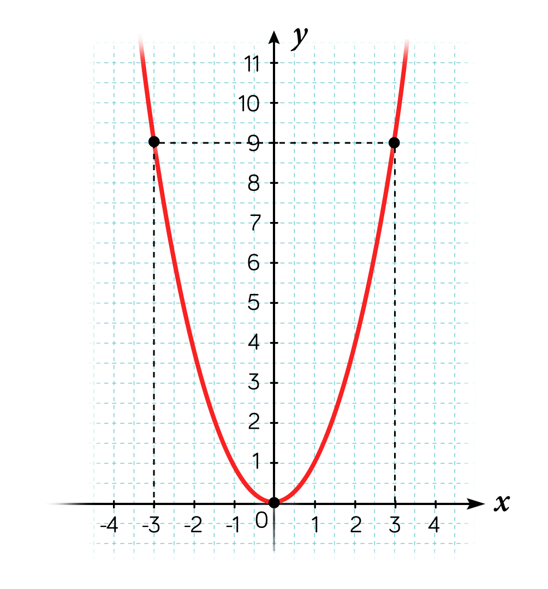
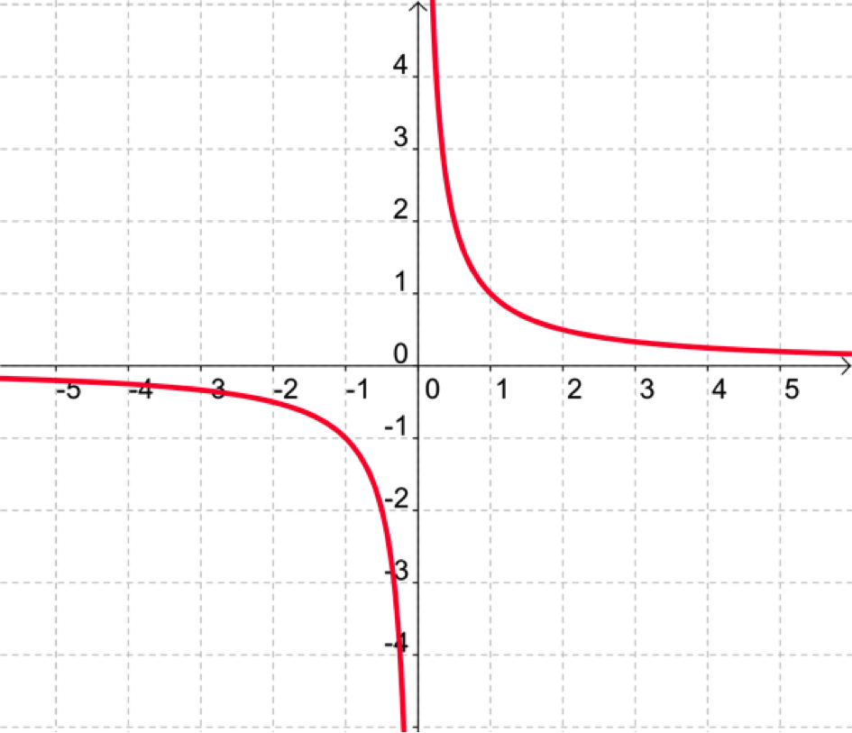
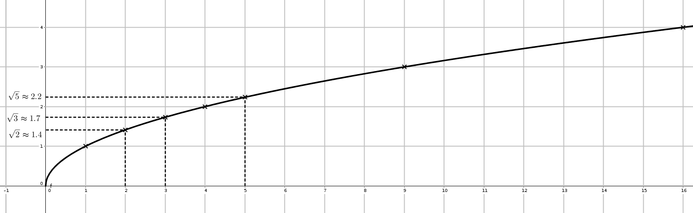
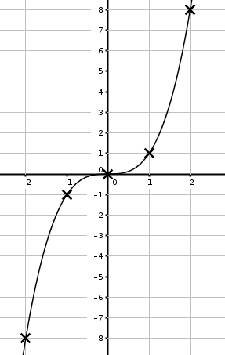

```css
```
```{=html}
<style>
:root {
  --def-color:   #2563eb;
  --prop-color:  #7c3aed;
  --theo-color:  #c026d3;
  --voc-color:   #0d9488;
  --rem-color:   #d97706;
  --ex-color:    #16a34a;
  --app-color:   #ea580c;
  --not-color:   #4f46e5;
  --meth-color:  #dc2626;
  --ill-color:   #475569;
}

.definition, .proposition, .theoreme, .vocabulaire, .remarque, .exemple, .application,
.notation, .methode, .illustration {
  margin: 1.5em 0;
  padding: 1em 1.3em 1em 1.3em;
  border-radius: 10px;
  border-left: 6px solid;
  box-shadow: 0 1px 4px rgba(0,0,0,0.08);
  font-family: "Georgia", serif;
}

.definition::before, .proposition::before, .theoreme::before, .vocabulaire::before,
.remarque::before, .exemple::before, .application::before,
.notation::before, .methode::before, .illustration::before {
  display: block;
  font-family: "Helvetica Neue", Arial, sans-serif;
  font-weight: 700;
  font-size: 0.95em;
  letter-spacing: 0.03em;
  text-transform: uppercase;
  margin-bottom: 0.6em;
}

.definition {
  background: #eff6ff;
  border-color: var(--def-color);
  color: #1e3a5f;
}
.definition::before {
  content: "📘  Définition";
  color: var(--def-color);
}

.proposition {
  background: #f5f3ff;
  border-color: var(--prop-color);
  color: #3b2467;
}
.proposition::before {
  content: "📐  Proposition";
  color: var(--prop-color);
}

.theoreme {
  background: #fdf4ff;
  border-color: var(--theo-color);
  color: #701a75;
}
.theoreme::before {
  content: "🏛️  Théorème";
  color: var(--theo-color);
}

.vocabulaire {
  background: #f0fdfa;
  border-color: var(--voc-color);
  color: #0f4c46;
}
.vocabulaire::before {
  content: "🏷️  Vocabulaire";
  color: var(--voc-color);
}

.remarque {
  background: #fffbeb;
  border-color: var(--rem-color);
  color: #6b4a06;
}
.remarque::before {
  content: "💡  Remarque";
  color: var(--rem-color);
}

.exemple {
  background: #f0fdf4;
  border-color: var(--ex-color);
  color: #14532d;
}
.exemple::before {
  content: "🔍  Exemple";
  color: var(--ex-color);
}

.application {
  background: #fff7ed;
  border: 2px dashed var(--app-color);
  border-left: 6px solid var(--app-color);
  color: #7c2d12;
}
.application::before {
  content: "✏️  Application";
  color: var(--app-color);
  font-size: 1.05em;
}

.notation {
  background: #eef2ff;
  border-color: var(--not-color);
  color: #312e81;
}
.notation::before {
  content: "🖊️  Notation";
  color: var(--not-color);
}

.methode {
  background: #fef2f2;
  border-color: var(--meth-color);
  color: #7f1d1d;
}
.methode::before {
  content: "🧭  Méthode";
  color: var(--meth-color);
}

.illustration {
  background: #f8fafc;
  border-color: var(--ill-color);
  color: #1e293b;
}
.illustration::before {
  content: "🖼️  Illustration";
  color: var(--ill-color);
}

/* Callouts "Solution" un peu plus stylés */
div.callout-caution {
  border-radius: 10px;
  box-shadow: 0 1px 4px rgba(0,0,0,0.08);
}
div.callout-caution .callout-title {
  font-family: "Helvetica Neue", Arial, sans-serif;
  font-weight: 700;
}
div.callout-caution .callout-title::before {
  content: "🔓  ";
}
</style>
```

# Fonctions affines et fonctions linéaires

## Définition

::: {.definition}
On appelle **fonction affine** une fonction $f$ définie sur $\mathbb{R}$ par $f(x)=mx+p$, où $m$ et $p$ sont deux nombres réels.

En particulier, lorsque $p=0$, la fonction $f$ définie par $f(x)=mx$ est une **fonction linéaire**.
:::

::: {.exemple}
1.  La fonction $g$ définie sur $\mathbb{R}$ par $g(x)=-2x+3$ est affine.

2.  La fonction $h$ définie sur $\mathbb{R}$ par $h(x)=\dfrac{1}{3}x$ est linéaire.
:::

## Représentation graphique

::: {.theoreme}
Dans un repère, la représentation graphique d'une fonction affine est une droite non parallèle à l'axe des ordonnées.

Réciproquement, toute droite non parallèle à l'axe des ordonnées est la représentation graphique d'une fonction affine.
:::

::: {.remarque}
Pour tracer la représentation graphique d'une fonction affine, il suffit de connaître les coordonnées de deux points se trouvant sur la droite. On se donne deux valeurs de $x$, et on calcule les deux images.
:::

::: {.application}
On considère la fonction affine $f$ définie par $f(x)=3x-1$. Tracer sa courbe représentative.
:::

::: {.callout-caution collapse="true"}
## Solution

On commence par remplir un tableau de valeurs:

| $x$    | 0    | 1   |
|:-------|:-----|:----|
| $f(x)$ | $-1$ | 2   |

On place les deux points de coordonnées $(0;-1)$ et $(1;2)$. La courbe représentative de $f$ est la droite passant par ces deux points.
:::

::: {.vocabulaire}
Soit $f$ une fonction affine définie sur $\mathbb{R}$ par $f(x)=mx+p$.

$m$ est le coefficient directeur et $p$ est l'ordonnée à l'origine (c'est l'ordonnée du point d'abscisse 0) de la droite représentative de $f$.
:::

## Variations des fonctions affines

::: {.proposition}
Soit $f$ une fonction affine définie sur $\mathbb{R}$ par $f(x)=mx+p$.

1.  Si $m>0$, alors $f$ est croissante sur $\mathbb{R}$.

2.  Si $m=0$, alors $f$ est constante sur $\mathbb{R}$.

3.  Si $m<0$, alors $f$ est décroissante sur $\mathbb{R}$.
:::

::: {.callout-caution collapse="true"}
## Solution

Soit $f$ une fonction affine définie sur $\mathbb{R}$ par $f(x)=mx+p$.

Soient $x_1$ et $x_2$ deux nombres réels quelconques tels que $x_1<x_2$.

$f(x_2)-f(x_1)=(mx_2+p)-(mx_1+p)=mx_2+p-mx_1-p=m(x_2-x_1)$.

Comme par hypothèse $x_2-x_1>0$, le signe de $f(x_2)-f(x_1)$ est le même que le signe de $m$.

On a donc les trois cas suivants:

1.  Si $m>0$ alors $f(x_2)-f(x_1)>0$ ou encore $f(x_1)<f(x_2)$. Donc $f$ est croissante sur $\mathbb{R}$.

2.  Si $m<0$ alors $f(x_2)-f(x_1)<0$ ou encore $f(x_1)>f(x_2)$. Donc $f$ est décroissante sur $\mathbb{R}$.

3.  Si $m=0$ alors pour tout $x$ de $\mathbb{R}$, $f(x)=p$. Donc $f$ est constante sur $\mathbb{R}$.
:::

## Signe d'une fonction affine

::: {.proposition}
Soit $f$ une fonction affine définie sur $\mathbb{R}$ par $f(x)=mx+p$, avec $m\neq0$.

$f$ est du signe de $m$ pour les valeurs supérieures à $x_0=\dfrac{-p}{m}$, et du signe contraire pour les valeurs inférieures.

Tableau de signes de $f(x)$ en fonction de $x$:

{width="70%" fig-align="center"}
:::

# La fonction carré

## Généralités

::: {.definition}
La fonction carré est la fonction $f$ définie sur $\mathbb{R}$ par $f(x)=x^2$.
:::

::: {.proposition}
Variation de la fonction carré.

La fonction carré est décroissante sur $]-\infty;0]$ et croissante sur $[0;+\infty[$.
:::

::: {.callout-caution collapse="true"}
## Solution

1.  Montrons que la fonction carré $f$ est décroissante sur $]-\infty;0]$:

    Soient $a$ et $b$ deux nombres réels quelconques négatifs tels que $a \leqslant b$.

    Alors $f(a)-f(b)=a^2-b^2=(a-b)(a+b)$

    Il est clair que $a+b \leqslant 0$.

    De plus $a \leqslant b \Leftrightarrow a-b \leqslant 0$. Donc $f(a)-f(b)=(a-b)(a+b) \geqslant 0$.

    Finalement $f(a)-f(b)\geqslant 0 \Leftrightarrow f(a) \geqslant f(b)$ Donc $f$ est bien décroissante sur $]-\infty;0]$

2.  Montrons que la fonction carré $f$ est croissante sur $[0;+\infty[$:

    Soient $a$ et $b$ deux nombres réels quelconques positifs tels que $a \leqslant b$.

    Alors $f(a)-f(b)=a^2-b^2=(a-b)(a+b)$

    Il est clair que $a+b \geqslant 0$.

    De plus $a \leqslant b \Leftrightarrow a-b \leqslant 0$. Donc $f(a)-f(b)=(a-b)(a+b) \leqslant 0$.

    Finalement $f(a)-f(b)\leqslant 0 \Leftrightarrow f(a) \leqslant f(b)$ Donc $f$ est bien croissante sur $[0;+\infty[$
:::

## Courbe représentative

::: {.vocabulaire}
La courbe de la fonction carré s'appelle une parabole.
:::

**Tableau de valeurs:**

| $x$    | $-3$ | $-2$ | $-1$ | 0   | 1   | 2   | 3   |
|:-------|:-----|:-----|:-----|:----|:----|:----|:----|
| $f(x)$ | 9    | 4    | 1    | 0   | 1   | 4   | 9   |

{width="55%" fig-align="center"}

::: {.vocabulaire}
Dans un repère $(O,I,J)$, la courbe de la fonction carré est une parabole de sommet $O$, l'origine du repère.
:::

::: {.proposition}
Symétrie de la courbe

Dans un repère orthogonal $(O,I,J)$, la courbe de la fonction carré est symétrique par rapport à l'axe des ordonnées.
:::

::: {.callout-caution collapse="true"}
## Solution

Pour tout nombre réel $a$, montrons que les points de la courbe d'abscisses $a$ et $-a$ sont symétriques par rapport à l'axe des ordonnées.

$f(-a)=(-a)^2=a^2=f(a)$. Les deux points de coordonnées $(a;f(a))$ et $(-a;f(-a))$ sont donc symétriques par rapport à l'axe des ordonnées.
:::

## Propriétés algébriques

::: {.proposition}
-   Si $a$ et $b$ sont deux réels positifs tels que $0\leqslant a \leqslant b$ alors $0\leqslant a^2 \leqslant b^2$

-   Si $a$ et $b$ sont deux réels négatifs tels que $a \leqslant b \leqslant 0$ alors $a^2 \geqslant b^2 \geqslant 0$
:::

::: {.proposition}
La fonction carré est paire.
:::

# La fonction inverse: $x\mapsto \dfrac{1}{x}$

## Généralités

::: {.definition}
La fonction inverse est la fonction $f$ définie sur $\mathbb{R}^*$ par $f(x)=\dfrac{1}{x}$.

À tout réel non nul, elle associe son inverse.
:::

::: {.proposition}
La fonction inverse est décroissante sur $]-\infty;0[$ et sur $]0;+\infty[$.

{width="70%" fig-align="center"}
:::

::: {.callout-caution collapse="true"}
## Solution

Montrons que la fonction inverse est décroissante sur $]-\infty;0[$.

Soit $f$ la fonction inverse définie sur $\mathbb{R}^*$ par $f(x)=\dfrac{1}{x}$.

Soient $a$ et $b$ deux réels négatifs non nuls tels que $a<b<0$.

Alors $f(a)-f(b)=\dfrac{1}{a}-\dfrac{1}{b}=\dfrac{b-a}{ab}$. Comme $a<b$, $b-a>0$. De plus $ab>0$. Donc $\dfrac{b-a}{ab}>0$ c'est-à-dire $\dfrac{1}{a}-\dfrac{1}{b}>0$ c'est-à-dire $\dfrac{1}{a}>\dfrac{1}{b}$. Finalement $f(a)>f(b)$. Ainsi $f$ est décroissante sur $\mathbb{R}^{-*}$
:::

## Courbe représentative

| $x$            | $-4$                    | $-2$                   | $-1$ | $-0{,}5$               | $-0{,}25$               |
|:---------------|:------------------------|:-----------------------|:-----|:-----------------------|:------------------------|
| $\dfrac{1}{x}$ | $\dfrac{1}{-4}=-0{,}25$ | $\dfrac{1}{-2}=-0{,}5$ | $-1$ | $\dfrac{1}{-0{,}5}=-2$ | $\dfrac{1}{-0{,}25}=-4$ |

| $x$            | 0              | 0,25                  | 0,5                  | 1   | 2                    | 4                     |
|:---------------|:---------------|:----------------------|:---------------------|:----|:---------------------|:----------------------|
| $\dfrac{1}{x}$ | $\blacksquare$ | $\dfrac{1}{0{,}25}=4$ | $\dfrac{1}{0{,}5}=2$ | $1$ | $\dfrac{1}{2}=0{,}5$ | $\dfrac{1}{4}=0{,}25$ |

::: {.vocabulaire}
La courbe de la fonction inverse s'appelle une hyperbole.
:::

{width="65%" fig-align="center"}

::: {.proposition}
Dans un repère orthogonal $(O,I,J)$, la courbe de la fonction inverse est symétrique par rapport à l'origine du repère.
:::

## Propriété algébrique

::: {.proposition}
Si $a$ et $b$ sont deux réels non nuls tels que

-   $0 < a \leqslant b$ alors $\dfrac{1}{a} \geqslant\dfrac{1}{b} > 0$

-   $a \leqslant b <0$ alors $0 >\dfrac{1}{a} \geqslant\dfrac{1}{b}$
:::

::: {.proposition}
La fonction inverse est impaire.
:::

::: {.application}
Comparer sans calculatrice:

1.  $\dfrac{1}{8}$ et $\dfrac{1}{6}$

2.  $\dfrac{1}{5}$ et $\dfrac{1}{20}$

3.  $\dfrac{1}{9}$ et $\dfrac{1}{9{,}1}$
:::

::: {.application}
Que peut-on dire de $\dfrac{1}{x}$ lorsque :

1.  $x\geqslant 3$

2.  $x\leqslant-2$

3.  $x < -5$

4.  $x \geqslant\dfrac{2}{3}$
:::

# La fonction racine carrée: $x\mapsto \sqrt{x}$

## Généralités

::: {.remarque}
Soit $x$ un réel positif. ($x\in \mathbb{R}^+$)

La racine carrée de $x$ est le nombre positif, noté $\sqrt{x}$, dont le carré est $x$.

Par conséquent, pour tout réel $x\geqslant 0$, $\sqrt{x}\geqslant 0$ et $(\sqrt{x})^2=x$.
:::

::: {.definition}
La fonction racine carrée est la fonction définie sur l'intervalle $[0;+\infty[$, qui à tout nombre réel $x$ positif ou nul associe sa racine carrée $\sqrt{x}$.
:::

::: {.proposition}
La fonction racine carrée est croissante sur l'intervalle $[0;+\infty[$.

{width="70%" fig-align="center"}
:::

::: {.callout-caution collapse="true"}
## Solution

Soient $u$ et $v$ deux réels positifs tels que $0<u\leqslant v$.

$\sqrt{u}-\sqrt{v}=\dfrac{(\sqrt{u}-\sqrt{v})(\sqrt{u}+\sqrt{v})}{\sqrt{u}+\sqrt{v}}=\dfrac{u-v}{\sqrt{u}+\sqrt{v}}$. Or $u-v\leqslant 0$ et $\sqrt{u}+\sqrt{v} >0$. Donc $\sqrt{u}-\sqrt{v}\leqslant 0$. Donc la fonction racine est croissante sur $[0;+\infty[$.

Rappel: Soit $f$ une fonction définie sur un intervalle $I$. On dit que $f$ est croissante sur $I$ si: Pour tout $x$ et $y$, $x\leqslant y$, de $I$, $f(x)\leqslant f(y)$
:::

## Courbe représentative

Tableau de quelques valeurs de la fonction racine carrée.

| $x$        | 0   | 0,25 | 1   | 2          | 3          | 4   | 5          | 9   |
|:-----------|:----|:-----|:----|:-----------|:-----------|:----|:-----------|:----|
| $\sqrt{x}$ | 0   | 0,5  | 1   | $\sqrt{2}$ | $\sqrt{3}$ | 2   | $\sqrt{5}$ | 3   |

{width="65%" fig-align="center"}

# La fonction cube: $x\mapsto x^3$

## Généralités

::: {.definition}
La fonction cube est la fonction définie sur $\mathbb{R}$ qui à tout réel $x$ associe son cube $x^3$.
:::

::: {.proposition}
La fonction cube est croissante sur $\mathbb{R}$.

{width="70%" fig-align="center"}
:::

::: {.callout-caution collapse="true"}
## Solution

On commencera par montrer que la fonction cube est croissante sur l'intervalle $]-\infty;0]$, puis sur $[0;+\infty[$.

** Sur $]-\infty;0]$:**

Vérifions que $u^3-v^3=(u-v)(u^2+uv+v^2)$

Soient $u$ et $v$ deux réels de $]-\infty;0]$ tels que $u\leqslant v$   (1) La fonction carré est décroissante sur $]-\infty;0]$, donc $u^2\geqslant v^2$(2).

En multipliant chaque membre de (1) par $v^2$ qui est positif, on obtient $\boxed{v^2.u\leqslant v^3}$

En multipliant chaque membre de (2) par $u$ qui est négatif, on obtient $u^3\leqslant v^2.u$ c'est-à-dire $\boxed{v^2.u\geqslant u^3}$

Finalement, $u^3 \leqslant v^2.u \leqslant v^3$. Donc on a bien: $\boxed{u^3\leqslant v^3}$

Donc la fonction cube est bien croissante sur $]-\infty;0]$.

** Sur $[0;+\infty[$**

Soient $u$ et $v$ deux réels de $[0;+\infty[$ tels que $u\leqslant v$ (1).

La fonction carré est croissante sur $[0;+\infty[$ donc $u^2 \leqslant v^2$ (3).

En multipliant chaque membre de (1) par $u^2$ qui est positif on obtient: $\boxed{ u^3 \leqslant u^2.v}$

En multipliant chaque membre de (3) par $v$ qui est positif on obtient: $\boxed{ u^2.v\leqslant v^3}$

Finalement $u^3 \leqslant u^2.v\leqslant v^3$ c'est-à-dire $u^3\leqslant v^3$.

Donc la fonction cube est bien croissante sur $[0;+\infty[$

Ainsi, la fonction cube est bien croissante sur $\mathbb{R}$.
:::

## Courbe représentative

Tableau de quelques valeurs de la fonction cube.

| $x$   | $-2$ | $-1$ | 0   | 1   | 2   |
|:------|:-----|:-----|:----|:----|:----|
| $x^3$ | $-8$ | $-1$ | 0   | 1   | 8   |

::: {.proposition}
La fonction cube est impaire.
:::

Courbe représentative de la fonction cube.

{width="45%" fig-align="center"}
