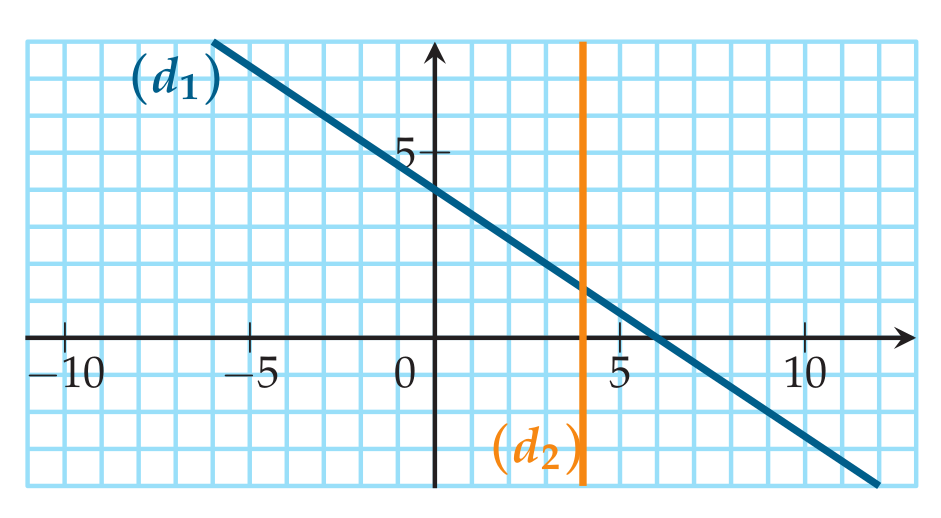
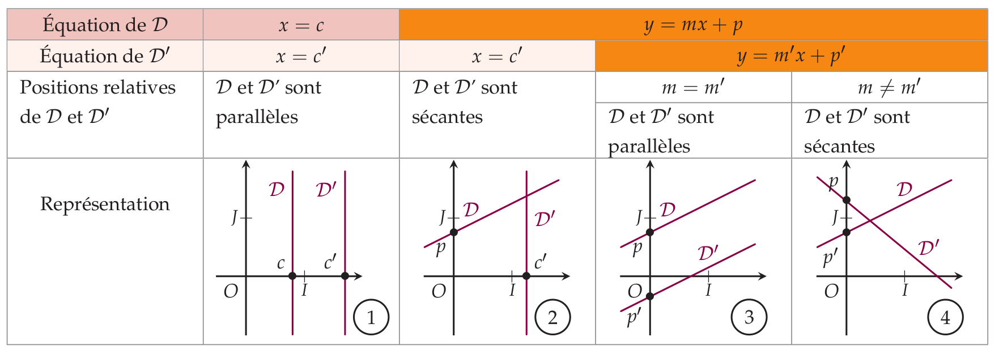

```css
```
```{=html}
<style>
:root {
  --def-color:   #2563eb;
  --prop-color:  #7c3aed;
  --theo-color:  #c026d3;
  --voc-color:   #0d9488;
  --rem-color:   #d97706;
  --ex-color:    #16a34a;
  --app-color:   #ea580c;
  --not-color:   #4f46e5;
  --meth-color:  #dc2626;
  --ill-color:   #475569;
}

.definition, .proposition, .theoreme, .vocabulaire, .remarque, .exemple, .application,
.notation, .methode, .illustration {
  margin: 1.5em 0;
  padding: 1em 1.3em 1em 1.3em;
  border-radius: 10px;
  border-left: 6px solid;
  box-shadow: 0 1px 4px rgba(0,0,0,0.08);
  font-family: "Georgia", serif;
}

.definition::before, .proposition::before, .theoreme::before, .vocabulaire::before,
.remarque::before, .exemple::before, .application::before,
.notation::before, .methode::before, .illustration::before {
  display: block;
  font-family: "Helvetica Neue", Arial, sans-serif;
  font-weight: 700;
  font-size: 0.95em;
  letter-spacing: 0.03em;
  text-transform: uppercase;
  margin-bottom: 0.6em;
}

.definition {
  background: #eff6ff;
  border-color: var(--def-color);
  color: #1e3a5f;
}
.definition::before {
  content: "📘  Définition";
  color: var(--def-color);
}

.proposition {
  background: #f5f3ff;
  border-color: var(--prop-color);
  color: #3b2467;
}
.proposition::before {
  content: "📐  Proposition";
  color: var(--prop-color);
}

.theoreme {
  background: #fdf4ff;
  border-color: var(--theo-color);
  color: #701a75;
}
.theoreme::before {
  content: "🏛️  Théorème";
  color: var(--theo-color);
}

.vocabulaire {
  background: #f0fdfa;
  border-color: var(--voc-color);
  color: #0f4c46;
}
.vocabulaire::before {
  content: "🏷️  Vocabulaire";
  color: var(--voc-color);
}

.remarque {
  background: #fffbeb;
  border-color: var(--rem-color);
  color: #6b4a06;
}
.remarque::before {
  content: "💡  Remarque";
  color: var(--rem-color);
}

.exemple {
  background: #f0fdf4;
  border-color: var(--ex-color);
  color: #14532d;
}
.exemple::before {
  content: "🔍  Exemple";
  color: var(--ex-color);
}

.application {
  background: #fff7ed;
  border: 2px dashed var(--app-color);
  border-left: 6px solid var(--app-color);
  color: #7c2d12;
}
.application::before {
  content: "✏️  Application";
  color: var(--app-color);
  font-size: 1.05em;
}

.notation {
  background: #eef2ff;
  border-color: var(--not-color);
  color: #312e81;
}
.notation::before {
  content: "🖊️  Notation";
  color: var(--not-color);
}

.methode {
  background: #fef2f2;
  border-color: var(--meth-color);
  color: #7f1d1d;
}
.methode::before {
  content: "🧭  Méthode";
  color: var(--meth-color);
}

.illustration {
  background: #f8fafc;
  border-color: var(--ill-color);
  color: #1e293b;
}
.illustration::before {
  content: "🖼️  Illustration";
  color: var(--ill-color);
}

/* Callouts "Solution" un peu plus stylés */
div.callout-caution {
  border-radius: 10px;
  box-shadow: 0 1px 4px rgba(0,0,0,0.08);
}
div.callout-caution .callout-title {
  font-family: "Helvetica Neue", Arial, sans-serif;
  font-weight: 700;
}
div.callout-caution .callout-title::before {
  content: "🔓  ";
}
</style>
```

# Équations de droites

## Équation réduite d'une droite

::: {.proposition}
Équation d'une droite\
On se place dans un repère $(O,I,J)$. Soit $(d)$ une droite dans ce repère.

-   Si $(d)$ est **parallèle à l'axe des ordonnées**, alors $(d)$ admet une équation de la forme $\boxed{x=c}$ où $c$ est un nombre réel.

-   Si $(d)$ **n'est pas parallèle à l'axe des ordonnées**, alors $(d)$ admet une équation de la forme $\boxed{y=mx+p}$ où $m$ et $p$ sont des nombres réels.
:::

::: {.definition}
Soit $(d)$ une droite non parallèle à l'axe des ordonnées.

-   L'équation de la forme $y=mx+p$ est appelée **équation réduite**.

-   Le point $B$ de coordonnées $(0;p)$ est l'intersection de la droite $(d)$ avec l'axe des ordonnées. $p$ est appelé **ordonnée à l'origine**.

-   $m$ est appelé le **coefficient directeur** de la droite $(d)$.
:::

## Équation cartésienne d'une droite

### Vecteur directeur d'une droite

::: {.definition}
Vecteur directeur\
Soient $A$ et $B$ deux points distincts d'une droite $(d)$. Le vecteur $\overrightarrow{AB}$ est appelé un **vecteur directeur** de $(d)$.
:::

::: {.proposition}
Tout vecteur $\overrightarrow{u}$ colinéaire à $\overrightarrow{AB}$ est également un vecteur directeur de $(d)$.
:::

### Équation cartésienne d'une droite

::: {.definition}
Soient $a,b,c$ trois réels (avec $a$ et $b$ non tous deux nuls). On appelle **équation cartésienne** d'une droite une équation de la forme : $$\boxed{ax + by + c = 0}$$
:::

::: {.proposition}
Le vecteur $\overrightarrow{u}\begin{pmatrix} -b \\ a \end{pmatrix}$ est un vecteur directeur de la droite d'équation cartésienne $$ax+by+c=0$$
:::

# Méthodologie

## Trouver l'équation réduite par le calcul

Lorsque l'on connaît les coordonnées $(x_1;y_1)$ et $(x_2;y_2)$ de deux points distincts $A$ et $B$ :

1.  Si $x_1=x_2$, la droite est verticale d'équation $x=x_1$.

2.  Si $x_1 \neq x_2$, l'équation est $y=mx+p$.

    -   On calcule $m = \dfrac{y_2-y_1}{x_2-x_1}$.

    -   On trouve $p$ en résolvant $y_1 = m x_1 + p$.

::: {.application}
Déterminer l'équation réduite de la droite $(AB)$ où $A(4;6)$ et $B(1;-2)$.
:::

## Lecture graphique

-   $p$ se lit à l'intersection avec l'axe $(Oy)$.

-   $m = \dfrac{\text{déplacement vertical}}{\text{déplacement horizontal}}$.

::: {.application}
Quelles sont les équations des droites $(d_1)$ et $(d_2)$ ?

{width="65%" fig-align="center"}
:::

## Déterminer une équation cartésienne

::: {.application}
Déterminer une équation cartésienne de la droite passant par $A(2;-1)$ et de vecteur directeur $\overrightarrow{u}\binom{-3}{2}$.\
:::

# Positions relatives et systèmes

{width="65%" fig-align="center"}

::: {.remarque}
Lorsque l'on veut étudier les positions relatives de deux droites d'équations $y=mx+p$ et $y=m'x+p'$ :

1.  On compare les deux équations de droites et on utilise le tableau pour conclure.

2.  Si les deux droites sont sécantes, et que l'on vous demande de déterminer le point d'intersection de ces deux droites: on résout le système à deux équations et deux inconnues: $$\left\{
          \begin{aligned}
    y&=mx+p \\
    y&=m'x+p'
          \end{aligned}
        \right.$$
:::

::: {.remarque}
Lors de la résolution d'un système de deux équations linéaires du premier degré à deux inconnues avec des coefficients non nuls, chaque équation peut se transformer en une équation réduite de droite. Résoudre un tel système revient à chercher les éventuels points d'intersection de deux droites à partir de leurs équations réduites. Ces deux droites peuvent être:

1.  sécantes (coefficients directeurs différents). Le système a une unique solution.

2.  confondues (même équation réduite). Le système a une infinité de solutions.

3.  strictement parallèles (même coefficient directeur, ordonnées à l'origine différentes). Le système n'a aucune solution.
:::

::: {.application}
Étudier et résoudre les systèmes suivants :

1\) $\begin{cases} 5x+2y=2 \\ 15x+6y=4 \end{cases}$\
2) $\begin{cases} 6x+2y=9 \\ 2x-y=-3 \end{cases}$\
3) $\begin{cases} 3x-6y=18 \\ x-2y=6 \end{cases}$
:::

::: {.application}
Intersection des droites : $-2x+y+3=0$ et $3x-5y-2=0$.
:::
