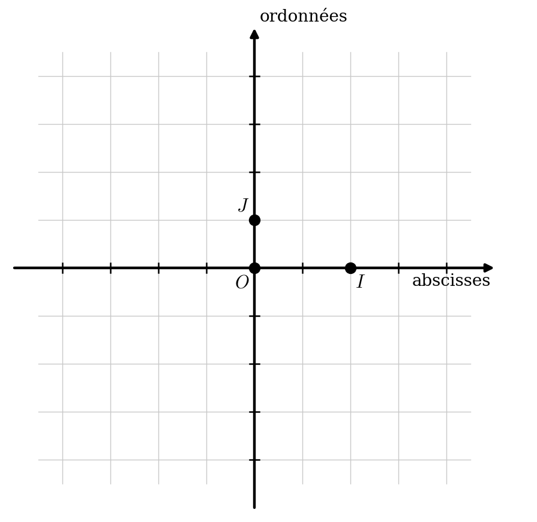
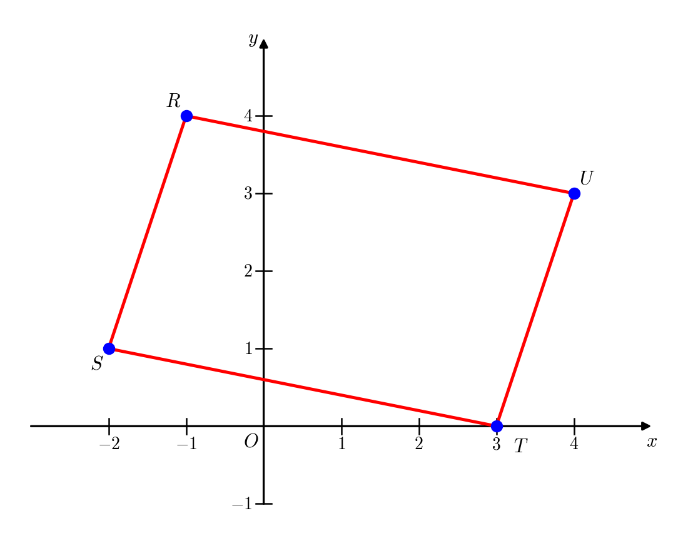
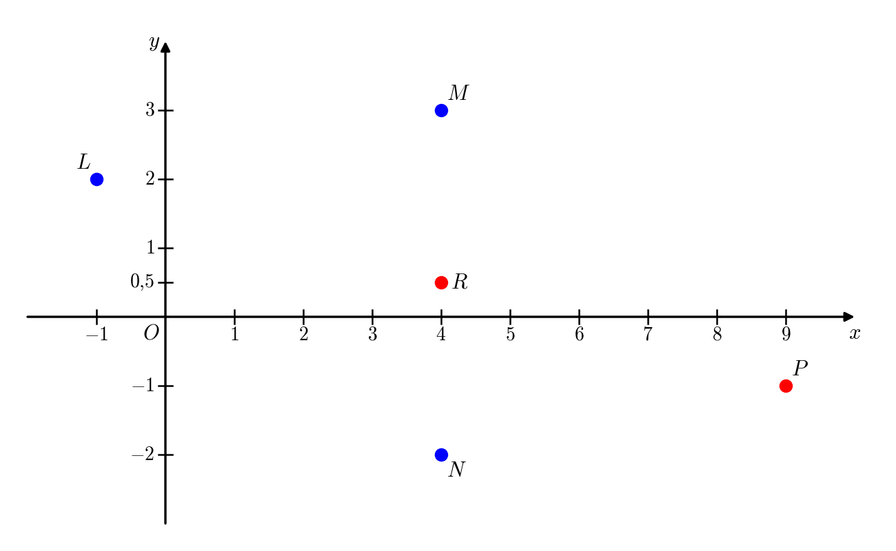
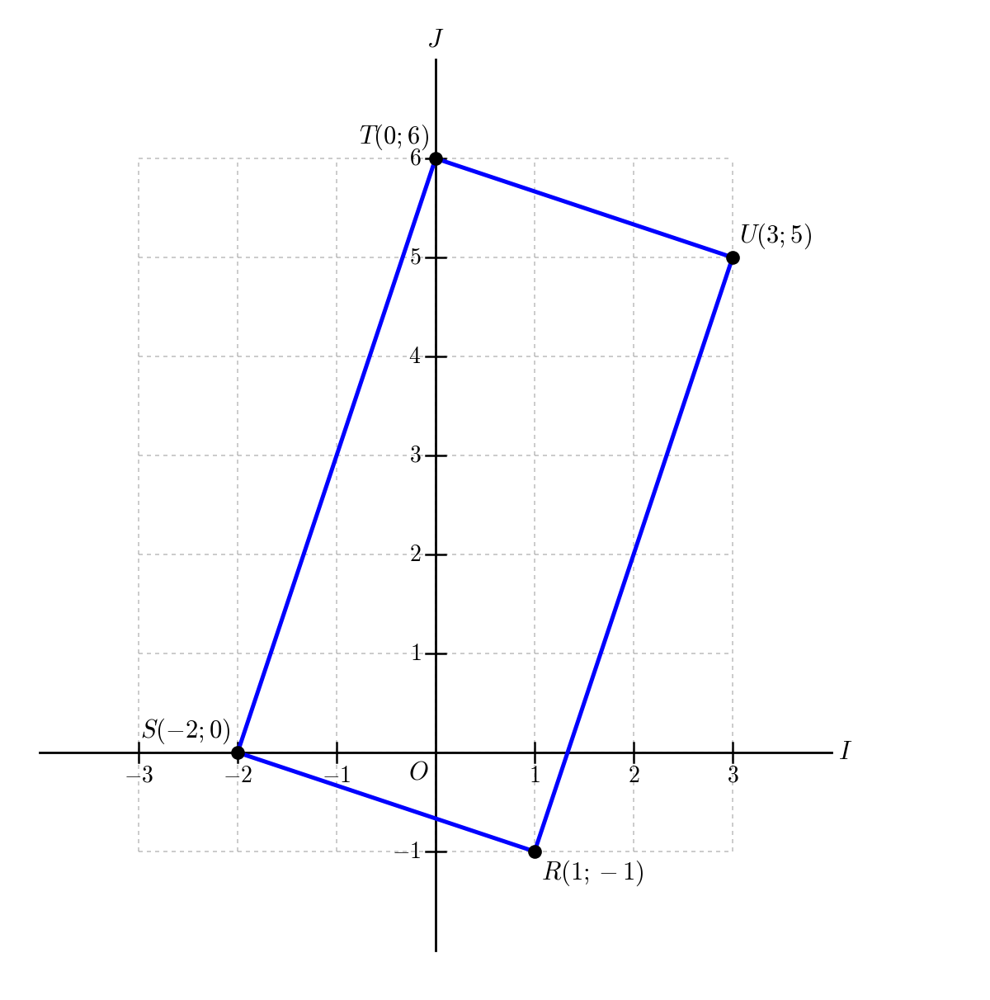

```css
```
```{=html}
<style>
:root {
  --def-color:   #2563eb;
  --prop-color:  #7c3aed;
  --voc-color:   #0d9488;
  --rem-color:   #d97706;
  --ex-color:    #16a34a;
  --app-color:   #ea580c;
  --not-color:   #4f46e5;
  --meth-color:  #dc2626;
  --ill-color:   #475569;
}

.definition, .proposition, .vocabulaire, .remarque, .exemple, .application,
.notation, .methode, .illustration {
  margin: 1.5em 0;
  padding: 1em 1.3em 1em 1.3em;
  border-radius: 10px;
  border-left: 6px solid;
  box-shadow: 0 1px 4px rgba(0,0,0,0.08);
  font-family: "Georgia", serif;
}

.definition::before, .proposition::before, .vocabulaire::before,
.remarque::before, .exemple::before, .application::before,
.notation::before, .methode::before, .illustration::before {
  display: block;
  font-family: "Helvetica Neue", Arial, sans-serif;
  font-weight: 700;
  font-size: 0.95em;
  letter-spacing: 0.03em;
  text-transform: uppercase;
  margin-bottom: 0.6em;
}

.definition {
  background: #eff6ff;
  border-color: var(--def-color);
  color: #1e3a5f;
}
.definition::before {
  content: "📘  Définition";
  color: var(--def-color);
}

.proposition {
  background: #f5f3ff;
  border-color: var(--prop-color);
  color: #3b2467;
}
.proposition::before {
  content: "📐  Proposition";
  color: var(--prop-color);
}

.vocabulaire {
  background: #f0fdfa;
  border-color: var(--voc-color);
  color: #0f4c46;
}
.vocabulaire::before {
  content: "🏷️  Vocabulaire";
  color: var(--voc-color);
}

.remarque {
  background: #fffbeb;
  border-color: var(--rem-color);
  color: #6b4a06;
}
.remarque::before {
  content: "💡  Remarque";
  color: var(--rem-color);
}

.exemple {
  background: #f0fdf4;
  border-color: var(--ex-color);
  color: #14532d;
}
.exemple::before {
  content: "🔍  Exemple";
  color: var(--ex-color);
}

.application {
  background: #fff7ed;
  border: 2px dashed var(--app-color);
  border-left: 6px solid var(--app-color);
  color: #7c2d12;
}
.application::before {
  content: "✏️  Application";
  color: var(--app-color);
  font-size: 1.05em;
}

.notation {
  background: #eef2ff;
  border-color: var(--not-color);
  color: #312e81;
}
.notation::before {
  content: "🖊️  Notation";
  color: var(--not-color);
}

.methode {
  background: #fef2f2;
  border-color: var(--meth-color);
  color: #7f1d1d;
}
.methode::before {
  content: "🧭  Méthode";
  color: var(--meth-color);
}

.illustration {
  background: #f8fafc;
  border-color: var(--ill-color);
  color: #1e293b;
}
.illustration::before {
  content: "🖼️  Illustration";
  color: var(--ill-color);
}

/* Callouts "Solution" un peu plus stylés */
div.callout-caution {
  border-radius: 10px;
  box-shadow: 0 1px 4px rgba(0,0,0,0.08);
}
div.callout-caution .callout-title {
  font-family: "Helvetica Neue", Arial, sans-serif;
  font-weight: 700;
}
div.callout-caution .callout-title::before {
  content: "🔓  ";
}
</style>
```

\gdef\R{\mathbb{R}}

\gdef\N{\mathbb{N}}

# Généralités

## Coordonnées d'un point dans un repère

Pour repérer un point dans le plan, on définit un repère et on indique les coordonnées de ce point dans le repère.

:::::: {.columns}

::::: {.column width="50%"}

:::: {.definition}
Définir un repère, c'est donner trois points $O$, $I$ et $J$ non alignés dans un ordre précis.

On note alors $(O,I,J)$ ce repère.

- Le point $O$ est appelé l'origine du repère.
- La droite $(OI)$ est l'axe des abscisses orienté de $O$ vers $I$.

  La longueur du segment $[OI]$ indique l'unité sur cet axe.
- La droite $(OJ)$ est l'axe des ordonnées orienté de $O$ vers $J$.

  La longueur du segment $[OJ]$ indique l'unité sur cet axe.
::::

:::::

::::: {.column width="50%"}

:::: {.illustration}
{fig-alt="Un repère (O, I, J) sur un quadrillage, avec les axes des abscisses et des ordonnées" fig-align="center"}
::::

:::::

::::::

::: {.remarque}
Pour repérer un point, on indique en premier son abscisse puis son ordonnée.
:::

::: {.exemple}
Placer, dans le repère précédent, le point $M(2;3)$.
:::

::: {.remarque}
Dans tout repère $(O,I,J)$ les coordonnées de $O$, $I$ et $J$ sont :

$$
O(0;0) \qquad\qquad I(1;0) \qquad\qquad J(0;1)
$$
:::

## Différents types de repères

::: {.definition}
- Si le triangle $OIJ$ est rectangle en $O$, le repère $(O,I,J)$ est dit orthogonal.
- Si le triangle $OIJ$ est isocèle en $O$, le repère $(O,I,J)$ est dit normé.
- Si le triangle $OIJ$ est isocèle et rectangle en $O$, le repère $(O,I,J)$ est dit orthonormé.
:::

# Coordonnées du milieu d'un segment

::: {.proposition}
Dans le plan muni d'un repère, on note $(x_A;y_A)$ et $(x_B;y_B)$ les coordonnées des points $A$ et $B$.

Les coordonnées du milieu $I$ du segment $[AB]$ sont données par la formule :

$$
\boxed{I\left(\dfrac{x_A+x_B}{2};\dfrac{y_A+y_B}{2}\right)}
$$
:::

::: {.remarque}
Cette formule est valable dans n'importe quel type de repère.
:::

::: {.application}
Dans un repère $(O,I,J)$, on donne les points de coordonnées suivants :

$$
R(-1;4) \qquad S(-2;1) \qquad T(3;0) \quad\text{et}\quad U(4;3)
$$

1. Placer les points dans un repère $(O;I;J)$.
2. Calculer les coordonnées du milieu $M$ du segment $[RT]$ puis de $N$, milieu du segment $[SU]$.
3. Conclure sur la nature du quadrilatère $RSTU$.
:::

:::{.callout-caution collapse="true"}
## Solution

**1.**

{fig-alt="Les points R, S, T et U dans un repère et le quadrilatère RSTU" fig-align="center" width="60%"}

**2.**

$M\left(\dfrac{-1+3}{2};\dfrac{4+0}{2}\right)$ donc $M(1;2)$ et $N\left(\dfrac{-2+4}{2};\dfrac{1+3}{2}\right)$ donc $N(1;2)$.

**3.**

Les points $M$ et $N$ sont confondus, donc les diagonales de $RSTU$ se coupent en leur milieu donc $RSTU$ est un parallélogramme.
:::

::: {.application}
Dans un repère $(O,I,J)$, on donne les points de coordonnées suivants :

$$
L(-1;2) \qquad M(4;3) \qquad N(4;-2)
$$

1. Placer les points dans un repère $(O;I;J)$.
2. Déterminer les coordonnées du point $P$ afin que le quadrilatère $LMPN$ soit un parallélogramme.
:::

:::{.callout-caution collapse="true"}
## Solution

{fig-alt="Les points L, M, N, le milieu R de [MN] et le point P dans un repère" fig-align="center" width="70%"}

On note $R$ le milieu du segment $[MN]$. Ainsi $R\left(\dfrac{4+4}{2};\dfrac{3-2}{2}\right)$ donc $R\left(4;\dfrac{1}{2}\right)$.

On note $P(x_P;y_P)$ les coordonnées du point $P$.

Pour que $LMPN$ soit un parallélogramme, il faut que ses diagonales $[MN]$ et $[PL]$ se coupent en leur milieu. Il faut donc que $R$ soit le milieu de $[LP]$. Exprimons les coordonnées du milieu de $[LP]$ en fonction des coordonnées de $P$ :

$R\left(\dfrac{-1+x_P}{2};\dfrac{2+y_P}{2}\right)$. Il faut donc $\dfrac{-1+x_P}{2}=4$ et $\dfrac{2+y_P}{2}=\dfrac{1}{2}$, c'est-à-dire $x_P=9$ et $y_P=-1$.

Finalement $P(9;-1)$.
:::

::: {.remarque}
L'application précédente permet également d'illustrer la méthode pour déterminer les coordonnées du symétrique d'un point par rapport à un autre : ici, $P$ est le symétrique de $L$ par rapport à $R$.
:::

# Distance entre deux points

::: {.proposition}
Dans le plan muni d'un repère **orthonormé**, on note $(x_A;y_A)$ et $(x_B;y_B)$ les coordonnées des points $A$ et $B$.

Le carré de la distance entre les points $A$ et $B$ est donné par la formule :

$$
\boxed{AB^2=(x_B-x_A)^2+(y_B-y_A)^2}
$$
:::

::: {.application}
Dans un repère $(O;I;J)$ orthonormé, on donne les points de coordonnées :

$$
R(1;-1) \qquad S(-2;0) \qquad T(0;6) \quad\text{et}\quad U(3;5)
$$

1. Placer les points dans un repère $(O;I;J)$.
2. Calculer les coordonnées du milieu des segments $[RT]$ et $[SU]$.
3. Calculer les longueurs $RT$ et $SU$.
4. Conclure sur la nature du quadrilatère $RSTU$.
:::

:::{.callout-caution collapse="true"}
## Solution

**1.**

{fig-alt="Les points R, S, T et U dans un repère orthonormé et le quadrilatère RSTU" fig-align="center" width="50%"}

**2.**

On note $M$ le milieu de $[RT]$. $M\left(\dfrac{1+0}{2};\dfrac{-1+6}{2}\right)$ donc $M\left(\dfrac{1}{2};\dfrac{5}{2}\right)$.

On note $N$ le milieu de $[SU]$. $N\left(\dfrac{-2+3}{2};\dfrac{0+5}{2}\right)$ donc $N\left(\dfrac{1}{2};\dfrac{5}{2}\right)$.

**3.**

Le repère $(O;I,J)$ est orthonormé, on peut donc utiliser la formule de la distance :

$$
\begin{align*}
RT^2&=(0-1)^2+(6+1)^2=1^2+7^2=1+49=50 &&\text{donc } RT=\sqrt{50}=5\sqrt{2} \\
SU^2&=(3+2)^2+(5-0)^2=5^2+5^2=25+25=50 &&\text{donc } SU=\sqrt{50}=5\sqrt{2}
\end{align*}
$$

**4.**

Les points $M$ et $N$ sont confondus, donc les diagonales $[RT]$ et $[SU]$ du quadrilatère $RSTU$ se coupent en leur milieu donc $RSTU$ est un parallélogramme.

De plus $SU=RT$ donc les diagonales du parallélogramme $RSTU$ sont de même longueur, donc $RSTU$ est un rectangle.
:::

# Exercices

| Thème                      | Exercices                          |
|----------------------------|------------------------------------|
| Milieu d'un segment        | 9 page 121 ; 32 et 36 page 123     |
| Distance entre deux points | 33, 34 et 35 page 123              |
| Nature d'une figure        | 54, 56, 58, 61, 62 et 63 page 125  |
| Problèmes                  | 86, 87, 88 et 97 pages 128 et 129  |
