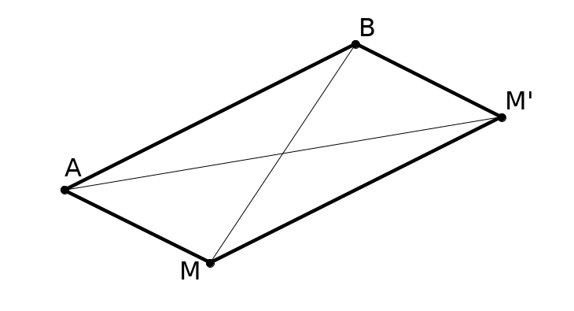
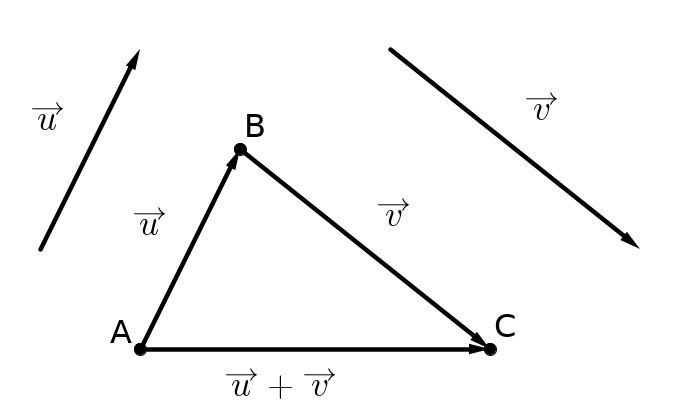
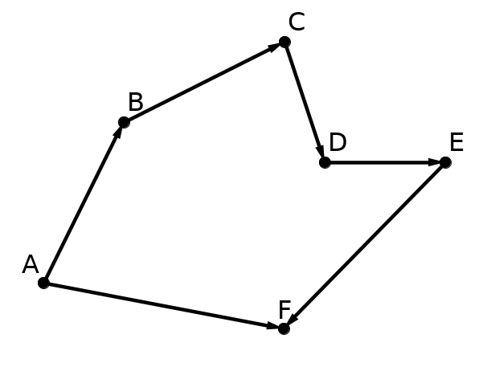
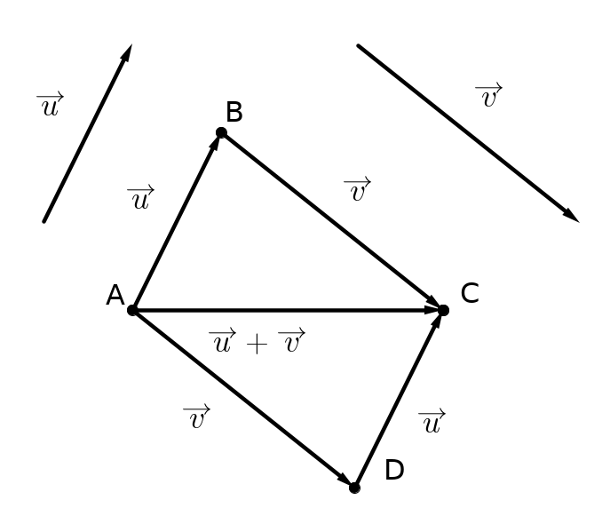
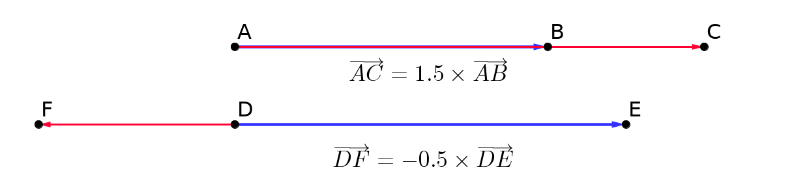
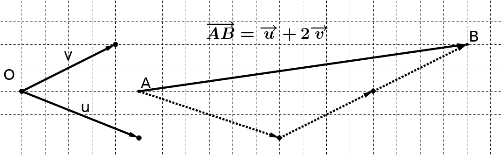

```css
```
```{=html}
<style>
:root {
  --def-color:   #2563eb;
  --prop-color:  #7c3aed;
  --theo-color:  #c026d3;
  --voc-color:   #0d9488;
  --rem-color:   #d97706;
  --ex-color:    #16a34a;
  --app-color:   #ea580c;
  --not-color:   #4f46e5;
  --meth-color:  #dc2626;
  --ill-color:   #475569;
}

.definition, .proposition, .theoreme, .vocabulaire, .remarque, .exemple, .application,
.notation, .methode, .illustration {
  margin: 1.5em 0;
  padding: 1em 1.3em 1em 1.3em;
  border-radius: 10px;
  border-left: 6px solid;
  box-shadow: 0 1px 4px rgba(0,0,0,0.08);
  font-family: "Georgia", serif;
}

.definition::before, .proposition::before, .theoreme::before, .vocabulaire::before,
.remarque::before, .exemple::before, .application::before,
.notation::before, .methode::before, .illustration::before {
  display: block;
  font-family: "Helvetica Neue", Arial, sans-serif;
  font-weight: 700;
  font-size: 0.95em;
  letter-spacing: 0.03em;
  text-transform: uppercase;
  margin-bottom: 0.6em;
}

.definition {
  background: #eff6ff;
  border-color: var(--def-color);
  color: #1e3a5f;
}
.definition::before {
  content: "📘  Définition";
  color: var(--def-color);
}

.proposition {
  background: #f5f3ff;
  border-color: var(--prop-color);
  color: #3b2467;
}
.proposition::before {
  content: "📐  Proposition";
  color: var(--prop-color);
}

.theoreme {
  background: #fdf4ff;
  border-color: var(--theo-color);
  color: #701a75;
}
.theoreme::before {
  content: "🏛️  Théorème";
  color: var(--theo-color);
}

.vocabulaire {
  background: #f0fdfa;
  border-color: var(--voc-color);
  color: #0f4c46;
}
.vocabulaire::before {
  content: "🏷️  Vocabulaire";
  color: var(--voc-color);
}

.remarque {
  background: #fffbeb;
  border-color: var(--rem-color);
  color: #6b4a06;
}
.remarque::before {
  content: "💡  Remarque";
  color: var(--rem-color);
}

.exemple {
  background: #f0fdf4;
  border-color: var(--ex-color);
  color: #14532d;
}
.exemple::before {
  content: "🔍  Exemple";
  color: var(--ex-color);
}

.application {
  background: #fff7ed;
  border: 2px dashed var(--app-color);
  border-left: 6px solid var(--app-color);
  color: #7c2d12;
}
.application::before {
  content: "✏️  Application";
  color: var(--app-color);
  font-size: 1.05em;
}

.notation {
  background: #eef2ff;
  border-color: var(--not-color);
  color: #312e81;
}
.notation::before {
  content: "🖊️  Notation";
  color: var(--not-color);
}

.methode {
  background: #fef2f2;
  border-color: var(--meth-color);
  color: #7f1d1d;
}
.methode::before {
  content: "🧭  Méthode";
  color: var(--meth-color);
}

.illustration {
  background: #f8fafc;
  border-color: var(--ill-color);
  color: #1e293b;
}
.illustration::before {
  content: "🖼️  Illustration";
  color: var(--ill-color);
}

/* Callouts "Solution" un peu plus stylés */
div.callout-caution {
  border-radius: 10px;
  box-shadow: 0 1px 4px rgba(0,0,0,0.08);
}
div.callout-caution .callout-title {
  font-family: "Helvetica Neue", Arial, sans-serif;
  font-weight: 700;
}
div.callout-caution .callout-title::before {
  content: "🔓  ";
}
</style>
```

# Définitions

::: {.definition}
Translation

Soient $A$ et $B$ deux points du plan.

La translation qui transforme $A$ en $B$ associe à chaque point $M$ du plan l'unique point $M'$ tel que $ABM'M$ est un parallélogramme.
:::

::: {.illustration}
{width="65%" fig-align="center"}
:::

::: {.definition}
Vecteur

On dit alors que les points $A$ et $B$ (pris dans cet ordre) et que les points $M$ et $M'$ (pris dans cet ordre) représentent le même vecteur $\overrightarrow{u}$. On note:

$\overrightarrow{u}=\overrightarrow{AB}=\overrightarrow{MM'}$

Finalement, un vecteur $\overrightarrow{AB}$ est caractérisé par:

-   sa direction: celle de la droite $(AB)$;

-   son sens : celui de $A$ vers $B$ ;

-   sa norme, notée $||\overrightarrow{AB}||$ : la longueur $AB$.
:::

::: {.remarque}
En suivant les mêmes notations de l'illustration précédente, on dira que $M'$ est l'image de $M$ par la translation de vecteur $\overrightarrow{AB}$
:::

# Égalité de deux vecteurs

::: {.definition}
Deux vecteurs $\overrightarrow{AB}$ et $\overrightarrow{CD}$ sont égaux lorsque $D$ est l'image de $C$ par la translation de vecteur $\overrightarrow{AB}$. Cela signifie que:

-   $\overrightarrow{AB}$ et $\overrightarrow{CD}$ ont la même direction, le même sens et la même norme.

-   Le quadrilatère $ABDC$ est un parallélogramme.
:::

::: {.remarque}
1.  L'égalité $AB=CD$ (égalité de longueur) ne suffit pas pour avoir $\overrightarrow{AB}=\overrightarrow{CD}$.

2.  Que dire du vecteur $\overrightarrow{AA}$ ou $\overrightarrow{BB}$?

    C'est le vecteur nul, noté $\overrightarrow{0}$. Il n'a pas de direction (donc pas de sens) et sa longueur est nulle.

3.  Que dire des vecteurs $\overrightarrow{AB}$ et $\overrightarrow{BA}$?

    Ils ont même direction, même norme et des sens contraires. On dit qu'ils sont opposés et on note $\overrightarrow{BA}=-\overrightarrow{AB}$
:::

::: {.remarque}
Un vecteur peut exister sans qu'on lui associe de point particulier. Dans ce cas on le note avec une lettre minuscule surmontée d'une flèche. Par exemple, le vecteur $\overrightarrow{u}$.
:::

::: {.definition}
Si $\overrightarrow{AB}=\overrightarrow{u}$ on dit que $\overrightarrow{AB}$ est un représentant de $\overrightarrow{u}$ d'origine $A$.
:::

# Somme de deux vecteurs

::: {.definition}
La somme de deux vecteurs $\overrightarrow{u}$ et $\overrightarrow{v}$ est le vecteur $\overrightarrow{s}$ résultant de l'enchaînement de la translation de vecteur $\overrightarrow{u}$ suivie de la translation de vecteur $\overrightarrow{v}$.

On note:

$\overrightarrow{s}=\overrightarrow{u}+\overrightarrow{v}$
:::

::: {.illustration}
{width="55%" fig-align="center"}
:::

::: {.remarque}
Si l'image de $A$ par la translation de vecteur $\overrightarrow{u}$ est $B$, et si l'image de $B$ par la translation de vecteur $\overrightarrow{v}$ est $C$, alors $C$ est l'image de $A$ par la translation de vecteur $\overrightarrow{s}=\overrightarrow{u}+\overrightarrow{v}$.
:::

::: {.proposition}
Relation de Chasles

Soient $A$, $B$ et $C$ trois points du plan. On a alors:

$\overrightarrow{AB}+\overrightarrow{BC}=\overrightarrow{AC}$
:::

::: {.remarque}
La relation de Chasles peut s'étendre à plus de deux points\
Ci-contre, on a l'égalité:

$\overrightarrow{AF}=\overrightarrow{AB}+\overrightarrow{BC}+\overrightarrow{CD}+\overrightarrow{DE}+\overrightarrow{EF}$
:::

::: {.illustration}
{width="55%" fig-align="center"}
:::

::: {.proposition}
Soient $A$, $B$ et $D$ trois points tels que $\overrightarrow{AB}=\overrightarrow{u}$ et $\overrightarrow{AD}=\overrightarrow{v}$.

Le point $C$ tel que $\overrightarrow{AC}=\overrightarrow{u}+\overrightarrow{v}$ est le quatrième sommet du parallélogramme $ABCD$.
:::

::: {.remarque}
1.  La première propriété permet de construire la somme de deux vecteurs en les mettant "bout-à-bout".

2.  La deuxième propriété permet de construire la somme de deux vecteurs de même origine.
:::

::: {.illustration}
{width="45%" fig-align="center"}
:::

::: {.definition}
Vecteurs opposés, soustraction de deux vecteurs

On rappelle que deux vecteurs opposés ont même direction, même longueur et sens opposé. On note $\overrightarrow{AB}=-\overrightarrow{BA}$.

Soustraire un vecteur à un autre, c'est additionner son opposé. C'est ainsi que l'on définit une soustraction de vecteurs.

$\overrightarrow{u}-\overrightarrow{v}=\overrightarrow{u}+(-\overrightarrow{v})$
:::

# Multiplication d'un vecteur par un réel

::: {.definition}
Soient $A$ et $B$ deux points distincts du plan et $k$ un nombre réel non nul.

Si $\overrightarrow{AC}=k\overrightarrow{AB}$, alors $C$ est le point de la droite $(AB)$ tel que:

1.  Si $k>0$, $AC=k\times AB$ et les points $B$ et $C$ sont du même côté de $A$.

2.  Si $k<0$, $AC=(-k)\times AB$ et les points $B$ et $C$ sont de part et d'autre de $A$.
:::

::: {.illustration}
{width="65%" fig-align="center"}
:::

::: {.remarque}
Autrement dit:

1.  Si $k>0$, alors $\overrightarrow{AB}$ et $\overrightarrow{AC}$ ont même direction, même sens et $AC=k \times AB$

2.  Si $k<0$, alors $\overrightarrow{AB}$ et $\overrightarrow{AC}$ ont même direction, sens opposés et $AC=(-k)\times AB$.
:::

::: {.remarque}
Par convention, $0\overrightarrow{u}=\overrightarrow{0}$ et $k\overrightarrow{0}=\overrightarrow{0}$

On a ainsi $k\overrightarrow{u}=\overrightarrow{0}$ ssi $k=0$ ou $\overrightarrow{u}=\overrightarrow{0}$
:::

::: {.remarque}
Milieu d'un segment\
Soit $M$ le milieu du segment $[AB]$. Cela signifie (par exemple) que :

-   $\overrightarrow{AM}=\overrightarrow{MB}$

-   $\overrightarrow{AB}=2\overrightarrow{AM}=2\overrightarrow{MB}$

-   $\overrightarrow{AM}=\dfrac{1}{2}\overrightarrow{AB}$
:::

# Vecteurs colinéaires

::: {.definition}
Deux vecteurs sont dits colinéaires lorsqu'ils ont la même direction.
:::

::: {.remarque}
Cela signifie que les vecteurs $\overrightarrow{AB}$ et $\overrightarrow{CD}$ sont colinéaires lorsque les droites $(AB)$ et $(CD)$ sont parallèles.
:::

::: {.definition}
On peut également définir la colinéarité de deux vecteurs en utilisant la multiplication par un réel:\
deux vecteurs non nuls $\overrightarrow{u}$ et $\overrightarrow{v}$ sont dits colinéaires si l'un d'eux est le produit de l'autre par un réel. C'est-à-dire qu'il existe un réel $k$ tel que $\overrightarrow{u}=k\overrightarrow{v}$.
:::

::: {.proposition}
Parallélisme et alignement

-   $(AB)\parallel (CD)$ si et seulement s'il existe un réel $k$ tel que $\overrightarrow{AB}=k\overrightarrow{CD}$ (c'est-à-dire ssi $\overrightarrow{AB}$ et $\overrightarrow{CD}$ sont colinéaires).

-   Les points $A,B$ et $C$ sont alignés si et seulement s'il existe un réel $k$ tel que $\overrightarrow{AB}=k\overrightarrow{AC}$ (c'est-à-dire ssi $\overrightarrow{AB}$ et $\overrightarrow{AC}$ sont colinéaires).
:::

# Repères vectoriels

À l'aide d'un point et de deux vecteurs ($\overrightarrow{u}$ et $\overrightarrow{v}$ par exemple) non colinéaires, il est possible de définir un repère. Ce repère permet d'exprimer n'importe quel vecteur du plan à l'aide des vecteurs $\overrightarrow{u}$ et $\overrightarrow{v}$.

::: {.illustration}
{width="65%" fig-align="center"}
:::

::: {.definition}
Soit un repère $(O;\overrightarrow{i},\overrightarrow{j})$

-   $(O;\overrightarrow{i},\overrightarrow{j})$ est un repère orthogonal lorsque les directions des vecteurs $\overrightarrow{i}$ et $\overrightarrow{j}$ sont orthogonales (perpendiculaires).

-   $(O;\overrightarrow{i},\overrightarrow{j})$ est un repère orthonormé lorsque les directions des vecteurs $\overrightarrow{i}$ et $\overrightarrow{j}$ sont orthogonales et que leurs normes sont égales à 1 : $||\overrightarrow{i}||=||\overrightarrow{j}||=1$.
:::
