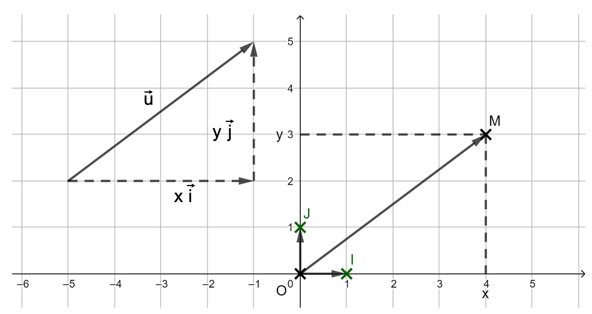
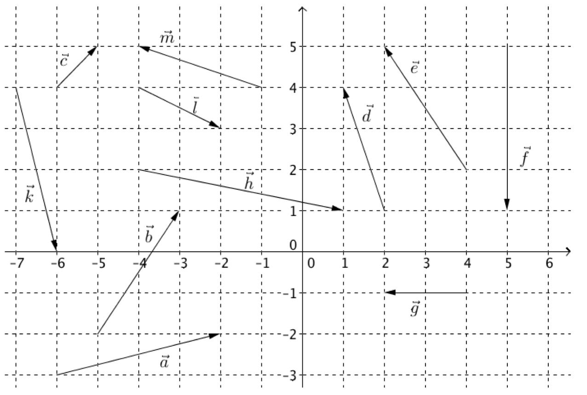
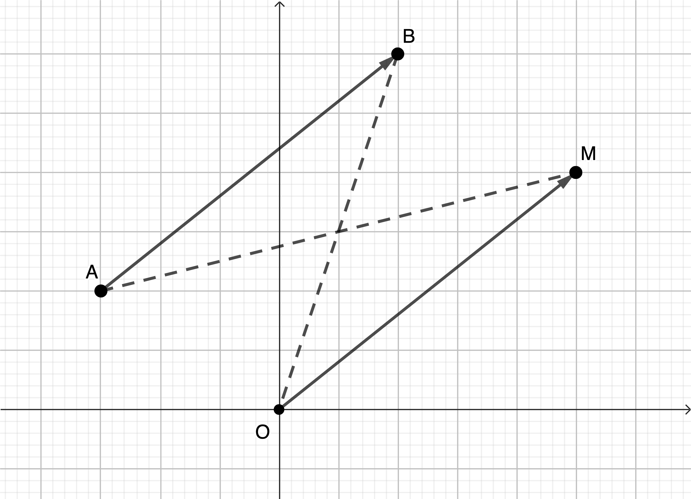

```css
```
```{=html}
<style>
:root {
  --def-color:   #2563eb;
  --prop-color:  #7c3aed;
  --theo-color:  #c026d3;
  --voc-color:   #0d9488;
  --rem-color:   #d97706;
  --ex-color:    #16a34a;
  --app-color:   #ea580c;
  --not-color:   #4f46e5;
  --meth-color:  #dc2626;
  --ill-color:   #475569;
}

.definition, .proposition, .theoreme, .vocabulaire, .remarque, .exemple, .application,
.notation, .methode, .illustration {
  margin: 1.5em 0;
  padding: 1em 1.3em 1em 1.3em;
  border-radius: 10px;
  border-left: 6px solid;
  box-shadow: 0 1px 4px rgba(0,0,0,0.08);
  font-family: "Georgia", serif;
}

.definition::before, .proposition::before, .theoreme::before, .vocabulaire::before,
.remarque::before, .exemple::before, .application::before,
.notation::before, .methode::before, .illustration::before {
  display: block;
  font-family: "Helvetica Neue", Arial, sans-serif;
  font-weight: 700;
  font-size: 0.95em;
  letter-spacing: 0.03em;
  text-transform: uppercase;
  margin-bottom: 0.6em;
}

.definition {
  background: #eff6ff;
  border-color: var(--def-color);
  color: #1e3a5f;
}
.definition::before {
  content: "📘  Définition";
  color: var(--def-color);
}

.proposition {
  background: #f5f3ff;
  border-color: var(--prop-color);
  color: #3b2467;
}
.proposition::before {
  content: "📐  Proposition";
  color: var(--prop-color);
}

.theoreme {
  background: #fdf4ff;
  border-color: var(--theo-color);
  color: #701a75;
}
.theoreme::before {
  content: "🏛️  Théorème";
  color: var(--theo-color);
}

.vocabulaire {
  background: #f0fdfa;
  border-color: var(--voc-color);
  color: #0f4c46;
}
.vocabulaire::before {
  content: "🏷️  Vocabulaire";
  color: var(--voc-color);
}

.remarque {
  background: #fffbeb;
  border-color: var(--rem-color);
  color: #6b4a06;
}
.remarque::before {
  content: "💡  Remarque";
  color: var(--rem-color);
}

.exemple {
  background: #f0fdf4;
  border-color: var(--ex-color);
  color: #14532d;
}
.exemple::before {
  content: "🔍  Exemple";
  color: var(--ex-color);
}

.application {
  background: #fff7ed;
  border: 2px dashed var(--app-color);
  border-left: 6px solid var(--app-color);
  color: #7c2d12;
}
.application::before {
  content: "✏️  Application";
  color: var(--app-color);
  font-size: 1.05em;
}

.notation {
  background: #eef2ff;
  border-color: var(--not-color);
  color: #312e81;
}
.notation::before {
  content: "🖊️  Notation";
  color: var(--not-color);
}

.methode {
  background: #fef2f2;
  border-color: var(--meth-color);
  color: #7f1d1d;
}
.methode::before {
  content: "🧭  Méthode";
  color: var(--meth-color);
}

.illustration {
  background: #f8fafc;
  border-color: var(--ill-color);
  color: #1e293b;
}
.illustration::before {
  content: "🖼️  Illustration";
  color: var(--ill-color);
}

/* Callouts "Solution" un peu plus stylés */
div.callout-caution {
  border-radius: 10px;
  box-shadow: 0 1px 4px rgba(0,0,0,0.08);
}
div.callout-caution .callout-title {
  font-family: "Helvetica Neue", Arial, sans-serif;
  font-weight: 700;
}
div.callout-caution .callout-title::before {
  content: "🔓  ";
}
</style>
```

# Repère orthonormé

::: {.definition}
Un repère du plan, défini par trois points non alignés $O, I, J$ est orthonormé lorsque le triangle $OIJ$ est isocèle rectangle en $O$.\
Le point $O$ est l'origine du repère, la droite $(OI)$ est l'axe des abscisses et la droite $(OJ)$ est l'axe des ordonnées. On a $OI=OJ=1$ unité.
:::

Le repère se note $(O;I,J)$ ou $(O; \overrightarrow{OI}, \overrightarrow{OJ})$.\
En posant $\overrightarrow{OI}=\overrightarrow{i}$ et $\overrightarrow{OJ}=\overrightarrow{j}$, le repère $(O;I,J)$ peut aussi s'écrire $(O;\overrightarrow{i},\overrightarrow{j})$.\
Dans un repère, tout point $M$ est repéré par un unique couple de nombres réels $(x_M;y_M)$ appelé coordonnées du point $M$. On écrit $M(x_M;y_M)$. $x_M$ est l'abscisse de $M$ et $y_M$ est l'ordonnée de $M$.

# Coordonnées d'un vecteur

::: {.proposition}
-   Pour tout point $M(x_M;y_M)$ dans un repère $(O;\overrightarrow{i};\overrightarrow{j})$, on a $\overrightarrow{OM}=x_M\overrightarrow{i}+y_M\overrightarrow{j}$.\
    On dit que le vecteur $\overrightarrow{OM}$ a pour coordonnées $\begin{pmatrix}
    x_M \\
    y_M
    \end{pmatrix}$ dans la base $(\overrightarrow{i}; \overrightarrow{j})$.

-   Pour tout vecteur $\overrightarrow{u}$ dans un repère $(O;\overrightarrow{i};\overrightarrow{j})$, il existe un unique couple de réels $(x;y)$ tel que $\overrightarrow{u}=x\overrightarrow{i}+y\overrightarrow{j}$.\
    On dit que le vecteur $\overrightarrow{u}$ a pour coordonnées $\begin{pmatrix}
    x \\
    y
    \end{pmatrix}$ dans la base $(\overrightarrow{i}; \overrightarrow{j})$.
:::

::: {.illustration}
{width="65%" fig-align="center"}
:::

::: {.application}
Lire les coordonnées des vecteurs.

{width="55%" fig-align="center"}
:::

::: {.callout-caution collapse="true"}
## Solution

$\overrightarrow{a}\begin{pmatrix}
4 \\
1
\end{pmatrix}$ ; $\overrightarrow{b}\begin{pmatrix}
2 \\
3
\end{pmatrix}$ ; $\overrightarrow{c}\begin{pmatrix}
1 \\
1
\end{pmatrix}$\
$\overrightarrow{d}\begin{pmatrix}
-1 \\
3
\end{pmatrix}$ ; $\overrightarrow{e}\begin{pmatrix}
-2 \\
3
\end{pmatrix}$ ; $\overrightarrow{f}\begin{pmatrix}
0 \\
-4
\end{pmatrix}$ ; $\overrightarrow{g}\begin{pmatrix}
-2 \\
0
\end{pmatrix}$\
$\overrightarrow{h}\begin{pmatrix}
5 \\
-1
\end{pmatrix}$ ; $\overrightarrow{k}\begin{pmatrix}
1 \\
-4
\end{pmatrix}$ ; $\overrightarrow{l}\begin{pmatrix}
2 \\
-1
\end{pmatrix}$ ; $\overrightarrow{m}\begin{pmatrix}
-3 \\
1
\end{pmatrix}$
:::

::: {.proposition}
Soient $\overrightarrow{u}\begin{pmatrix}
x \\
y
\end{pmatrix}$ et $\overrightarrow{v}\begin{pmatrix}
x' \\
y'
\end{pmatrix}$ deux vecteurs dans un repère $(O;\overrightarrow{i};\overrightarrow{j})$. Soit $k$ un réel.

-   $\overrightarrow{u}=\overrightarrow{v}$ si et seulement si $x=x'$ et $y=y'$.

-   Le vecteur $\overrightarrow{u}+\overrightarrow{v}$ a pour coordonnées $\begin{pmatrix}
    x+x' \\
    y+y'
    \end{pmatrix}$.

-   Le vecteur $k\overrightarrow{u}$ a pour coordonnées $\begin{pmatrix}
    kx \\
    ky
    \end{pmatrix}$.
:::

::: {.proposition}
Soient $A(x_A;y_A)$ et $B(x_B;y_B)$ deux points dans un repère $(O;\overrightarrow{i};\overrightarrow{j})$.\
Le vecteur $\overrightarrow{AB}$ a pour coordonnées $\begin{pmatrix}
x_B-x_A \\
y_B-y_A
\end{pmatrix}$.
:::

::: {.callout-caution collapse="true"}
## Solution

Soient $A(x_A;y_A)$ et $B(x_B;y_B)$ deux points dans un repère $(O;\overrightarrow{i};\overrightarrow{j})$.\
Soit $M(x;y)$ le point tel que $\overrightarrow{OM}=\overrightarrow{AB}$.\
Donc $OMBA$ est un parallélogramme. Ses diagonales $[OB]$ et $[AM]$ se coupent en leur milieu.\
Ainsi, $\dfrac{x_B}{2}=\dfrac{x_A+x}{2}\iff x=x_B-x_A$\
et $\dfrac{y_B}{2}=\dfrac{y_A+y}{2}\iff y=y_B-y_A$.

{width="45%" fig-align="center"}
:::

::: {.application}
Soient $A(1;5)$ et $B(5;3)$ deux points du plan. Déterminer les coordonnées du vecteur $\overrightarrow{AB}$.
:::

::: {.callout-caution collapse="true"}
## Solution

$\overrightarrow{AB}\begin{pmatrix}
5-1 \\
3-5
\end{pmatrix}$ donc $\overrightarrow{AB}\begin{pmatrix}
4 \\
-2
\end{pmatrix}$
:::

# Critère de colinéarité de deux vecteurs

::: {.definition}
On appelle déterminant des vecteurs $\overrightarrow{u}\begin{pmatrix}
x \\
y
\end{pmatrix}$ et $\overrightarrow{v}\begin{pmatrix}
x' \\
y'
\end{pmatrix}$ le nombre $xy'-x'y$.\
On le note $\det(\overrightarrow{u}, \overrightarrow{v})$.
:::

::: {.proposition}
Soient $\overrightarrow{u}\begin{pmatrix}
x \\
y
\end{pmatrix}$ et $\overrightarrow{v}\begin{pmatrix}
x' \\
y'
\end{pmatrix}$ deux vecteurs dans un repère $(O;\overrightarrow{i};\overrightarrow{j})$.\
Les vecteurs $\overrightarrow{u}$ et $\overrightarrow{v}$ sont colinéaires si et seulement si $\det(\overrightarrow{u}, \overrightarrow{v})=0$.
:::

::: {.callout-caution collapse="true"}
## Solution

$\overrightarrow{u}\begin{pmatrix}
x \\
y
\end{pmatrix}$ et $\overrightarrow{v}\begin{pmatrix}
x' \\
y'
\end{pmatrix}$ sont colinéaires si et seulement s'il existe un réel $k$ tel que $\overrightarrow{u}=k\overrightarrow{v}$ (on démontre ici le sens direct, dans le cas $\overrightarrow{v}\neq\overrightarrow{0}$).\
Ainsi, $x=kx'$ et $y=ky'$ (donc leurs coordonnées sont proportionnelles)\
Donc, $\det(\overrightarrow{u}, \overrightarrow{v})=xy'-x'y=kx'y'-x'ky'=0$.
:::

::: {.remarque}
Deux vecteurs colinéaires ont des coordonnées proportionnelles.
:::

::: {.application}
Soient $\overrightarrow{u}\begin{pmatrix}
2 \\
3
\end{pmatrix}$, $\overrightarrow{v}\begin{pmatrix}
4 \\
6
\end{pmatrix}$ et $\overrightarrow{w}\begin{pmatrix}
3 \\
4
\end{pmatrix}$ trois vecteurs dans un repère $(O;\overrightarrow{i};\overrightarrow{j})$.\
Ces vecteurs sont-ils colinéaires ?
:::

::: {.callout-caution collapse="true"}
## Solution

On a $\overrightarrow{v}=2\overrightarrow{u}$ donc $\overrightarrow{v}$ et $\overrightarrow{u}$ sont colinéaires.\
On a $\det(\overrightarrow{u}, \overrightarrow{w})=2\times 4-3\times 3=-1\ne0$ donc $\overrightarrow{u}$ et $\overrightarrow{w}$ ne sont pas colinéaires.\
:::
