```css
```
```{=html}
<style>
:root {
  --def-color:   #2563eb;
  --prop-color:  #7c3aed;
  --theo-color:  #c026d3;
  --voc-color:   #0d9488;
  --rem-color:   #d97706;
  --ex-color:    #16a34a;
  --app-color:   #ea580c;
  --not-color:   #4f46e5;
  --meth-color:  #dc2626;
  --ill-color:   #475569;
}

.definition, .proposition, .theoreme, .vocabulaire, .remarque, .exemple, .application,
.notation, .methode, .illustration {
  margin: 1.5em 0;
  padding: 1em 1.3em 1em 1.3em;
  border-radius: 10px;
  border-left: 6px solid;
  box-shadow: 0 1px 4px rgba(0,0,0,0.08);
  font-family: "Georgia", serif;
}

.definition::before, .proposition::before, .theoreme::before, .vocabulaire::before,
.remarque::before, .exemple::before, .application::before,
.notation::before, .methode::before, .illustration::before {
  display: block;
  font-family: "Helvetica Neue", Arial, sans-serif;
  font-weight: 700;
  font-size: 0.95em;
  letter-spacing: 0.03em;
  text-transform: uppercase;
  margin-bottom: 0.6em;
}

.definition {
  background: #eff6ff;
  border-color: var(--def-color);
  color: #1e3a5f;
}
.definition::before {
  content: "📘  Définition";
  color: var(--def-color);
}

.proposition {
  background: #f5f3ff;
  border-color: var(--prop-color);
  color: #3b2467;
}
.proposition::before {
  content: "📐  Proposition";
  color: var(--prop-color);
}

.theoreme {
  background: #fdf4ff;
  border-color: var(--theo-color);
  color: #701a75;
}
.theoreme::before {
  content: "🏛️  Théorème";
  color: var(--theo-color);
}

.vocabulaire {
  background: #f0fdfa;
  border-color: var(--voc-color);
  color: #0f4c46;
}
.vocabulaire::before {
  content: "🏷️  Vocabulaire";
  color: var(--voc-color);
}

.remarque {
  background: #fffbeb;
  border-color: var(--rem-color);
  color: #6b4a06;
}
.remarque::before {
  content: "💡  Remarque";
  color: var(--rem-color);
}

.exemple {
  background: #f0fdf4;
  border-color: var(--ex-color);
  color: #14532d;
}
.exemple::before {
  content: "🔍  Exemple";
  color: var(--ex-color);
}

.application {
  background: #fff7ed;
  border: 2px dashed var(--app-color);
  border-left: 6px solid var(--app-color);
  color: #7c2d12;
}
.application::before {
  content: "✏️  Application";
  color: var(--app-color);
  font-size: 1.05em;
}

.notation {
  background: #eef2ff;
  border-color: var(--not-color);
  color: #312e81;
}
.notation::before {
  content: "🖊️  Notation";
  color: var(--not-color);
}

.methode {
  background: #fef2f2;
  border-color: var(--meth-color);
  color: #7f1d1d;
}
.methode::before {
  content: "🧭  Méthode";
  color: var(--meth-color);
}

.illustration {
  background: #f8fafc;
  border-color: var(--ill-color);
  color: #1e293b;
}
.illustration::before {
  content: "🖼️  Illustration";
  color: var(--ill-color);
}

/* Callouts "Solution" un peu plus stylés */
div.callout-caution {
  border-radius: 10px;
  box-shadow: 0 1px 4px rgba(0,0,0,0.08);
}
div.callout-caution .callout-title {
  font-family: "Helvetica Neue", Arial, sans-serif;
  font-weight: 700;
}
div.callout-caution .callout-title::before {
  content: "🔓  ";
}
</style>
```

\gdef\R{\mathbb{R}}

\gdef\N{\mathbb{N}}

# Intervalles

## Intervalles bornés

| Inégalité          | Droite graduée | Notation |
|---------------------|:---------------:|----------|
| $-1\leqslant x\leqslant 2$ | *(à tracer)*     | $x\in\ \dots$ |
| $0<x<2$             | *(à tracer)*     | $x\in\ \dots$ |
| $-2\leqslant x<0$   | *(à tracer)*     | $x\in\ \dots$ |
| $0<x\leqslant 3$    | *(à tracer)*     | $x\in\ \dots$ |

:::{.callout-caution collapse="true"}
## Solution

| Inégalité          | Droite graduée | Notation |
|---------------------|:---------------:|----------|
| $-1\leqslant x\leqslant 2$ | 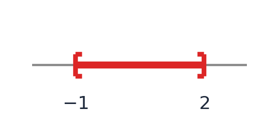{width="220px"} | $x\in[-1;2]$    |
| $0<x<2$             | 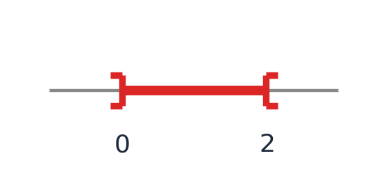{width="220px"} | $x\in\ ]0;2[$   |
| $-2\leqslant x<0$   | 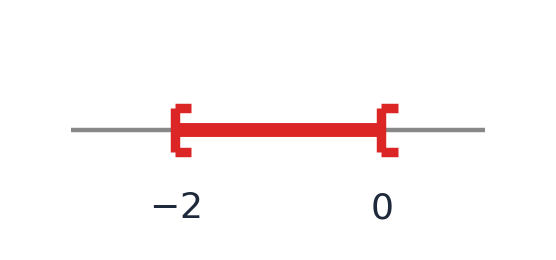{width="220px"} | $x\in[-2;0[$    |
| $0<x\leqslant 3$    | 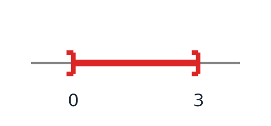{width="220px"}  | $x\in\ ]0;3]$   |
:::

## Vocabulaire

::: {.vocabulaire}
- L'intervalle $[a;b]$ est un intervalle fermé en ce sens que les crochets sont tournés vers l'intérieur : les réels $a$ et $b$ appartiennent à l'ensemble considéré.
- L'intervalle $]a;b[$ est un intervalle ouvert en ce sens que les crochets sont tournés vers l'extérieur : les réels $a$ et $b$ n'appartiennent pas à l'ensemble considéré.
- Les intervalles $[a;b[$ et $]a;b]$ sont des intervalles semi-ouverts. Par exemple, on dit que l'intervalle $[a;b[$ est fermé à gauche et ouvert à droite.
:::

::: {.application}
Pour les inégalités suivantes, tracer l'ensemble sur une droite graduée, donner la notation sous la forme d'intervalle, et préciser le vocabulaire.

1. $-3<x<5$
2. $6\geqslant x>3$
3. $3\leqslant x\leqslant 4$
:::

:::{.callout-caution collapse="true"}
## Solution

**1.** $-3<x<5$

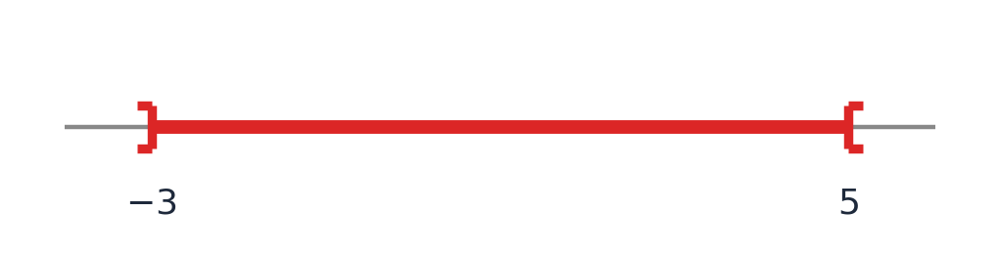{width="240px"}

$x\in\,]-3;5[$. C'est un intervalle ouvert (borné).

**2.** $6\geqslant x>3$, c'est-à-dire $3<x\leqslant 6$

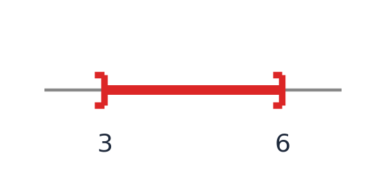{width="240px"}

$x\in\,]3;6]$. C'est un intervalle semi-ouvert : ouvert à gauche, fermé à droite.

**3.** $3\leqslant x\leqslant 4$

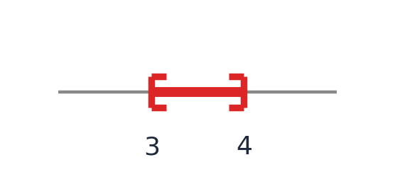{width="240px"}

$x\in[3;4]$. C'est un intervalle fermé.
:::

## Intervalles non bornés

| Inégalité   | Droite graduée | Notation |
|--------------|:---------------:|----------|
| $x\geqslant 0$ | *(à tracer)*   | $x\in\ \dots$ |
| $x>1$        | *(à tracer)*   | $x\in\ \dots$ |
| $x\leqslant 1$ | *(à tracer)* | $x\in\ \dots$ |
| $x<0$        | *(à tracer)*   | $x\in\ \dots$ |

:::{.callout-caution collapse="true"}
## Solution

| Inégalité   | Droite graduée | Notation |
|--------------|:---------------:|----------|
| $x\geqslant 0$ | 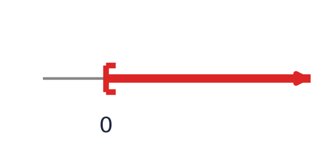{width="220px"} | $x\in[0;+\infty[$   |
| $x>1$        | 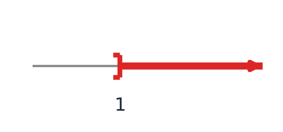{width="220px"} | $x\in\ ]1;+\infty[$  |
| $x\leqslant 1$ | 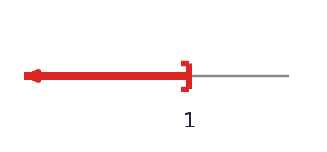{width="220px"} | $x\in\ ]-\infty;1]$ |
| $x<0$        | 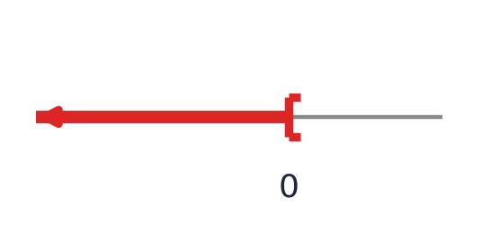{width="220px"} | $x\in\ ]-\infty;0[$  |
:::

# Réunion d'intervalles

Lorsque l'on souhaite représenter le regroupement de plusieurs intervalles, on utilise la notation $\cup$ qui se lit « union ».

::: {.definition}
Soient $I$ et $J$ deux intervalles. La réunion des intervalles $I$ et $J$, notée $I\cup J$, désigne l'ensemble des réels qui appartiennent à $I$ OU à $J$ (ou à $I$ et $J$).
:::

::: {.application}
On considère les intervalles $I=\,]-6;5[$ et $J=\,]3;8[$. Représenter $I\cup J$ sur une droite graduée puis simplifier cette union.
:::

:::{.callout-caution collapse="true"}
## Solution

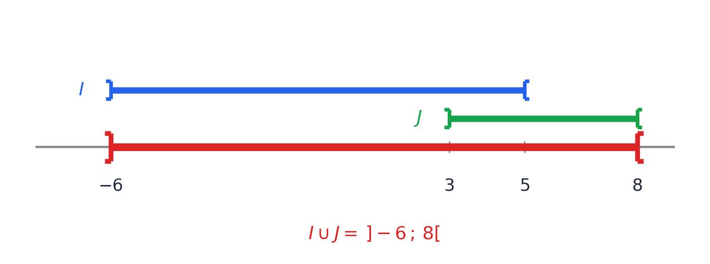{fig-alt="Droites graduées de I, J et de leur union" fig-align="center" width="80%"}

Les intervalles $I$ et $J$ se chevauchent (car $3<5$), donc leur réunion est un seul intervalle : $I\cup J=\,]-6;8[$.
:::

# Intersection d'intervalles

::: {.definition}
Soient deux intervalles $I$ et $J$. L'intersection des intervalles $I$ et $J$, notée $I\cap J$ (qui se lit « $I$ inter $J$ »), désigne l'ensemble des réels qui appartiennent à la fois à $I$ ET à $J$.
:::

::: {.application}
Représenter puis simplifier $I\cap J$ sachant que $I=[4;+\infty[$ et $J=\,]2;3]$.
:::

:::{.callout-caution collapse="true"}
## Solution

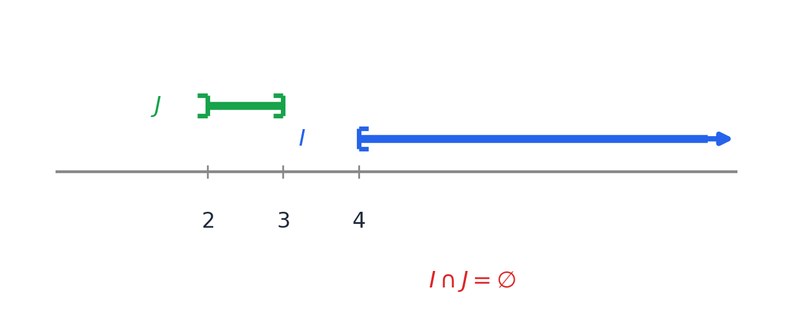{fig-alt="Droites graduées de I et J, sans point commun" fig-align="center" width="70%"}

Les intervalles $I$ et $J$ n'ont aucun point commun (car $3<4$), donc $I\cap J=\varnothing$.
:::

# Distance entre nombres réels

::: {.definition}
La distance entre deux nombres réels est la différence entre le plus grand et le plus petit. Ainsi, la distance entre les réels $x$ et $a$ est égale à :

$$
\begin{cases}
x-a & \text{lorsque } x\geqslant a \\
a-x & \text{lorsque } x\leqslant a
\end{cases}
$$
:::

::: {.remarque}
Au lieu d'utiliser cette notation sur deux lignes, on utilise la notation condensée $|x-a|$ (lire « valeur absolue de $x-a$ ») pour désigner la distance entre $x$ et $a$.
:::

::: {.proposition}
Soit $a$ et $r$ deux réels avec $r>0$.

$|x-a|\leqslant r$ équivaut à $x\in[a-r;a+r]$.
:::

::: {.illustration}
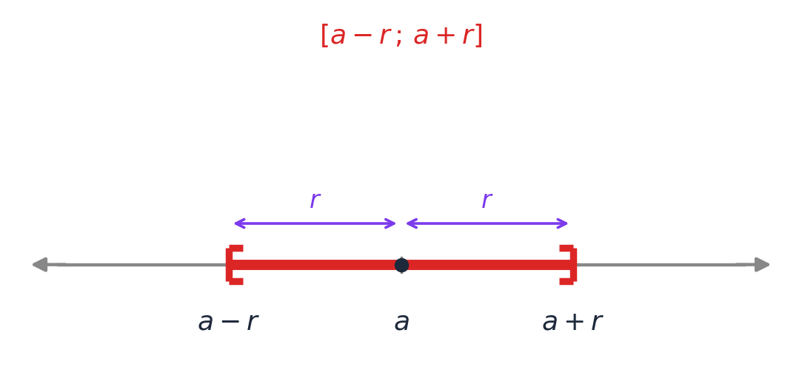{fig-alt="Droite graduée montrant l'intervalle [a-r ; a+r] centré en a, avec les deux distances r indiquées" fig-align="center" width="70%"}
:::

# Équations – Inéquations

## Équations

::: {.definition}
On appelle équation produit nulle une équation du type $A(x)\times B(x)=0$.
:::

::: {.proposition}
Un produit de facteurs est nul si et seulement si l'un des facteurs est nul.
:::

::: {.application}
Résoudre l'équation $(3x+1)\left(-\dfrac{1}{2}x+2\right)=0$.
:::

:::{.callout-caution collapse="true"}
## Solution

Un produit de facteurs est nul si et seulement si l'un des facteurs est nul, donc :

$$
(3x+1)\left(-\dfrac{1}{2}x+2\right)=0 \Leftrightarrow 3x+1=0 \text{ ou } -\dfrac{1}{2}x+2=0
$$

- $3x+1=0 \Leftrightarrow x=-\dfrac{1}{3}$
- $-\dfrac{1}{2}x+2=0 \Leftrightarrow \dfrac{1}{2}x=2 \Leftrightarrow x=4$

$S=\left\{-\dfrac{1}{3};4\right\}$
:::

::: {.definition}
On appelle équation quotient nulle une équation du type $\dfrac{A(x)}{B(x)}=0$ avec $B(x)\neq 0$.
:::

::: {.proposition}
Un quotient est nul si et seulement si le numérateur est nul, et le dénominateur est non nul.
:::

::: {.application}
Résoudre l'équation $\dfrac{-3x+5}{x+6}=0$.
:::

:::{.callout-caution collapse="true"}
## Solution

Un quotient est nul si et seulement si le numérateur est nul, et le dénominateur est non nul.

**Condition d'existence :** $x+6\neq 0 \Leftrightarrow x\neq -6$.

**Numérateur nul :** $-3x+5=0 \Leftrightarrow x=\dfrac{5}{3}$.

Or $\dfrac{5}{3}\neq -6$, donc cette valeur est bien solution.

$S=\left\{\dfrac{5}{3}\right\}$
:::

## Inéquations

::: {.definition}
On appelle équation du premier degré une équation du type $ax+b=0$ avec $a\neq 0$. On appelle inéquation du premier degré une inéquation du type $ax+b\geqslant 0$ ou $ax+b\leqslant 0$.
:::

::: {.remarque}
La résolution algébrique d'une (in)équation permet de trouver la valeur exacte de chacune des solutions.
:::

::: {.proposition}
**Opérations sur les inéquations**

Les opérations suivantes ne changent pas l'ensemble des solutions d'une inéquation :

- additionner ou soustraire un même nombre aux deux membres d'une inéquation ;
- multiplier ou diviser par un même nombre positif non nul les deux membres d'une inéquation ;
- multiplier ou diviser par un même nombre négatif non nul les deux membres d'une inéquation **à condition d'inverser le sens de l'inégalité**.
:::

::: {.remarque}
**En pratique**, pour résoudre une (in)équation :

- on regroupe les termes contenant l'inconnue dans le même membre de l'(in)équation ;
- si nécessaire, on réduit les expressions des deux membres ;
- on isole l'inconnue dans l'ordre inverse des priorités de calcul.
:::

::: {.application}
Résoudre l'inéquation $15+6x<9x$.
:::

:::{.callout-caution collapse="true"}
## Solution

$$
\begin{align*}
15+6x<9x &\Leftrightarrow 15+6x-9x<9x-9x \\
&\Leftrightarrow 15-3x<0 \\
&\Leftrightarrow -3x<-15 \\
&\Leftrightarrow x>\dfrac{-15}{-3} \\
&\Leftrightarrow x>5
\end{align*}
$$

$S=\,]5;+\infty[$
:::

::: {.application}
Résoudre dans $\R$ :

1. $\dfrac{x-3}{4}+\dfrac{x}{6}<\dfrac{2x-3}{3}$
2. $\dfrac{2(x-3)}{3}+1<\dfrac{1-2x}{6}+5+x$
3. $3x-\dfrac{x-1}{3}\geqslant\dfrac{1}{3}-x$
:::

:::{.callout-caution collapse="true"}
## Solution

**1.** On multiplie les deux membres par $12$ (multiple commun de $4$, $6$ et $3$) :

$$
\begin{align*}
\dfrac{x-3}{4}+\dfrac{x}{6}<\dfrac{2x-3}{3} &\Leftrightarrow 3(x-3)+2x<4(2x-3) \\
&\Leftrightarrow 3x-9+2x<8x-12 \\
&\Leftrightarrow 5x-9<8x-12 \\
&\Leftrightarrow 5x-8x<-12+9 \\
&\Leftrightarrow -3x<-3 \\
&\Leftrightarrow x>1
\end{align*}
$$

$S=\,]1;+\infty[$

**2.** On multiplie les deux membres par $6$ :

$$
\begin{align*}
\dfrac{2(x-3)}{3}+1<\dfrac{1-2x}{6}+5+x &\Leftrightarrow 4(x-3)+6<(1-2x)+30+6x \\
&\Leftrightarrow 4x-12+6<1-2x+30+6x \\
&\Leftrightarrow 4x-6<4x+31 \\
&\Leftrightarrow 4x-4x<31+6 \\
&\Leftrightarrow 0<37
\end{align*}
$$

L'inégalité $0<37$ est toujours vraie, quelle que soit la valeur de $x$.

$S=\R$

**3.** On multiplie les deux membres par $3$ :

$$
\begin{align*}
3x-\dfrac{x-1}{3}\geqslant\dfrac{1}{3}-x &\Leftrightarrow 9x-(x-1)\geqslant 1-3x \\
&\Leftrightarrow 9x-x+1\geqslant 1-3x \\
&\Leftrightarrow 8x+1\geqslant 1-3x \\
&\Leftrightarrow 8x+3x\geqslant 1-1 \\
&\Leftrightarrow 11x\geqslant 0 \\
&\Leftrightarrow x\geqslant 0
\end{align*}
$$

$S=[0;+\infty[$
:::
