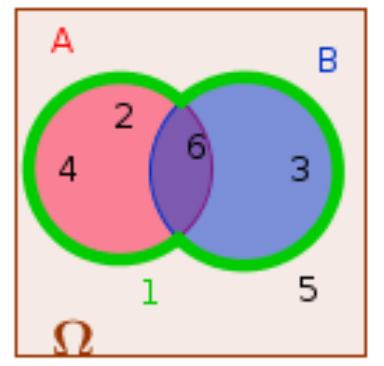

```css
```
```{=html}
<style>
:root {
  --def-color:   #2563eb;
  --prop-color:  #7c3aed;
  --theo-color:  #c026d3;
  --voc-color:   #0d9488;
  --rem-color:   #d97706;
  --ex-color:    #16a34a;
  --app-color:   #ea580c;
  --not-color:   #4f46e5;
  --meth-color:  #dc2626;
  --ill-color:   #475569;
}

.definition, .proposition, .theoreme, .vocabulaire, .remarque, .exemple, .application,
.notation, .methode, .illustration {
  margin: 1.5em 0;
  padding: 1em 1.3em 1em 1.3em;
  border-radius: 10px;
  border-left: 6px solid;
  box-shadow: 0 1px 4px rgba(0,0,0,0.08);
  font-family: "Georgia", serif;
}

.definition::before, .proposition::before, .theoreme::before, .vocabulaire::before,
.remarque::before, .exemple::before, .application::before,
.notation::before, .methode::before, .illustration::before {
  display: block;
  font-family: "Helvetica Neue", Arial, sans-serif;
  font-weight: 700;
  font-size: 0.95em;
  letter-spacing: 0.03em;
  text-transform: uppercase;
  margin-bottom: 0.6em;
}

.definition {
  background: #eff6ff;
  border-color: var(--def-color);
  color: #1e3a5f;
}
.definition::before {
  content: "📘  Définition";
  color: var(--def-color);
}

.proposition {
  background: #f5f3ff;
  border-color: var(--prop-color);
  color: #3b2467;
}
.proposition::before {
  content: "📐  Proposition";
  color: var(--prop-color);
}

.theoreme {
  background: #fdf4ff;
  border-color: var(--theo-color);
  color: #701a75;
}
.theoreme::before {
  content: "🏛️  Théorème";
  color: var(--theo-color);
}

.vocabulaire {
  background: #f0fdfa;
  border-color: var(--voc-color);
  color: #0f4c46;
}
.vocabulaire::before {
  content: "🏷️  Vocabulaire";
  color: var(--voc-color);
}

.remarque {
  background: #fffbeb;
  border-color: var(--rem-color);
  color: #6b4a06;
}
.remarque::before {
  content: "💡  Remarque";
  color: var(--rem-color);
}

.exemple {
  background: #f0fdf4;
  border-color: var(--ex-color);
  color: #14532d;
}
.exemple::before {
  content: "🔍  Exemple";
  color: var(--ex-color);
}

.application {
  background: #fff7ed;
  border: 2px dashed var(--app-color);
  border-left: 6px solid var(--app-color);
  color: #7c2d12;
}
.application::before {
  content: "✏️  Application";
  color: var(--app-color);
  font-size: 1.05em;
}

.notation {
  background: #eef2ff;
  border-color: var(--not-color);
  color: #312e81;
}
.notation::before {
  content: "🖊️  Notation";
  color: var(--not-color);
}

.methode {
  background: #fef2f2;
  border-color: var(--meth-color);
  color: #7f1d1d;
}
.methode::before {
  content: "🧭  Méthode";
  color: var(--meth-color);
}

.illustration {
  background: #f8fafc;
  border-color: var(--ill-color);
  color: #1e293b;
}
.illustration::before {
  content: "🖼️  Illustration";
  color: var(--ill-color);
}

/* Callouts "Solution" un peu plus stylés */
div.callout-caution {
  border-radius: 10px;
  box-shadow: 0 1px 4px rgba(0,0,0,0.08);
}
div.callout-caution .callout-title {
  font-family: "Helvetica Neue", Arial, sans-serif;
  font-weight: 700;
}
div.callout-caution .callout-title::before {
  content: "🔓  ";
}
</style>
```

# Expérience aléatoire

::: {.exemple}
On lance un dé équilibré à six faces et on note le résultat obtenu sur la face supérieure. Il s'agit bien d'une expérience aléatoire :

-   Il n'est pas possible de savoir sur quel chiffre le dé va s'arrêter.

-   Les issues de cette expérience sont les chiffres $1, 2, 3, 4, 5, 6$. L'univers est donc $\Omega = \{1, 2, 3, 4, 5, 6\}$.

Un événement est par exemple : $A=$ « obtenir un nombre pair ». On a alors $A=\{2, 4, 6\}$. Un événement élémentaire est par exemple : $B=$ « obtenir un 4 ». Dans cette expérience il y a six événements élémentaires.
:::

::: {.definition}
1.  Une **expérience aléatoire** est une expérience vérifiant les deux conditions suivantes :

    -   elle comporte plusieurs issues envisageables ;

    -   on ne peut pas prévoir l'issue lorsqu'on réalise l'expérience.

2.  **L'univers** de l'expérience aléatoire est l'ensemble des issues de cette expérience aléatoire. On le note $\Omega$.

3.  Un **événement** est un ensemble d'issues de l'expérience aléatoire.

4.  Les **événements élémentaires** sont les événements réduits à une unique issue de l'expérience.
:::

# Probabilité d'un événement

## Loi des grands nombres et probabilité

::: {.exemple}
On simule $n$ lancers d'un dé équilibré à six faces, et on note le nombre de fois où le chiffre 4 est sorti.

| Nombre de lancers      |  10  |  50  | 100  |  500  | 1000  | 10000  | 100000  |
|:-----------------------|:----:|:----:|:----:|:-----:|:-----:|:------:|:-------:|
| Nombre de 4 obtenus    |  3   |  10  |  19  |  76   |  161  |  1681  |  16649  |
| Fréquence d'apparition | 0,30 | 0,20 | 0,19 | 0,152 | 0,161 | 0,1681 | 0,16649 |

On peut remarquer que la fréquence s'approche de la valeur $\frac{1}{6} \approx 0{,}1667$. La probabilité d'obtenir un 4 est donc $\frac{1}{6}$.
:::

::: {.proposition}
Lors d'une expérience aléatoire répétée un grand nombre de fois, les fréquences obtenues d'un événement $A$ de l'expérience se rapprochent d'une valeur théorique.
:::

::: {.definition}
Cette valeur théorique s'appelle probabilité de l'événement $A$.
:::

## Calcul de probabilités

::: {.proposition}
Dans une expérience aléatoire :

-   La probabilité $\mathbb{P}(A)$ d'un événement $A$ vérifie : $0 \leqslant\mathbb{P}(A) \leqslant 1$.

-   La somme des probabilités des événements élémentaires vaut 1.

-   La probabilité d'un événement est la somme des probabilités des événements élémentaires qui le constituent.

-   La probabilité d'un événement certain est égale à 1.

-   La probabilité d'un événement impossible (noté $\varnothing$) est égale à 0.
:::

::: {.exemple}
Dans l'exemple précédent, il y a autant de chances d'obtenir un 4 qu'un 6 ou un 2. Tous les événements élémentaires ont donc pour probabilité $\dfrac{1}{6}$. Il y a 6 événements élémentaires: $6\times\dfrac{1}{6}=1$.

La probabilité de l'événement A="obtenir un nombre pair" est :\
$\mathbb{P}(A)=\mathbb{P}(\{2\})+\mathbb{P}(\{4\})+\mathbb{P}(\{6\})=3\times\dfrac{1}{6}=\dfrac{1}{2}$.

3 est le nombre d'éléments de A, que l'on appelle cardinal de A et que l'on note $\text{card}(A)$.
:::

::: {.definition}
Lorsque, dans une expérience aléatoire, toutes les issues ont la même probabilité de se réaliser, on dit que l'expérience est **équiprobable**.
:::

::: {.proposition}
Lors d'une expérience aléatoire ayant $n$ issues équiprobables :

-   La probabilité de chaque événement élémentaire est $\frac{1}{n}$.

-   La probabilité d'un événement $A$ est donc $\mathbb{P}(A) = \frac{\text{card}(A)}{n}$.
:::

::: {.exemple}
On tire au hasard une carte dans un jeu de 32 cartes.

L'univers est *l'ensemble des 32 cartes: $\Omega= \{$as de pique,\..., sept de carreau\...$\}$* Quels sont les événements élémentaires de cette expérience? Quelles sont leurs probabilités respectives?

*Il s'agit d'une expérience équiprobable.*

On note J l'événement "tirer un roi". $J=\{$ *roi de trèfle, carreau, cœur et pique*$\}$ On a alors $\mathbb{P}(J)=\dfrac{4}{32} = \dfrac{1}{8}$.

On note C l'événement "tirer un trèfle". Il y a 8 cartes qui portent du trèfle dans un tel jeu. On a donc $\text{card}(C)=8$ et donc $\mathbb{P}(C)=\dfrac{8}{32} =\dfrac{1}{4}$.
:::

# Réunion et intersection de deux événements

::: {.exemple}
Dans l'exemple du jeu de dé, on considère les événements:

1.  A:"obtenir un nombre pair".

2.  B:"obtenir un multiple de 3".

On a alors:

{width="35%" fig-align="center"}

$$\begin{aligned}
  A\cap B&=\{2,4,6\} \cap \{3,6\}\\
  &=\{6\}\\
et~ 
  A\cup B&=\{2,4,6\} \cup \{3,6\}\\
  &=\{2,3,4,6\}

\end{aligned}$$
:::

::: {.definition}
-   L'événement $A \cap B$ est réalisé lorsque les deux événements $A$ et $B$ le sont.

-   L'événement $A \cup B$ est réalisé lorsque l'un au moins des deux événements l'est.
:::

## Probabilité d'une réunion

::: {.theoreme}
Si $A$ et $B$ sont deux événements d'une expérience aléatoire, alors : $$\mathbb{P}(A \cup B) = \mathbb{P}(A) + \mathbb{P}(B) - \mathbb{P}(A \cap B)$$
:::

::: {.exemple}
Reprenons le jeu de cartes, et les événements:

1.  A:"tirer un roi"

2.  B:"tirer un cœur"

On a alors: $A\cap B=$ "tirer le roi de cœur", donc $\mathbb{P}(A\cap B)=\dfrac{1}{32}$. On a déjà vu que $\mathbb{P}(A)=\dfrac{1}{8}$ et $\mathbb{P}(B)=\dfrac{1}{4}$. L'événement $A\cup B$ a donc pour probabilité:

$$\begin{aligned}
 \mathbb{P}(A\cup B)&=\mathbb{P}(A)+\mathbb{P}(B)-\mathbb{P}(A\cap B) \\
& = \dfrac{1}{8}+\dfrac{1}{4}-\dfrac{1}{32} \\
& =\dfrac{4}{32}+\dfrac{8}{32}-\dfrac{1}{32} \\
& =\dfrac{11}{32}
\end{aligned}$$
:::

## Événements incompatibles

::: {.definition}
Deux événements sont dits **incompatibles** lorsqu'ils ne peuvent pas se réaliser simultanément ($A \cap B = \varnothing$).
:::

::: {.proposition}
Si deux événements $A$ et $B$ sont incompatibles, alors $\mathbb{P}(A \cup B) = \mathbb{P}(A) + \mathbb{P}(B)$.
:::

::: {.exemple}
Reprenons le jeu de cartes: On tire une carte parmi les 32 du jeu. Les événements $A$ : "tirer un carreau" et $B$ : "tirer un pique" sont incompatibles: on ne peut pas tirer à la fois un carreau et un pique.

Donc:

$\mathbb{P}(A\cup B)=\mathbb{P}(A)+\mathbb{P}(B)=\dfrac{1}{4}+\dfrac{1}{4}=\dfrac{1}{2}$.
:::

## Événement contraire

::: {.definition}
On appelle **événement contraire** d'un événement $A$ l'événement, noté $\bar{A}$, qui contient l'ensemble des issues n'appartenant pas à $A$.
:::

::: {.exemple}
L'événement contraire de A="obtenir un chiffre pair"=$\{2,4,6\}$ lors du lancer d'un dé est $\bar{A}$="ne pas obtenir un chiffre pair"="obtenir un chiffre impair"=$\{1,3,5\}$.

De même l'événement contraire de C dans le jeu de cartes est "tirer une carte de cœur, carreau ou pique".
:::

::: {.proposition}
La probabilité de l'événement contraire d'un événement $A$ est $\mathbb{P}(\bar{A}) = 1 - \mathbb{P}(A)$.
:::

::: {.exemple}
Dans le jeu du lancer de dé, on a donc $\mathbb{P}(\bar{A})=1-\dfrac{1}{2}=\dfrac{1}{2}$.

Dans le jeu des cartes, on a $\mathbb{P}(\bar{C})=1-\dfrac{1}{4}=\dfrac{3}{4}$.
:::
