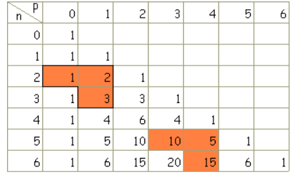

```css
```
```{=html}
<style>
:root {
  --def-color:   #2563eb;
  --prop-color:  #7c3aed;
  --theo-color:  #c026d3;
  --voc-color:   #0d9488;
  --rem-color:   #d97706;
  --ex-color:    #16a34a;
  --app-color:   #ea580c;
  --not-color:   #4f46e5;
  --meth-color:  #dc2626;
  --ill-color:   #475569;
}

.definition, .proposition, .theoreme, .vocabulaire, .remarque, .exemple, .application,
.notation, .methode, .illustration {
  margin: 1.5em 0;
  padding: 1em 1.3em 1em 1.3em;
  border-radius: 10px;
  border-left: 6px solid;
  box-shadow: 0 1px 4px rgba(0,0,0,0.08);
  font-family: "Georgia", serif;
}

.definition::before, .proposition::before, .theoreme::before, .vocabulaire::before,
.remarque::before, .exemple::before, .application::before,
.notation::before, .methode::before, .illustration::before {
  display: block;
  font-family: "Helvetica Neue", Arial, sans-serif;
  font-weight: 700;
  font-size: 0.95em;
  letter-spacing: 0.03em;
  text-transform: uppercase;
  margin-bottom: 0.6em;
}

.definition {
  background: #eff6ff;
  border-color: var(--def-color);
  color: #1e3a5f;
}
.definition::before {
  content: "📘  Définition";
  color: var(--def-color);
}

.proposition {
  background: #f5f3ff;
  border-color: var(--prop-color);
  color: #3b2467;
}
.proposition::before {
  content: "📐  Proposition";
  color: var(--prop-color);
}

.theoreme {
  background: #fdf4ff;
  border-color: var(--theo-color);
  color: #701a75;
}
.theoreme::before {
  content: "🏛️  Théorème";
  color: var(--theo-color);
}

.vocabulaire {
  background: #f0fdfa;
  border-color: var(--voc-color);
  color: #0f4c46;
}
.vocabulaire::before {
  content: "🏷️  Vocabulaire";
  color: var(--voc-color);
}

.remarque {
  background: #fffbeb;
  border-color: var(--rem-color);
  color: #6b4a06;
}
.remarque::before {
  content: "💡  Remarque";
  color: var(--rem-color);
}

.exemple {
  background: #f0fdf4;
  border-color: var(--ex-color);
  color: #14532d;
}
.exemple::before {
  content: "🔍  Exemple";
  color: var(--ex-color);
}

.application {
  background: #fff7ed;
  border: 2px dashed var(--app-color);
  border-left: 6px solid var(--app-color);
  color: #7c2d12;
}
.application::before {
  content: "✏️  Application";
  color: var(--app-color);
  font-size: 1.05em;
}

.notation {
  background: #eef2ff;
  border-color: var(--not-color);
  color: #312e81;
}
.notation::before {
  content: "🖊️  Notation";
  color: var(--not-color);
}

.methode {
  background: #fef2f2;
  border-color: var(--meth-color);
  color: #7f1d1d;
}
.methode::before {
  content: "🧭  Méthode";
  color: var(--meth-color);
}

.illustration {
  background: #f8fafc;
  border-color: var(--ill-color);
  color: #1e293b;
}
.illustration::before {
  content: "🖼️  Illustration";
  color: var(--ill-color);
}

/* Callouts "Solution" un peu plus stylés */
div.callout-caution {
  border-radius: 10px;
  box-shadow: 0 1px 4px rgba(0,0,0,0.08);
}
div.callout-caution .callout-title {
  font-family: "Helvetica Neue", Arial, sans-serif;
  font-weight: 700;
}
div.callout-caution .callout-title::before {
  content: "🔓  ";
}
</style>
```

# Principe additif et multiplicatif

## Ensemble fini et cardinal

::: {.definition}
Soit $n$ un entier naturel. Lorsqu'un ensemble $E$ a $n$ éléments, on dit que $E$ est un ensemble fini.\
Le nombre $n$ d'éléments de $E$ est appelé le cardinal de $E$. On note $\text{Card}(E)=n$.
:::

::: {.exemple}
$E=\{a;e;i;o;u;y\}$ est un ensemble à six éléments. On note $\text{Card}(E)=6$.
:::

::: {.remarque}
-   $\text{Card}(\emptyset)=0$

-   Certains ensembles ne sont pas finis. Par exemple l'ensemble $\mathbb{N}$ des entiers naturels ou encore l'ensemble des réels de l'intervalle $[0;1]$.
:::

::: {.definition}
Deux ensembles $A$ et $B$ sont disjoints lorsque $A\cap B =\emptyset$
:::

## Principe additif

::: {.proposition}
Soit $p \in \mathbb{N}^*$.\
Soient $A_1$, $A_2$, \..., $A_p$, $p$ ensembles finis deux à deux disjoints. On a:

$\text{Card}(A_1 \cup A_2 \cup ... \cup A_p)=\text{Card}(A_1)+\text{Card}(A_2)+...+\text{Card}(A_p)$

Autrement dit: $\text{Card}(\bigcup\limits_{i=1}^{p}A_i)=\sum\limits_{i=1}^{p} \text{Card}(A_i)$
:::

::: {.proposition}
Soient $A$ une partie d'un ensemble $E$ fini et $\bar{A}$ le complémentaire de $A$ dans $E$. On a:

$\text{Card}(\bar{A})=\text{Card}(E)-\text{Card}(A)$
:::

::: {.remarque}
La démonstration de cette proposition sera étudiée dans l'exercice 56 page 46.
:::

## Principe multiplicatif

::: {.definition}
Soient $E$ et $F$ deux ensembles non vides.

Le produit cartésien de $E$ par $F$, noté $E\times F$, est l'ensemble des couples $(x,y)$ avec $x\in E$ et $y \in F$.
:::

::: {.exemple}
Soient $E=\{a; b; c\}$ et $F=\{1; 2 \}$. Alors $E\times F =\{ (a;1); (b;1); (c;1); (a;2); (b;2); (c;2)\}$ et $F\times E=\{(1;a); (2;a); (1;b); (2;b); (1;c); (2;c)\}$
:::

::: {.remarque}
On peut retrouver tous les couples du produit cartésien à l'aide d'un tableau à double entrée ou d'un arbre.
:::

::: {.proposition}
Lorsque les ensembles $E$ et $F$ sont finis, $\text{Card}(E\times F)=\text{Card}(E) \times \text{Card}(F)$.
:::

::: {.remarque}
Le signe $\times$ dans $\text{Card}(E \times F)$ désigne le produit cartésien des ensembles $E$ et $F$, alors que celui dans $\text{Card}(E)\times \text{Card}(F)$ symbolise la multiplication de deux entiers.
:::

::: {.definition}
Soient $k$ un entier supérieur ou égal à 2 et $E_1, E_2, ..., E_k$, $k$ ensembles non vides.

Toute liste ordonnée $(x_1; x_2; ...; x_k)$ avec $x_i \in E_i$ pour $i$ allant de $1$ à $k$ est appelée un $k$-uplet ou $k$-liste.
:::

::: {.proposition}
-   L'ensemble de ces $k$-uplets est le produit cartésien $E_1\times E_2 \times ... \times E_k$.

-   Lorsque les ensembles $E_1, E_2, ..., E_k$ sont finis, on a:

    $\text{Card}(E_1 \times E_2 \times ... \times E_k)= \text{Card}(E_1) \times \text{Card}(E_2) \times ... \times \text{Card}(E_k)$.\
    Autrement dit: $\text{Card}\left(\prod\limits_{i=1}^k E_i\right) = \prod\limits_{i=1}^k\text{Card}(E_i)$
:::

# $k$-uplets d'un ensemble fini

## Nombre de $k$-uplets d'un ensemble à $n$ éléments

::: {.definition}
Soit $k \in \mathbb{N}^*$ et $E$ un ensemble non vide.\
Un $k$-uplet (ou $k$-liste) d'éléments de $E$ est un élément du produit cartésien:

$E^k=E\times E\times...\times E$ ($k$ facteurs)
:::

::: {.exemple}
$(a; b; r; f; h; a; b)$ est un $7$-uplet de l'ensemble des 26 lettres $E=\{a; b; ...; z \}$
:::

::: {.theoreme}
Soient $n$ et $k$ deux entiers naturels non nuls et $E$ un ensemble fini de cardinal $n$.\
Le nombre de $k$-uplet de $E$ est $n^k$, ainsi $\text{Card}\left(E^k \right)=n^k$.
:::

::: {.application}
On dispose de trois boîtes $A$, $B$ et $C$ et de 5 jetons de couleurs différentes que l'on doit ranger dans les boîtes. Combien de rangements possibles existe-t-il ?
:::

::: {.callout-caution collapse="true"}
## Solution

On note $T=\{A;B;C\}$ l'ensemble des boîtes. Les différents rangements possibles sont des $5$-uplets de $T$. Par exemple $(A;B;B;A;C)$ signifie que l'on a rangé le premier jeton dans la boîte $A$, le deuxième dans la boîte $B$\... Il y a alors $3^5=243$ rangements possibles.
:::

::: {.remarque}
On peut utiliser un arbre de dénombrement pour compter tous les rangements possibles.
:::

## $k$-uplets d'éléments distincts d'un ensemble, arrangements, permutations

::: {.application}
On dispose de trois jetons et de cinq boîtes notées $A$, $B$, $C$, $D$ et $E$. On doit ranger les jetons dans les boîtes, une boîte ne pouvant contenir qu'un seul jeton. Combien de rangements possibles existe-t-il ?
:::

::: {.callout-caution collapse="true"}
## Solution

On dispose de cinq possibilités pour le premier jeton, de quatre pour le deuxième, de trois pour le troisième. Les rangements possibles sont donc les $3$-uplets d'éléments deux à deux distincts de l'ensemble $E=\{A; B; C; D; E \}$\
Leur nombre est $5\times 4 \times 3=60$
:::

::: {.definition}
Soit $E$ un ensemble non vide à $n$ éléments et $k$ un entier naturel inférieur ou égal à $n$. Un arrangement de $k$ éléments de $E$ (ou $k$-arrangement) est un k-uplet d'éléments distincts de $E$.
:::

::: {.theoreme}
Soit $n\in \mathbb{N}^*$ et $k\in \mathbb{N}$ tel que $1 \leqslant k \leqslant n$.\
Soit $E$ un ensemble fini de cardinal $n$. Le nombre de $k$-uplets d'éléments deux à deux distincts de $E$ est:

$n(n-1)(n-2)...(n-k+1)$
:::

::: {.exemple}
On dispose maintenant de 3 jetons et de trois boîtes notées $A$, $B$ et $C$. On range un jeton par boîte. Tous les rangements correspondent aux permutations des boîtes $A$, $B$ et $C$.
:::

::: {.definition}
On appelle permutation d'un ensemble $E$ à $n$ éléments tout $n$-uplet d'éléments deux à deux distincts de $E$
:::

::: {.exemple}
Les permutations de l'ensemble $E=\{A; B; C\}$ sont:

$(A;B;C)$, $(A;C;B)$, $(B;C;A)$, $(B;A;C)$, $(C;B;A)$ et $(C;A;B)$
:::

::: {.theoreme}
Le nombre de permutations d'un ensemble à $n$ éléments ($n \in \mathbb{N}^*$) est le nombre noté $n!$ (qui se lit « factorielle $n$ » ou « $n$ factorielle »), défini par :

$n!=n(n-1)(n-2)...\times2\times 1$
:::

::: {.remarque}
Par convention, $0!=1$.
:::

# Parties d'un ensemble et combinaisons

## Nombre de parties d'un ensemble

::: {.definition}
Soit $E$ un ensemble. Dire qu'un ensemble $F$ est une partie de $E$ (ou que $F$ est un sous-ensemble de $E$, ou que $F$ est inclus dans $E$) signifie que tous les éléments de $F$ sont des éléments de $E$.\
On note alors $F \subset E$.
:::

::: {.remarque}
Il ne faut pas confondre une partie d'un ensemble avec un $k$-uplet. Par exemple, $\{1;2\}=\{2;1\}$ est une partie à deux éléments, tandis que $(1;2)$ et $(2;1)$ sont des couples distincts.
:::

::: {.exemple}
On considère l'ensemble $E=\{a;b;c\}$. Les ensembles $A=\{a;c\}$ et $B=\emptyset$ sont des parties de $E$.
:::

::: {.application}
Déterminer toutes les parties de $E$: Pour cela on peut construire un arbre.
:::

::: {.theoreme}
Soit $n\in \mathbb{N}$. Le nombre de parties d'un ensemble à $n$ éléments est égal au nombre de $n$-uplets de l'ensemble $\{0;1\}$, c'est-à-dire $2^n$.
:::

::: {.callout-caution collapse="true"}
## Solution

Pour constituer une partie $F$ de $E$, il y a deux choix pour chaque élément de $E$: l'incorporer dans $F$ ou pas. Puisque $E$ possède $n$ éléments, cela donne au total $2^n$ parties possibles.
:::

::: {.remarque}
On appelle mot de longueur $n$ sur l'alphabet $A=\{a;b\}$ un $n$-uplet d'éléments de $A$.\
Par exemple, $(a;b;b;a)$ est un mot de longueur 4 sur l'alphabet $A$. Il y a $2^n$ mots de longueur $n$.
:::

## Combinaison

::: {.definition}
Soient $n$ et $k$ deux entiers naturels tels que $0 \leqslant k \leqslant n$ et $E$ un ensemble fini de cardinal $n$.\
On appelle combinaison de $k$ éléments de $E$ toute partie de $E$ ayant $k$ éléments.
:::

::: {.exemple}
On considère les mots de longueur 3 formés avec les lettres de l'alphabet $A=\{a;b\}$. Construire un mot contenant exactement deux lettres $a$ revient à déterminer la position des deux lettres $a$ dans le mot de trois lettres, c'est-à-dire une combinaison de deux éléments de l'ensemble $\{1; 2; 3\}$. Il y en a trois.
:::

::: {.proposition}
Soient $n$ et $k$ deux entiers naturels tels que $0 \leqslant k \leqslant n$. Le nombre de combinaisons de $k$ éléments d'un ensemble à $n$ éléments, noté $\binom{n}{k}$, est donné par:

$\binom{n}{k}=\dfrac{n!}{k!(n-k)!}$
:::

::: {.callout-caution collapse="true"}
## Solution

Soit $x$ le nombre de sous-ensembles à $k$ éléments d'un ensemble à $n$ éléments.\
Si, à partir d'une partie à $k$ éléments, on réalise toutes les permutations possibles, on obtient tous les $k$-uplets d'éléments distincts.\
Ainsi, $x \times k!=n(n-1)...(n-k+1)$(=nombre de $k$-uplet) d'où $x=\dfrac{n(n-1)..(n-(k-1))}{k!}$.\
Finalement, $x=\dfrac{n(n-1)...(n-(k-1))}{k!}\times \dfrac{(n-k)\times ... \times 1}{(n-k)!}=\dfrac{n!}{k!(n-k)!}$
:::

# Propriétés des combinaisons

## Propriétés

::: {.proposition}
Soit $n\in \mathbb{N}$.

-   $\binom{n}{0}=1$. Dans un ensemble à $n$ éléments, il existe une seule partie à 0 élément: la partie vide.

-   $\binom{n}{1}=n$. Dans un ensemble à $n$ éléments, il y a $n$ parties ayant un élément.

-   $\binom{n}{n}=1$

-   Pour tous entiers $n$ et $k$ vérifiant $0 \leqslant k \leqslant n$, $\binom{n}{k}=\binom{n}{n-k}$. Dénombrer les parties à $k$ éléments revient à dénombrer les parties à $n-k$ éléments qui en sont les complémentaires.
:::

::: {.proposition}
Pour tout entier naturel $n$, $\sum\limits_{k=0}^n \binom{n}{k}=2^n$.
:::

::: {.callout-caution collapse="true"}
## Solution

Soit $A$ un ensemble fini à $n$ éléments. Pour tout entier naturel $k$, inférieur ou égal à $n$, on note $A_k$ l'ensemble des parties de $A$ à $k$ éléments.\
On a ainsi, $\text{Card}(A_k)=\binom{n}{k}$. Les $A_k$ sont deux à deux disjoints et leur réunion est l'ensemble des parties de $A$, ainsi :

$2^n=\text{Card}\left( \bigcup\limits_{i=0}^n A_i \right)=\sum\limits_{i=0}^n \text{Card}(A_i)=\sum\limits_{i=0}^n \binom{n}{i}$
:::

## Relation et triangle de Pascal

::: {.theoreme}
**Relation de Pascal**

Pour tous entiers naturels $n \geqslant 2$ et $p$ vérifiant $1 \leqslant p \leqslant n-1$,

$\binom{n}{p}=\binom{n-1}{p-1}+\binom{n-1}{p}$
:::

On peut ainsi calculer les $\binom{n}{p}$ à l'aide du tableau ci-dessous, appelé triangle de Pascal.\
À l'intersection de la ligne $n$ et de la colonne $p$, on lit l'entier $\binom{n}{p}$.\
On commence par écrire les « 1 » de la première colonne et de la diagonale, puis on utilise la relation de Pascal suivant le schéma:

$$\begin{aligned}
        \binom{n-1}{p-1}&+\binom{n-1}{p} \\
        &= \binom{n}{p}
\end{aligned}$$

{fig-alt="Triangle de Pascal jusqu'à n = 6, avec la relation de Pascal mise en évidence" width="55%" fig-align="center"}
