```css
```
```{=html}
<style>
:root {
  --def-color:   #2563eb;
  --prop-color:  #7c3aed;
  --theo-color:  #c026d3;
  --voc-color:   #0d9488;
  --rem-color:   #d97706;
  --ex-color:    #16a34a;
  --app-color:   #ea580c;
  --not-color:   #4f46e5;
  --meth-color:  #dc2626;
  --ill-color:   #475569;
}

.definition, .proposition, .theoreme, .vocabulaire, .remarque, .exemple, .application,
.notation, .methode, .illustration {
  margin: 1.5em 0;
  padding: 1em 1.3em 1em 1.3em;
  border-radius: 10px;
  border-left: 6px solid;
  box-shadow: 0 1px 4px rgba(0,0,0,0.08);
  font-family: "Georgia", serif;
}

.definition::before, .proposition::before, .theoreme::before, .vocabulaire::before,
.remarque::before, .exemple::before, .application::before,
.notation::before, .methode::before, .illustration::before {
  display: block;
  font-family: "Helvetica Neue", Arial, sans-serif;
  font-weight: 700;
  font-size: 0.95em;
  letter-spacing: 0.03em;
  text-transform: uppercase;
  margin-bottom: 0.6em;
}

.definition {
  background: #eff6ff;
  border-color: var(--def-color);
  color: #1e3a5f;
}
.definition::before {
  content: "📘  Définition";
  color: var(--def-color);
}

.proposition {
  background: #f5f3ff;
  border-color: var(--prop-color);
  color: #3b2467;
}
.proposition::before {
  content: "📐  Proposition";
  color: var(--prop-color);
}

.theoreme {
  background: #fdf4ff;
  border-color: var(--theo-color);
  color: #701a75;
}
.theoreme::before {
  content: "🏛️  Théorème";
  color: var(--theo-color);
}

.vocabulaire {
  background: #f0fdfa;
  border-color: var(--voc-color);
  color: #0f4c46;
}
.vocabulaire::before {
  content: "🏷️  Vocabulaire";
  color: var(--voc-color);
}

.remarque {
  background: #fffbeb;
  border-color: var(--rem-color);
  color: #6b4a06;
}
.remarque::before {
  content: "💡  Remarque";
  color: var(--rem-color);
}

.exemple {
  background: #f0fdf4;
  border-color: var(--ex-color);
  color: #14532d;
}
.exemple::before {
  content: "🔍  Exemple";
  color: var(--ex-color);
}

.application {
  background: #fff7ed;
  border: 2px dashed var(--app-color);
  border-left: 6px solid var(--app-color);
  color: #7c2d12;
}
.application::before {
  content: "✏️  Application";
  color: var(--app-color);
  font-size: 1.05em;
}

.notation {
  background: #eef2ff;
  border-color: var(--not-color);
  color: #312e81;
}
.notation::before {
  content: "🖊️  Notation";
  color: var(--not-color);
}

.methode {
  background: #fef2f2;
  border-color: var(--meth-color);
  color: #7f1d1d;
}
.methode::before {
  content: "🧭  Méthode";
  color: var(--meth-color);
}

.illustration {
  background: #f8fafc;
  border-color: var(--ill-color);
  color: #1e293b;
}
.illustration::before {
  content: "🖼️  Illustration";
  color: var(--ill-color);
}

/* Callouts "Solution" un peu plus stylés */
div.callout-caution {
  border-radius: 10px;
  box-shadow: 0 1px 4px rgba(0,0,0,0.08);
}
div.callout-caution .callout-title {
  font-family: "Helvetica Neue", Arial, sans-serif;
  font-weight: 700;
}
div.callout-caution .callout-title::before {
  content: "🔓  ";
}
</style>
```

# Dérivée d'une fonction composée

## Dérivée de $x\mapsto \sqrt{u(x)}$

::: {.proposition}
Soit $u$ une fonction définie, positive et dérivable sur un intervalle $I$ de $\mathbb{R}$ et $f$ la fonction définie sur $I$ par $f(x)=\sqrt{u(x)}$.

La fonction $f$ est dérivable en tout réel $x \in I$ tel que $u(x) \neq 0$ et

$f'(x)=\dfrac{u'(x)}{2\sqrt{u(x)}}$
:::

::: {.callout-caution collapse="true"}
## Solution

Avec les mêmes notations: Soit $a \in I$ tel que $u(a)>0$. Soit $h \in \mathbb{R}^*$ tel que $a+h \in I$.\
On pose $\tau(h)=\dfrac{f(a+h)-f(a)}{h}$ c'est-à-dire $\tau(h)=\dfrac{\sqrt{u(a+h)}-\sqrt{u(a)}}{h}$.\
Ainsi $\tau(h)=\dfrac{ (\sqrt{u(a+h)}-\sqrt{u(a)})(\sqrt{u(a+h)}+\sqrt{u(a)})}{h(\sqrt{u(a+h)}+\sqrt{u(a)})}=\dfrac{u(a+h)-u(a)}{h(\sqrt{u(a+h)}+\sqrt{u(a)})}$\
Ainsi $\tau(h)=\dfrac{u(a+h)-u(a)}{h}\times \dfrac{1}{\sqrt{u(a+h)}+\sqrt{u(a)}}$. Examinons la limite de $\tau(h)$ lorsque $h$ tend vers $0$:

-   D'une part $\lim\limits_{h \rightarrow 0}\dfrac{u(a+h)-u(a)}{h}=u'(a)$.

-   D'autre part $\lim\limits_{h \rightarrow 0} \dfrac{1}{\sqrt{u(a+h)}+\sqrt{u(a)}}=\dfrac{1}{2\sqrt{u(a)}}$

Ainsi par produit, $\lim\limits_{h \rightarrow 0}\dfrac{u(a+h)-u(a)}{h} \times \dfrac{1}{\sqrt{u(a+h)}+\sqrt{u(a)}} = \dfrac{u'(a)}{2\sqrt{u(a)}}$. Ceci étant vrai pour tout $a\in I$ tel que $u(a)>0$, on a $\forall x \in I$ tel que $u(x) \neq 0$, $f'(x)=\dfrac{u'(x)}{2\sqrt{u(x)}}$
:::

::: {.application}
Soit $f$ la fonction définie sur $[1;+\infty[$ par $f(x)=\sqrt{x^2-1}$. Déterminer la fonction dérivée de $f$.
:::

::: {.callout-caution collapse="true"}
## Solution

La fonction $f$ est dérivable sur $]1;+\infty[$. En effet, $\forall x \in ]1;+\infty[,~x^2-1>0$.\
Soit $x \in ]1;+\infty[$. $f'(x)=\dfrac{2x}{2\sqrt{x^2-1}}=\dfrac{x}{\sqrt{x^2-1}}$
:::

## Dérivée de $x \mapsto (u(x))^n$

::: {.proposition}
Soit $u$ une fonction définie et dérivable sur un intervalle $I$ de $\mathbb{R}$. Soit $n \in \mathbb{N}^*$. Soit $f$ la fonction définie sur $I$ par $f(x)=(u(x))^n$.\
La fonction $f$ est dérivable sur $I$ et pour tout $x \in I$:

$f'(x)=nu'(x)(u(x))^{n-1}$
:::

::: {.callout-caution collapse="true"}
## Solution

Avec les mêmes notations. La démonstration se fait par récurrence : soit $n \in \mathbb{N}^*$. On note $H_n$ : « $\left( u(x)^{n} \right)'=nu'(x)(u(x))^{n-1}$ »\
Initialisation: Pour $n=1$: $1\times u'(x)(u(x))^{1-1}=u'(x)$. Ainsi $H_1$ est vraie.\
Hérédité: Soit $k \in \mathbb{N}^*$ tel que $H_k$ est vraie. Montrons que $H_{k+1}$ est vraie.\
$(u(x))^{k+1}=u(x) \times u(x)^k$. On peut dériver cette expression en tant que produit de deux fonctions:\
$(u(x)^{k+1})'=u'(x)\times u(x)^k + u(x) \times (u(x)^k)'=u'(x)\times u(x)^k + u(x) \times ku'(x)(u(x))^{k-1}$\
$(u(x)^{k+1})'=u'(x)\times u(x)^k + k \times u'(x)\times u(x)^k=(k+1) \times u'(x)\times (u(x))^k$. Ainsi $H_{k+1}$ est vraie.\
Conclusion: $H_1$ est vraie et $H_k \Rightarrow H_{k+1}$ donc par récurrence, $\forall n \in \mathbb{N}^*,~H_n$ est vraie.
:::

::: {.application}
Soit $f$ la fonction définie sur $\mathbb{R}$ par $f(x)=(4x-3)^5$. Déterminer la fonction dérivée de $f$.
:::

::: {.callout-caution collapse="true"}
## Solution

La fonction $f$ est dérivable sur $\mathbb{R}$. Soit $x \in \mathbb{R}$, $f'(x)=5\times 4 \times (4x-3)^4=20(4x-3)^4$.
:::

::: {.proposition}
**(admise)** Soit $u$ une fonction définie et dérivable sur un intervalle $I$. Soit $n \in \mathbb{Z}^*$ (si $n<0$, on suppose que $u$ ne s'annule pas sur $I$). Soit $f$ la fonction définie sur $I$ par $f(x)=(u(x))^n$.\
La fonction $f$ est dérivable sur $I$ et pour tout $x \in I$:

$f'(x)=nu'(x)(u(x))^{n-1}$
:::

## Dérivée de $x \mapsto e^{u(x)}$ 

::: {.proposition}
**(admise)**\
Soit $u$ une fonction définie et dérivable sur un intervalle $I$ de $\mathbb{R}$.\
Soit $f$ la fonction définie sur $I$ par $f(x)=e^{u(x)}$.\
La fonction $f$ est dérivable sur $I$ et pour tout réel $x$ de $I$, $f'(x)=u'(x)e^{u(x)}$.
:::

::: {.application}
Soit $f$ la fonction définie sur $\mathbb{R}$ par $f(x)=e^{4x+3}$.\
Déterminer la fonction dérivée de $f$.
:::

::: {.callout-caution collapse="true"}
## Solution

-   la fonction $x \mapsto 4x+3$ est dérivable sur $\mathbb{R}$ (fonction affine)

-   la fonction $x \mapsto e^x$ est dérivable sur $\mathbb{R}$

Donc, par composition, $f$ est dérivable sur $\mathbb{R}$ et pour tout $x$ réel, $f'(x)=4e^{4x+3}$.
:::

## Dérivée de $x \mapsto f(mx+p)$

::: {.proposition}
Soient $m$ et $p$ deux réels et $f$ une fonction définie et dérivable sur un intervalle $I$ de $\mathbb{R}$.\
La fonction $x \mapsto f(mx+p)$ est dérivable en tout réel $x$ tel que $mx+p \in I$ et on a:

$(f(mx+p))'=mf'(mx+p)$
:::

::: {.callout-caution collapse="true"}
## Solution

Avec les mêmes notations. Si $m=0$, le résultat est immédiat ; supposons $m \neq 0$. Soit $a$ un réel tel que $ma+p \in I$. Soit $h \in \mathbb{R}^*$ tel que $m(a+h)+p \in I$.\
On pose $\tau(h)=\dfrac{ f(m(a+h)+p) - f(ma+p) }{h}$.\
On a donc: $\tau(h)=m \times \dfrac{ f(ma+p + mh)-f(ma+p) }{mh}$.\
Or $f$ est dérivable en $ma+p$ donc $\lim\limits_{mh \rightarrow 0} \dfrac{ f(ma+p + mh)-f(ma+p) }{mh}=f'(ma+p)$\
Ainsi, par produit, $\lim\limits_{mh \rightarrow 0}m \dfrac{ f(ma+p + mh)-f(ma+p) }{mh}=mf'(ma+p)$\
Ceci étant vrai pour tout réel $a$ tel que $ma+p\in I$, on a, pour tout $x$ tel que $mx+p \in I$, $(f(mx+p))'=mf'(mx+p)$.
:::

## Généralisation

Des exemples précédents se dessine une formule unifiée de la dérivée de $x\mapsto f(u(x))$ (fonction composée de $u$ et de $f$ que l'on note $f\circ u$)

$$(f\circ u)' : x \mapsto u'(x)\times f'(u(x))$$

## Dérivées successives

::: {.definition}
Soit $f$ une fonction dérivable sur un intervalle $I$. On note $f'$ sa dérivée.\
Lorsque $f'$ est dérivable sur $I$, on note $f''$ sa dérivée.\
$f''$ est appelée la dérivée seconde de $f$ sur $I$.
:::

::: {.remarque}
Soit $n \in \mathbb{N}$, on note $f^{(n)}$ la dérivée $n$-ième de $f$, également appelée la dérivée d'ordre $n$ de $f$.
:::

# Convexité

## Définition

::: {.definition}
Soit $f$ une fonction dérivable sur un intervalle $I$ et $\mathcal{C}_f$ sa courbe représentative dans un repère.

On dit que $f$ est convexe sur $I$ lorsque sa courbe représentative est située en-dessous de chacune de ses sécantes entre deux points d'intersection.
:::

::: {.proposition}
Soit $f$ une fonction définie et deux fois dérivable sur un intervalle $I$.

$f$ est convexe sur $I$ $\Longleftrightarrow$ $\mathcal{C}_f$ est au-dessus de ses tangentes $\Longleftrightarrow$ $f'$ est croissante sur $I$ $\Longleftrightarrow$ $f''$ est positive sur $I$
:::

::: {.callout-caution collapse="true"}
## Solution

Démontrons, dans le cas où $f''(x)>0$ pour tout $x \in I$, que $f$ est convexe sur $I$.

Soient $f$ une fonction définie et deux fois dérivable sur un intervalle $I$ et $a\in I$.

$\mathcal{C}_f$ est sa courbe représentative dans un repère et $\mathcal{T}$ est la tangente à $\mathcal{C}_f$ au point d'abscisse $a$.

Supposons que, pour tout $x \in I$, $f''(x)>0$. Soit $\varphi$ la fonction définie sur $I$ par :

$$\varphi (x) = f(x)-(f'(a) \times (x-a)+f(a)) = f(x)-f'(a) \times (x-a)-f(a)$$

Comme $f$ est deux fois dérivable sur $I$, $\varphi$ l'est aussi, et on a, pour tout $x\in I$, $\varphi '(x)=f'(x)-f'(a)$ et $\varphi ''(x)=f''(x)$.

Ainsi, $\varphi ''(x)>0$ (car $f''(x)>0$ par hypothèse) et donc $\varphi '$ est croissante sur $I$.

1.  Si $x>a$, alors on a $\varphi '(x)> \varphi '(a)$. Or $\varphi '(a) = f'(a)-f'(a) =0$. D'où $\varphi '(x)>0$. Alors $\varphi$ est croissante. On a donc $\varphi (x)> \varphi (a)$.

    Or $\varphi (a) = f(a) - f'(a)(a-a) -f(a) = 0$. Donc $\varphi (x) >0$.

    Ainsi, $f(x)-\left(f'(a) \times (x-a)+f(a)\right)>0$ donc $f(x) >f'(a)(x-a) +f(a)$ et donc $\mathcal{C}_f$ est au-dessus de $\mathcal{T}$.

2.  Si $x<a$, alors on a $\varphi '(x)< \varphi '(a)$. Or $\varphi '(a) = f'(a)-f'(a) =0$. D'où $\varphi '(x)<0$. Alors $\varphi$ est décroissante. On a donc $\varphi (x)> \varphi (a)$.

    Or $\varphi (a) = f(a) - f'(a)(a-a) -f(a) = 0$. Donc $\varphi (x) >0$.

    Ainsi, $f(x)-\left(f'(a) \times (x-a)+f(a)\right)>0$ donc $f(x) >f'(a)(x-a) +f(a)$ et donc $\mathcal{C}_f$ est au-dessus de $\mathcal{T}$.

Dans les deux cas, $\mathcal{C}_f$ est au-dessus de $\mathcal{T}$ et donc $f$ est convexe.
:::

::: {.methode}
**Étude de la convexité d'une fonction**

Étudions la convexité de la fonction $f$ définie sur $\mathbb{R}$ par $f(x)=x^4$.

1.  Calculons la dérivée seconde : $f$ est deux fois dérivable sur $\mathbb{R}$, on a $f''(x)=12x^2$.

2.  Étudions le signe de $f''$ : $f''(x) \geqslant 0 \quad \Longleftrightarrow \quad 12x^2 \geqslant 0 \quad \Longleftrightarrow \quad x \in \mathbb{R}$

3.  Appliquons la propriété : $f''$ est positive sur $\mathbb{R}$ donc la fonction $f$ est convexe sur $\mathbb{R}$.
:::

:::::: {.exemple}
::::: {.columns}

:::: {.column width="50%"}
La fonction $f(x)=x^2$ est convexe sur $\mathbb{R}$.

Pour tout $x$ réel, $f'(x)=2x$ et la fonction $f'$ est croissante sur $\mathbb{R}$.

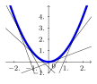{fig-alt="Parabole y = x² et quelques tangentes, toutes situées sous la courbe" width="70%" fig-align="center"}
::::

:::: {.column width="50%"}
La fonction $g(x)=\sqrt{x}$ est concave sur $]0;+\infty[$.

Pour tout $x$ réel strictement positif, $g'(x)=\dfrac{1}{2\sqrt{x}}$ et la fonction $g'$ est décroissante sur $]0;+\infty[$.

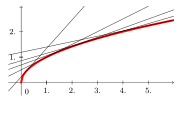{fig-alt="Courbe de la racine carrée et quelques tangentes, toutes situées au-dessus de la courbe" width="90%" fig-align="center"}
::::

:::::
::::::

## Point d'inflexion

::: {.definition}
Soit $f$ une fonction dérivable sur un intervalle $I$ et $\mathcal{C}$ sa courbe représentative dans un repère. Soit $a \in I$. Dire que le point $A\left( a; f(a) \right)$ est un point d'inflexion de $\mathcal{C}$ signifie qu'en $A$ la courbe $\mathcal{C}$ traverse sa tangente.
:::

**Conséquence**

En l'abscisse $a$, $f$ passe de convexe à concave ou de concave à convexe.

::: {.exemple}
La fonction $f(x)=x^3$ est concave sur $]- \infty; 0]$ et convexe sur $[0; +\infty[$.

La fonction admet donc comme point d'inflexion l'origine du repère.

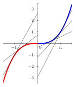{fig-alt="Courbe de la fonction cube, concave pour x négatif et convexe pour x positif, avec quelques tangentes" width="70%" fig-align="center"}
:::

::: {.proposition}
Soit $f$ une fonction deux fois dérivable sur un intervalle $I$, $\mathcal{C}$ sa représentation graphique dans un repère et $a\in I$.

Le point $A \left( a; f(a) \right)$ est un point d'inflexion de $\mathcal{C}$ si, et seulement si, $f''$ s'annule en $a$ en changeant de signe.
:::

::: {.callout-caution collapse="true"}
## Solution

Montrons que le point $A \left( a; f(a) \right)$ est un point d'inflexion de $\mathcal{C}$ si, et seulement si, $f''$ s'annule en $a$ en changeant de signe.

$f''$ s'annule en changeant de signe en $a$ si, et seulement si, $f'$ change de sens de variation en $a$. Donc $f$ change de convexité en $a$ et la fonction $f$ admet alors un point d'inflexion en $a$.
:::

::: {.methode}
Montrons que la fonction cube admet un point d'inflexion :

1.  On vérifie que la fonction est deux fois dérivable sur l'intervalle étudié : la fonction cube $f$ est deux fois dérivable sur $\mathbb{R}$ car c'est une fonction polynôme.

2.  On calcule $f''$ : $f'(x)=3x^2$ et $f''(x)=6x$.

3.  Étude du signe de $f''$ : $f''(x) \geqslant 0 \quad \Longleftrightarrow \quad 6x \geqslant 0 \quad \Longleftrightarrow \quad x \geqslant 0$

    {fig-alt="Tableau de signes de f''(x) = 6x : négatif avant 0, nul en 0, positif après" width="70%" fig-align="center"}

4.  On conclut : la dérivée seconde s'annule en changeant de signe en $0$. On retrouve le fait que l'origine $O$ du repère représente un point d'inflexion de la courbe de $f$.
:::

::: {.application}
Soit $f$ la fonction définie sur $\mathbb{R}$ par $f(x)=0{,}5x^4+x^3-6x^2-1$.\
Étudier la convexité de $f$ sur $\mathbb{R}$ et donner les éventuels points d'inflexion de sa courbe représentative $C_f$.\
:::

::: {.callout-caution collapse="true"}
## Solution

$f$ est une fonction polynôme donc elle est dérivable sur $\mathbb{R}$.\
Pour $x$ réel, $f'(x)=2x^3+3x^2-12x$\
$f'$ est une fonction polynôme donc elle est dérivable sur $\mathbb{R}$.\
Pour $x$ réel, $f''(x)=6x^2+6x-12$\
$\Delta=6^2-4\times 6 \times (-12)=324=18^2>0$\
donc $f''$ admet deux racines réelles distinctes :\
$x_1=\frac{-6-18}{2 \times 6}=-2$ et $x_2=\frac{-6+18}{2 \times 6}=1$

{fig-alt="Tableau de signes de f'' et convexité de f : convexe jusqu'à −2, concave entre −2 et 1, convexe après 1" width="70%" fig-align="center"}

$f''$ change de signe et s'annule en $-2$ et $1$ donc la courbe représentative $C_f$ admet deux points d'inflexion aux points d'abscisses $-2$ et 1.
:::

# Notion de continuité

::: {.definition}
On dit qu'une fonction $f$ est continue sur un intervalle $I$ lorsque sa courbe représentative ne présente aucune rupture (on peut tracer la courbe sans lever le crayon de la feuille).
:::

::::: {.columns}

:::: {.column width="33%"}
La fonction carré est continue sur $\mathbb{R}$.

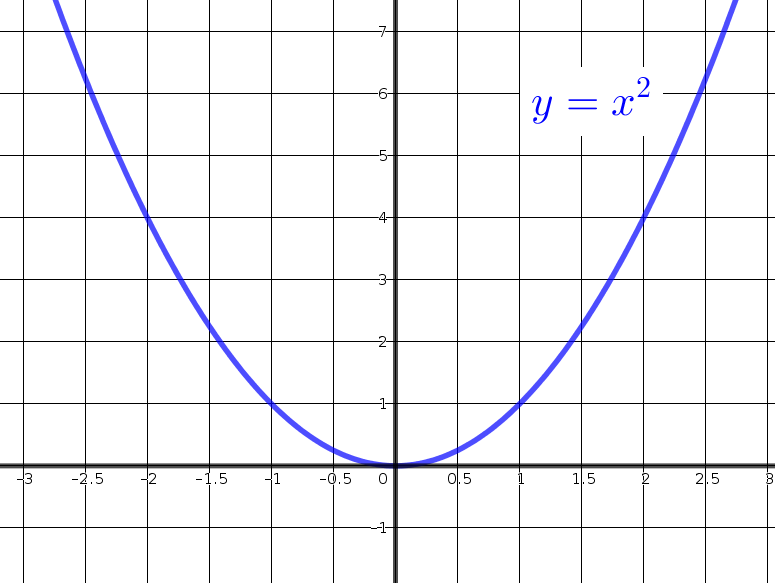{fig-alt="Parabole de la fonction carré, tracée sans lever le crayon" width="90%" fig-align="center"}
::::

:::: {.column width="33%"}
La fonction inverse est continue sur $]-\infty;0[$ et sur $]0;+\infty[$, mais pas sur $\mathbb{R}$.

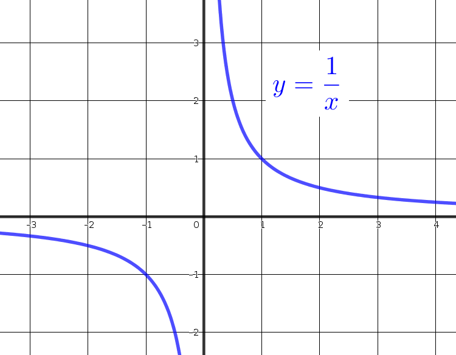{fig-alt="Hyperbole de la fonction inverse, en deux branches séparées en 0" width="90%" fig-align="center"}
::::

:::: {.column width="33%"}
La fonction $f$ ci-dessous est définie sur $[0;5]$, mais n'est pas continue.

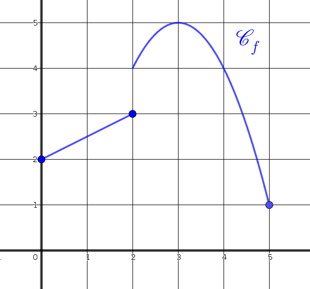{fig-alt="Courbe d'une fonction présentant un saut sur l'intervalle [0;5]" width="90%" fig-align="center"}
::::

:::::

::: {.definition}
Soit $f$ une fonction définie sur un intervalle $I$ de $\mathbb{R}$. Soit $a\in I$.\
On dit que $f$ est continue en $a$ si $f$ admet une limite en $a$, égale à $f(a)$.

On dit que $f$ est continue sur $I$ si $f$ est continue en $a$ pour tout $a\in I$.
:::

::: {.remarque}
Il faudra parfois étudier la limite de $f$ à gauche et à droite de $a$.
:::

::: {.application}
Soit la fonction $f$ définie sur $\mathbb{R}$ par $f(x)=\begin{cases}e^{x-2} ~\text{si} ~x \in ]-\infty;2[\\3-x ~\text{si}~ x \in [2;+\infty[\end{cases}$ .\
Étudier la continuité de $f$ en 2.
:::

::: {.callout-caution collapse="true"}
## Solution

$\lim\limits_{x \to 2^-} e^{x-2}=1$ et $\lim\limits_{x \to 2^+} (3-x)=1$\
donc, $\lim\limits_{x \to 2^-} e^{x-2}=\lim\limits_{x \to 2^+} (3-x)=1=f(2)$\
Donc, $f$ est continue en 2.
:::

::: {.proposition}
Une fonction obtenue par opérations sur les fonctions usuelles est continue sur chaque intervalle où elle est définie.
:::

::: {.proposition}
Les fonctions affines, polynomiales, rationnelles sont continues sur tout intervalle de leur ensemble de définition.
:::

::: {.proposition}
Toute fonction dérivable sur un intervalle est continue sur cet intervalle.
:::

::: {.remarque}
La réciproque de cette proposition est fausse: par exemple, la fonction racine carrée est définie et continue sur $\mathbb{R}^+$, mais dérivable seulement sur $\mathbb{R}^{+*}$.
:::

# Théorème des valeurs intermédiaires

## Exemples

:::::: {.exemple}
::::: {.columns}

:::: {.column width="50%"}
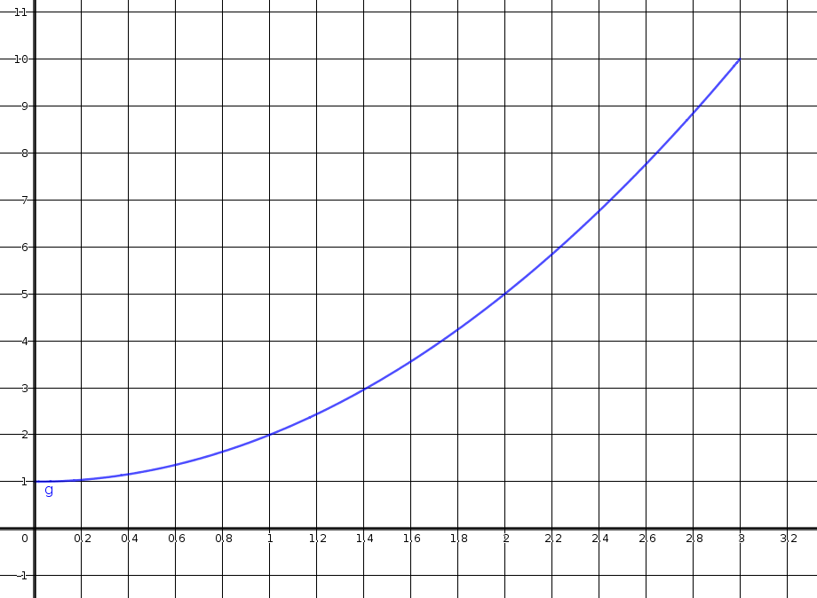{fig-alt="Courbe continue et strictement croissante sur [0;3], de 1 à 10, qui atteint une seule fois la valeur 4" width="95%" fig-align="center"}
::::

:::: {.column width="50%"}
**Exemple 1**

Soit $f$ une fonction continue et strictement croissante sur $[0;3]$. $f$ prend une et une seule fois toute valeur comprise entre $f(0)$ et $f(3)$, c'est-à-dire entre 1 et 10. Par exemple, $f$ prend une seule fois la valeur $4$.
::::

:::::
::::::

:::::: {.exemple}
::::: {.columns}

:::: {.column width="50%"}
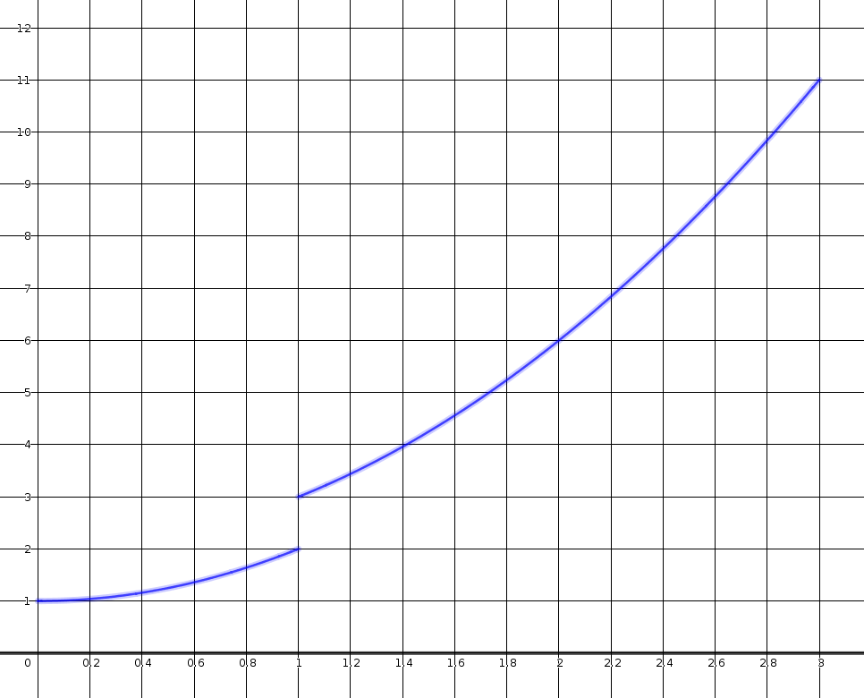{fig-alt="Courbe non continue sur [0;3] qui saute par-dessus la valeur 2,5" width="95%" fig-align="center"}
::::

:::: {.column width="50%"}
**Exemple 2**

La fonction $g$ n'est pas continue sur $[0;3]$. Ainsi $g$ ne prend pas toutes les valeurs entre $g(0)$ et $g(3)$. Par exemple, $g$ ne prend jamais la valeur $2{,}5$.
::::

:::::
::::::

:::::: {.exemple}
::::: {.columns}

:::: {.column width="50%"}
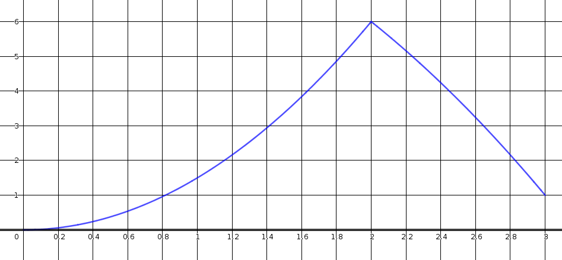{fig-alt="Courbe continue non monotone sur [0;3] qui atteint deux fois la valeur 4" width="95%" fig-align="center"}
::::

:::: {.column width="50%"}
**Exemple 3**

Soit $h$ une fonction continue mais pas strictement monotone sur $[0;3]$. $h$ peut prendre plusieurs fois la même valeur entre $h(0)$ et $h(3)$. Par exemple la valeur 4 est prise deux fois.
::::

:::::
::::::

## Résultats

::: {.theoreme}
**Théorème des valeurs intermédiaires**

Soit $f$ une fonction continue sur un intervalle $[a;b]$. Toutes les valeurs intermédiaires entre $f(a)$ et $f(b)$ sont prises au moins une fois.\
Autrement dit, pour tout réel $k$ compris entre $f(a)$ et $f(b)$ il existe au moins un réel $c \in [a;b]$ tel que $f(c)=k$.
:::

::: {.remarque}
Si $f(a)$ et $f(b)$ sont de signes contraires, alors 0 est une valeur intermédiaire. Donc l'équation $f(x)=0$ admet au moins une solution dans l'intervalle $[a;b]$.
:::

::: {.theoreme}
**Théorème de la bijection, ou corollaire du théorème des valeurs intermédiaires**

Soit $f$ une fonction continue et strictement monotone sur un intervalle $[a;b]$. Soit $k$ un réel compris entre $f(a)$ et $f(b)$.\
L'équation $f(x)=k$ admet une unique solution dans l'intervalle $[a;b]$.
:::

::: {.application}
Soit $f$ la fonction dont le tableau de variations est le suivant:

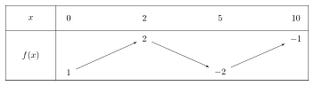{fig-alt="Tableau de variations : f croît de 1 à 2 sur [0;2], décroît de 2 à −2 sur [2;5], puis croît de −2 à −1 sur [5;10]" width="70%" fig-align="center"}

1.  Démontrer que l'équation $f(x)=0$ admet une unique solution sur $[2;5]$.

2.  Démontrer que l'équation $f(x)=0$ n'admet pas de solution sur $[0;2]$.

3.  Démontrer que l'équation $f(x)=0$ n'admet pas de solution sur $[5;10]$.

4.  En déduire le nombre exact de solutions de l'équation $f(x)=0$ sur $[0;10]$.
:::

::: {.application}
On considère la fonction $f$ définie sur $\mathbb{R}$ par $f(x)=e^x-x$.

1.  Dresser le tableau de variations de la fonction $f$ sur $\mathbb{R}$.

2.  Démontrer que l'équation $f(x)=2$ admet exactement deux solutions dans $\mathbb{R}$.

3.  Donner une valeur approchée au dixième de ces solutions.
:::

::: {.callout-caution collapse="true"}
## Solution

1.  -   La fonction $f$ est dérivable sur $\mathbb{R}$ comme somme de fonctions dérivables sur $\mathbb{R}$.\
        Soit $x \in \mathbb{R}$, $f'(x)=e^x-1$\
        $e^x-1 \geqslant 0 \Leftrightarrow e^x \geqslant e^0 \Leftrightarrow x \geqslant 0$

    -   $\lim\limits_{x \to -\infty} e^{x}=0$ et $\lim\limits_{x \to -\infty} (-x)=+\infty$ donc, par somme, $\lim\limits_{x \to -\infty} f(x)=+\infty$

    -   Soit $x \in \mathbb{R}^*$, $f(x)=e^x(1-\frac{1}{\frac{e^x}{x}})$\
        D'après le théorème des croissances comparées : $\lim\limits_{x \to +\infty} \frac{e^x}{x}=+\infty$ donc, par quotient, $\lim\limits_{x \to +\infty} \frac{1}{\frac{e^x}{x}}=0$\
        donc, par somme $\lim\limits_{x \to +\infty} (1-\frac{1}{\frac{e^x}{x}})=1$ et $\lim\limits_{x \to +\infty} {e^x}=+\infty$, donc, par produit, $\lim\limits_{x \to +\infty} f(x)=+\infty$

    On obtient le tableau de variations :

    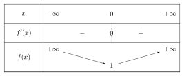{fig-alt="Tableau de variations de f(x) = eˣ − x : décroissante de +∞ à 1 sur ]−∞;0], croissante de 1 à +∞ ensuite" width="70%" fig-align="center"}

2.  La fonction $f$ est définie, continue (car dérivable) et strictement décroissante sur $]-\infty;0]$.\
    2 est compris entre $f(0)=1$ et $\lim\limits_{x \to -\infty} f(x)=+\infty$.\
    D'après le corollaire du théorème des valeurs intermédiaires, l'équation $f(x)=2$ admet une unique solution $\alpha_1$ sur $]-\infty;0]$.\
    La fonction $f$ est définie, continue (car dérivable) et strictement croissante sur $[0;+\infty[$.\
    2 est compris entre $f(0)=1$ et $\lim\limits_{x \to +\infty} f(x)=+\infty$.\
    D'après le corollaire du théorème des valeurs intermédiaires, l'équation $f(x)=2$ admet une unique solution $\alpha_2$ sur $[0;+\infty[$.\
    Donc, l'équation $f(x)=2$ admet deux solutions dans $\mathbb{R}$.

3.  Avec la calculatrice, on trouve $\alpha_1 \approx -1{,}8$ et $\alpha_2 \approx 1{,}1$ (au centième : $\alpha_1 \approx -1{,}84$ et $\alpha_2 \approx 1{,}15$).
:::

## Application aux suites

### Image d'une suite convergente par une fonction continue

::: {.proposition}
Soit $f$ une fonction définie et continue sur un intervalle $I$ de $\mathbb{R}$.\
Soit $(u_n)$ une suite telle que, pour tout entier naturel $n$, $u_n \in I$.\
Si $(u_n)$ est convergente vers un nombre réel $\ell$ appartenant à $I$, alors la suite $(f(u_n))$ converge vers $f(\ell)$.
:::

::: {.exemple}
Soit $f$ la fonction définie sur $[-3;+\infty[$ par $f(x)=\sqrt{3+x}$.\
Soit $(u_n)$ la suite définie sur $\mathbb{N}$ par $u_n=\frac{1}{n+4}$.\
Par somme, $\lim\limits_{n \to +\infty} (n+4)=+\infty$\
Par quotient, $\lim\limits_{n \to +\infty} u_n=0$\
$f$ est continue sur $[-3;+\infty[$ donc $\lim\limits_{n \to +\infty} f(u_n)=f(0)=\sqrt{3}$
:::

### Limite d'une suite $u_{n+1}=f(u_n)$

::: {.theoreme}
**Théorème du point fixe**

Soit $f$ une fonction définie et continue sur un intervalle $I$ de $\mathbb{R}$ et à valeurs dans $I$.\
Soit $(u_n)$ une suite définie par la relation de récurrence $u_{n+1}=f(u_n)$, avec son premier terme $u_0 \in I$.\
Si $(u_n)$ converge vers un nombre réel $\ell$ appartenant à $I$ alors $\ell$ est une solution de l'équation $f(x)=x$.
:::

::: {.callout-caution collapse="true"}
## Solution

Avec les mêmes hypothèses.\
D'une part, $(u_n)$ converge vers un réel $\ell$ donc $\lim\limits_{n \to +\infty} u_n=\lim\limits_{n \to +\infty} u_{n+1}=\ell$.\
D'autre part, d'après la propriété précédente, $\lim\limits_{n \to +\infty} u_{n+1}=\lim\limits_{n \to +\infty} f(u_n)=f(\lim\limits_{n \to +\infty} u_{n})=f(\ell)$\
Ainsi, $f(\ell)=\ell$.\
:::

::: {.remarque}
Autrement dit, $f(\ell)=\ell$. Attention, ce n'est pas forcément la seule solution de l'équation $f(x)=x.$
:::

::: {.application}
On considère la suite $(u_n)$ définie sur $\mathbb{N}$ par $u_0=\frac{5}{2}$ et $u_{n+1}=f(u_n)$ où $f$ est la fonction définie sur $\mathbb{R}$ par $f(x)=-x^2+6x-6$.

1.  Démontrer que la fonction $f$ est strictement croissante sur $[2;3]$.

2.  Démontrer que, pour tout $n \in \mathbb{N}$, $2<u_n<u_{n+1}<3$.

3.  En déduire que la suite $(u_n)$ est convergente et déterminer sa limite.
:::

::: {.callout-caution collapse="true"}
## Solution

1.  $f$ est une fonction polynôme donc dérivable sur $\mathbb{R}$ donc sur $[2;3]$,\
    et pour tout $x \in [2;3]$, $f'(x)=-2x+6$.\
    $-2x+6 \geqslant 0 \Leftrightarrow 6 \geqslant 2x \Leftrightarrow 3 \geqslant x$\
    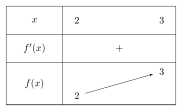{fig-alt="Tableau de variations sur [2;3] : f' positive, f croissante de 2 à 3" width="70%" fig-align="center"}

2.  Soit $n \in \mathbb{N}$, $P_n$ : « $2<u_n<u_{n+1}<3$ »\
    Initialisation :\
    $u_0=\frac{5}{2}$ et $u_1=f(u_0)=-(\frac{5}{2})^2+6 \times \frac{5}{2}-6=\frac{11}{4}$\
    Ainsi, $2<u_0<u_1<3$\
    Donc $P_0$ vraie.\
    Hérédité :\
    Supposons $P_n$ vraie pour un entier naturel $n$ quelconque.\
    $2<u_n<u_{n+1}<3$\
    $\Leftrightarrow f(2)<f(u_n)<f(u_{n+1})<f(3)$ car $f$ est strictement croissante sur $[2;3]$\
    $\Leftrightarrow 2<f(u_n)<f(u_{n+1})<3$\
    Donc $P_{n+1}$ vraie.\
    Conclusion :\
    $P_0$ est vraie.\
    $\forall n \in \mathbb{N}$, $P_n$ vraie $\Rightarrow$ $P_{n+1}$ vraie.\
    Donc, $\forall n \in \mathbb{N}$, $2<u_n<u_{n+1}<3$

3.  La suite $(u_n)$ est donc croissante et majorée (par 3) donc, d'après le théorème de convergence des suites monotones, elle converge vers un réel $\ell$.\
    $f$ est une fonction définie et continue sur $[2;3]$ et à valeurs dans $[2;3]$.\
    $(u_n)$ est définie par la relation de récurrence $u_{n+1}=f(u_n)$, avec son premier terme $u_0 \in [2;3]$.\
    D'après le théorème du point fixe, $\ell$ est une solution de l'équation $f(x)=x$.\
    $f(x)=x \Leftrightarrow -x^2+6x-6=x \Leftrightarrow -x^2+5x-6=0$\
    $\Delta=5^2-4 \times (-1) \times (-6)=1=1^2>0$\
    donc cette équation admet deux solutions réelles distinctes :\
    $x_1=\frac{-5-1}{-2}=3$ et $x_2=\frac{-5+1}{-2}=2$\
    Comme $u_0=\frac{5}{2}$ et que $(u_n)$ est croissante alors $\ell=3$.
:::
