```css
```
```{=html}
<style>
:root {
  --def-color:   #2563eb;
  --prop-color:  #7c3aed;
  --theo-color:  #c026d3;
  --voc-color:   #0d9488;
  --rem-color:   #d97706;
  --ex-color:    #16a34a;
  --app-color:   #ea580c;
  --not-color:   #4f46e5;
  --meth-color:  #dc2626;
  --ill-color:   #475569;
}

.definition, .proposition, .theoreme, .vocabulaire, .remarque, .exemple, .application,
.notation, .methode, .illustration {
  margin: 1.5em 0;
  padding: 1em 1.3em 1em 1.3em;
  border-radius: 10px;
  border-left: 6px solid;
  box-shadow: 0 1px 4px rgba(0,0,0,0.08);
  font-family: "Georgia", serif;
}

.definition::before, .proposition::before, .theoreme::before, .vocabulaire::before,
.remarque::before, .exemple::before, .application::before,
.notation::before, .methode::before, .illustration::before {
  display: block;
  font-family: "Helvetica Neue", Arial, sans-serif;
  font-weight: 700;
  font-size: 0.95em;
  letter-spacing: 0.03em;
  text-transform: uppercase;
  margin-bottom: 0.6em;
}

.definition {
  background: #eff6ff;
  border-color: var(--def-color);
  color: #1e3a5f;
}
.definition::before {
  content: "📘  Définition";
  color: var(--def-color);
}

.proposition {
  background: #f5f3ff;
  border-color: var(--prop-color);
  color: #3b2467;
}
.proposition::before {
  content: "📐  Proposition";
  color: var(--prop-color);
}

.theoreme {
  background: #fdf4ff;
  border-color: var(--theo-color);
  color: #701a75;
}
.theoreme::before {
  content: "🏛️  Théorème";
  color: var(--theo-color);
}

.vocabulaire {
  background: #f0fdfa;
  border-color: var(--voc-color);
  color: #0f4c46;
}
.vocabulaire::before {
  content: "🏷️  Vocabulaire";
  color: var(--voc-color);
}

.remarque {
  background: #fffbeb;
  border-color: var(--rem-color);
  color: #6b4a06;
}
.remarque::before {
  content: "💡  Remarque";
  color: var(--rem-color);
}

.exemple {
  background: #f0fdf4;
  border-color: var(--ex-color);
  color: #14532d;
}
.exemple::before {
  content: "🔍  Exemple";
  color: var(--ex-color);
}

.application {
  background: #fff7ed;
  border: 2px dashed var(--app-color);
  border-left: 6px solid var(--app-color);
  color: #7c2d12;
}
.application::before {
  content: "✏️  Application";
  color: var(--app-color);
  font-size: 1.05em;
}

.notation {
  background: #eef2ff;
  border-color: var(--not-color);
  color: #312e81;
}
.notation::before {
  content: "🖊️  Notation";
  color: var(--not-color);
}

.methode {
  background: #fef2f2;
  border-color: var(--meth-color);
  color: #7f1d1d;
}
.methode::before {
  content: "🧭  Méthode";
  color: var(--meth-color);
}

.illustration {
  background: #f8fafc;
  border-color: var(--ill-color);
  color: #1e293b;
}
.illustration::before {
  content: "🖼️  Illustration";
  color: var(--ill-color);
}

/* Callouts "Solution" un peu plus stylés */
div.callout-caution {
  border-radius: 10px;
  box-shadow: 0 1px 4px rgba(0,0,0,0.08);
}
div.callout-caution .callout-title {
  font-family: "Helvetica Neue", Arial, sans-serif;
  font-weight: 700;
}
div.callout-caution .callout-title::before {
  content: "🔓  ";
}
</style>
```

\gdef\R{\mathbb{R}}

\gdef\N{\mathbb{N}}

# Vecteurs, droites et plans de l'espace

## Vecteurs de l'espace

### Définition d'un vecteur de l'espace

::: {.definition}
Soient $A$ et $B$ deux points de l'espace. On associe le vecteur $\overrightarrow{AB}$ à la translation qui transforme $A$ en $B$.
:::

::: {.proposition}
Deux vecteurs $\overrightarrow{AB}$ et $\overrightarrow{CD}$ sont égaux si et seulement si $ABDC$ est un parallélogramme (éventuellement aplati). On peut alors noter $\overrightarrow{u}=\overrightarrow{AB}=\overrightarrow{CD}$.
:::

::: {.vocabulaire}
Les vecteurs $\overrightarrow{AB}$ et $\overrightarrow{CD}$ sont des représentants du vecteur $\overrightarrow{u}$.
:::

::: {.remarque}
- Deux vecteurs sont égaux s'ils ont même direction, même sens et même norme.
- Lorsque $A$ et $B$ sont confondus, on dit que le vecteur $\overrightarrow{AB}$ est nul et on le note $\overrightarrow{0}$.
:::

::: {.theoreme}
Soient $\overrightarrow{u}$ un vecteur et $A$ un point de l'espace. Il existe un unique point $M$ tel que $\overrightarrow{AM}=\overrightarrow{u}$.
:::

::: {.vocabulaire}
On dit que $\overrightarrow{AM}$ est le représentant de $\overrightarrow{u}$ d'origine $A$.
:::

### Opérations sur les vecteurs de l'espace

::: {.definition}
**Règle du parallélogramme**

Soient $\overrightarrow{u}$ et $\overrightarrow{v}$ deux vecteurs de l'espace de représentants respectifs $\overrightarrow{u}=\overrightarrow{AB}$ et $\overrightarrow{v}=\overrightarrow{AC}$. La somme des vecteurs $\overrightarrow{u}$ et $\overrightarrow{v}$ est le vecteur noté $\overrightarrow{u}+\overrightarrow{v}$ de représentant $\overrightarrow{AD}$ tel que $ABDC$ soit un parallélogramme.
:::

::: {.illustration}
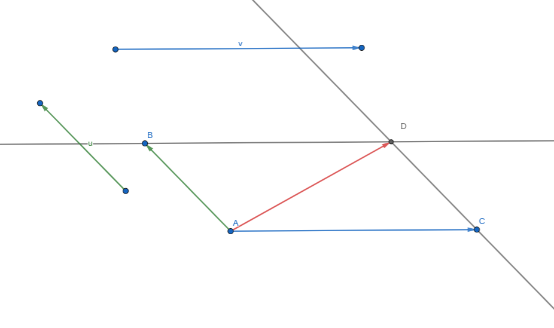{fig-alt="Somme de deux vecteurs avec la règle du parallélogramme" fig-align="center" width="55%"}

🔗 [Figure interactive GeoGebra](https://www.geogebra.org/geometry/rjmukfnq){target="_blank"}
:::

::: {.proposition}
**Relation de Chasles**

Pour tous points $A$, $B$ et $C$ de l'espace, $\overrightarrow{AB}+\overrightarrow{BC}=\overrightarrow{AC}$.
:::

::: {.definition}
- Soient $\overrightarrow{u}$ un vecteur non nul et $k$ un réel non nul. Le vecteur $k\overrightarrow{u}$ est le vecteur qui a :
  - la même direction que le vecteur $\overrightarrow{u}$ ;
  - le même sens que $\overrightarrow{u}$ si $k>0$, le sens contraire de $\overrightarrow{u}$ si $k<0$ ;
  - pour norme $|k|\times\|\overrightarrow{u}\|$.
- Pour tout vecteur $\overrightarrow{u}$ et pour tout réel $k$, $0\overrightarrow{u}=k\overrightarrow{0}=\overrightarrow{0}$.
:::

::: {.proposition}
Soient $\overrightarrow{u}$ et $\overrightarrow{v}$ deux vecteurs de l'espace. Soient $k$ et $k'$ deux réels.

- $k\overrightarrow{u}=\overrightarrow{0}\Leftrightarrow k=0$ ou $\overrightarrow{u}=\overrightarrow{0}$
- $k(k'\overrightarrow{u})=kk'\overrightarrow{u}$
- $(k+k')\overrightarrow{u}=k\overrightarrow{u}+k'\overrightarrow{u}$
- $k(\overrightarrow{u}+\overrightarrow{v})=k\overrightarrow{u}+k\overrightarrow{v}$
:::

::: {.definition}
Soient $\overrightarrow{u}$ et $\overrightarrow{v}$ deux vecteurs de l'espace. On dit que $\overrightarrow{u}$ et $\overrightarrow{v}$ sont colinéaires s'il existe un réel $k$ tel que $\overrightarrow{u}=k\overrightarrow{v}$ ou $\overrightarrow{v}=k\overrightarrow{u}$.
:::

::: {.remarque}
- Deux vecteurs non nuls sont colinéaires si et seulement si ils ont la même direction.
- Le vecteur nul est colinéaire à tout vecteur.
:::

## Droites et plans de l'espace

### Caractérisation vectorielle d'une droite

::: {.definition}
Soient $A$ et $B$ deux points distincts de l'espace.

La droite $(AB)$ est l'ensemble des points $M$ tels que $\overrightarrow{AM}=k\overrightarrow{AB}$, où $k\in\R$.

On dit que $\overrightarrow{AB}$ est un vecteur directeur de la droite $(AB)$.
:::

::: {.illustration}
{fig-alt="Droite (AB) définie par le vecteur AB" fig-align="center" width="55%"}

🔗 [Figure interactive GeoGebra](https://www.geogebra.org/3d/nwtu7b6u){target="_blank"}
:::

::: {.remarque}
Un point $A$ et un vecteur $\overrightarrow{u}$ suffisent à déterminer une droite : c'est la droite passant par le point $A$ et de vecteur directeur $\overrightarrow{u}$.
:::

### Caractérisation vectorielle d'un plan

::: {.definition}
Soient $\overrightarrow{u}$, $\overrightarrow{v}$ et $\overrightarrow{w}$ trois vecteurs de l'espace tels que $\overrightarrow{u}$ et $\overrightarrow{v}$ ne sont pas colinéaires.

$\overrightarrow{u}$, $\overrightarrow{v}$ et $\overrightarrow{w}$ sont coplanaires lorsqu'il existe deux réels $x$ et $y$ tels que $\overrightarrow{w}=x\overrightarrow{u}+y\overrightarrow{v}$.

On dit alors que $\overrightarrow{w}$ est une combinaison linéaire des vecteurs $\overrightarrow{u}$ et $\overrightarrow{v}$.
:::

::: {.exemple}
On considère la pyramide régulière à base carrée ci-dessous. Montrer que les vecteurs $\overrightarrow{SO}$, $\overrightarrow{SA}$ et $\overrightarrow{SC}$ sont coplanaires.

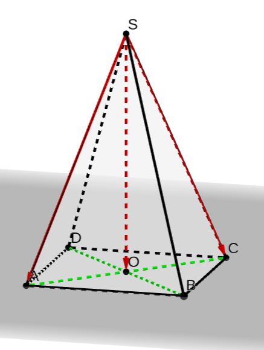{fig-alt="Pyramide régulière SABCD à base carrée, de centre O" fig-align="center" width="50%"}

🔗 [Figure interactive GeoGebra](https://www.geogebra.org/3d/rseyquxt){target="_blank"}
:::

:::{.callout-caution collapse="true"}
## Solution

Dans la pyramide régulière à base carrée, on a l'égalité $\overrightarrow{SO}=\dfrac{1}{2}\overrightarrow{SA}+\dfrac{1}{2}\overrightarrow{SC}$. Les vecteurs $\overrightarrow{SO}$, $\overrightarrow{SA}$ et $\overrightarrow{SC}$ sont donc coplanaires.

On peut remarquer que $\overrightarrow{SO}$, $\overrightarrow{SA}$ et $\overrightarrow{SB}$ ne sont pas coplanaires.
:::

::: {.definition}
On dit que des points sont coplanaires lorsqu'il existe un plan qui contient ces points.

Soient $A$, $B$ et $C$ trois points non alignés de l'espace.

- Le plan $(ABC)$ est l'ensemble des points $M$ tels que $\overrightarrow{AM}=x\overrightarrow{AB}+y\overrightarrow{AC}$ où $x\in\R$ et $y\in\R$.
- $\overrightarrow{AB}$ et $\overrightarrow{AC}$ sont des vecteurs directeurs du plan $(ABC)$, $(\overrightarrow{AB},\overrightarrow{AC})$ est une base de ce plan et $(A;\overrightarrow{AB},\overrightarrow{AC})$ est un repère de ce plan.
:::

::: {.remarque}
- Trois points sont toujours coplanaires.
- Un point $A$ et deux vecteurs non colinéaires $\overrightarrow{u}$ et $\overrightarrow{v}$ (ou trois points non alignés) suffisent à déterminer un plan : c'est le plan passant par $A$ et de vecteurs directeurs $\overrightarrow{u}$ et $\overrightarrow{v}$ (on dit aussi que le plan est dirigé par $\overrightarrow{u}$ et $\overrightarrow{v}$). Par exemple, dans la pyramide ci-dessus, le point $S$ et les vecteurs $\overrightarrow{SA}$ et $\overrightarrow{SB}$ suffisent à déterminer le plan $(SAB)$.
:::

::: {.proposition}
Soient $\overrightarrow{u}$, $\overrightarrow{v}$ et $\overrightarrow{w}$ trois vecteurs de l'espace tels que $\overrightarrow{u}=\overrightarrow{AB}$, $\overrightarrow{v}=\overrightarrow{AC}$ et $\overrightarrow{w}=\overrightarrow{AD}$.

$\overrightarrow{u}$, $\overrightarrow{v}$ et $\overrightarrow{w}$ sont coplanaires si et seulement si les points $A$, $B$, $C$ et $D$ sont coplanaires.
:::

::: {.exemple}
On considère le cube représenté ci-dessous. On pose $\overrightarrow{u}=\overrightarrow{AH}$, $\overrightarrow{v}=\overrightarrow{BC}$ et $\overrightarrow{w}=\overrightarrow{BF}$.

Montrer que les vecteurs $\overrightarrow{u}$, $\overrightarrow{v}$ et $\overrightarrow{w}$ sont coplanaires.

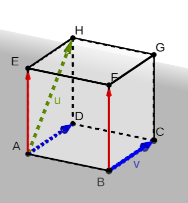{fig-alt="Cube ABCDEFGH" fig-align="center" width="45%"}

🔗 [Figure interactive GeoGebra](https://www.geogebra.org/3d/d99q5wng){target="_blank"}
:::

:::{.callout-caution collapse="true"}
## Solution

On a $\overrightarrow{v}=\overrightarrow{AD}$ et $\overrightarrow{w}=\overrightarrow{AE}$. Or $A$, $D$, $H$ et $E$ sont quatre points coplanaires, donc les vecteurs $\overrightarrow{u}$, $\overrightarrow{v}$ et $\overrightarrow{w}$ sont coplanaires.
:::

## Positions relatives de droites et de plans de l'espace

### Positions relatives de deux plans

::: {.definition}
Deux plans de l'espace peuvent être :

- soit strictement parallèles (ils n'ont alors aucun point commun) ;
- soit parallèles et confondus (tous leurs points sont communs) ;
- soit sécants, leur intersection est alors une droite contenue dans ces deux plans.
:::

::: {.remarque}
Deux plans parallèles sont soit strictement parallèles soit confondus.
:::

:::::: {.illustration}
::::: {.columns}

:::: {.column width="33%"}
{fig-alt="Deux plans strictement parallèles" fig-align="center"}

🔗 [GeoGebra](https://www.geogebra.org/m/cv8gsyvv){target="_blank"}
::::

:::: {.column width="33%"}
{fig-alt="Deux plans confondus" fig-align="center"}

🔗 [GeoGebra](https://www.geogebra.org/3d/wbhdtptm){target="_blank"}
::::

:::: {.column width="33%"}
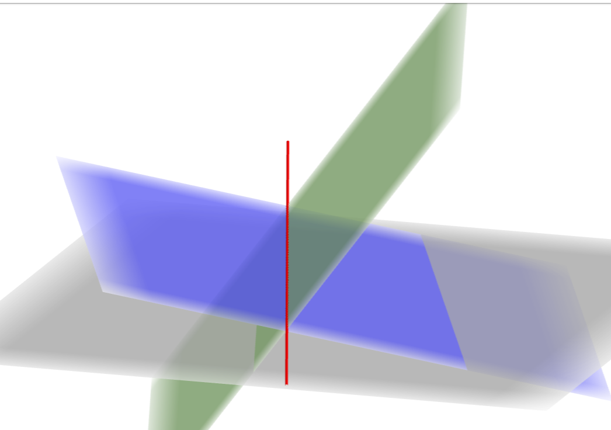{fig-alt="Deux plans sécants selon une droite" fig-align="center"}

🔗 [GeoGebra](https://www.geogebra.org/3d/h7ppuuvg){target="_blank"}
::::

:::::
::::::

### Positions relatives de deux droites

::: {.definition}
Deux droites de l'espace sont soit coplanaires (elles sont alors dans un même plan) soit non coplanaires.
:::

::: {.definition}
Deux droites de l'espace qui sont coplanaires sont :

- soit strictement parallèles ;
- soit parallèles et confondues ;
- soit sécantes en un point.
:::

::: {.illustration}
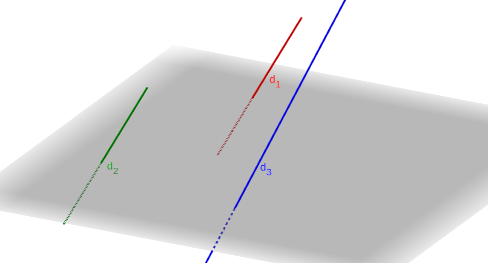{fig-alt="Trois droites d1, d2, d3 dans l'espace" fig-align="center" width="55%"}

Les droites $d_1$ et $d_2$ sont parallèles, les droites $d_1$ et $d_3$ ne sont pas coplanaires.

🔗 [Figure interactive GeoGebra](https://www.geogebra.org/m/rbevkqdu){target="_blank"}
:::

::: {.illustration}
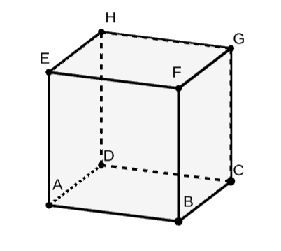{fig-alt="Cube ABCDEFGH avec les droites (AB), (DC) et (CG)" fig-align="center" width="55%"}

Les droites $(AB)$ et $(DC)$ sont parallèles, les droites $(AB)$ et $(CG)$ ne sont pas coplanaires.

🔗 [Figure interactive GeoGebra](https://www.geogebra.org/3d/hgcm8cxt){target="_blank"}
:::

::: {.remarque}
- Deux droites non coplanaires n'ont aucun point commun ;
- Deux droites de l'espace qui n'ont aucun point commun sont soit strictement parallèles soit non coplanaires.
:::

### Positions relatives d'une droite et d'un plan

::: {.definition}
Une droite et un plan de l'espace sont soit sécants soit parallèles. S'ils sont parallèles, soit ils sont strictement parallèles (sans point d'intersection) soit la droite est incluse dans le plan.
:::

::: {.illustration}
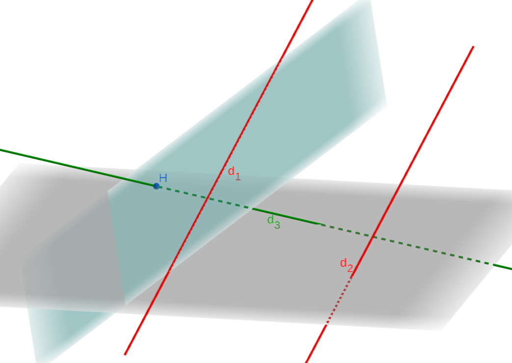{fig-alt="Trois droites d1, d2, d3 et un plan" fig-align="center" width="55%"}

La droite $d_1$ est incluse dans le plan. La droite $d_2$ est strictement parallèle au plan. La droite $d_3$ est sécante (en $H$) au plan.

🔗 [Figure interactive GeoGebra](https://www.geogebra.org/m/crxsyfb2){target="_blank"}
:::

## Propriétés du parallélisme dans l'espace

::: {.remarque}
Toutes ces propriétés sont admises.
:::

### Parallélisme de deux droites

::: {.definition}
Deux droites distinctes sont parallèles lorsqu'elles sont coplanaires et sans point commun.
:::

::: {.proposition}
Si deux droites sont parallèles alors toute droite parallèle à l'une est parallèle à l'autre.
:::

::: {.proposition}
Si deux droites sont parallèles alors tout plan qui coupe l'une coupe l'autre.
:::

### Parallélisme de deux plans

::: {.definition}
Deux plans distincts sont parallèles lorsqu'ils n'ont aucun point commun.
:::

::: {.proposition}
Si deux plans sont parallèles alors tout plan parallèle à l'un est parallèle à l'autre.
:::

::: {.proposition}
Si deux droites sécantes d'un plan $\mathcal{P}_1$ sont parallèles à deux droites sécantes d'un plan $\mathcal{P}_2$ alors $\mathcal{P}_1$ et $\mathcal{P}_2$ sont parallèles.
:::

::: {.illustration}
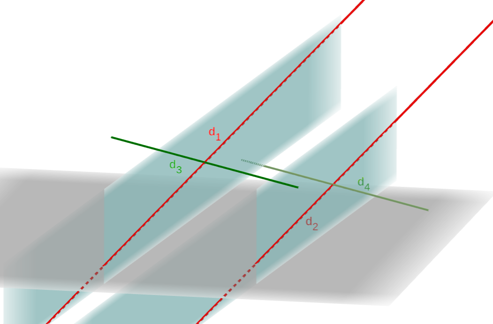{fig-alt="Deux plans parallèles contenant chacun deux droites sécantes" fig-align="center" width="55%"}

Les droites sécantes $d_1$ et $d_3$ sont respectivement parallèles aux droites $d_2$ et $d_4$. Les deux plans sont parallèles.

🔗 [Figure interactive GeoGebra](https://www.geogebra.org/m/wqkz4qf7){target="_blank"}
:::

::: {.proposition}
Si deux plans sont parallèles alors tout plan qui coupe l'un coupe l'autre et les droites d'intersection sont parallèles.
:::

::: {.illustration}
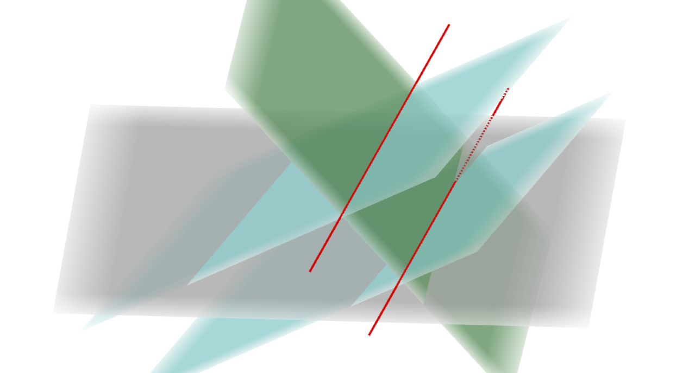{fig-alt="Un plan qui coupe deux plans parallèles selon deux droites parallèles" fig-align="center" width="55%"}

🔗 [Figure interactive GeoGebra](https://www.geogebra.org/m/cjutrhtq){target="_blank"}
:::

### Parallélisme d'une droite et d'un plan

::: {.definition}
Une droite et un plan sont parallèles lorsqu'ils n'ont aucun point commun.
:::

::: {.proposition}
Si un plan $\mathcal{P}$ contient une droite $\mathcal{D}$ parallèle à une droite $\mathcal{D}'$ alors $\mathcal{P}$ et $\mathcal{D}'$ sont parallèles.
:::

::: {.illustration}
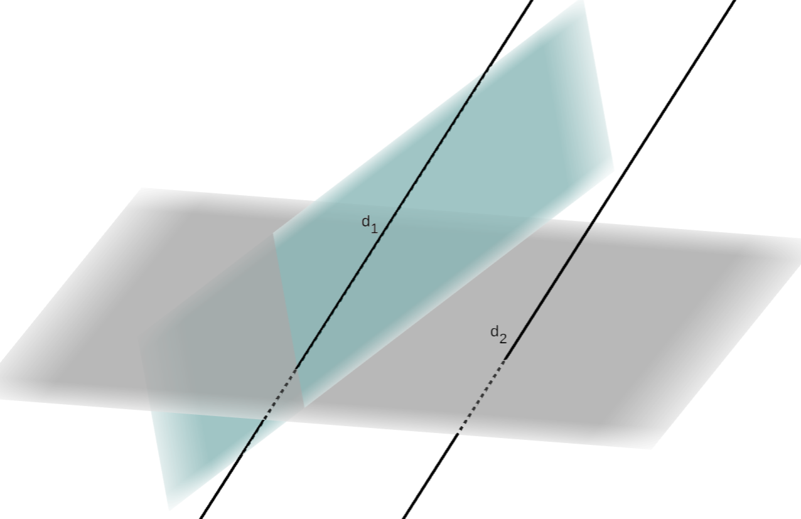{fig-alt="Un plan contenant une droite parallèle à une droite extérieure" fig-align="center" width="55%"}

🔗 [Figure interactive GeoGebra](https://www.geogebra.org/m/sc5myaqg){target="_blank"}
:::

::: {.proposition}
Si une droite $\mathcal{D}$ et un plan $\mathcal{P}$ sont parallèles alors tout plan contenant $\mathcal{D}$ et sécant à $\mathcal{P}$ coupe $\mathcal{P}$ selon une droite parallèle à $\mathcal{D}$.
:::

::: {.theoreme}
**Théorème du toit**

Soient $\mathcal{D}$ et $\mathcal{D}'$ deux droites parallèles contenues respectivement dans $\mathcal{P}$ et $\mathcal{P}'$, deux plans distincts.

Si $\mathcal{P}$ et $\mathcal{P}'$ sont sécants selon une droite $\Delta$, alors $\Delta$ est parallèle à $\mathcal{D}$ et à $\mathcal{D}'$.
:::

::: {.illustration}
{fig-alt="Théorème du toit : deux plans sécants contenant deux droites parallèles" fig-align="center" width="55%"}

🔗 [Figure interactive GeoGebra](https://www.geogebra.org/m/akycbpeg){target="_blank"}
:::

# Orthogonalité et distance dans l'espace

## Repère de l'espace

### Base de l'espace

::: {.definition}
Une base de l'espace est formée d'un triplet de vecteurs $(\overrightarrow{i},\overrightarrow{j},\overrightarrow{k})$ non coplanaires.
:::

::: {.remarque}
Les vecteurs d'une base sont tous non nuls et non colinéaires deux à deux.
:::

::: {.proposition}
Soit $(\overrightarrow{i},\overrightarrow{j},\overrightarrow{k})$ une base de l'espace.

Pour tout vecteur $\overrightarrow{u}$ de l'espace, il existe un unique triplet de réels $(x,y,z)$ tel que

$$
\overrightarrow{u}=x\overrightarrow{i}+y\overrightarrow{j}+z\overrightarrow{k}.
$$
:::

::: {.definition}
$(x,y,z)$ sont les coordonnées de $\overrightarrow{u}$ dans cette base. On note $\overrightarrow{u}\begin{pmatrix}x\\y\\z\end{pmatrix}$.
:::

### Repère de l'espace

::: {.definition}
Un repère de l'espace est formé d'un point $O$ et d'une base $(\overrightarrow{i},\overrightarrow{j},\overrightarrow{k})$. On note $(O;\overrightarrow{i},\overrightarrow{j},\overrightarrow{k})$ un tel repère. $O$ est l'origine du repère.
:::

::: {.remarque}
Attention, en changeant l'ordre des vecteurs, on change le repère.
:::

::: {.proposition}
Soit $(O;\overrightarrow{i},\overrightarrow{j},\overrightarrow{k})$ un repère de l'espace.

Pour tout point $M$ de l'espace, il existe un unique triplet $(x;y;z)$ tel que $\overrightarrow{OM}=x\overrightarrow{i}+y\overrightarrow{j}+z\overrightarrow{k}$.
:::

::: {.definition}
$(x,y,z)$ sont les coordonnées de $M$ dans le repère $(O;\overrightarrow{i},\overrightarrow{j},\overrightarrow{k})$. $x$ est l'abscisse de $M$, $y$ son ordonnée et $z$ sa cote. On note $M(x,y,z)$.
:::

::: {.illustration}
{fig-alt="Coordonnées d'un point M dans un repère de l'espace" fig-align="center" width="55%"}

🔗 [Figure interactive GeoGebra](https://www.geogebra.org/3d/ujmjgxf3){target="_blank"}
:::

::: {.proposition}
Soit $(O;\overrightarrow{i},\overrightarrow{j},\overrightarrow{k})$ un repère de l'espace. Soient $\overrightarrow{u}\begin{pmatrix}x\\y\\z\end{pmatrix}$ et $\overrightarrow{v}\begin{pmatrix}x'\\y'\\z'\end{pmatrix}$ deux vecteurs, $k$ un réel et $A(x_A;y_A;z_A)$ et $B(x_B;y_B;z_B)$ deux points de l'espace.

- Le milieu du segment $[AB]$ a pour coordonnées $\left(\dfrac{x_A+x_B}{2};\dfrac{y_A+y_B}{2};\dfrac{z_A+z_B}{2}\right)$.
- Dans la base $(\overrightarrow{i},\overrightarrow{j},\overrightarrow{k})$, $\overrightarrow{u}+\overrightarrow{v}\begin{pmatrix}x+x'\\y+y'\\z+z'\end{pmatrix}$ ; $k\overrightarrow{u}\begin{pmatrix}kx\\ky\\kz\end{pmatrix}$ et $\overrightarrow{AB}\begin{pmatrix}x_B-x_A\\y_B-y_A\\z_B-z_A\end{pmatrix}$.
- $\overrightarrow{u}$ et $\overrightarrow{v}$ sont colinéaires si et seulement si leurs coordonnées sont proportionnelles.
:::

## Produit scalaire dans l'espace

### Rappel : produit scalaire dans le plan

::: {.definition}
On appelle produit scalaire de $\overrightarrow{u}$ et $\overrightarrow{v}$ le nombre réel, noté $\overrightarrow{u}\cdot\overrightarrow{v}$ et défini par :

$$
\overrightarrow{u}\cdot\overrightarrow{v}=
\begin{cases}
\|\overrightarrow{u}\|\times\|\overrightarrow{v}\|\times\cos(\overrightarrow{u};\overrightarrow{v}) & \text{si } \overrightarrow{u}\neq\overrightarrow{0} \text{ et } \overrightarrow{v}\neq\overrightarrow{0} \\
0 & \text{si } \overrightarrow{u}=\overrightarrow{0} \text{ ou } \overrightarrow{v}=\overrightarrow{0}
\end{cases}
$$

Le produit scalaire d'un vecteur $\overrightarrow{u}$ par lui-même $(\overrightarrow{u}\cdot\overrightarrow{u})$ est appelé carré scalaire de $\overrightarrow{u}$ et se note $\overrightarrow{u}^2$.
:::

::: {.remarque}
Le produit scalaire est donc une nouvelle opération dont les arguments sont des vecteurs et le résultat est un réel.
:::

:::::: {.exemple}
::::: {.columns}

:::: {.column width="65%"}
On considère le triangle équilatéral $ABC$ ci-contre avec $AB=2$. On note $\overrightarrow{u}=\overrightarrow{CA}$ et $\overrightarrow{v}=\overrightarrow{CB}$.

Calculer $\overrightarrow{u}\cdot\overrightarrow{v}$.
::::

:::: {.column width="35%"}
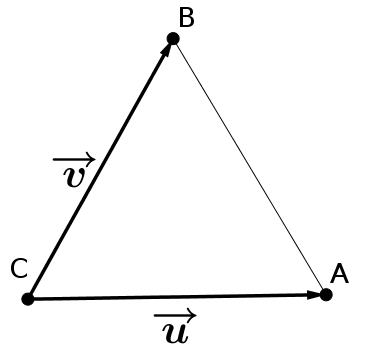{fig-alt="Triangle équilatéral ABC" fig-align="center"}
::::

:::::
::::::

:::{.callout-caution collapse="true"}
## Solution

On a donc $\|\overrightarrow{u}\|=\|\overrightarrow{v}\|=2$ et $(\overrightarrow{u};\overrightarrow{v})=\dfrac{\pi}{3}$.

Ainsi $\overrightarrow{u}\cdot\overrightarrow{v}=2\times 2\times\cos\left(\dfrac{\pi}{3}\right)=2$.
:::

**Autres expressions du produit scalaire : cas des vecteurs colinéaires**

::: {.proposition}
- Si $\overrightarrow{u}$ et $\overrightarrow{v}$ sont deux vecteurs colinéaires de même sens alors

  $$
  \overrightarrow{u}\cdot\overrightarrow{v}=\|\overrightarrow{u}\|\times\|\overrightarrow{v}\|
  $$
- Si $\overrightarrow{u}$ et $\overrightarrow{v}$ sont deux vecteurs colinéaires de sens contraire alors

  $$
  \overrightarrow{u}\cdot\overrightarrow{v}=-\|\overrightarrow{u}\|\times\|\overrightarrow{v}\|
  $$
:::

::: {.remarque}
Pour tout vecteur $\overrightarrow{u}$, $\overrightarrow{u}^2=\|\overrightarrow{u}\|^2$.
:::

**Autres expressions du produit scalaire : avec des projetés orthogonaux**

::: {.definition}
Soit $(d)$ une droite et soit $M$ un point n'appartenant pas à cette droite.

On dit que le point $M'$ de la droite $(d)$ est le projeté orthogonal de $M$ sur $(d)$ si les droites $(MM')$ et $(d)$ sont perpendiculaires.
:::

::: {.illustration}
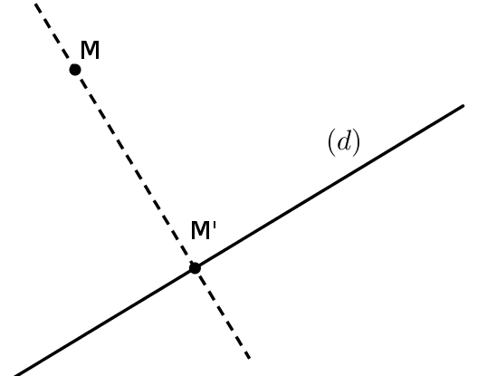{fig-alt="Projeté orthogonal M' d'un point M sur une droite (d)" fig-align="center" width="45%"}
:::

::: {.proposition}
Soient $A$, $B$, $C$ et $D$ quatre points du plan.

Si $C'$ et $D'$ sont les projetés orthogonaux de $C$ et $D$ sur $(AB)$, alors :

$$
\overrightarrow{AB}\cdot\overrightarrow{CD}=\overrightarrow{AB}\cdot\overrightarrow{C'D'}
$$
:::

::: {.illustration}
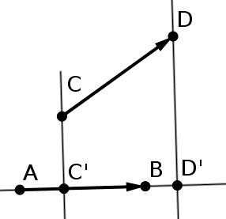{fig-alt="Projetés orthogonaux C' et D' de C et D sur la droite (AB)" fig-align="center" width="45%"}
:::

**Règles de calcul**

::: {.proposition}
($\overrightarrow{u}$, $\overrightarrow{v}$ et $\overrightarrow{w}$ sont des vecteurs quelconques, $k$ un réel).

- Le produit scalaire est symétrique : $\overrightarrow{u}\cdot\overrightarrow{v}=\overrightarrow{v}\cdot\overrightarrow{u}$.
- Le produit scalaire est bilinéaire : $\overrightarrow{u}\cdot(\overrightarrow{v}+\overrightarrow{w})=\overrightarrow{u}\cdot\overrightarrow{v}+\overrightarrow{u}\cdot\overrightarrow{w}$ ; $(\overrightarrow{u}+\overrightarrow{v})\cdot\overrightarrow{w}=\overrightarrow{u}\cdot\overrightarrow{w}+\overrightarrow{v}\cdot\overrightarrow{w}$.
- $\overrightarrow{u}\cdot(k\overrightarrow{v})=k\times(\overrightarrow{u}\cdot\overrightarrow{v})$ ; $(k\overrightarrow{u})\cdot\overrightarrow{v}=k\times(\overrightarrow{u}\cdot\overrightarrow{v})$.
- Identités remarquables :
  - $(\overrightarrow{u}+\overrightarrow{v})^2=\overrightarrow{u}^2+2\overrightarrow{u}\cdot\overrightarrow{v}+\overrightarrow{v}^2$
  - $(\overrightarrow{u}-\overrightarrow{v})^2=\overrightarrow{u}^2-2\overrightarrow{u}\cdot\overrightarrow{v}+\overrightarrow{v}^2$
  - $(\overrightarrow{u}-\overrightarrow{v})\cdot(\overrightarrow{u}+\overrightarrow{v})=\overrightarrow{u}^2-\overrightarrow{v}^2$
:::

::: {.proposition}
- $\overrightarrow{u}\cdot\overrightarrow{v}=\dfrac{1}{2}\left[\|\overrightarrow{u}+\overrightarrow{v}\|^2-\|\overrightarrow{u}\|^2-\|\overrightarrow{v}\|^2\right]$
- $\overrightarrow{u}\cdot\overrightarrow{v}=\dfrac{1}{2}\left[\|\overrightarrow{u}\|^2+\|\overrightarrow{v}\|^2-\|\overrightarrow{u}-\overrightarrow{v}\|^2\right]$
:::

::: {.definition}
- On dit qu'un vecteur est **unitaire** lorsque sa norme vaut $1$.
- On dit que deux vecteurs sont **orthogonaux**, et on note $\overrightarrow{u}\perp\overrightarrow{v}$, lorsque leur produit scalaire est nul, c'est-à-dire

  $$
  \boxed{\overrightarrow{u}\perp\overrightarrow{v}\Longleftrightarrow\overrightarrow{u}\cdot\overrightarrow{v}=0}
  $$
:::

### Définition du produit scalaire dans l'espace

::: {.definition}
Soient $\overrightarrow{u}$ et $\overrightarrow{v}$ deux vecteurs de l'espace. On considère les points $A$, $B$ et $C$ tels que $\overrightarrow{u}=\overrightarrow{AB}$ et $\overrightarrow{v}=\overrightarrow{AC}$. Les points $A$, $B$ et $C$ étant coplanaires, le produit scalaire des vecteurs $\overrightarrow{u}$ et $\overrightarrow{v}$, noté $\overrightarrow{u}\cdot\overrightarrow{v}$, est le réel $\overrightarrow{AB}\cdot\overrightarrow{AC}$ calculé dans un plan contenant les points $A$, $B$ et $C$.
:::

::: {.remarque}
Toutes les propriétés du produit scalaire dans le plan restent donc d'actualité dans l'espace.
:::

## Orthogonalité dans l'espace

### Orthogonalité de deux droites

::: {.definition}
Soient $d$ et $d'$ deux droites de l'espace. $d$ et $d'$ sont orthogonales si un vecteur directeur de l'une est orthogonal à un vecteur directeur de l'autre.
:::

::: {.proposition}
Deux droites $d$ et $d'$ de l'espace sont orthogonales si et seulement si tout vecteur directeur de $d$ est orthogonal à tout vecteur directeur de $d'$.
:::

::: {.remarque}
- Deux droites orthogonales ne sont pas nécessairement coplanaires.
- Dans l'espace, deux droites sont perpendiculaires si et seulement si elles sont sécantes selon un angle droit (c'est un cas particulier d'orthogonalité).
- Si deux droites sont perpendiculaires, alors elles sont orthogonales. La réciproque est fausse.
:::

::: {.illustration}
{fig-alt="Cube avec deux droites orthogonales et deux droites perpendiculaires" fig-align="center" width="55%"}

Les droites $(EF)$ et $(DH)$ sont orthogonales alors que les droites $(GH)$ et $(GC)$ sont perpendiculaires.

🔗 [Figure interactive GeoGebra](https://www.geogebra.org/3d/s277bf8x){target="_blank"}
:::

::: {.proposition}
- Deux droites $d$ et $d'$ de l'espace sont orthogonales si et seulement s'il existe une droite $\Delta$ parallèle à $d$ et perpendiculaire à $d'$.
- Si deux droites sont parallèles, alors toute droite orthogonale à l'une est orthogonale à l'autre.
- Si deux droites sont orthogonales, alors toute droite parallèle à l'une est orthogonale à l'autre.
:::

::: {.illustration}
{fig-alt="Droites orthogonales et droites parallèles dans l'espace" fig-align="center" width="55%"}

🔗 [Figure interactive GeoGebra](https://www.geogebra.org/3d/wut6fdsn){target="_blank"}
:::

### Orthogonalité d'un plan et d'une droite

::: {.definition}
Dans l'espace, soient $\mathcal{P}$ un plan de base $(\overrightarrow{u},\overrightarrow{v})$ et $d$ une droite de vecteur directeur $\overrightarrow{w}$.

La droite $d$ et le plan $\mathcal{P}$ sont orthogonaux si $\overrightarrow{w}$ est orthogonal à la fois à $\overrightarrow{u}$ et à $\overrightarrow{v}$.
:::

::: {.proposition}
- Une droite est orthogonale à un plan si et seulement si elle est orthogonale à deux droites sécantes de ce plan.
- Si une droite est orthogonale à un plan, alors elle est orthogonale à toute droite de ce plan.
- Si deux droites sont parallèles, alors tout plan orthogonal à l'une est orthogonal à l'autre.
:::

::: {.illustration}
{fig-alt="Droite orthogonale à un plan" fig-align="center" width="55%"}

🔗 [Figure interactive GeoGebra](https://www.geogebra.org/3d/ajyrc33k){target="_blank"}
:::

::: {.proposition}
- Si deux plans sont parallèles, alors toute droite orthogonale à l'un est orthogonale à l'autre.
- Si deux plans sont orthogonaux à une même droite, alors ils sont parallèles entre eux.
:::

::: {.illustration}
{fig-alt="Plans parallèles orthogonaux à une même droite" fig-align="center" width="55%"}

🔗 [Figure interactive GeoGebra](https://www.geogebra.org/3d/a7gsgrd7){target="_blank"}
:::

## Vecteur normal, projeté orthogonal

### Vecteur normal à un plan

::: {.definition}
Soit $\mathcal{P}$ un plan de base $(\overrightarrow{u},\overrightarrow{v})$. Un vecteur $\overrightarrow{n}$ est normal au plan $\mathcal{P}$ s'il est non nul et orthogonal à la fois à $\overrightarrow{u}$ et à $\overrightarrow{v}$.
:::

::: {.illustration}
{fig-alt="Vecteur normal à un plan" fig-align="center" width="55%"}

🔗 [Figure interactive GeoGebra](https://www.geogebra.org/3d/m3vmnsbw){target="_blank"}
:::

::: {.proposition}
Soient $A$ un point et $\overrightarrow{n}$ un vecteur non nul. Il existe un unique plan passant par $A$ et de vecteur normal $\overrightarrow{n}$.
:::

::: {.remarque}
On peut donc déterminer de manière unique un plan à l'aide d'un point et d'un vecteur normal.
:::

::: {.definition}
Soient $\mathcal{P}_1$ un plan de vecteur normal $\overrightarrow{n_1}$ et $\mathcal{P}_2$ un plan de vecteur normal $\overrightarrow{n_2}$.

On dit que $\mathcal{P}_1$ est perpendiculaire à $\mathcal{P}_2$ si $\overrightarrow{n_1}$ est orthogonal à $\overrightarrow{n_2}$.
:::

::: {.illustration}
{fig-alt="Deux plans perpendiculaires et leurs vecteurs normaux" fig-align="center" width="55%"}

🔗 [Figure interactive GeoGebra](https://www.geogebra.org/3d/fqyf3fzh){target="_blank"}
:::

::: {.remarque}
- Tout vecteur non nul colinéaire à un vecteur normal à un plan est aussi un vecteur normal à ce plan.
- Si deux vecteurs sont normaux à un même plan, alors ils sont colinéaires entre eux.
:::

::: {.proposition}
- Un vecteur est normal à un plan $\mathcal{P}$ si et seulement s'il est orthogonal à tout vecteur directeur de $\mathcal{P}$.
- Une droite est orthogonale à un plan si et seulement si un vecteur directeur de cette droite est colinéaire à un vecteur normal à ce plan.
- Une droite est parallèle à un plan si et seulement si un vecteur directeur de cette droite est orthogonal à un vecteur normal à ce plan.
- Soient $\mathcal{P}_1$ un plan de vecteur normal $\overrightarrow{n_1}$ et $\mathcal{P}_2$ un plan de vecteur normal $\overrightarrow{n_2}$.

  $\mathcal{P}_1$ est parallèle à $\mathcal{P}_2$ si et seulement si $\overrightarrow{n_1}$ est colinéaire à $\overrightarrow{n_2}$.
:::

### Projeté orthogonal d'un point

::: {.proposition}
- Soient $A$ un point et $d$ une droite de l'espace. Il existe un unique plan passant par $A$ et orthogonal à $d$. La droite $d$ est alors sécante avec ce plan et leur point d'intersection est appelé projeté orthogonal de $A$ sur $d$.
- Soient $A$ un point et $\mathcal{P}$ un plan de l'espace. Il existe une unique droite passant par $A$ et orthogonale à $\mathcal{P}$. Le plan $\mathcal{P}$ est alors sécant avec cette droite et leur point d'intersection est appelé projeté orthogonal de $A$ sur $\mathcal{P}$.
:::

::: {.illustration}
{fig-alt="Projeté orthogonal d'un point sur une droite et sur un plan" fig-align="center" width="55%"}

🔗 [Figure interactive GeoGebra](https://www.geogebra.org/3d/bvbspmhu){target="_blank"}
:::

## Calculs de distances

### Calculs dans une base et un repère orthonormé de l'espace

::: {.definition}
Une base orthonormée de l'espace est une base de l'espace telle que ses trois vecteurs soient orthogonaux deux à deux et tous de norme $1$.

Autrement dit, $\overrightarrow{i}\cdot\overrightarrow{j}=\overrightarrow{i}\cdot\overrightarrow{k}=\overrightarrow{j}\cdot\overrightarrow{k}=0$ et $\|\overrightarrow{i}\|=\|\overrightarrow{j}\|=\|\overrightarrow{k}\|=1$.
:::

::: {.definition}
Un repère orthonormé $(O;\overrightarrow{i},\overrightarrow{j},\overrightarrow{k})$ est un repère tel que la base $(\overrightarrow{i},\overrightarrow{j},\overrightarrow{k})$ soit orthonormée.
:::

::: {.proposition}
Dans une base orthonormée $(\overrightarrow{i},\overrightarrow{j},\overrightarrow{k})$ de l'espace, on considère deux vecteurs $\overrightarrow{u}\begin{pmatrix}x\\y\\z\end{pmatrix}$ et $\overrightarrow{v}\begin{pmatrix}x'\\y'\\z'\end{pmatrix}$.

On a alors $\overrightarrow{u}\cdot\overrightarrow{v}=xx'+yy'+zz'$ et $\|\overrightarrow{u}\|=\sqrt{x^2+y^2+z^2}$.
:::

# Équations de plans et de droites de l'espace

## Plans

### Équation(s) cartésienne et paramétriques

Tout plan $\mathcal{P}$ de l'espace admet une équation cartésienne de la forme :

$$
\boxed{\mathcal{P} : ax+by+cz+d=0, \qquad (a,b,c)\neq(0,0,0).}
$$

::: {.remarque}
Ainsi $M(x_M;y_M;z_M)\in\mathcal{P}\iff ax_M+by_M+cz_M+d=0$.
:::

::: {.definition}
Un vecteur non nul $\overrightarrow{n}$ de l'espace est normal à un plan $\mathcal{P}$ lorsqu'il est orthogonal à tout vecteur admettant un représentant dans $\mathcal{P}$.
:::

::: {.proposition}
Une équation cartésienne du plan $\mathcal{P}$ passant par un point $A(x_0,y_0,z_0)$ et admettant pour vecteur normal $\overrightarrow{n}(a,b,c)$ s'obtient ainsi :

$$
M(x,y,z)\in\mathcal{P}\Longleftrightarrow\overrightarrow{AM}\cdot\overrightarrow{n}=0\Longleftrightarrow a(x-x_0)+b(y-y_0)+c(z-z_0)=0
$$

*Réciproquement :* tout plan admettant une équation cartésienne du type $ax+by+cz+d=0$ admet pour vecteur normal le vecteur de coordonnées $(a,b,c)$.
:::

::: {.proposition}
Un plan $\mathcal{P}$ passant par un point $A(x_0,y_0,z_0)$ et dirigé par les vecteurs $\overrightarrow{u}(u_1,u_2,u_3)$ et $\overrightarrow{v}(v_1,v_2,v_3)$ admet la représentation **paramétrique** suivante :

$$
\mathcal{P} :
\left\{
\begin{array}{l}
x=x_0+u_1t+v_1t' \\
y=y_0+u_2t+v_2t' \\
z=z_0+u_3t+v_3t'
\end{array}
\right| \qquad (t,t')\in\R^2
$$
:::

::: {.proposition}
Deux plans sont perpendiculaires si et seulement si un vecteur normal de l'un est orthogonal à un vecteur normal de l'autre.
:::

### Distance d'un point à un plan

::: {.proposition}
**Distance d'un point à un plan**

Soit $A$ un point de l'espace et $\mathcal{P}$ un plan passant par un point $B$ et de vecteur normal $\overrightarrow{n}$.

Le projeté orthogonal $H$ de $A$ sur le plan $\mathcal{P}$ est le point du plan $\mathcal{P}$ le plus proche de $A$.

La distance $AH$ est appelée distance du point $A$ au plan $\mathcal{P}$.
:::

::: {.remarque}
Cette distance $AH$ est égale à $AH=\dfrac{|\overrightarrow{AB}\cdot\overrightarrow{n}|}{\|\overrightarrow{n}\|}$, mais en pratique on n'utilise pas cette formule directement : on la retrouve par le calcul.
:::

::: {.illustration}
{fig-alt="Distance d'un point à un plan" fig-align="center" width="55%"}

🔗 [Figure interactive GeoGebra](https://www.geogebra.org/3d/zpbnmycn){target="_blank"}
:::

::: {.exemple}
On se place dans un repère orthonormé de l'espace. Soit $(\mathcal{P})$ le plan passant par $A(1;-3;2)$ et de vecteur normal $\overrightarrow{n}\begin{pmatrix}5\\-2\\1\end{pmatrix}$.

Soit $B(3;-2;5)$. Calculer la distance du point $B$ au plan $\mathcal{P}$.
:::

:::{.callout-caution collapse="true"}
## Solution

On note $H$ le projeté orthogonal de $B$ sur $\mathcal{P}$. La distance recherchée est donc la distance $BH$.

**Équation du plan $\mathcal{P}$.** Son équation est de la forme $5x-2y+z+c=0$. De plus $A\in\mathcal{P}$ donc $5+6+2+c=0$, soit $c=-13$. Finalement l'équation du plan $\mathcal{P}$ est $5x-2y+z-13=0$.

**Coordonnées de $H(x_H;y_H;z_H)$.**

$H$ appartient au plan $\mathcal{P}$ donc ses coordonnées vérifient $5x_H-2y_H+z_H-13=0$.

Déterminons maintenant une équation paramétrique de la droite $(BH)$ :

$$
M(x;y;z)\in(BH)\Leftrightarrow\exists k\in\R\ |\ \overrightarrow{BM}=k\overrightarrow{n}\Leftrightarrow\exists k\in\R\ |\ \left\{\begin{array}{l}x-3=5k\\y+2=-2k\\z-5=k\end{array}\right.
$$

$$
M(x;y;z)\in(BH)\Leftrightarrow\exists k\in\R\ |\ \left\{\begin{array}{l}x=5k+3\\y=-2k-2\\z=k+5\end{array}\right.
$$

Ainsi, comme $H$ appartient à la fois au plan $\mathcal{P}$ et à la droite $(BH)$, ses coordonnées vérifient :

$$
\left\{\begin{array}{l}x_H=5k+3\\y_H=-2k-2\\z_H=k+5\\5x_H-2y_H+z_H-13=0\end{array}\right.
$$

On trouve $k=\dfrac{-11}{30}$ et donc $H\left(\dfrac{7}{6};\dfrac{-19}{15};\dfrac{139}{30}\right)$.

**Distance.** Finalement la distance $BH$ est

$$
BH=\sqrt{(x_H-x_B)^2+(y_H-y_B)^2+(z_H-z_B)^2}=\dfrac{11}{\sqrt{30}}
$$
:::

## Droites

### Équation(s) cartésienne et paramétriques

L'intersection de deux plans $(\mathcal{P})$ et $(\mathcal{P}')$ non parallèles de l'espace est une **droite**, donc une droite $\mathcal{D}$ peut être donnée par un **système de deux équations cartésiennes** (SEC) :

$$
\mathcal{D} :
\left\{
\begin{array}{ll}
ax+by+cz+d=0 & (\mathcal{P}) \\
a'x+b'y+c'z+d'=0 & (\mathcal{P}')
\end{array}
\right.
$$

::: {.proposition}
Une droite $\mathcal{D}_A$ passant par un point $A(x_0,y_0,z_0)$ et dirigée par $\overrightarrow{u}(u_1,u_2,u_3)$ admet la représentation paramétrique :

$$
\mathcal{D}_A :
\left\{
\begin{array}{l}
x=x_0+u_1t \\
y=y_0+u_2t \\
z=z_0+u_3t
\end{array}
\right| \quad t\in\R
$$
:::

### Distance d'un point à une droite

::: {.proposition}
**Distance d'un point à une droite**

Soient $A$ un point de l'espace et $d$ une droite de l'espace passant par un point $B$ et de vecteur directeur $\overrightarrow{u}$.

- Le projeté orthogonal $H$ de $A$ sur $d$ est le point de la droite $d$ le plus proche de $A$.
- La distance $AH$ est appelée distance du point $A$ à la droite $d$.
:::

::: {.remarque}
Cette distance $AH$ est égale à $AH=\left\|\overrightarrow{AB}-\dfrac{\overrightarrow{AB}\cdot\overrightarrow{u}}{\|\overrightarrow{u}\|^2}\overrightarrow{u}\right\|$, mais en pratique on n'utilise pas cette formule directement : on la retrouve par le calcul.
:::

::: {.illustration}
{fig-alt="Distance d'un point à une droite" fig-align="center" width="55%"}

🔗 [Figure interactive GeoGebra](https://www.geogebra.org/3d/fzscvdbm){target="_blank"}
:::

::: {.exemple}
On se place dans un repère orthonormé de l'espace. Soit $d$ la droite passant par $A(2;-5;3)$ et de vecteur directeur $\overrightarrow{u}\begin{pmatrix}2\\2\\1\end{pmatrix}$. Quelle est la distance du point $B(-1;2;-4)$ à la droite $d$ ?
:::

:::{.callout-caution collapse="true"}
## Solution

On note $H$ le projeté orthogonal de $B$ sur la droite $d$. La distance du point $B$ à la droite $d$ est alors la distance $BH$.

**Coordonnées de $H(x_H;y_H;z_H)$.**

$H$ est le projeté orthogonal de $B$ sur $d$ donc $\overrightarrow{BH}\cdot\overrightarrow{u}=0$ :

$$
(x_H+1)\times 2+(y_H-2)\times 2+(z_H+4)\times 1=0\Leftrightarrow 2x_H+2y_H+z_H=-2
$$

De plus $H$ est sur la droite $d$, donc ses coordonnées vérifient l'équation de la droite $d$. Déterminons une équation paramétrique de $d$. On a $\overrightarrow{AM}\begin{pmatrix}x-2\\y+5\\z-3\end{pmatrix}$ donc

$$
M(x;y;z)\in d\Leftrightarrow\exists k\in\R\ |\ \overrightarrow{AM}=k\overrightarrow{u}\Leftrightarrow\exists k\in\R\ |\ \left\{\begin{array}{l}x-2=2k\\y+5=2k\\z-3=k\end{array}\right.
$$

Ainsi les coordonnées de $H$ vérifient le système :

$$
\left\{\begin{array}{l}x_H=2k+2\\y_H=2k-5\\z_H=k+3\\2x_H+2y_H+z_H=-2\end{array}\right.
$$

On trouve $k=\dfrac{1}{9}$ et donc $H\left(\dfrac{20}{9};\dfrac{-43}{9};\dfrac{28}{9}\right)$.

**Distance.** Finalement, la distance recherchée est :

$$
BH=\sqrt{\left(\dfrac{20}{9}+1\right)^2+\left(\dfrac{-43}{9}-2\right)^2+\left(\dfrac{28}{9}+4\right)^2}\approx 10.34
$$
:::
