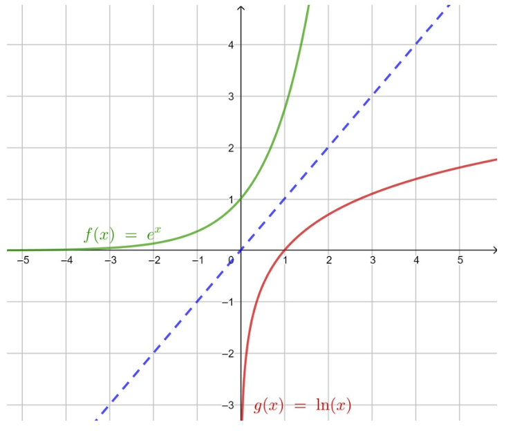

```css
```
```{=html}
<style>
:root {
  --def-color:   #2563eb;
  --prop-color:  #7c3aed;
  --theo-color:  #c026d3;
  --voc-color:   #0d9488;
  --rem-color:   #d97706;
  --ex-color:    #16a34a;
  --app-color:   #ea580c;
  --not-color:   #4f46e5;
  --meth-color:  #dc2626;
  --ill-color:   #475569;
}

.definition, .proposition, .theoreme, .vocabulaire, .remarque, .exemple, .application,
.notation, .methode, .illustration {
  margin: 1.5em 0;
  padding: 1em 1.3em 1em 1.3em;
  border-radius: 10px;
  border-left: 6px solid;
  box-shadow: 0 1px 4px rgba(0,0,0,0.08);
  font-family: "Georgia", serif;
}

.definition::before, .proposition::before, .theoreme::before, .vocabulaire::before,
.remarque::before, .exemple::before, .application::before,
.notation::before, .methode::before, .illustration::before {
  display: block;
  font-family: "Helvetica Neue", Arial, sans-serif;
  font-weight: 700;
  font-size: 0.95em;
  letter-spacing: 0.03em;
  text-transform: uppercase;
  margin-bottom: 0.6em;
}

.definition {
  background: #eff6ff;
  border-color: var(--def-color);
  color: #1e3a5f;
}
.definition::before {
  content: "📘  Définition";
  color: var(--def-color);
}

.proposition {
  background: #f5f3ff;
  border-color: var(--prop-color);
  color: #3b2467;
}
.proposition::before {
  content: "📐  Proposition";
  color: var(--prop-color);
}

.theoreme {
  background: #fdf4ff;
  border-color: var(--theo-color);
  color: #701a75;
}
.theoreme::before {
  content: "🏛️  Théorème";
  color: var(--theo-color);
}

.vocabulaire {
  background: #f0fdfa;
  border-color: var(--voc-color);
  color: #0f4c46;
}
.vocabulaire::before {
  content: "🏷️  Vocabulaire";
  color: var(--voc-color);
}

.remarque {
  background: #fffbeb;
  border-color: var(--rem-color);
  color: #6b4a06;
}
.remarque::before {
  content: "💡  Remarque";
  color: var(--rem-color);
}

.exemple {
  background: #f0fdf4;
  border-color: var(--ex-color);
  color: #14532d;
}
.exemple::before {
  content: "🔍  Exemple";
  color: var(--ex-color);
}

.application {
  background: #fff7ed;
  border: 2px dashed var(--app-color);
  border-left: 6px solid var(--app-color);
  color: #7c2d12;
}
.application::before {
  content: "✏️  Application";
  color: var(--app-color);
  font-size: 1.05em;
}

.notation {
  background: #eef2ff;
  border-color: var(--not-color);
  color: #312e81;
}
.notation::before {
  content: "🖊️  Notation";
  color: var(--not-color);
}

.methode {
  background: #fef2f2;
  border-color: var(--meth-color);
  color: #7f1d1d;
}
.methode::before {
  content: "🧭  Méthode";
  color: var(--meth-color);
}

.illustration {
  background: #f8fafc;
  border-color: var(--ill-color);
  color: #1e293b;
}
.illustration::before {
  content: "🖼️  Illustration";
  color: var(--ill-color);
}

/* Callouts "Solution" un peu plus stylés */
div.callout-caution {
  border-radius: 10px;
  box-shadow: 0 1px 4px rgba(0,0,0,0.08);
}
div.callout-caution .callout-title {
  font-family: "Helvetica Neue", Arial, sans-serif;
  font-weight: 700;
}
div.callout-caution .callout-title::before {
  content: "🔓  ";
}
</style>
```

# Fonction logarithme népérien

La fonction exponentielle est continue, strictement croissante et strictement positive.\
D'après le théorème de la bijection (corollaire du théorème des valeurs intermédiaires), pour tout réel $x>0$, l'équation $\text{e}^t=x$, d'inconnue $t$, admet une unique solution dans $\mathbb{R}$, notée $\ln(x)$.

## Définition

::: {.definition}
La fonction définie sur $\mathbb{R}^{+*}$, qui à tout réel $x>0$ associe $\ln(x)$, l'unique solution de l'équation $\text{e}^t=x$, est appelée fonction logarithme népérien, notée $\ln$.
:::

::: {.remarque}
Dans un repère orthonormé, la représentation graphique de la fonction logarithme népérien est le symétrique de la représentation graphique de la fonction exponentielle par rapport à la première bissectrice, d'équation $y=x$.
:::

::: {.illustration}
{fig-alt="Courbes des fonctions exponentielle et logarithme népérien, symétriques par rapport à la droite d'équation y = x" width="65%" fig-align="center"}
:::

## Conséquences

::: {.proposition}
**(admises)**

-   $\ln(1)=0$

-   $\ln(\text{e})=1$

-   Pour tout $x \in \mathbb{R}$, $\ln(\text{e}^x)=x$

-   Pour tout $x \in \mathbb{R}^{+*}$, $\text{e}^{\ln(x)}=x$
:::

::: {.exemple}
Résoudre dans $\mathbb{R}$ les équations suivantes :

1.  $\text{e}^x=3$

2.  $\text{e}^{3x-2}=2$

3.  $\ln(x)=-2$

4.  $\ln(-2x+1)=4$
:::

::: {.callout-caution collapse="true"}
## Solution

1.  $\text{e}^x=3 \Longleftrightarrow x=\ln(3)$ donc $S=\{\ln(3)\}$

2.  $\text{e}^{3x-2}=2 \Longleftrightarrow 3x-2=\ln(2) \Longleftrightarrow x=\frac{2+\ln(2)}{3}$ donc $S=\{\frac{2+\ln(2)}{3}\}$

3.  On résout dans $\mathbb{R}^{+*}$ : $\ln(x)=-2 \Longleftrightarrow x=\text{e}^{-2}$ donc $S=\{\text{e}^{-2}\}$

4.  $-2x+1>0 \Longleftrightarrow x<\frac{1}{2}$. On résout dans $]-\infty;\frac{1}{2}[$ : $\ln(-2x+1)=4 \Longleftrightarrow -2x+1=\text{e}^4 \Longleftrightarrow x=\frac{1-\text{e}^4}{2}$. Or $\frac{1-\text{e}^4}{2}<\frac{1}{2}$ donc $S=\{\frac{1-\text{e}^4}{2}\}$
:::

# Propriétés algébriques

## Relation fonctionnelle

::: {.proposition}
Pour tous réels $x$ et $y$ strictement positifs, $\ln(xy)=\ln(x)+\ln(y)$.
:::

::: {.callout-caution collapse="true"}
## Solution

Soient $x$ et $y$ deux réels strictement positifs. D'une part : $\text{e}^{\ln(xy)}=xy$. D'autre part : $\text{e}^{\ln(x)}\times \text{e}^{\ln(y)}=xy$. Ainsi, $\text{e}^{\ln(xy)}=\text{e}^{\ln(x)}\times \text{e}^{\ln(y)}=\text{e}^{\ln(x)+\ln(y)}$. Finalement, $\ln(xy)=\ln(x)+\ln(y)$.
:::

::: {.remarque}
La fonction exponentielle transforme une somme en produit ; sa réciproque, la fonction logarithme népérien, transforme un produit en somme.
:::

## Autres règles de calcul

::: {.proposition}
Pour tous réels $x$ et $y$ strictement positifs et pour $n$ un entier relatif.

1.  $\ln(\frac{1}{x})=-\ln(x)$

2.  $\ln(\frac{x}{y})=\ln(x)-\ln(y)$

3.  $\ln(x^n)=n\ln(x)$

4.  $\ln(\sqrt{x})=\frac{1}{2}\ln(x)$
:::

::: {.callout-caution collapse="true"}
## Solution

1.  $\ln(x \times \frac{1}{x}) = \ln(1) = 0$, donc $\ln(x) + \ln(\frac{1}{x}) = 0$, c'est-à-dire $\ln(\frac{1}{x})=-\ln(x)$.

2.  $\ln(\frac{x}{y}) = \ln(x \times \frac{1}{y}) = \ln(x)+\ln(\frac{1}{y}) = \ln(x) - \ln(y)$ d'après le point 1.

3.  $\text{e}^{\ln(x^n)} = x^n$ et $\text{e}^{n\ln(x)} = (\text{e}^{\ln(x)})^n = x^n$. Donc $\text{e}^{\ln(x^n)}=\text{e}^{n\ln(x)}$, et ainsi $\ln(x^n)=n\ln(x)$.

4.  $2\ln(\sqrt{x}) = \ln((\sqrt{x})^2) = \ln(x)$, donc $\ln(\sqrt{x})=\frac{1}{2}\ln(x)$.
:::

::: {.exemple}
Écrire les nombres suivants en fonction de $\ln(2)$ : $\ln(32)$, $\ln(\frac{1}{1024})$ et $\ln(8\sqrt2)$.
:::

::: {.callout-caution collapse="true"}
## Solution

$\ln(32)=\ln(2^5)=5\ln(2)$\
$\ln(\frac{1}{1024})=-\ln(1024)=-\ln(2^{10})=-10\ln(2)$\
$\ln(8\sqrt2)=\ln(8)+\ln(\sqrt{2})=3\ln(2)+\frac{1}{2}\ln(2)=\frac{7}{2}\ln(2)$
:::

# Étude de la fonction logarithme népérien

## Dérivée et variations

::: {.proposition}
1.  La fonction logarithme népérien est dérivable sur $]0;+\infty[$ et pour tout réel $x>0$, $\ln'(x)=\frac{1}{x}$.

2.  La fonction logarithme népérien est continue sur $]0;+\infty[$.

3.  La fonction logarithme népérien est strictement croissante sur $]0;+\infty[$.
:::

::: {.callout-caution collapse="true"}
## Solution

1.  On admet que $\ln$ est dérivable sur $]0;+\infty[$. Pour $x>0$, soit $f(x)=\text{e}^{\ln(x)}=x$. Par composition, $f'(x)=\ln'(x)\text{e}^{\ln(x)}=\ln'(x)\times x$. Or $f'(x)=1$, donc $\ln'(x)\times x=1$, c'est-à-dire $\ln'(x)=\frac{1}{x}$.

2.  La fonction $\ln$ est dérivable sur $]0;+\infty[$, donc continue sur $]0;+\infty[$.

3.  Sur $]0;+\infty[$, $\ln'(x)=\frac{1}{x}>0$ donc $\ln$ est strictement croissante.
:::

## Signe, équations, inéquations

::: {.proposition}
**(admises)**\
Pour tous réels $x$ et $y$ strictement positifs.

1.  $\ln(x)<0 \Longleftrightarrow x \in ]0;1[$

2.  $\ln(x)>0 \Longleftrightarrow x>1$

3.  $x=y \Longleftrightarrow \ln(x)=\ln(y)$

4.  $x<y \Longleftrightarrow \ln(x)<\ln(y)$
:::

## Limites

::: {.proposition}
1.  $\lim\limits_{x \to +\infty} \ln(x)=+\infty$

2.  $\lim\limits_{x \to 0^+} \ln(x)=-\infty$
:::

::: {.callout-caution collapse="true"}
## Solution

1.  Soit $A$ un réel. $\ln(x)>A \Longleftrightarrow x>\text{e}^A$ : pour tout réel $A$, $\ln(x)>A$ dès que $x>\text{e}^A$, donc $\lim\limits_{x \to +\infty} \ln(x)=+\infty$.

2.  En posant $X=1/x$, $\lim\limits_{x \to 0^+} \ln(x) = \lim\limits_{X \to +\infty} \ln(1/X) = \lim\limits_{X \to +\infty} -\ln(X) = -\infty$.
:::

## Convexité

::: {.proposition}
La fonction logarithme népérien est concave sur $]0;+\infty[$.
:::

::: {.callout-caution collapse="true"}
## Solution

$f(x)=\ln(x) \implies f'(x)=\frac{1}{x} \implies f''(x)=-\frac{1}{x^2}$. Comme $f''(x)<0$, $f$ est concave.
:::

::: {.remarque}
La fonction $\ln$ étant strictement croissante et concave, sa représentation graphique « croît de moins en moins vite ». On parle de croissance ralentie.
:::

# Approfondir l'étude de la fonction logarithme népérien

## Limites

::: {.proposition}
$\lim\limits_{x \to 0} \frac{\ln(1+x)}{x}=1$
:::

::: {.proposition}
**Croissances comparées**

Pour $n \in \mathbb{N}^*$ :

1.  $\lim\limits_{x \to 0^+} x^n\ln(x)=0$

2.  $\lim\limits_{x \to +\infty} \dfrac{\ln(x)}{x^n}=0$
:::

## Fonctions composées avec la fonction logarithme népérien

::: {.proposition}
**(admise)**\
Soit $I$ un intervalle. Si $u$ est une fonction dérivable et strictement positive sur $I$, alors $x \mapsto \ln(u(x))$ est dérivable sur $I$ et $(\ln(u))'(x)=\frac{u'(x)}{u(x)}$.
:::

::: {.exemple}
Soit $f$ la fonction définie sur $\mathbb{R}$ par $f(x)=\ln(x^4+2)$. La fonction $u : x \mapsto x^4+2$ est dérivable et strictement positive sur $\mathbb{R}$. D'où, pour tout réel $x$, $f'(x)=\frac{4x^3}{x^4+2}$.
:::
