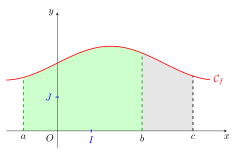
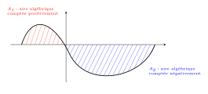
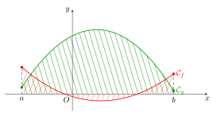
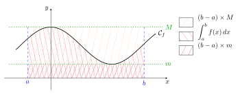
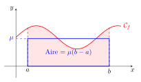

```css
```
```{=html}
<style>
:root {
  --def-color:   #2563eb;
  --prop-color:  #7c3aed;
  --theo-color:  #c026d3;
  --voc-color:   #0d9488;
  --rem-color:   #d97706;
  --ex-color:    #16a34a;
  --app-color:   #ea580c;
  --not-color:   #4f46e5;
  --meth-color:  #dc2626;
  --ill-color:   #475569;
}

.definition, .proposition, .theoreme, .vocabulaire, .remarque, .exemple, .application,
.notation, .methode, .illustration {
  margin: 1.5em 0;
  padding: 1em 1.3em 1em 1.3em;
  border-radius: 10px;
  border-left: 6px solid;
  box-shadow: 0 1px 4px rgba(0,0,0,0.08);
  font-family: "Georgia", serif;
}

.definition::before, .proposition::before, .theoreme::before, .vocabulaire::before,
.remarque::before, .exemple::before, .application::before,
.notation::before, .methode::before, .illustration::before {
  display: block;
  font-family: "Helvetica Neue", Arial, sans-serif;
  font-weight: 700;
  font-size: 0.95em;
  letter-spacing: 0.03em;
  text-transform: uppercase;
  margin-bottom: 0.6em;
}

.definition {
  background: #eff6ff;
  border-color: var(--def-color);
  color: #1e3a5f;
}
.definition::before {
  content: "📘  Définition";
  color: var(--def-color);
}

.proposition {
  background: #f5f3ff;
  border-color: var(--prop-color);
  color: #3b2467;
}
.proposition::before {
  content: "📐  Proposition";
  color: var(--prop-color);
}

.theoreme {
  background: #fdf4ff;
  border-color: var(--theo-color);
  color: #701a75;
}
.theoreme::before {
  content: "🏛️  Théorème";
  color: var(--theo-color);
}

.vocabulaire {
  background: #f0fdfa;
  border-color: var(--voc-color);
  color: #0f4c46;
}
.vocabulaire::before {
  content: "🏷️  Vocabulaire";
  color: var(--voc-color);
}

.remarque {
  background: #fffbeb;
  border-color: var(--rem-color);
  color: #6b4a06;
}
.remarque::before {
  content: "💡  Remarque";
  color: var(--rem-color);
}

.exemple {
  background: #f0fdf4;
  border-color: var(--ex-color);
  color: #14532d;
}
.exemple::before {
  content: "🔍  Exemple";
  color: var(--ex-color);
}

.application {
  background: #fff7ed;
  border: 2px dashed var(--app-color);
  border-left: 6px solid var(--app-color);
  color: #7c2d12;
}
.application::before {
  content: "✏️  Application";
  color: var(--app-color);
  font-size: 1.05em;
}

.notation {
  background: #eef2ff;
  border-color: var(--not-color);
  color: #312e81;
}
.notation::before {
  content: "🖊️  Notation";
  color: var(--not-color);
}

.methode {
  background: #fef2f2;
  border-color: var(--meth-color);
  color: #7f1d1d;
}
.methode::before {
  content: "🧭  Méthode";
  color: var(--meth-color);
}

.illustration {
  background: #f8fafc;
  border-color: var(--ill-color);
  color: #1e293b;
}
.illustration::before {
  content: "🖼️  Illustration";
  color: var(--ill-color);
}

/* Callouts "Solution" un peu plus stylés */
div.callout-caution {
  border-radius: 10px;
  box-shadow: 0 1px 4px rgba(0,0,0,0.08);
}
div.callout-caution .callout-title {
  font-family: "Helvetica Neue", Arial, sans-serif;
  font-weight: 700;
}
div.callout-caution .callout-title::before {
  content: "🔓  ";
}
</style>
```

# Intégrale d'une fonction continue positive

## Notation - définition de l'intégrale

::: {.definition}
Dans un repère orthogonal $\left(O,\overrightarrow{i},\overrightarrow{j}\right)$, on note $O(0;0), I(1;0), K(1;1)$ et $J(0;1)$.\
Alors l'aire de $OIKJ$ est appelée unité d'aire (notation u.a.).
:::

::: {.exemple}
Si $OI=3$ cm et $OJ=2$ cm alors 1 u.a. = 6 cm$^2$.
:::

::: {.definition}
Soient $f$ une fonction continue et positive sur un intervalle $I$ et $(a,b) \in I^2$ avec $a<b$. L'aire (algébrique) du domaine délimité par les droites d'équations $x=a$, $x=b$, l'axe des abscisses et la courbe $C_f$, exprimée en unités d'aire, est notée $$\int_a^b f(x)dx,$$ on prononce « intégrale de $a$ à $b$ de $f(x)dx$ ».\
Cette aire est parfois notée $\int f$ ou $\int_{[a,b]} f$ s'il n'y a pas ambiguïté.\
Les réels $a$ et $b$ sont appelés les bornes de l'intégrale.
:::

::: {.remarque}
Le nombre $\displaystyle \int_a^b f(x)dx$ ne dépend que de $a, b$ et $f$. On dit que $x$ est une variable muette. On peut également écrire ce nombre $\displaystyle \int_a^b f(t)dt, \int_a^b f(u)du$ ou encore $\displaystyle \int_a^b f$.
:::

::: {.remarque}
Si $f$ est une fonction négative sur $[a;b]$, alors l'aire du domaine $\mathcal{D}$, en u.a, est : $$\text{aire}(\mathcal{D}) = \int_a^b -f(x) dx$$
:::

## Premières propriétés

::: {.proposition}
Soient $f$ une fonction continue positive sur $I$, $(a,b)\in I^2$ avec $a\leqslant b$. On a : $$\int_a^b f(x)dx \geqslant 0 \qquad \text{et si } a=b : \quad \int_a^a f(x)dx= 0$$
:::

::: {.callout-caution collapse="true"}
## Solution

-   $\displaystyle \int_a^b f(x)dx$ désigne une aire, c'est donc un nombre positif.

-   Si $a=b$, alors le domaine est réduit à un segment. Son aire est donc nulle.
:::

::: {.proposition}
**Additivité des aires**

Soient $f$ une fonction continue positive sur $I$, $(a,b,c)\in I^3$ avec $a<b<c$. On a : $$\int_a^b f(x)dx + \int_b^c f(x)dx = \int_a^c f(x)dx$$
:::

::: {.illustration}
$\;$\
{fig-alt="Aire sous la courbe de f découpée en deux domaines : de a à b, puis de b à c" width="70%" fig-align="center"}
:::

::: {.proposition}
**Invariance par symétrie et par translation**

Soient $f$ une fonction continue positive sur $I$, $C$ sa courbe représentative dans un repère orthogonal $\left(O,\overrightarrow{i},\overrightarrow{j}\right)$, et des réels positifs $a$, $b$ et $T$ tels que $-a$, $a$, $b$, $a+T$ et $b+T$ appartiennent à $I$.\
Si $C$ est symétrique par rapport à l'axe des ordonnées alors $\displaystyle \int_{-a}^0 f(x)dx=\int_0^a f(x)dx$.\
Si $C$ est invariante par translation de vecteur $T\overrightarrow{i}$ alors $\displaystyle \int_a^b f(x)dx=\int_{a+T}^{b+T} f(x)dx$.
:::

# Théorème fondamental : existence de primitives

::: {.theoreme}
Soit $f$ une fonction continue et positive sur un intervalle $[a,b]$ de $\mathbb{R}$. La fonction $\displaystyle F : x \mapsto \int_a^x f(t)dt$ est dérivable sur $[a,b]$ : $$\forall x \in [a,b], \quad F'(x) = f(x) \quad \text{et} \quad F(a) = 0$$ $F$ est donc l'unique primitive de $f$ qui s'annule en $a$.
:::

::: {.callout-caution collapse="true"}
## Solution

Dans le cas où $f$ est continue, positive et croissante.

Soient $f$ une fonction continue, positive et croissante sur \[$a$,$b$\] et la fonction $F$ définie sur \[$a$,$b$\] par $F(x) = \int_a^x f(t)dt$.

Soit $x_0 \in [a,b]$, montrons que $F$ est dérivable en $x_0$ et que $F'(x_0) = f(x_0)$. Pour cela, il faut revenir au taux de variation de $F$ et montrer qu'il tend vers $f(x_0)$, donc étudions la différence entre ce taux et $f(x_0)$ ; on a alors pour $x \neq x_0$ : $$\begin{aligned}
\frac{F(x)-F(x_0)}{x-x_0}-f(x_0) 
& = \frac{1}{x-x_0}\left(\int_{a}^{x}f(t)dt-\int_{a}^{x_0}f(t)dt\right) - \frac{1}{x-x_0}f(x_0)(x-x_0) \\
& = \frac{1}{x-x_0}\left(\int_{a}^{x}f(t)dt+\int_{x_0}^{a}f(t)dt\right) - \frac{1}{x-x_0}\int_{x_0}^{x}f(x_0)dt \\
& = \frac{1}{x-x_0}\left(\int_{x_0}^{x}f(t)dt- \int_{x_0}^{x}f(x_0)dt \right)  \qquad \text{ (en utilisant Chasles et en factorisant)}\\
& = \frac{1}{x-x_0}\int_{x_0}^{x}\left[f(t)-f(x_0)\right]dt
\end{aligned}$$

-   **Premier cas** : $x_0<x$.

    Alors pour $t \in [x_0;  x]$, par croissance de $f$, $$f(x_0)\leqslant f(t)\leqslant f(x),$$ donc $$0 \leqslant f(t)-f(x_0) \leqslant f(x)-f(x_0),$$ donc par croissance de l'intégrale et en multipliant par $\frac{1}{x-x_0}>0$ on obtient : $$0 \leqslant \frac{1}{x-x_0}\int_{x_0}^{x}\left[f(t)-f(x_0)\right]dt \leqslant \frac{1}{x-x_0}\int_{x_0}^{x}\left[f(x)-f(x_0)\right]dt,$$ c'est-à-dire $$0 \leqslant \frac{1}{x-x_0}\int_{x_0}^{x}\left[f(t)-f(x_0)\right]dt \leqslant f(x)-f(x_0)$$ Par continuité de $f$ en $x_0$, $\lim_{x\to x_0}f(x) = f(x_0)$ donc on applique le théorème des gendarmes d'où $$\lim_{\substack{x\to x_0\\x>x_0}} \frac{1}{x-x_0}\int_{x_0}^{x}\left[f(t)-f(x_0)\right]dt = 0,$$ soit $$\lim_{\substack{x\to x_0\\x>x_0}} \frac{F(x)-F(x_0)}{x-x_0}=f(x_0).$$

-   **Deuxième cas** : $x_0>x$.

    Alors pour $t \in [x;  x_0]$, par croissance de $f$, $$f(x)\leqslant f(t)\leqslant f(x_0),$$ donc $$f(x)-f(x_0) \leqslant f(t)-f(x_0) \leqslant 0,$$ donc par croissance de l'intégrale (mais attention ici $x<x_0$ !), $$0 \leqslant \int_{x_0}^{x}\left[f(t)-f(x_0)\right]dt \leqslant \int_{x_0}^{x}\left[f(x)-f(x_0)\right]dt,$$ puis en multipliant par $\frac{1}{x-x_0}<0$ on obtient : $$\frac{1}{x-x_0}\int_{x_0}^{x}\left[f(x)-f(x_0)\right]dt  \leqslant \frac{1}{x-x_0}\int_{x_0}^{x}\left[f(t)-f(x_0)\right]dt \leqslant 0,$$ c'est-à-dire (*on finit de la même façon*) $$f(x)-f(x_0)  \leqslant \frac{1}{x-x_0}\int_{x_0}^{x}\left[f(t)-f(x_0)\right]dt \leqslant 0$$ Par continuité de $f$ en $x_0$, $\lim_{x\to x_0}f(x) = f(x_0)$ donc on applique le théorème des gendarmes d'où $$\lim_{\substack{x\to x_0\\x<x_0}} \frac{1}{x-x_0}\int_{x_0}^{x}\left[f(t)-f(x_0)\right]dt = 0,$$ soit $$\lim_{\substack{x\to x_0\\x<x_0}} \frac{F(x)-F(x_0)}{x-x_0}=f(x_0).$$
:::

::: {.proposition}
Toute fonction continue sur un intervalle $I$ admet des primitives sur $I$.
:::

::: {.callout-caution collapse="true"}
## Solution

Dans le cas où $I=[a,b]$, en admettant qu'alors $f$ admet un minimum sur $I$.

D'après le théorème (fondamental) précédent, toute fonction continue positive sur un intervalle admet des primitives sur cet intervalle.

Si $f$ est une fonction continue sur un segment $[a,b]$, elle admet un minimum $m$ sur ce segment. Alors la fonction qui à $x$ associe $f(x)-m$ est continue et positive sur $[a,b]$, cette fonction admet une primitive $G$. Alors la fonction $F$ définie sur $[a,b]$ par $F(x) = G(x)+mx$ a pour dérivée $x \mapsto G'(x)+m=f(x)-m+m$ c'est-à-dire $f$. $F$ est donc une primitive de $f$.
:::

::: {.remarque}
Ce théorème prouve qu'il existe des primitives pour les fonctions continues, mais il ne donne pas de formule explicite.
:::

::: {.proposition}
Si $f$ est une fonction continue et positive sur $I$ et $(a,b) \in I^2$ alors : $$\int_a^b f(t) dt =  F(b)-F(a)$$ où $F$ est une primitive quelconque de $f$ sur $I$.

On note $\displaystyle \int_a^b f(t) dt =  \big[ F(x) \big]_a^b = F(b)-F(a)$
:::

::: {.callout-caution collapse="true"}
## Solution

Soit $G$ la fonction définie sur $[a;b]$ par $G(x)=\displaystyle \int_a^x f(t) dt$. $G$ est une primitive de $f$ sur $[a;b]$ donc il existe $k\in \mathbb{R}$ tel que $G(x)=F(x)+k$. De plus $G(a)=0$ donc $0=F(a)+k$ donc $k=-F(a)$. Donc $G(x)=F(x)-F(a)$ donc $\displaystyle \int_a^b f(t) dt=G(b)=F(b)-F(a)$
:::

::: {.application}
Soit $f$ la fonction définie sur $\mathbb{R}$ par $f(x)=\cos(x)$. Calculer la valeur de l'aire sous la courbe de $f$ sur l'intervalle $\left[0,\dfrac{\pi}{2}\right]$.
:::

::: {.callout-caution collapse="true"}
## Solution

$f$ est continue et positive sur $\left[0,\dfrac{\pi}{2}\right]$. La fonction $F$ définie sur $\left[0,\dfrac{\pi}{2}\right]$ par $F(x)=\sin(x)$ est une primitive de $f$. On a donc: $$A=\displaystyle \int_0^\frac{\pi}{2} \cos(x) dx= [\sin(x)]^\frac{\pi}{2}_0=\sin\left(\dfrac{\pi}{2}\right)-\sin(0)=1$$
:::

# Intégrale d'une fonction de signe quelconque

## Définition

::: {.definition}
Pour toute fonction $f$ continue sur un intervalle $I$, pour tous $a$ et $b$ de $I$ :\
$\displaystyle \int_a^b f(t) dt = F(b)-F(a)$.
:::

::: {.remarque}
Cette définition est cohérente avec les résultats précédents et ne dépend pas de la primitive $F$ choisie (deux primitives diffèrent d'une constante).
:::

## Propriétés de l'intégrale

Dans tout ce paragraphe, $(a,b,c)\in I^3$, $\alpha$ est un réel et $f, g$ sont des fonctions continues sur $I$.

::: {.proposition}
**Inversion des bornes**

$\displaystyle \int_a^b f(x)dx = -\int_b^a f(x)dx$
:::

::: {.proposition}
**Relation de Chasles**

$\displaystyle \int_a^b f(x)dx + \int_b^c f(x)dx =\int_a^c f(x)dx$
:::

::: {.proposition}
**Linéarité de l'intégrale**

$\displaystyle \int_a^b \big( f(x) + g(x)\big)dx = \int_a^b f(x)dx + \int_a^b g(x)dx$

$\displaystyle \int_a^b \alpha f(x)dx = \alpha \int_a^b f(x)dx$
:::

::: {.proposition}
**Positivité de l'intégrale**

Si $a \leqslant b$ et si $f \leqslant 0$ sur $[a,b]$ alors $\displaystyle \int_a^b f(x)dx \leqslant 0$.
:::

::: {.remarque}
La réciproque est fausse : il est possible d'avoir une intégrale négative avec une fonction dont le signe change. Il faut penser à l'aire algébrique (aire comptée positivement pour des domaines au-dessus de l'axe des abscisses et négativement sinon) :

{fig-alt="Aire algébrique : la partie au-dessus de l'axe des abscisses est comptée positivement, la partie en dessous négativement" width="70%" fig-align="center"}
:::

::: {.proposition}
**Stricte positivité**

Si $f \geqslant 0$ sur $[a,b]$ et si $\displaystyle \int_a^b f(x)dx = 0$ avec $a \neq b$ alors $f = 0$ sur $[a,b]$.
:::

::: {.proposition}
**Croissance de l'intégrale**

Si $a \leqslant b$ et si $f \leqslant g$ sur $[a,b]$ alors $\displaystyle \int_a^b f(x)dx \leqslant \int_a^b g(x)dx$.
:::

::: {.remarque}
La réciproque est fausse : il faut encore une fois penser au côté géométrique: ici on a bien $\int_a^b g(x)dx \geqslant \int_a^b f(x) dx$ mais pas $g \geqslant f$. En particulier $f(a)> g(a)$
:::

::: {.illustration}
{fig-alt="Courbes de f et g entre a et b : l'aire sous g est plus grande alors que f(a) > g(a) et f(b) > g(b)" width="70%" fig-align="center"}
:::

# Intégration par parties

::: {.theoreme}
Soient $f$ et $g$ de classe $C^1$ sur $[a,b]$ : $$\int_a^b f(t)g'(t)dt = \left[ f(t)g(t) \right]_a^b - \int_a^b f'(t)g(t)dt$$
:::

::: {.callout-caution collapse="true"}
## Solution

Avec les mêmes notations:\
$f$ et $g$ sont dérivables sur $[a;b]$ donc par produit $fg$ est dérivable sur $[a;b]$. Or $(fg)'=f'g+fg'$. Ainsi $fg$ est une primitive de $f'g+fg'$ sur $[a;b]$. Donc: $$[f(x)g(x)]^b_a=\int_a^b (f'(x)g(x)+f(x)g'(x))dx = \int_a^b f'(x)g(x) dx + \int_a^b f(x)g'(x) dx$$ d'où la formule d'intégration par parties: $$\int_a^b f(t)g'(t)dt  = \left[ f(t)g(t )\right]_a^b - \int_a^b f'(t)g(t)dt$$
:::

::: {.remarque}
Cette formule s'applique lorsqu'on cherche à calculer l'intégrale d'un produit de deux fonctions à condition que $\int_a^b f'(t)g(t)dt$ soit plus facile à calculer que $\int_a^b f(t)g'(t)dt$.\
C'est le cas en particulier pour le produit:

-   d'une fonction polynôme et d'une fonction sinus ou cosinus (avec $f$ égale à la fonction polynôme)

-   d'une fonction polynôme et d'une fonction logarithme (avec $f$ égale à la fonction logarithme)

-   d'une fonction exponentielle et d'une fonction sinus ou cosinus.
:::

::: {.application}

1.  Calculer $I=\displaystyle \int_0^\frac{\pi}{2} x \cos(x) dx$.\

2.  Calculer $J=\displaystyle \int_0^\frac{\pi}{2} \mathrm{e}^{-2x} \cos(x) dx$
:::

::: {.callout-caution collapse="true"}
## Solution

1.  Calculer $I=\displaystyle \int_0^\frac{\pi}{2} x \cos(x) dx$.\
    On pose $f(x)=x$ alors $f'(x)=1$ et\
    $g'(x)=\cos(x)$ alors $g(x)=\sin(x)$\
    Donc $I=\displaystyle \int_0^\frac{\pi}{2} f(x)g'(x)dx =\left[ f(x)g(x)\right]_0^\frac{\pi}{2} - \displaystyle \int_0^\frac{\pi}{2} f'(x)g(x)dx = [x \sin(x)]_0^\frac{\pi}{2}-\displaystyle \int_0^\frac{\pi}{2} \sin(x)dx$\
    Donc $I=[x \sin(x)+\cos(x)]_0^\frac{\pi}{2}=\dfrac{\pi}{2}-1$

    Remarque: le calcul de $I$ permet de trouver les primitives de la fonction $f:x \mapsto x \cos(x)$: les primitives de $f$ sur $\mathbb{R}$ sont $F:x \mapsto x \sin(x)+\cos(x) +C$, avec $C \in \mathbb{R}$

2.  Calculer $J=\displaystyle \int_0^\frac{\pi}{2} \mathrm{e}^{-2x} \cos(x) dx$

    On pose, par exemple, en choisissant $f$ égale à la fonction exponentielle:\
    $f(x)=\mathrm{e}^{-2x}$ alors $f'(x)=-2\mathrm{e}^{-2x}$ et\
    $g'(x)=\cos(x)$ alors $g(x)=\sin(x)$\
    Alors $J=\displaystyle \int_0^\frac{\pi}{2} f(x)g'(x)dx =\left[ f(x)g(x)\right]_0^\frac{\pi}{2} - \displaystyle \int_0^\frac{\pi}{2} f'(x)g(x)dx =[\mathrm{e}^{-2x} \sin(x)]_0^\frac{\pi}{2} +2 \displaystyle \int_0^\frac{\pi}{2} \mathrm{e}^{-2x}\sin(x)dx$\
    On applique à nouveau une intégration par parties pour $\displaystyle \int_0^\frac{\pi}{2} \mathrm{e}^{-2x}\sin(x)dx$ en posant à nouveau:\
    $f(x)=\mathrm{e}^{-2x}$ alors $f'(x)=-2\mathrm{e}^{-2x}$ et\
    $g'(x)=\sin(x)$ alors $g(x)=-\cos(x)$\
    Ainsi $\displaystyle \int_0^\frac{\pi}{2} \mathrm{e}^{-2x}\sin(x)dx= [-\mathrm{e}^{-2x}\cos(x)]_0^\frac{\pi}{2} -2 \displaystyle \int_0^\frac{\pi}{2} \mathrm{e}^{-2x}\cos(x)dx$\
    Finalement, $J=[\mathrm{e}^{-2x} \sin(x)]_0^\frac{\pi}{2} +2 \displaystyle \int_0^\frac{\pi}{2} \mathrm{e}^{-2x}\sin(x)dx= [\mathrm{e}^{-2x} \sin(x)]_0^\frac{\pi}{2} + 2 [-\mathrm{e}^{-2x}\cos(x)]_0^\frac{\pi}{2} -4 \displaystyle \int_0^\frac{\pi}{2} \mathrm{e}^{-2x}\cos(x)dx$\
    d'où $J=[\mathrm{e}^{-2x}\sin(x)-2\mathrm{e}^{-2x}\cos(x)]_0^\frac{\pi}{2}-4J$\
    Ainsi $5J=[\mathrm{e}^{-2x}(\sin(x)-2\cos(x))]_0^\frac{\pi}{2}$ donc $J=\dfrac{1}{5} (\mathrm{e}^{-\pi}+2)$
:::

# Applications

## Calculs d'aire

::: {.proposition}
Soit $f$ une fonction continue et négative sur un intervalle $I$ et $(a,b) \in I^2$ avec $a<b$ . L'aire du domaine délimité par les droites d'équations $x=a$, $x=b$, l'axe des abscisses et la courbe $\mathcal{C}_f$, exprimée en unités d'aire, est égale à $$\int_a^b -f(x)dx.$$
:::

::: {.proposition}
Soient $f$ et $g$ des fonctions continues sur un intervalle $[a,b]$ telles que $f \leqslant g$ sur $[a,b]$ et $\mathcal{C}_f, \mathcal{C}_g$ leurs courbes représentatives. L'aire du domaine délimité par les droites d'équations $x=a$, $x=b$, les courbes $\mathcal{C}_f$ et $\mathcal{C}_g$, exprimée en unités d'aire, est égale à $$\int_a^b \big(g(x)-f(x)\big)dx.$$
:::

## Moyennes

Soit $f$ continue sur $I$ et $(a,b)\in I^2$, $a \neq b$.

### Inégalité de la moyenne

::: {.proposition}
Si $$\forall x \in [a,b] \quad m \leqslant f(x) \leqslant M,$$ alors $$m(b-a) \leqslant \int_a^b f(x)dx \leqslant M(b-a).$$
:::

::: {.illustration}
{fig-alt="Aire sous la courbe de f encadrée par les rectangles de hauteurs m et M sur [a;b]" width="70%" fig-align="center"}
:::

::: {.remarque}
La proposition précédente peut aussi s'écrire: $$m \leqslant \frac{1}{b-a} \int_a^b  f(x)dx \leqslant M.$$
:::

### Valeur moyenne

::: {.definition}
Le nombre réel $$\frac{1}{b-a}\int_a^b f(x)dx$$ est appelé valeur moyenne de $f$ sur $[a,b]$.
:::

::: {.illustration}
En notant $\mu$ la valeur moyenne de $f$ sur $[a,b]$ : si $f$ est une fonction positive, on a $\int_a^b f(x) dx = \mu (b-a)$. L'aire sous la courbe de $f$ est donc égale à l'aire du rectangle de largeur $b-a$ et de hauteur $\mu$, c'est-à-dire l'aire sous la courbe de la fonction constante de valeur $\mu$.

{fig-alt="Rectangle de hauteur μ, la valeur moyenne, de même aire que le domaine sous la courbe entre a et b" width="70%" fig-align="center"}
:::
