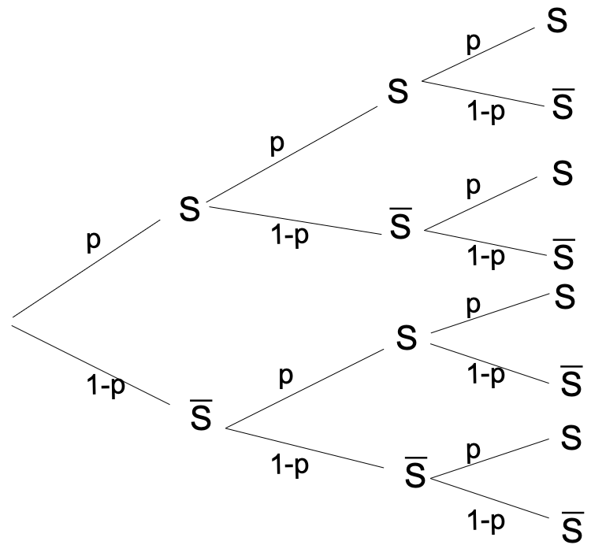
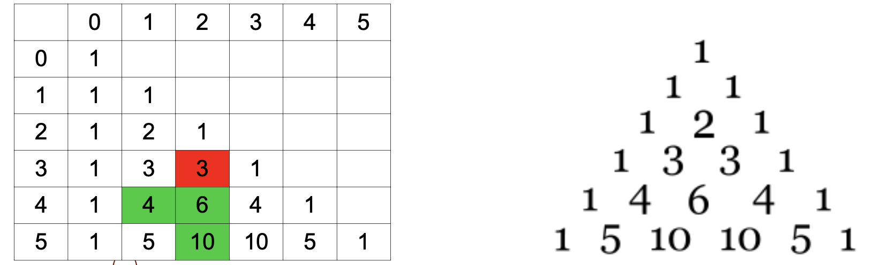
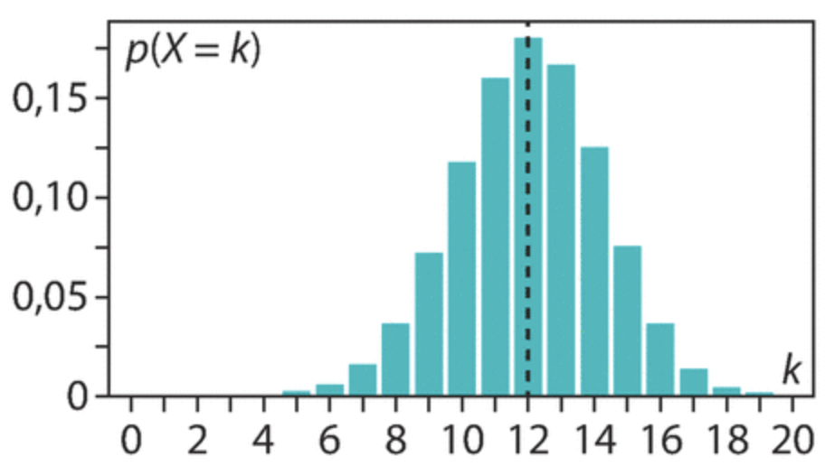
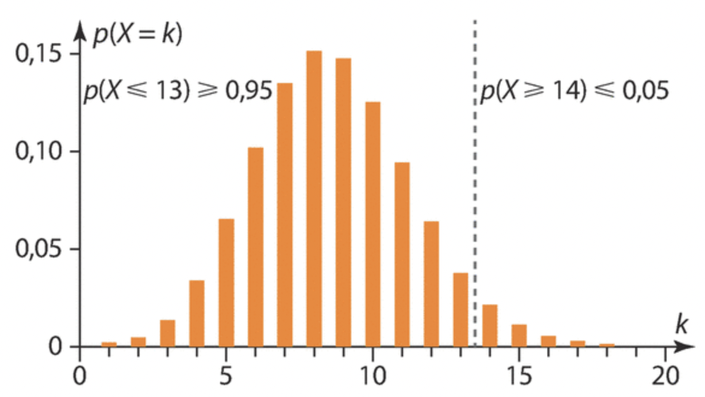
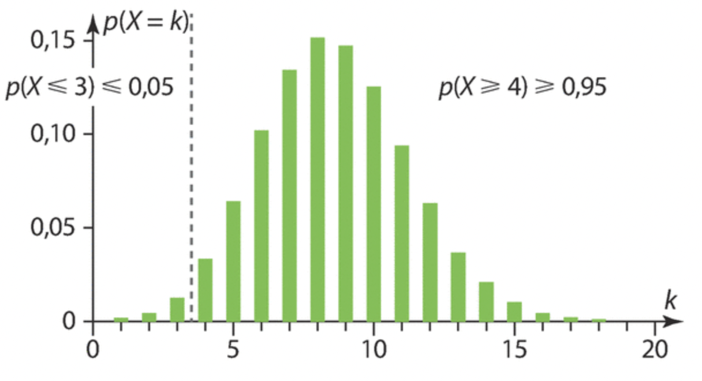
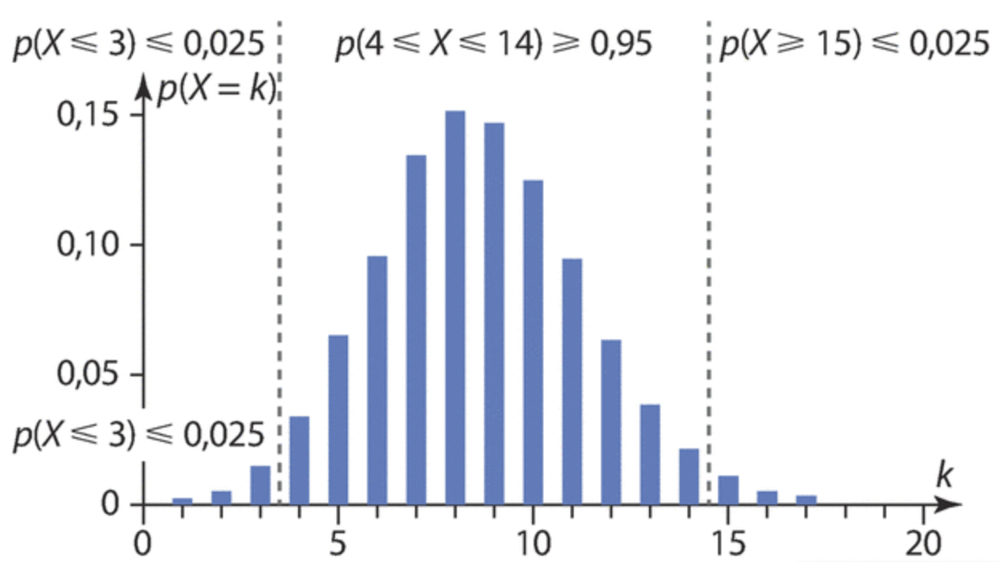

```css
```
```{=html}
<style>
:root {
  --def-color:   #2563eb;
  --prop-color:  #7c3aed;
  --voc-color:   #0d9488;
  --rem-color:   #d97706;
  --ex-color:    #16a34a;
  --app-color:   #ea580c;
  --not-color:   #4f46e5;
  --meth-color:  #dc2626;
  --ill-color:   #475569;
}

.definition, .proposition, .vocabulaire, .remarque, .exemple, .application,
.notation, .methode, .illustration {
  margin: 1.5em 0;
  padding: 1em 1.3em 1em 1.3em;
  border-radius: 10px;
  border-left: 6px solid;
  box-shadow: 0 1px 4px rgba(0,0,0,0.08);
  font-family: "Georgia", serif;
}

.definition::before, .proposition::before, .vocabulaire::before,
.remarque::before, .exemple::before, .application::before,
.notation::before, .methode::before, .illustration::before {
  display: block;
  font-family: "Helvetica Neue", Arial, sans-serif;
  font-weight: 700;
  font-size: 0.95em;
  letter-spacing: 0.03em;
  text-transform: uppercase;
  margin-bottom: 0.6em;
}

.definition {
  background: #eff6ff;
  border-color: var(--def-color);
  color: #1e3a5f;
}
.definition::before {
  content: "📘  Définition";
  color: var(--def-color);
}

.proposition {
  background: #f5f3ff;
  border-color: var(--prop-color);
  color: #3b2467;
}
.proposition::before {
  content: "📐  Proposition";
  color: var(--prop-color);
}

.vocabulaire {
  background: #f0fdfa;
  border-color: var(--voc-color);
  color: #0f4c46;
}
.vocabulaire::before {
  content: "🏷️  Vocabulaire";
  color: var(--voc-color);
}

.remarque {
  background: #fffbeb;
  border-color: var(--rem-color);
  color: #6b4a06;
}
.remarque::before {
  content: "💡  Remarque";
  color: var(--rem-color);
}

.exemple {
  background: #f0fdf4;
  border-color: var(--ex-color);
  color: #14532d;
}
.exemple::before {
  content: "🔍  Exemple";
  color: var(--ex-color);
}

.application {
  background: #fff7ed;
  border: 2px dashed var(--app-color);
  border-left: 6px solid var(--app-color);
  color: #7c2d12;
}
.application::before {
  content: "✏️  Application";
  color: var(--app-color);
  font-size: 1.05em;
}

.notation {
  background: #eef2ff;
  border-color: var(--not-color);
  color: #312e81;
}
.notation::before {
  content: "🖊️  Notation";
  color: var(--not-color);
}

.methode {
  background: #fef2f2;
  border-color: var(--meth-color);
  color: #7f1d1d;
}
.methode::before {
  content: "🧭  Méthode";
  color: var(--meth-color);
}

.illustration {
  background: #f8fafc;
  border-color: var(--ill-color);
  color: #1e293b;
}
.illustration::before {
  content: "🖼️  Illustration";
  color: var(--ill-color);
}

/* Callouts "Solution" un peu plus stylés */
div.callout-caution {
  border-radius: 10px;
  box-shadow: 0 1px 4px rgba(0,0,0,0.08);
}
div.callout-caution .callout-title {
  font-family: "Helvetica Neue", Arial, sans-serif;
  font-weight: 700;
}
div.callout-caution .callout-title::before {
  content: "🔓  ";
}
</style>
```

\gdef\R{\mathbb{R}}

\gdef\N{\mathbb{N}}

# Rappel sur les variables aléatoires

## Exemple

::::: {.application}
On lance 2 fois de suite une pièce de monnaie supposée équilibrée. On appelle $P$ l'événement « on obtient pile » et $F$ l'événement « on obtient face ». Une éventualité se présente comme un couple de lettres éventuellement identiques. L'univers $\Omega$ de cette expérience est $\Omega=\{PP,FF,PF,FP\}$. Toutes ces issues sont équiprobables.

:::: {.columns}

::: {.column width="50%"}
On décide que :

- si on obtient 2 fois pile, on gagne 2 € ;
- si on obtient 2 fois face, on perd 1 € ;
- dans tous les autres cas, on perd 0,50 €.
:::

::: {.column width="50%"}
{fig-alt="Arbre des issues du double lancer et gain associé à chaque issue" fig-align="center"}
:::

::::
:::::

:::{.callout-caution collapse="true"}
## Solution

La fonction $X$ qui, à chaque issue de $\Omega$, associe le gain du joueur, prend comme valeurs : $x_1=2$, $x_2=-1$ et $x_3=-0{,}5$.

L'événement « $X$ prend la valeur $2$ » se note $(X=2)$.

Sa probabilité est $p_1=P(X=2)=\dfrac{1}{4}$. De même, $p_2=P(X=-1)=\dfrac{1}{4}$ et $p_3=P(X=-0{,}5)=\dfrac{1}{2}$.

On résume en général la loi de probabilité de $X$ dans un tableau.

| $x_i$ | $2$            | $-1$           | $-0{,}5$       |
|-------|----------------|----------------|----------------|
| $p_i$ | $\dfrac{1}{4}$ | $\dfrac{1}{4}$ | $\dfrac{1}{2}$ |
:::

## Variable aléatoire réelle et loi de probabilité

::: {.definition}
Soit $\Omega$ l'univers d'une expérience aléatoire.

Une variable aléatoire $X$ sur $\Omega$ est une fonction définie de $\Omega$ dans $\R$.

Si $x_i$ désigne la valeur prise par $X$, on note $(X=x_i)$ l'événement « $X$ prend la valeur $x_i$ ».

La loi de probabilité de la variable $X$ associe à chaque valeur $x_i$ la probabilité de l'événement $(X=x_i)$.

On présente habituellement cette loi sous forme d'un tableau :

| $x_i$            | $x_1$ | $x_2$ | $\dots$ | $x_n$ |
|------------------|-------|-------|---------|-------|
| $P(\{X=x_i\})$   | $p_1$ | $p_2$ | $\dots$ | $p_n$ |
:::

::: {.remarque}
Comme pour toute loi de probabilité, on a toujours : $\displaystyle\sum_{i=1}^n p_i=1$.
:::

::: {.notation}
Soit $a$ un réel.

On note $\{X\geqslant a\}$ l'événement « la variable aléatoire $X$ prend une valeur supérieure ou égale à la valeur $a$ ».

On peut définir de la même manière les événements $\{X>a\}$, $\{X<a\}$ et $\{X\leqslant a\}$.
:::

## Espérance, variance et écart-type

::: {.definition}
Soit $X$ une variable aléatoire de loi de probabilité :

| $x_i$            | $x_1$ | $x_2$ | $\dots$ | $x_n$ |
|------------------|-------|-------|---------|-------|
| $P(\{X=x_i\})$   | $p_1$ | $p_2$ | $\dots$ | $p_n$ |

On appelle espérance de $X$ le nombre réel, noté $E(X)$, défini par :

$$
E(X)=\sum_{i=1}^n x_i\times P(X=x_i)
$$
:::

::: {.remarque}
$E(X)$ s'interprète comme la valeur moyenne des valeurs prises par $X$ lorsque l'expérience est répétée un grand nombre de fois.
:::

::: {.application}
Reprenons la première application (lancer de deux pièces) :

| $x_i$ | $2$            | $-1$           | $-0{,}5$       |
|-------|----------------|----------------|----------------|
| $p_i$ | $\dfrac{1}{4}$ | $\dfrac{1}{4}$ | $\dfrac{1}{2}$ |

Calculer l'espérance de $X$ et interpréter le résultat.
:::

:::{.callout-caution collapse="true"}
## Solution

$E(X)=2\times\dfrac{1}{4}+(-1)\times\dfrac{1}{4}+(-0{,}5)\times\dfrac{1}{2}=0$.

Sur un grand nombre de parties, le joueur gagne en moyenne $0$ € par partie.
:::

::: {.vocabulaire}
- Si l'espérance est nulle, on dit que le jeu est équitable.
- Si l'espérance est positive, on dit que le jeu est favorable au joueur.
- Si l'espérance est négative, on dit que le jeu est défavorable au joueur.
:::

::: {.proposition}
**Linéarité de l'espérance**

Soit $X$ une variable aléatoire et $a$ et $b$ deux réels.

$$
E(aX+b)=aE(X)+b
$$
:::

:::{.callout-caution collapse="true"}
## Solution

Soit $X$ une variable aléatoire dont la loi de probabilité est :

| $x_i$            | $x_1$ | $x_2$ | $\dots$ | $x_n$ |
|------------------|-------|-------|---------|-------|
| $P(\{X=x_i\})$   | $p_1$ | $p_2$ | $\dots$ | $p_n$ |

Soit $a$ et $b$ deux réels. La variable aléatoire $aX+b$ suit la loi de probabilité :

| $ax_i+b$              | $ax_1+b$ | $ax_2+b$ | $\dots$ | $ax_n+b$ |
|-----------------------|----------|----------|---------|----------|
| $P(\{X=x_i\})$        | $p_1$    | $p_2$    | $\dots$ | $p_n$    |

On peut remarquer que seules les valeurs de la variable aléatoire changent, pas les probabilités correspondantes.

Par définition de l'espérance on a :

$$
\begin{align*}
E(aX+b)&=\sum_{i=1}^n (ax_i+b)\times P(X=x_i) \\
&=\sum_{i=1}^n \left[ ax_i\times P(X=x_i)+b\times P(X=x_i)\right] \\
&=a\sum_{i=1}^n x_i\times P(X=x_i)+b\sum_{i=1}^n P(X=x_i) \\
&=aE(X)+b
\end{align*}
$$
:::

::: {.definition}
Soit $X$ une variable aléatoire dont la loi de probabilité est :

| $x_i$            | $x_1$ | $x_2$ | $\dots$ | $x_n$ |
|------------------|-------|-------|---------|-------|
| $P(\{X=x_i\})$   | $p_1$ | $p_2$ | $\dots$ | $p_n$ |

On appelle variance de $X$ le nombre réel positif, noté $V(X)$, défini par :

$$
V(X)=\sum_{i=1}^n\left[x_i-E(X)\right]^2\times P(X=x_i)
$$
:::

::: {.proposition}
**Formule de König-Huygens**

$$
V(X)=\sum_{i=1}^n x_i^2\times P(X=x_i)-\left[E(X)\right]^2
$$
:::

:::{.callout-caution collapse="true"}
## Solution

Si la variable aléatoire $X$ prend respectivement les valeurs $x_1,x_2,\dots,x_n$ avec les probabilités $p_1,p_2,\dots,p_n$, alors la variable aléatoire $X^2$ prend respectivement les valeurs $x_1^2,\dots,x_n^2$ avec les probabilités $p_1,\dots,p_n$. Ainsi :

$$
\begin{align*}
V(X)&=\sum_{i=1}^n\left[x_i-E(X)\right]^2\times p_i \\
&=\sum_{i=1}^n\left(x_i^2-2\times E(X)\times x_i+E(X)^2\right)p_i \\
&=\sum_{i=1}^n\left(x_i^2p_i-2\times E(X)\times x_ip_i+E(X)^2p_i\right) \\
&=\sum_{i=1}^n x_i^2p_i+\sum_{i=1}^n\left(-2\times E(X)\times x_ip_i\right)+\sum_{i=1}^n E(X)^2p_i \\
&=E(X^2)-2E(X)\times\sum_{i=1}^n x_ip_i+E(X)^2\sum_{i=1}^n p_i \\
&=E(X^2)-2E(X)\times E(X)+E(X)^2 \\
&=E(X^2)-E(X)^2
\end{align*}
$$
:::

::: {.application}
Reprenons la première application (lancer de deux pièces) :

| $x_i$ | $2$            | $-1$           | $-0{,}5$       |
|-------|----------------|----------------|----------------|
| $p_i$ | $\dfrac{1}{4}$ | $\dfrac{1}{4}$ | $\dfrac{1}{2}$ |

Calculer la variance de $X$.
:::

:::{.callout-caution collapse="true"}
## Solution

$V(X)=2^2\times\dfrac{1}{4}+(-1)^2\times\dfrac{1}{4}+(-0{,}5)^2\times\dfrac{1}{2}-0^2=1{,}375$.
:::

::: {.proposition}
Soit $X$ une variable aléatoire et $a$ et $b$ deux réels.

$$
V(aX+b)=a^2V(X)
$$
:::

:::{.callout-caution collapse="true"}
## Solution

Avec les mêmes notations :

$$
\begin{align*}
V(aX+b)&=E\left((aX+b)^2\right)-\left[E(aX+b)\right]^2 \\
&=E(a^2X^2+2abX+b^2)-\left[aE(X)+b\right]^2 \\
&=a^2E(X^2)+2abE(X)+b^2-\left[a^2E(X)^2+2abE(X)+b^2\right] \\
&=a^2E(X^2)+2abE(X)+b^2-a^2E(X)^2-2abE(X)-b^2 \\
&=a^2E(X^2)-a^2E(X)^2 \\
&=a^2\left(E(X^2)-E(X)^2\right) \\
&=a^2V(X)
\end{align*}
$$
:::

::: {.definition}
Soit $X$ une variable aléatoire dont la loi de probabilité est :

| $x_i$            | $x_1$ | $x_2$ | $\dots$ | $x_n$ |
|------------------|-------|-------|---------|-------|
| $P(\{X=x_i\})$   | $p_1$ | $p_2$ | $\dots$ | $p_n$ |

On appelle écart-type de $X$ le nombre réel positif, noté $\sigma(X)$, défini par :

$$
\sigma(X)=\sqrt{V(X)}
$$
:::

::: {.remarque}
Comme en statistiques, l'écart-type permet de se donner une idée de la dispersion des valeurs prises par une variable autour de son espérance en tenant compte des probabilités.

Plus l'écart-type est « grand », plus les valeurs prises par la variable aléatoire sont « éloignées » de l'espérance. Dans le cas d'un gain, plus il est grand, plus le jeu est risqué.
:::

# Épreuve et loi de Bernoulli

## Définitions

::: {.definition}
On appelle épreuve de Bernoulli de paramètre $p$ ($p\in[0;1]$) une expérience aléatoire admettant exactement deux issues. L'une est appelée « succès », notée $S$, dont la probabilité est $p$, l'autre est appelée « échec », notée $\overline{S}$, dont la probabilité est $1-p$.
:::

::: {.definition}
On dit que la variable aléatoire $X$ suit la loi de Bernoulli de paramètre $p$ si :

- $X$ prend la valeur $0$ si l'issue de l'épreuve est l'échec ou la valeur $1$ si l'issue de l'épreuve est le succès ;
- $P(X=1)=p$ et $P(X=0)=1-p$.
:::

::: {.exemple}
1. Lors du lancer d'un dé équilibré à six faces, on appelle succès le fait d'obtenir un $6$. Cette expérience aléatoire est une épreuve de Bernoulli de paramètre $\dfrac{1}{6}$.
2. On tire une carte au hasard dans un jeu de 32 cartes. On considère la variable aléatoire $X$ qui prend la valeur $1$ si la carte tirée est un cœur et $0$ sinon. $X$ suit la loi de Bernoulli de paramètre $\dfrac{1}{4}$.
:::

## Espérance, variance, écart-type

::: {.proposition}
Soit $X$ une variable aléatoire qui suit la loi de Bernoulli de paramètre $p$.

- $E(X)=p$
- $V(X)=p(1-p)$
- $\sigma(X)=\sqrt{p(1-p)}$
:::

:::{.callout-caution collapse="true"}
## Solution

- $E(X)=0\times P(X=0)+1\times P(X=1)=0\times(1-p)+1\times p=p$
- $V(X)=0^2\times P(X=0)+1^2\times P(X=1)-\left[E(X)\right]^2=0\times(1-p)+1\times p-p^2=p(1-p)$
:::

::: {.exemple}
Un feu tricolore peut être au rouge, à l'orange ou au vert.

Ce feu tricolore reste 25 secondes au vert, 10 secondes à l'orange et 25 secondes au rouge.

On se présente un très grand nombre de fois devant ce feu. En moyenne, combien de fois allons-nous rencontrer un feu vert ?
:::

:::{.callout-caution collapse="true"}
## Solution

Se présenter à un feu tricolore est une épreuve de Bernoulli de succès $S$ « le feu est au vert » (et donc $\overline{S}$ « le feu est au rouge ou à l'orange »).

On note $X$ la variable aléatoire égale à $1$ si le feu est vert, et $0$ sinon. La probabilité que le feu soit vert est $p=\dfrac{5}{12}$.

$E(X)=\dfrac{5}{12}$
:::

# Schéma de Bernoulli

Soit $n$ un entier naturel non nul et $p$ un réel de $[0;1]$.

## Définition, arbre pondéré

::: {.definition}
L'expérience aléatoire consistant à répéter $n$ fois de manière identique et indépendante une épreuve de Bernoulli de paramètre $p$ s'appelle un schéma de Bernoulli de paramètres $n$ et $p$.
:::

::: {.remarque}
Un schéma de Bernoulli peut s'illustrer par un arbre pondéré. L'arbre permet de compter le nombre de chemins correspondant à un nombre de succès donné.
:::

::::: {.exemple}
:::: {.columns}

::: {.column width="50%"}
On réalise trois fois de suite une épreuve de Bernoulli de paramètre $p$.

Les issues de cette expérience sont $SSS$, $SS\overline{S}$, $S\overline{S}S$, $S\overline{S}\,\overline{S}$, $\dots$

On s'intéresse aux issues comportant 2 succès lors des 3 répétitions. Ce sont $SS\overline{S}$, $S\overline{S}S$ et $\overline{S}SS$.

La probabilité de chacune de ces issues est égale à $p^2(1-p)$.
:::

::: {.column width="50%"}
{fig-alt="Arbre pondéré d'un schéma de Bernoulli à trois répétitions" fig-align="center"}
:::

::::
:::::

## Coefficients binomiaux

::: {.definition}
On considère un schéma de Bernoulli de paramètres $n\in\N^*$ et $p\in[0;1]$. Soit $k\in\N$ tel que $0\leqslant k\leqslant n$.

Le coefficient binomial $\dbinom{n}{k}$ (se lit « $k$ parmi $n$ ») est le nombre de façons d'obtenir exactement $k$ succès parmi les $n$ épreuves.
:::

::: {.remarque}
Par convention $\dbinom{0}{0}=1$.
:::

::: {.proposition}
Soit $n\in\N^*$. Soit $k\in\N$ tel que $0\leqslant k\leqslant n$.

- $\dbinom{n}{0}=1$
- $\dbinom{n}{n}=1$
- $\dbinom{n}{k}=\dbinom{n}{n-k}$
:::

:::{.callout-caution collapse="true"}
## Solution

Soit $n\in\N^*$. Soit $k\in\N$ tel que $0\leqslant k\leqslant n$.

- Il n'y a qu'un seul chemin ne contenant aucun succès (autrement dit, il n'y a qu'un seul chemin ne contenant que des échecs). Donc $\dbinom{n}{0}=1$.
- Il n'y a qu'un seul chemin ne contenant que des succès. Donc $\dbinom{n}{n}=1$.
- Il y a autant de chemins qui réalisent $k$ succès que de chemins qui réalisent $k$ échecs, c'est-à-dire $n-k$ succès. Donc $\dbinom{n}{k}=\dbinom{n}{n-k}$.
:::

## Triangle de Pascal

::: {.proposition}
**Formule de Pascal**

Pour tous entiers naturels $n$ et $k$ tels que $1\leqslant k\leqslant n-1$,

$$
\dbinom{n-1}{k-1}+\dbinom{n-1}{k}=\dbinom{n}{k}
$$
:::

:::{.callout-caution collapse="true"}
## Solution

Avec les mêmes notations : $\dbinom{n}{k}$ est le nombre de chemins qui réalisent $k$ succès parmi $n$ répétitions. Il y en a de deux types :

- ceux qui commencent par un succès : il reste alors $k-1$ succès parmi $n-1$ répétitions. Il y en a $\dbinom{n-1}{k-1}$ ;
- ceux qui commencent par un échec : il reste alors $k$ succès parmi $n-1$ répétitions. Il y en a $\dbinom{n-1}{k}$.

Donc $\dbinom{n}{k}=\dbinom{n-1}{k-1}+\dbinom{n-1}{k}$.
:::

::: {.illustration}
**Construction du triangle de Pascal**

On peut déterminer les $\dbinom{n}{k}$ de proche en proche à l'aide du triangle de Pascal. Pour cela :

- étape 1 : $\dbinom{0}{0}=1$ ;
- étape 2 : $\dbinom{n}{0}=1$ assure que la première colonne ne contient que des $1$ ;
- étape 3 : $\dbinom{n}{n}=1$ assure que la dernière colonne ne contient que des $1$ ;
- étape 4 : $\dbinom{n-1}{k-1}+\dbinom{n-1}{k}=\dbinom{n}{k}$ permet de déterminer n'importe quel coefficient binomial à partir de deux connus auparavant. On obtient chaque nombre du tableau en additionnant le nombre juste au-dessus et celui situé à gauche sur la ligne précédente.
:::

:::{.callout-caution collapse="true"}
## Solution

Par exemple, pour $n=5$ :

{fig-alt="Triangle de Pascal jusqu'à n = 5" fig-align="center"}

On lit : $\color{red}{\dbinom{3}{2}=3}$

On détermine : $\color{blue}{\dbinom{5}{2}=\dbinom{4}{1}+\dbinom{4}{2}}$
:::

::: {.remarque}
La calculatrice permet d'obtenir les coefficients binomiaux, notamment si $n$ et $k$ sont « grands » (calculatrice NumWorks : boîte à outils, puis dénombrement, puis `binomial(n,k)`).
:::

# Loi binomiale

Soit $n$ un entier naturel non nul et $p$ un nombre réel de $[0;1]$.

## Définition et propriété

::: {.definition}
Soit $X$ la variable aléatoire comptant le nombre de succès dans un schéma de Bernoulli de paramètres $n$ et $p$.

On dit que $X$ suit la loi binomiale de paramètres $n$ et $p$, notée $B(n;p)$.
:::

::: {.application}
Un QCM comporte 20 questions. Pour chacune d'elles, quatre réponses sont proposées dont une seule est correcte. Un élève choisit au hasard une réponse à chaque question indépendamment des autres. La variable aléatoire $X$ compte le nombre de réponses correctes données par l'élève.

Justifier que $X$ suit une loi binomiale et préciser les paramètres.
:::

:::{.callout-caution collapse="true"}
## Solution

*Épreuve de Bernoulli :*

La réponse à chaque question est une épreuve de Bernoulli de succès « la réponse est correcte » de probabilité $p=\dfrac{1}{4}$.

*Schéma de Bernoulli :*

On répète 20 fois de manière identique et indépendante chaque épreuve de Bernoulli précédente.

*Loi binomiale :*

$X$ suit donc la loi binomiale $B\left(20;\dfrac{1}{4}\right)$.
:::

::: {.proposition}
Soit $X$ une variable aléatoire qui suit la loi binomiale $B(n;p)$.

Pour tout entier $k$ tel que $0\leqslant k\leqslant n$ :

$$
P(\{X=k\})=\dbinom{n}{k}p^k(1-p)^{n-k}
$$
:::

:::{.callout-caution collapse="true"}
## Solution

Dans un schéma de $n$ épreuves de Bernoulli, la variable aléatoire qui compte les succès prend pour valeurs $0,1,2,\dots,n$.

Pour un entier $k$ compris entre $0$ et $n$, l'événement $\{X=k\}$ est représenté dans l'arbre par les chemins qui comportent $k$ succès et donc $n-k$ échecs ; il y en a $\dbinom{n}{k}$.

Chacun de ces chemins comporte $k$ fois $S$ et $n-k$ fois $\overline{S}$ et a donc pour probabilité :

$$
p^{\text{nombre de }S}\times(1-p)^{\text{nombre de }\overline{S}}
$$

Il en résulte que $P(\{X=k\})=\dbinom{n}{k}p^k(1-p)^{n-k}$.
:::

::: {.remarque}
La calculatrice permet de calculer $P(\{X=k\})$ et $P(\{X\leqslant k\})$ (calculatrice NumWorks : probabilités, puis binomiale). L'utilisation de la calculatrice pour calculer directement $P(\{X\geqslant k\})$ n'est pas autorisée.
:::

::: {.application}
Reprenons l'exemple précédent où $X$ suit la loi binomiale de paramètres $B\left(20;\dfrac{1}{4}\right)$.

Calculer, à l'aide de la calculatrice, $P(\{X=12\})$ et $P(\{X\geqslant 10\})$.
:::

## Espérance, variance et écart-type

::: {.proposition}
Soit $X$ une variable aléatoire qui suit la loi binomiale $B(n;p)$.

- $E(X)=np$
- $V(X)=np(1-p)$
- $\sigma(X)=\sqrt{np(1-p)}$
:::

::: {.remarque}
La démonstration de cette proposition sera étudiée dans le chapitre « Somme de variables aléatoires ».
:::

::: {.application}
Reprenons l'exemple précédent où $X$ suit la loi binomiale de paramètres $B\left(20;\dfrac{1}{4}\right)$.

Calculer l'espérance de $X$ et interpréter le résultat. Calculer ensuite la variance puis l'écart-type.
:::

:::{.callout-caution collapse="true"}
## Solution

$E(X)=20\times\dfrac{1}{4}=5$

Sur un grand nombre d'élèves répondant à ce QCM, le nombre moyen de bonnes réponses est de $5$.

$V(X)=20\times\dfrac{1}{4}\times\dfrac{3}{4}=3{,}75$ et $\sigma(X)=\sqrt{3{,}75}\approx 1{,}94$.
:::

## Représentation graphique

::: {.proposition}
**Représentation graphique (proposition admise)**

Soit $X$ une variable aléatoire suivant la loi binomiale $B(n;p)$. Le diagramme en barres associé à $X$ est en forme de cloche, approximativement centré sur son espérance.
:::

::::: {.exemple}
:::: {.columns}

::: {.column width="50%"}
Le diagramme en barres associé à la loi $B(20;0{,}6)$, sur lequel $k$ varie de $0$ à $20$ en abscisses, montre, pour chaque valeur de $k$, la hauteur de la barre correspondant à $P(X=k)$.

Par exemple, pour $k=10$, $P(X=10)\approx 0{,}12$.

Le diagramme est en forme de cloche et approximativement centré sur $12$ (l'espérance correspondant à cette loi).

Ce diagramme est quasiment symétrique par rapport à la droite d'équation $x=12$ tracée en pointillés.
:::

::: {.column width="50%"}
{fig-alt="Diagramme en barres de la loi binomiale B(20 ; 0,6)" fig-align="center"}
:::

::::
:::::

# Échantillonnage

::: {.definition}
Soit $X$ une variable aléatoire suivant une loi binomiale, $\alpha\in\,]0;1[$ un réel, et $a$ et $b$ deux réels.

Un intervalle $[a;b]$ tel que $P(a\leqslant X\leqslant b)\geqslant 1-\alpha$ est appelé intervalle de fluctuation au seuil $1-\alpha$ (ou au risque $\alpha$) associé à $X$.
:::

::: {.proposition}
**(admise)**

Soit $X$ une variable aléatoire suivant une loi binomiale et un réel $\alpha\in\,]0;1[$.

- L'intervalle $[0;b]$ où $b$ est le plus petit entier tel que $P(X\leqslant b)\geqslant 1-\alpha$ est un intervalle de fluctuation « à gauche » au seuil de $1-\alpha$ associé à $X$.
- L'intervalle $[a;n]$ où $a$ est le plus petit entier tel que $P(X\leqslant a)>\alpha$, et où $n$ est le nombre de répétitions associé à $X$, est un intervalle de fluctuation « à droite » au seuil de $1-\alpha$ associé à $X$.
- L'intervalle $[a;b]$ où $a$ et $b$ sont les plus petits entiers vérifiant respectivement $P(X\leqslant a)>\dfrac{\alpha}{2}$ et $P(X\leqslant b)\geqslant 1-\dfrac{\alpha}{2}$ est un intervalle de fluctuation centré (ou bilatéral) au seuil de $1-\alpha$.
:::

::::::: {.exemple}
On considère une variable aléatoire $X$ suivant la loi $B(43;0{,}2)$ et $\alpha=0{,}05$ (donc $1-\alpha=0{,}95$).

:::::: {.columns}

::::: {.column width="50%"}
**1)** On a $P(X\leqslant 12)\approx 0{,}927$ donc $P(X\leqslant 12)<0{,}95$ et $P(X\leqslant 13)\approx 0{,}964$ donc $P(X\leqslant 13)\geqslant 0{,}95$.

Ainsi, $[0;13]$ est un intervalle de fluctuation au seuil $0{,}95$ associé à $X$ : on est sûr, à au moins 95 %, qu'il n'y aura pas plus de 13 succès sur les 43 répétitions.
:::::

::::: {.column width="50%"}
{fig-alt="Diagramme en barres de B(43 ; 0,2) et intervalle de fluctuation à gauche" fig-align="center"}
:::::

::::::

:::::: {.columns}

::::: {.column width="50%"}
**2)** On a $P(X\leqslant 3)\approx 0{,}018$ donc $P(X\leqslant 3)\leqslant 0{,}05$ et $P(X\leqslant 4)\approx 0{,}051$ donc $P(X\leqslant 4)>0{,}05$.

Ainsi, $[4;43]$ est un intervalle de fluctuation au seuil $0{,}95$ associé à $X$ : on est sûr, à au moins 95 %, qu'il n'y aura pas moins de 4 succès sur les 43 répétitions.
:::::

::::: {.column width="50%"}
{fig-alt="Diagramme en barres de B(43 ; 0,2) et intervalle de fluctuation à droite" fig-align="center"}
:::::

::::::

:::::: {.columns}

::::: {.column width="50%"}
**3)** On remarque que $\dfrac{\alpha}{2}=0{,}025$ et $1-\dfrac{\alpha}{2}=0{,}975$.

On a $P(X\leqslant 3)\approx 0{,}018\leqslant 0{,}025$ et $P(X\leqslant 4)\approx 0{,}051>0{,}025$.

On a $P(X\leqslant 13)\approx 0{,}964<0{,}975$ et $P(X\leqslant 14)\approx 0{,}984\geqslant 0{,}975$.

Ainsi, $[4;14]$ est un intervalle de fluctuation centré au seuil $0{,}95$ associé à $X$ : on est sûr, à au moins 95 %, d'avoir entre 4 et 14 succès sur les 43 répétitions.
:::::

::::: {.column width="50%"}
{fig-alt="Diagramme en barres de B(43 ; 0,2) et intervalle de fluctuation centré" fig-align="center"}
:::::

::::::
:::::::
