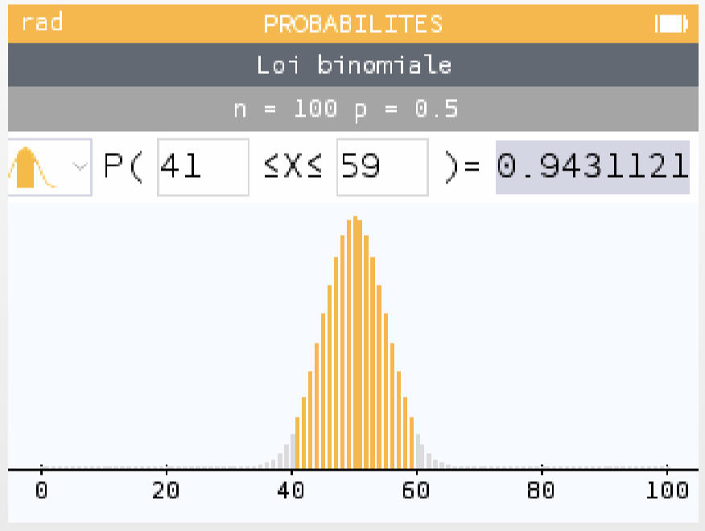
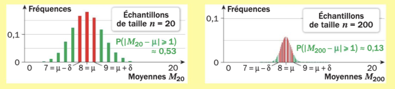

```css
```
```{=html}
<style>
:root {
  --def-color:   #2563eb;
  --prop-color:  #7c3aed;
  --theo-color:  #c026d3;
  --voc-color:   #0d9488;
  --rem-color:   #d97706;
  --ex-color:    #16a34a;
  --app-color:   #ea580c;
  --not-color:   #4f46e5;
  --meth-color:  #dc2626;
  --ill-color:   #475569;
}

.definition, .proposition, .theoreme, .vocabulaire, .remarque, .exemple, .application,
.notation, .methode, .illustration {
  margin: 1.5em 0;
  padding: 1em 1.3em 1em 1.3em;
  border-radius: 10px;
  border-left: 6px solid;
  box-shadow: 0 1px 4px rgba(0,0,0,0.08);
  font-family: "Georgia", serif;
}

.definition::before, .proposition::before, .theoreme::before, .vocabulaire::before,
.remarque::before, .exemple::before, .application::before,
.notation::before, .methode::before, .illustration::before {
  display: block;
  font-family: "Helvetica Neue", Arial, sans-serif;
  font-weight: 700;
  font-size: 0.95em;
  letter-spacing: 0.03em;
  text-transform: uppercase;
  margin-bottom: 0.6em;
}

.definition {
  background: #eff6ff;
  border-color: var(--def-color);
  color: #1e3a5f;
}
.definition::before {
  content: "📘  Définition";
  color: var(--def-color);
}

.proposition {
  background: #f5f3ff;
  border-color: var(--prop-color);
  color: #3b2467;
}
.proposition::before {
  content: "📐  Proposition";
  color: var(--prop-color);
}

.theoreme {
  background: #fdf4ff;
  border-color: var(--theo-color);
  color: #701a75;
}
.theoreme::before {
  content: "🏛️  Théorème";
  color: var(--theo-color);
}

.vocabulaire {
  background: #f0fdfa;
  border-color: var(--voc-color);
  color: #0f4c46;
}
.vocabulaire::before {
  content: "🏷️  Vocabulaire";
  color: var(--voc-color);
}

.remarque {
  background: #fffbeb;
  border-color: var(--rem-color);
  color: #6b4a06;
}
.remarque::before {
  content: "💡  Remarque";
  color: var(--rem-color);
}

.exemple {
  background: #f0fdf4;
  border-color: var(--ex-color);
  color: #14532d;
}
.exemple::before {
  content: "🔍  Exemple";
  color: var(--ex-color);
}

.application {
  background: #fff7ed;
  border: 2px dashed var(--app-color);
  border-left: 6px solid var(--app-color);
  color: #7c2d12;
}
.application::before {
  content: "✏️  Application";
  color: var(--app-color);
  font-size: 1.05em;
}

.notation {
  background: #eef2ff;
  border-color: var(--not-color);
  color: #312e81;
}
.notation::before {
  content: "🖊️  Notation";
  color: var(--not-color);
}

.methode {
  background: #fef2f2;
  border-color: var(--meth-color);
  color: #7f1d1d;
}
.methode::before {
  content: "🧭  Méthode";
  color: var(--meth-color);
}

.illustration {
  background: #f8fafc;
  border-color: var(--ill-color);
  color: #1e293b;
}
.illustration::before {
  content: "🖼️  Illustration";
  color: var(--ill-color);
}

/* Callouts "Solution" un peu plus stylés */
div.callout-caution {
  border-radius: 10px;
  box-shadow: 0 1px 4px rgba(0,0,0,0.08);
}
div.callout-caution .callout-title {
  font-family: "Helvetica Neue", Arial, sans-serif;
  font-weight: 700;
}
div.callout-caution .callout-title::before {
  content: "🔓  ";
}
</style>
```

# Inégalités

## Inégalité de Markov

::: {.theoreme}
Soit $X$ une variable aléatoire réelle positive ou nulle d'espérance $E(X)$.\
Pour tout réel $a$ strictement positif, $P(X \geqslant a) \leqslant \frac{E(X)}{a}$.\
Cette inégalité est appelée l'inégalité de Markov.
:::

::: {.callout-caution collapse="true"}
## Solution

Soit $X$ une variable aléatoire réelle positive ou nulle.\
Soit $a \in \mathbb{R}^{+*}$.\
Soit $Y$ la variable aléatoire définie par $\begin{cases}Y=a \text{ si } X \geqslant a\\Y=0 \text{ sinon}\end{cases}$\
Comme $X\geqslant 0$ et $a>0$ alors $X \geqslant Y$. Ainsi, $E(X) \geqslant E(Y)$.\
Or, $E(Y)=a \times P(Y=a) +0 \times P(Y=0)=a \times P(X \geqslant a)$\
Donc, $E(X) \geqslant aP(X\geqslant a)$\
Donc, $\frac{E(X)}{a}\geqslant P(X\geqslant a)$ car $a>0$.\
:::

::: {.remarque}
-   Ce résultat signifie que la probabilité que $X$ prenne des valeurs supérieures ou égales à $a$ est d'autant plus faible que $a$ est grand.

-   Si $a\leqslant E(X)$ alors l'inégalité de Markov n'a plus d'intérêt car $\frac{E(X)}{a}$ est supérieur ou égal à 1.

-   Cette inégalité permet de trouver un majorant mais pas forcément le plus petit possible.
:::

::: {.exemple}
Soit $X$ une variable aléatoire positive d'espérance 1.\
D'après l'inégalité de Markov, on a $P(X \geqslant 100) \leqslant 0{,}01$.\
Autrement dit, une variable positive d'espérance 1 a au plus 1 chance sur 100 de dépasser 100.
:::

::: {.application}
On sait que le nombre moyen de voitures fabriquées dans une usine en une journée est de 50. On appelle $X$ la variable aléatoire donnant le nombre de voitures fabriquées chaque jour.\
Que peut-on dire de la probabilité que l'usine produise au moins 75 voitures par jour ?\
:::

::: {.callout-caution collapse="true"}
## Solution

Le nombre de voitures produites est un nombre positif ou nul, ainsi $X$ est une variable aléatoire positive ou nulle.\
D'après l'inégalité de Markov : $P(X \geqslant 75) \leqslant \frac{50}{75}$ donc $P(X\geqslant75)\leqslant \frac{2}{3}$.
:::

## Inégalité de Bienaymé-Tchebychev

::: {.theoreme}
Soit $X$ une variable aléatoire d'espérance $E(X)$ et de variance $V(X)$.\
Pour tout réel $a$ strictement positif, $P(|X-E(X)|\geqslant a) \leqslant \frac{V(X)}{a^2}$.\
Cette inégalité est appelée l'inégalité de Bienaymé-Tchebychev.
:::

::: {.callout-caution collapse="true"}
## Solution

Soit $X$ une variable aléatoire.\
Soit $a \in \mathbb{R}^{+*}$.\
$|X-E(X)|\geqslant a \iff [X-E(X)]^2 \geqslant a^2$\
La variable $[X-E(X)]^2$ est positive ou nulle.\
D'après l'inégalité de Markov : $P([X-E(X)]^2\geqslant a^2) \leqslant \frac{E([X-E(X)]^2)}{a^2}$\
Or, $E([X-E(X)]^2)=V(X)$\
Donc, $P([X-E(X)]^2\geqslant a^2)\leqslant \frac{V(X)}{a^2}$ et donc, $P(|X-E(X)|\geqslant a)\leqslant \frac{V(X)}{a^2}$.
:::

::: {.remarque}
-   Ce résultat signifie que la probabilité que les valeurs prises par $X$ s'écartent d'au moins $a$ de $E(X)$ est d'autant plus faible que $a$ est grand.

-   $P(|X-E(X)|<a)=P(E(X)-a< X < E(X)+a)=1-P(|X-E(X)|\geqslant a)$

-   On dit que $]E(X)-a;E(X)+a[$ est un intervalle de fluctuation de $X$.

-   Cette inégalité permet de trouver un majorant mais pas forcément le plus petit possible.
:::

::: {.application}
On reprend l'exemple précédent.\
Donner une autre majoration de la probabilité que la production atteigne ou dépasse 75 voitures en une journée sachant que $V(X)=25$.\
:::

::: {.callout-caution collapse="true"}
## Solution

Il faut « centrer » $X$ en lui retranchant son espérance.\
$P(X \geqslant 75)=P(X-50 \geqslant 25)$\
Or, $P(X-50 \geqslant 25) \leqslant P(|X-50|\geqslant25)$\
D'après l'inégalité de Bienaymé-Tchebychev : $P(|X-50|\geqslant 25) \leqslant \frac{25}{25^2}$ donc $P(|X-50|\geqslant 25) \leqslant \frac{1}{25}$.
:::

::: {.exemple}
On lance une pièce équilibrée 100 fois de suite.\
La variable aléatoire $X$ compte le nombre de Pile obtenus.\
$X$ suit la loi binomiale de paramètres $n=100$ et $p=\frac{1}{2}$.\
L'espérance de $X$ est $E(X)=100 \times \frac{1}{2}=50$ et la variance de $X$ est $V(X)=100 \times \frac{1}{2} \times \frac{1}{2}=25$.\
D'après l'inégalité de Bienaymé-Tchebychev, pour tout $a \in \mathbb{R}^{+*}$ : $P(|X-50|\geqslant a) \leqslant \frac{25}{a^2}$.\
Par exemple, pour $a=10$, $P(|X-50|\geqslant 10) \leqslant 0{,}25$.\
La probabilité que l'écart de $X$ à $E(X)$ soit supérieur ou égal à 10 est inférieure ou égale à 0,25.\
Or, $P(|X-50|<10)=1-P(|X-50|\geqslant 10)$. Donc, $P(|X-50|<10)\geqslant 0{,}75$.\
La probabilité que $X$ prenne une valeur dans l'intervalle $]40;60[$ est supérieure ou égale à 0,75.

{fig-alt="Diagramme en barres de la loi binomiale B(100 ; 0,5) et intervalle ]40;60[" width="55%" fig-align="center"}
:::

# Loi des grands nombres

## Inégalité de concentration

::: {.theoreme}
Soit $X$ une variable aléatoire d'espérance $E(X)$ et de variance $V(X)$.\
Soit $M_n$ la variable aléatoire moyenne d'un échantillon de taille $n$ de $X$ ;\
autrement dit, $M_n=\frac{1}{n}\displaystyle{\sum_{i=1}^{n}X_i}$, où les $X_i$ sont indépendantes et de même loi de probabilité (celle de $X$).\
Pour tout réel $a$ strictement positif, $P(|M_n-E(X)|\geqslant a) \leqslant \frac{V(X)}{na^2}$.\
Cette inégalité est appelée l'inégalité de concentration.
:::

::: {.callout-caution collapse="true"}
## Solution

On a déjà montré dans le chapitre « Somme de variables aléatoires » que $E(M_n)=E(X)$ et $V(M_n)=\frac{V(X)}{n}$.\
Il suffit ensuite d'appliquer l'inégalité de Bienaymé-Tchebychev à $M_n$.
:::

::: {.exemple}
Dans une société de démarchage par téléphone, on estime que 40% des personnes appelées répondent effectivement.\
On appelle $n$ personnes, la variable aléatoire $X_i$ prend la valeur 1 si la $i$-ième personne appelée répond et 0 sinon. Les variables aléatoires $X_i$ sont indépendantes et de même loi (de Bernoulli de paramètre $p=0{,}4$). $E(X_i)=p=0{,}4$ et $V(X_i)=p(1-p)=0{,}4\times 0{,}6=0{,}24$.\
D'après l'inégalité de concentration : Pour tout $a \in \mathbb{R}^{+*}$, $P(|M_n-0{,}4|\geqslant a)\leqslant \frac{0{,}24}{na^2}$\
Par exemple, pour $a=0{,}1$ et pour $n=1000$, $P(|M_n-0{,}4|\geqslant0{,}1)\leqslant 0{,}024$\
On dit que l'on obtient pour $M_n$ une précision de 0,1 avec un risque de 0,024.\
Lorsqu'on appelle 1000 personnes, la probabilité que le nombre de personnes qui répondent soit en dehors de l'intervalle $]300;500[$ est inférieure ou égale à 0,024.
:::

## Loi faible des grands nombres

::: {.proposition}
Soit $X$ une variable aléatoire d'espérance $E(X)$ et de variance $V(X)$.\
Soit $M_n$ la variable aléatoire moyenne d'un échantillon de taille $n$ de $X$ ;\
autrement dit, $M_n=\frac{1}{n}\displaystyle{\sum_{i=1}^{n}X_i}$, où les $X_i$ sont indépendantes et de même loi de probabilité (celle de $X$).\
Pour tout réel $a$ strictement positif, $\lim\limits_{n \to +\infty} P(|M_n-E(X)|\geqslant a)=0$
:::

::: {.callout-caution collapse="true"}
## Solution

On reprend l'inégalité de concentration : $0 \leqslant P(|M_n-E(X)|\geqslant a) \leqslant \frac{V(X)}{na^2}$\
Or, $\lim\limits_{n \to +\infty} \frac{1}{n}=0$ donc, par produit $\lim\limits_{n \to +\infty} \frac{V(X)}{na^2}=0$\
D'après le théorème des gendarmes : $\lim\limits_{n \to +\infty} P(|M_n-E(X)|\geqslant a)=0$
:::

::: {.remarque}
Ce résultat signifie que plus la taille d'un échantillon d'une variable aléatoire $X$ est grande, plus l'écart entre la moyenne de cet échantillon et l'espérance de la variable aléatoire $X$ est faible (autrement dit, plus la taille de l'échantillon est grande, plus les moyennes sont regroupées autour de l'espérance).
:::

{fig-alt="Répartition des moyennes d'échantillons de taille 20 puis 200 : plus la taille augmente, plus les moyennes se concentrent autour de l'espérance" width="90%" fig-align="center"}
