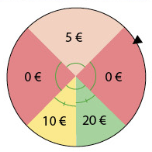

```css
```
```{=html}
<style>
:root {
  --def-color:   #2563eb;
  --prop-color:  #7c3aed;
  --theo-color:  #c026d3;
  --voc-color:   #0d9488;
  --rem-color:   #d97706;
  --ex-color:    #16a34a;
  --app-color:   #ea580c;
  --not-color:   #4f46e5;
  --meth-color:  #dc2626;
  --ill-color:   #475569;
}

.definition, .proposition, .theoreme, .vocabulaire, .remarque, .exemple, .application,
.notation, .methode, .illustration {
  margin: 1.5em 0;
  padding: 1em 1.3em 1em 1.3em;
  border-radius: 10px;
  border-left: 6px solid;
  box-shadow: 0 1px 4px rgba(0,0,0,0.08);
  font-family: "Georgia", serif;
}

.definition::before, .proposition::before, .theoreme::before, .vocabulaire::before,
.remarque::before, .exemple::before, .application::before,
.notation::before, .methode::before, .illustration::before {
  display: block;
  font-family: "Helvetica Neue", Arial, sans-serif;
  font-weight: 700;
  font-size: 0.95em;
  letter-spacing: 0.03em;
  text-transform: uppercase;
  margin-bottom: 0.6em;
}

.definition {
  background: #eff6ff;
  border-color: var(--def-color);
  color: #1e3a5f;
}
.definition::before {
  content: "📘  Définition";
  color: var(--def-color);
}

.proposition {
  background: #f5f3ff;
  border-color: var(--prop-color);
  color: #3b2467;
}
.proposition::before {
  content: "📐  Proposition";
  color: var(--prop-color);
}

.theoreme {
  background: #fdf4ff;
  border-color: var(--theo-color);
  color: #701a75;
}
.theoreme::before {
  content: "🏛️  Théorème";
  color: var(--theo-color);
}

.vocabulaire {
  background: #f0fdfa;
  border-color: var(--voc-color);
  color: #0f4c46;
}
.vocabulaire::before {
  content: "🏷️  Vocabulaire";
  color: var(--voc-color);
}

.remarque {
  background: #fffbeb;
  border-color: var(--rem-color);
  color: #6b4a06;
}
.remarque::before {
  content: "💡  Remarque";
  color: var(--rem-color);
}

.exemple {
  background: #f0fdf4;
  border-color: var(--ex-color);
  color: #14532d;
}
.exemple::before {
  content: "🔍  Exemple";
  color: var(--ex-color);
}

.application {
  background: #fff7ed;
  border: 2px dashed var(--app-color);
  border-left: 6px solid var(--app-color);
  color: #7c2d12;
}
.application::before {
  content: "✏️  Application";
  color: var(--app-color);
  font-size: 1.05em;
}

.notation {
  background: #eef2ff;
  border-color: var(--not-color);
  color: #312e81;
}
.notation::before {
  content: "🖊️  Notation";
  color: var(--not-color);
}

.methode {
  background: #fef2f2;
  border-color: var(--meth-color);
  color: #7f1d1d;
}
.methode::before {
  content: "🧭  Méthode";
  color: var(--meth-color);
}

.illustration {
  background: #f8fafc;
  border-color: var(--ill-color);
  color: #1e293b;
}
.illustration::before {
  content: "🖼️  Illustration";
  color: var(--ill-color);
}

/* Callouts "Solution" un peu plus stylés */
div.callout-caution {
  border-radius: 10px;
  box-shadow: 0 1px 4px rgba(0,0,0,0.08);
}
div.callout-caution .callout-title {
  font-family: "Helvetica Neue", Arial, sans-serif;
  font-weight: 700;
}
div.callout-caution .callout-title::before {
  content: "🔓  ";
}
</style>
```

# Somme de variables aléatoires

## Définitions

::: {.definition}
Soient $X$ et $Y$ deux variables aléatoires définies sur l'univers $\Omega$. Soit $a$ un réel.

-   On définit une variable aléatoire $Z$ telle que, pour tout élément $\omega \in \Omega$, $Z(\omega)=aX(\omega)$. On note $Z=aX$.

-   On définit une variable aléatoire $S$ telle que, pour tout élément $\omega \in \Omega$, $S(\omega)=X(\omega)+Y(\omega)$. On note $S=X+Y$.
:::

::: {.remarque}
-   On peut définir de la même façon la somme de $n$ variables aléatoires ($n \in \mathbb{N}^*$).

-   On peut définir de la même façon la variable aléatoire $X-Y$.
:::

::: {.application}
Un jeu consiste à lancer un dé équilibré numéroté de 1 à 6. Le nombre de points obtenus est le résultat du dé multiplié par 5.\
On note $X$ et $Y$ les variables aléatoires correspondant au résultat du dé et aux points obtenus.\
Déterminer la loi de probabilité de $Y$.
:::

::: {.callout-caution collapse="true"}
## Solution

Ainsi, $Y=5X$.\
La variable $Y$ prend ses valeurs dans l'ensemble $\{5;10;15;20;25;30\}$ et sa loi de probabilité est :\

|     $y$      |       5       |      10       |      15       |      20       |      25       |      30       |
|:------------:|:-------------:|:-------------:|:-------------:|:-------------:|:-------------:|:-------------:|
| $P(\{Y=y\})$ | $\frac{1}{6}$ | $\frac{1}{6}$ | $\frac{1}{6}$ | $\frac{1}{6}$ | $\frac{1}{6}$ | $\frac{1}{6}$ |
:::

::: {.application}
On lance un dé jaune équilibré à 4 faces et un dé vert équilibré à 6 faces.\
On note $J$ et $V$ les variables aléatoires correspondant au résultat du dé jaune et du dé vert.\
La variable aléatoire $S=J+V$ est la variable donnant la somme des résultats des deux dés.\
Donner la loi de probabilité de la variable aléatoire $S$.
:::

::: {.callout-caution collapse="true"}
## Solution

On peut dresser un tableau à double entrée pour lister toutes les sommes possibles.\

| $J \backslash V$ |  1  |  2  |  3  |  4  |  5  |  6  |
|:---:|:---:|:---:|:---:|:---:|:---:|:---:|
|  1  |  2  |  3  |  4  |  5  |  6  |  7  |
|  2  |  3  |  4  |  5  |  6  |  7  |  8  |
|  3  |  4  |  5  |  6  |  7  |  8  |  9  |
|  4  |  5  |  6  |  7  |  8  |  9  | 10  |

La variable aléatoire $S$ prend les valeurs de l'ensemble $\llbracket 2;10\rrbracket$ et sa loi de probabilité est donnée par :

|     $s$      |       2        |       3        |       4       |       5       |       6       |       7       |       8       |       9        |       10       |
|:------------:|:--------------:|:--------------:|:-------------:|:-------------:|:-------------:|:-------------:|:-------------:|:--------------:|:--------------:|
| $P(\{S=s\})$ | $\frac{1}{24}$ | $\frac{1}{12}$ | $\frac{1}{8}$ | $\frac{1}{6}$ | $\frac{1}{6}$ | $\frac{1}{6}$ | $\frac{1}{8}$ | $\frac{1}{12}$ | $\frac{1}{24}$ |
:::

## Espérance d'une somme de variables aléatoires

Dans cette partie, on considère une variable aléatoire $X$ définie sur $\Omega=\lbrace \omega_1;\omega_2; ... ;\omega_n \rbrace$ et on note $\lbrace x_1; x_2;...; x_p\rbrace$ l'ensemble des valeurs prises par $X$ où $n$ et $p$ sont des entiers naturels non nuls.

::: {.proposition}
**(admise)**\
$$E(X)=\sum \limits_{i=1}^n X(\omega_i)P(\lbrace \omega_i \rbrace)$$
:::

::: {.application}
Dans le cadre d'un lancer de dé cubique équilibré, on gagne 2  si on obtient un nombre pair et on perd 6  si on obtient un nombre impair. On note $X$ la variable aléatoire correspondant au gain remporté. Calculer l'espérance de $X$.
:::

::: {.callout-caution collapse="true"}
## Solution

L'espérance de la variable aléatoire $X$ correspondant au gain remporté s'élève à : $$E(X) = (-6)\times \dfrac{1}{6} + ... + 2 \times \dfrac{1}{6} = -2 \text{ €}$$
:::

::: {.proposition}
Soient $X$ et $Y$ deux variables aléatoires définies sur le même univers $\Omega$. Soit $a$ un réel. Alors :

-   $E(X+Y)=E(X)+E(Y)$

-   $E(aX)=aE(X)$
:::

::: {.callout-caution collapse="true"}
## Solution

-   Soient $X$, $Y$ et $Z$ trois variables aléatoires définies sur $\Omega$ telles que $Z=X+Y$.

    On a alors $E(X+Y)=E(Z)=\sum \limits_{i=1}^n Z(\omega_i)P(\lbrace \omega_i \rbrace) = \sum \limits_{i=1}^n (X+Y)(\omega_i)P(\lbrace \omega_i \rbrace)$.

    Or, $(X+Y)(\omega_i)=X(\omega_i) + Y(\omega_i)$.

    Donc $E(X+Y)=\sum \limits_{i=1}^n X(\omega_i)P(\lbrace \omega_i \rbrace) + \sum \limits_{i=1}^n Y(\omega_i)P(\lbrace \omega_i \rbrace)$.

    D'où $E(X+Y)=E(X)+E(Y)$ en identifiant les deux sommes précédentes à $E(X)$ et $E(Y)$.

-   Pour $a=0$ la propriété est évidente.\
    Considérons maintenant $a \neq 0$.

    En notant $x_1; ... x_n$, les valeurs prises par $X$, alors $aX$ prend les valeurs $ax_1; ... ax_n$.

    Par définition $E(aX) = \sum \limits_{i=1}^n ax_iP(aX=ax_i)$.

    Or $aX=ax_i$ si, et seulement si, $X=x_i$ donc $P(aX=ax_i)=P(X=x_i)$.

    Ainsi, $E(aX) = \sum \limits_{i=1}^n ax_iP(X=x_i) = a \times \sum \limits_{i=1}^n x_iP(X=x_i) = aE(X)$
:::

::: {.remarque}
-   Le premier point de cette propriété permet de déterminer l'espérance de $X+Y$ simplement à l'aide de celles de $X$ et $Y$ (donc sans la connaissance de la loi de probabilité de $X+Y$).

-   On a également $E(X-Y)=E(X)-E(Y)$.
:::

::: {.application}

Dans une fête foraine, un jeu de hasard se déroule en deux temps.\
Le joueur fait d'abord tourner la roue ci-dessous et gagne le montant indiqué dans le secteur obtenu. Puis, il pioche un jeton bonus dans un sac qui contient 25 jetons marqués 0 euros, 20 jetons marqués 2 euros et 5 jetons marqués 5 euros.

{fig-alt="Roue de la fête foraine partagée en secteurs de gains" width="35%" fig-align="center"}

1.  Définir deux variables aléatoires $X$ et $Y$ telles que $Z=X+Y$.

2.  Calculer l'espérance de $X$ et celle de $Y$.

3.  En déduire l'espérance de $Z$. Interpréter.
:::

::: {.callout-caution collapse="true"}
## Solution
1.  $X$ est la variable aléatoire correspondant au gain obtenu avec la roue.\
    La loi de probabilité de $X$ est :

    |   $x_i$    |       0       |       5       |      10       |      20       |
    |:----------:|:-------------:|:-------------:|:-------------:|:-------------:|
    | $P(X=x_i)$ | $\frac{1}{2}$ | $\frac{1}{4}$ | $\frac{1}{8}$ | $\frac{1}{8}$ |

    $Y$ est la variable aléatoire correspondant au gain obtenu avec le jeton.\
    La loi de probabilité de $Y$ est :

    |   $y_i$    |       0       |       2       |       5        |
    |:----------:|:-------------:|:-------------:|:--------------:|
    | $P(Y=y_i)$ | $\frac{1}{2}$ | $\frac{2}{5}$ | $\frac{1}{10}$ |

2.  $E(X)=0 \times \frac{1}{2} + 5 \times \frac{1}{4}+10 \times \frac{1}{8} + 20 \times \frac{1}{8} = 5$\
    $E(Y)=0 \times \frac{1}{2} + 2 \times \frac{2}{5}+ 5 \times \frac{1}{10}=1{,}3$

3.  $E(Z)=E(X+Y)=E(X)+E(Y)=5+1{,}3=6{,}3$\
    Sur un grand nombre de joueurs, le gain moyen par joueur est de $6{,}30$ euros.
:::

## Variance

::: {.definition}
$V(X) = \sum \limits_{i=1}^n (x_i-E(X))^2 P(X=x_i)$.
:::

::: {.definition}
Soient $X_1, X_2, ... , X_n$, $n$ variables aléatoires à valeurs respectivement dans $E_1, ...E_n$.\
On dit que $X_1, X_2, ... , X_n$ sont indépendantes lorsque, pour tous $x_1 \in E_1, ..., x_n \in E_n$ : $$P(X_1=x_1 \cap X_2=x_2 \cap ... \cap X_n=x_n) = P(X_1=x_1) \times P(X_2=x_2) \times ... \times P(X_n=x_n)$$
:::

::: {.remarque}
De manière intuitive, deux variables aléatoires sont indépendantes si les résultats de l'une n'ont pas d'influence sur les résultats de l'autre.
:::

::: {.proposition}
Soient $X$ et $Y$ deux variables aléatoires définies sur un même univers fini $\Omega$. Soit $a\in \mathbb{R}$. Alors :

-   $V(X+Y)=V(X)+V(Y)$ si $X$ et $Y$ sont deux variables aléatoires indépendantes

-   $V(aX)=a^2V(X)$

-   $\sigma(aX)=|a|\sigma(X)$
:::

::: {.callout-caution collapse="true"}
## Solution

-   Ce premier point est admis.

-   Si $a=0$, la propriété est évidente.\
    On suppose que $a\neq 0$.

    En notant $x_1;...x_n$ les valeurs prises par $X$, alors $aX$ prend les valeurs $ax_1;...ax_n$.

    Par définition, $V(aX) = \sum \limits_{i=1}^n (ax_i-E(aX))^2 P(aX=ax_i)$

    Donc $V(aX) = \sum \limits_{i=1}^n a^2(x_i-E(X))^2 P(X=x_i)$

    Ainsi $V(aX) = a^2\sum \limits_{i=1}^n (x_i-E(X))^2 P(X=x_i) = a^2V(X)$

-   $\sigma(aX)=\sqrt{V(aX)}=\sqrt{a^2V(X)}=|a|\sqrt{V(X)}=|a|\sigma(X)$.
:::

::: {.application}
On reprend l'exemple précédent. Calculer la variance de $Z$.
:::

::: {.callout-caution collapse="true"}
## Solution

$V(X)=(0-5)^2 \times \frac{1}{2} + (5-5)^2 \times \frac{1}{4}+(10-5)^2 \times \frac{1}{8} + (20-5)^2 \times \frac{1}{8} = 43{,}75$\
$V(Y)=(0-1{,}3)^2 \times \frac{1}{2} + (2-1{,}3)^2 \times \frac{2}{5}+ (5-1{,}3)^2 \times \frac{1}{10}=2{,}41$\
Les variables aléatoires $X$ et $Y$ sont indépendantes.\
$V(Z)=V(X)+V(Y)=43{,}75+2{,}41=46{,}16$
:::

# Applications

Dans cette partie, $n$ désigne un entier naturel non nul et $p$ désigne un nombre réel de l'intervalle $[0;1]$.

## Loi binomiale

::: {.definition}
Deux variables aléatoires sont dites identiquement distribuées lorsqu'elles ont la même loi de probabilité.
:::

::: {.proposition}
**(admise)**\
Toute variable aléatoire suivant une loi binomiale peut s'écrire comme une somme de variables aléatoires de Bernoulli indépendantes et identiquement distribuées.
:::

::: {.proposition}
Si $X$ suit une loi binomiale de paramètres $n$ et $p$, alors :

-   $E(X)=np$

-   $V(X)=np(1-p)$

-   $\sigma(X)=\displaystyle \sqrt{np(1-p)}$
:::

::: {.callout-caution collapse="true"}
## Solution

-   Soit $X$ une variable aléatoire suivant la loi binomiale de paramètres $n$ et $p$. Alors, il existe $n$ variables aléatoires de Bernoulli indépendantes, de paramètre $p$, telles que $X=X_1+...+X_n$.

    Ainsi, pour tout $k \in \left\lbrace1;...;n \right\rbrace$, $E(X_k)=p$ et $V(X_k)=p(1-p)$.

    Or, $E(X)=E(X_1+...+X_n)=E(X_1)+...+E(X_n)=p+...+p=np$

-   Les variables aléatoires $X_1, ... X_n$ étant indépendantes, par définition du schéma de Bernoulli, on a : $V(X)=V(X_1)+...+V(X_n)=p(1-p)+...+p(1-p)=np(1-p)$

-   $\sigma(X)=\displaystyle \sqrt{V(X)} = \displaystyle \sqrt{np(1-p)}$
:::

::: {.application}
On effectue 40 lancers d'une pièce équilibrée. Pour $i \in \llbracket 1;40\rrbracket$, $X_i$ est la variable aléatoire donnant 1 si la pièce tombe sur Pile et 0 sinon au $i$-ième lancer.

1.  Quelle est la loi suivie par $X=X_1+X_2+...+X_{40}$ ?

2.  À quoi correspond $X$ concrètement ?

3.  Déterminer $E(X)$.
:::

::: {.callout-caution collapse="true"}
## Solution

1.  Les $X_i$ étant toutes indépendantes et suivant une loi de Bernoulli de paramètre $p=0{,}5$, on peut en déduire que $X$ suit la loi binomiale de paramètres $n=40$ et $p=0{,}5$.

2.  $X$ est la variable aléatoire donnant le nombre de Pile obtenus à l'issue des 40 lancers.

3.  $E(X)=40 \times 0{,}5=20$.
:::

## Échantillons de $n$ variables aléatoires indépendantes et identiquement distribuées

On considère un entier naturel $n$ non nul et $X_1, ... X_n$, $n$ variables aléatoires définies sur $\Omega$ supposées indépendantes et identiquement distribuées.

On note $S_n=X_1+... + X_n$ la somme de ces $n$ variables aléatoires et $M_n=\dfrac{X_1+...+X_n}{n}$ la moyenne de ces $n$ variables aléatoires.

::: {.proposition}
Pour tout $k \in \left\lbrace 1;...;n \right\rbrace$, on a :

-   $E(S_n)=nE(X_k)$

-   $V(S_n)=nV(X_k)$

-   $\sigma(S_n)=\displaystyle \sqrt{n}\sigma(X_k)$
:::

::: {.callout-caution collapse="true"}
## Solution

-   La linéarité de l'espérance donne $E(S_n)=E(X_1)+...+E(X_n)$.\
    Or ces variables aléatoires suivent la même loi. Elles ont donc la même espérance.\
    D'où, pour tout $k \in\lbrace 1;...;n \rbrace$, $E(S_n)=nE(X_k)$

-   De la même manière, les variables aléatoires $X_1, ... X_n$ étant indépendantes, on a, pour tout $k \in\lbrace 1;...;n \rbrace$, $V(S_n)=V(X_1)+...+V(X_n) = nV(X_k)$

-   $\sigma(S_n)=\displaystyle\sqrt{V(S_n)} = \displaystyle\sqrt{nV(X_k)}=\displaystyle\sqrt{n}\sqrt{V(X_k)}= \displaystyle\sqrt{n}\sigma(X_k)$
:::

::: {.proposition}
Pour tout $k\in\lbrace 1;...;n \rbrace$, on a :

-   $E(M_n)=E(X_k)$

-   $V(M_n)=\dfrac{V(X_k)}{n}$

-   $\sigma(M_n)=\dfrac{\sigma(X_k)}{\displaystyle\sqrt{n}}$
:::

::: {.callout-caution collapse="true"}
## Solution

-   Soit $k\in\lbrace 1;...;n \rbrace$, la linéarité de l'espérance et la propriété précédente donnent\
    $E(M_n)=E\left(\dfrac{X_1+...+X_n}{n}\right) = E\left(\dfrac{S_n}{n}\right) = \dfrac{1}{n}E(S_n) = \dfrac{1}{n} \times n E(X_k) = E(X_k)$

-   On sait que, pour tout $a \in \mathbb{R}$, on a $V(aS_n)=a^2V(S_n)$\
    Donc $V(M_n)=V\left(\dfrac{S_n}{n}\right) = \dfrac{1}{n^2}V(S_n)=\dfrac{1}{n^2}\times n V(X_k) = \dfrac{V(X_k)}{n}$

-   $\sigma(M_n)=\displaystyle\sqrt{V(M_n)} = \displaystyle\sqrt{\dfrac{V(X_k)}{n}}=\dfrac{\sigma(X_k)}{\displaystyle\sqrt{n}}$
:::

::: {.application}
Le matin, suivant le temps dont elle dispose et selon sa faim, Carla mange une, deux ou trois tartines de beurre avec des probabilités respectives de 0,25 ; 0,62 et 0,13.\
On note $S$ la variable aléatoire donnant le nombre de tartines mangées par Carla au cours d'une semaine.

1.  Décomposer $S$ en une somme de variables aléatoires indépendantes suivant toutes une même loi que l'on précisera.

2.  Calculer $E(S)$ et $\sigma(S)$.
:::

::: {.callout-caution collapse="true"}
## Solution

1.  $S=X_1+X_2+...+X_7$, où pour $k\in\llbracket 1;7\rrbracket$, $X_k$ est une variable aléatoire donnant le nombre de tartines mangées par Carla le $k$-ième jour de la semaine.\
    La loi de probabilité de $X_k$ est donnée par :

    |    $x_i$     |  1   |  2   |  3   |
    |:------------:|:----:|:----:|:----:|
    | $P(X_k=x_i)$ | 0,25 | 0,62 | 0,13 |

2.  Les variables aléatoires $X_k$, pour $k\in\llbracket 1;7\rrbracket$, sont indépendantes et identiquement distribuées.\
    Donc, $E(S)=7E(X_1)=7(1 \times 0{,}25+2 \times 0{,}62 + 3 \times 0{,}13)=7 \times 1{,}88 = 13{,}16$\
    Sur un grand nombre de semaines, Carla va manger environ 13,16 tartines en moyenne durant chaque semaine.\
    $V(X_1) = (1^2 \times 0{,}25+2^2 \times 0{,}62 + 3^2 \times 0{,}13) - 1{,}88^2 \simeq 0{,}3656$\
    $\sigma(S)=\sqrt{7}\sigma(X_1) \simeq 1{,}600$
:::
