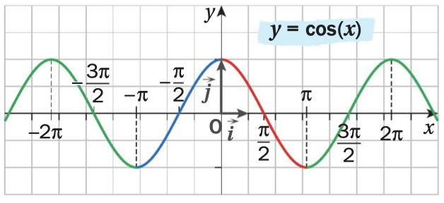
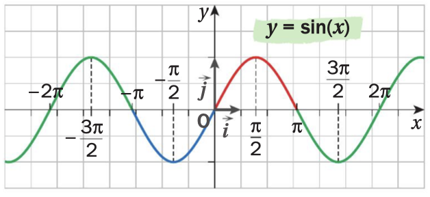
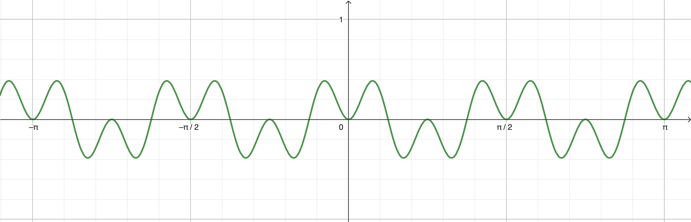

```css
```
```{=html}
<style>
:root {
  --def-color:   #2563eb;
  --prop-color:  #7c3aed;
  --theo-color:  #c026d3;
  --voc-color:   #0d9488;
  --rem-color:   #d97706;
  --ex-color:    #16a34a;
  --app-color:   #ea580c;
  --not-color:   #4f46e5;
  --meth-color:  #dc2626;
  --ill-color:   #475569;
}

.definition, .proposition, .theoreme, .vocabulaire, .remarque, .exemple, .application,
.notation, .methode, .illustration {
  margin: 1.5em 0;
  padding: 1em 1.3em 1em 1.3em;
  border-radius: 10px;
  border-left: 6px solid;
  box-shadow: 0 1px 4px rgba(0,0,0,0.08);
  font-family: "Georgia", serif;
}

.definition::before, .proposition::before, .theoreme::before, .vocabulaire::before,
.remarque::before, .exemple::before, .application::before,
.notation::before, .methode::before, .illustration::before {
  display: block;
  font-family: "Helvetica Neue", Arial, sans-serif;
  font-weight: 700;
  font-size: 0.95em;
  letter-spacing: 0.03em;
  text-transform: uppercase;
  margin-bottom: 0.6em;
}

.definition {
  background: #eff6ff;
  border-color: var(--def-color);
  color: #1e3a5f;
}
.definition::before {
  content: "📘  Définition";
  color: var(--def-color);
}

.proposition {
  background: #f5f3ff;
  border-color: var(--prop-color);
  color: #3b2467;
}
.proposition::before {
  content: "📐  Proposition";
  color: var(--prop-color);
}

.theoreme {
  background: #fdf4ff;
  border-color: var(--theo-color);
  color: #701a75;
}
.theoreme::before {
  content: "🏛️  Théorème";
  color: var(--theo-color);
}

.vocabulaire {
  background: #f0fdfa;
  border-color: var(--voc-color);
  color: #0f4c46;
}
.vocabulaire::before {
  content: "🏷️  Vocabulaire";
  color: var(--voc-color);
}

.remarque {
  background: #fffbeb;
  border-color: var(--rem-color);
  color: #6b4a06;
}
.remarque::before {
  content: "💡  Remarque";
  color: var(--rem-color);
}

.exemple {
  background: #f0fdf4;
  border-color: var(--ex-color);
  color: #14532d;
}
.exemple::before {
  content: "🔍  Exemple";
  color: var(--ex-color);
}

.application {
  background: #fff7ed;
  border: 2px dashed var(--app-color);
  border-left: 6px solid var(--app-color);
  color: #7c2d12;
}
.application::before {
  content: "✏️  Application";
  color: var(--app-color);
  font-size: 1.05em;
}

.notation {
  background: #eef2ff;
  border-color: var(--not-color);
  color: #312e81;
}
.notation::before {
  content: "🖊️  Notation";
  color: var(--not-color);
}

.methode {
  background: #fef2f2;
  border-color: var(--meth-color);
  color: #7f1d1d;
}
.methode::before {
  content: "🧭  Méthode";
  color: var(--meth-color);
}

.illustration {
  background: #f8fafc;
  border-color: var(--ill-color);
  color: #1e293b;
}
.illustration::before {
  content: "🖼️  Illustration";
  color: var(--ill-color);
}

/* Callouts "Solution" un peu plus stylés */
div.callout-caution {
  border-radius: 10px;
  box-shadow: 0 1px 4px rgba(0,0,0,0.08);
}
div.callout-caution .callout-title {
  font-family: "Helvetica Neue", Arial, sans-serif;
  font-weight: 700;
}
div.callout-caution .callout-title::before {
  content: "🔓  ";
}
</style>
```

# Parité et périodicité d'une fonction

::: {.definition}
Soit $f$ une fonction définie sur un intervalle $I$ de $\mathbb{R}$ et ${C_f}$ sa courbe représentative dans un repère orthogonal $(O,\vec{i},\vec{j})$ du plan.\
La fonction $f$ est:

-   **paire** si pour tout $x$ de $I$, $-x$ appartient à $I$ et $f(-x)=f(x)$.\
    Sa courbe représentative ${C_f}$ est alors symétrique par rapport à l'axe des ordonnées.

-   **impaire** si pour tout $x$ de $I$, $-x$ appartient à $I$ et $f(-x)= - f(x)$.\
    Sa courbe représentative ${C_f}$ est alors symétrique par rapport à l'origine $O$ du repère.

-   **périodique** de période $T$ ($T$ réel non nul), si pour tout $x$ de $I$, $x+T$ appartient à $I$ et $f(x+T)=f(x)$.\
    Sa courbe représentative ${C_f}$ est alors invariante par translation de vecteur $T\overrightarrow{i}$ ou $- T\overrightarrow{i}$.
:::

::: {.remarque}
-   La fonction cosinus est paire et $2\pi$-périodique.

    {fig-alt="Courbe de la fonction cosinus" width="45%" fig-align="center"}

-   La fonction sinus est impaire et $2\pi$-périodique.

    {fig-alt="Courbe de la fonction sinus" width="45%" fig-align="center"}
:::

::: {.application}
Soit $f$ la fonction définie sur $\mathbb{R}$ par $f(x)=\cos(4x)\sin^2(4x)$ dont on donne la représentation graphique ci-dessous.

{fig-alt="Courbe de la fonction f(x) = cos(4x) sin²(4x)" width="45%" fig-align="center"}

1.  Conjecturer graphiquement la parité et la périodicité de $f$.

2.  Démontrer ces conjectures.
:::

::: {.callout-caution collapse="true"}
## Solution

1.  La courbe représentative de $f$ semble symétrique par rapport à l'axe des ordonnées, donc on conjecture que $f$ est paire.\
    La courbe représentative de $f$ semble invariante par translation de vecteurs $\frac{\pi}{2}\overrightarrow{i}$ ou $\frac{-\pi}{2}\overrightarrow{i}$, donc on conjecture que $f$ est $\frac{\pi}{2}$-périodique.

2.  Soit $x \in \mathbb{R}$, $-x \in \mathbb{R}$ et\
    $f(-x)=\cos(-4x)\sin^2(-4x)$\
    $f(-x)=\cos(4x)(-\sin(4x))^2$ car la fonction cosinus est paire et la fonction sinus est impaire\
    $f(-x)=\cos(4x)\sin^2(4x)$\
    $f(-x)=f(x)$\
    donc $f$ est paire.

    Soit $x \in \mathbb{R}$, $x+\frac{\pi}{2} \in \mathbb{R}$ et\
    $f(x+\frac{\pi}{2})=\cos(4(x+\frac{\pi}{2}))\sin^2(4(x+\frac{\pi}{2}))$\
    $f(x+\frac{\pi}{2})=\cos(4x+2\pi)\sin^2(4x+2\pi)$\
    $f(x+\frac{\pi}{2})=\cos(4x)\sin^2(4x)$ car les fonctions cosinus et sinus sont $2\pi$-périodiques\
    $f(x+\frac{\pi}{2})=f(x)$\
    donc $f$ est $\frac{\pi}{2}$-périodique.\
:::

# Dérivation des fonctions cosinus et sinus

::: {.proposition}
**(admise)**

-   Les fonctions cosinus et sinus sont dérivables sur $\mathbb{R}$.

-   La dérivée de la fonction $x \mapsto \cos(x)$ est la fonction $x \mapsto -\sin(x)$.

-   La dérivée de la fonction $x \mapsto \sin(x)$ est la fonction $x \mapsto \cos(x)$.
:::

::: {.application}
Déterminer la dérivée de chacune des fonctions suivantes.

1.  Soit $f$ la fonction définie sur $\mathbb{R}$ par $f(x)=\cos(x)\sin(x)$.\

2.  Soit $g$ la fonction définie sur $\mathbb{R}$ par $g(x)=\cos^2(x)$.\

3.  Soit $h$ la fonction définie sur $\mathbb{R}\setminus \{\frac{\pi}{2}+k\pi, k\in \mathbb{Z}\}$ par $h(x)=\tan(x)=\frac{\sin(x)}{\cos(x)}$.\
:::

::: {.callout-caution collapse="true"}
## Solution
1.  Soit $f$ la fonction définie sur $\mathbb{R}$ par $f(x)=\cos(x)\sin(x)$.\
    Les fonctions cosinus et sinus sont dérivables sur $\mathbb{R}$ donc, par produit, $f$ est dérivable sur $\mathbb{R}$.\
    Soit $x \in \mathbb{R}$, $f'(x)=-\sin(x)\sin(x)+\cos(x)\cos(x)=\cos^2(x)-\sin^2(x)$

2.  Soit $g$ la fonction définie sur $\mathbb{R}$ par $g(x)=\cos^2(x)$.\
    Les fonctions cosinus et carré sont dérivables sur $\mathbb{R}$ donc, par composition, $g$ est dérivable sur $\mathbb{R}$.\
    Soit $x \in \mathbb{R}$, $g'(x)=2\cos(x)(-\sin(x))=-2\cos(x)\sin(x)$

3.  Soit $h$ la fonction définie sur $\mathbb{R}\setminus \{\frac{\pi}{2}+k\pi, k\in \mathbb{Z}\}$ par $h(x)=\tan(x)=\frac{\sin(x)}{\cos(x)}$.\
    La fonction sinus est dérivable sur $\mathbb{R}$ et la fonction cosinus est dérivable sur $\mathbb{R}$ et s'annule en $\frac{\pi}{2}+k\pi$ avec $k \in \mathbb{Z}$ donc, par quotient, $h$ est dérivable sur $\mathbb{R}\setminus \{\frac{\pi}{2}+k\pi, k\in \mathbb{Z}\}$.\
    Soit $x \in \mathbb{R}\setminus \{\frac{\pi}{2}+k\pi, k\in \mathbb{Z}\}$, $h'(x)=\frac{\cos(x)\cos(x)-\sin(x)(-\sin(x))}{\cos^2(x)}=\frac{\cos^2(x)+\sin^2(x)}{\cos^2(x)}=\frac{1}{\cos^2(x)}$
:::

::: {.proposition}
**(admise)**\
Soit $u$ une fonction dérivable sur un intervalle $I$ de $\mathbb{R}$.

-   La fonction $f$ définie sur $I$ par $f(x)=\cos(u(x))$ est dérivable sur $I$ et, pour tout $x$ de $I$, $$f'(x)=-u'(x)\sin(u(x))$$

-   La fonction $g$ définie sur $I$ par $g(x)=\sin(u(x))$ est dérivable sur $I$ et, pour tout $x$ de $I$, $$g'(x)=u'(x)\cos(u(x))$$
:::

::: {.application}
Déterminer la dérivée de chacune des fonctions suivantes.

1.  Soit $f$ la fonction définie sur $\mathbb{R}$ par $f(x)=\cos(5x+1)$.\

2.  Soit $g$ la fonction définie sur $\mathbb{R}$ par $g(x)=\sin(3x^2+5x-1)$.\
:::

::: {.callout-caution collapse="true"}
## Solution

1.  Soit $f$ la fonction définie sur $\mathbb{R}$ par $f(x)=\cos(5x+1)$.\
    $x \mapsto 5x+1$ est dérivable sur $\mathbb{R}$\
    La fonction cosinus est dérivable sur $\mathbb{R}$\
    Donc, par composition, $f$ est dérivable sur $\mathbb{R}$.\
    Soit $x \in \mathbb{R}$, $f'(x)=-5\sin(5x+1)$

2.  Soit $g$ la fonction définie sur $\mathbb{R}$ par $g(x)=\sin(3x^2+5x-1)$.\
    $x \mapsto3x^2+5x-1$ est dérivable sur $\mathbb{R}$\
    La fonction sinus est dérivable sur $\mathbb{R}$\
    Donc, par composition, $g$ est dérivable sur $\mathbb{R}$.\
    Soit $x \in \mathbb{R}$, $g'(x)=(6x+5)\cos(3x^2+5x-1)$
:::

# Limites

::: {.proposition}
-   Les fonctions sinus et cosinus n'ont pas de limite en $+\infty$ et $-\infty$.

-   $\lim\limits_{x \rightarrow 0} \dfrac{\sin(x)}{x}=1$
:::

::: {.callout-caution collapse="true"}
## Solution

-   Ce premier point est admis.

-   La fonction sinus est dérivable sur $\mathbb{R}$ donc notamment en 0.\
    Soit $x \in \mathbb{R}^*$.\
    Le taux de variation de la fonction sinus entre 0 et $0+x$ est $\frac{\sin(0+x)-\sin(0)}{x}=\frac{\sin(x)}{x}$\
    Lorsque $x$ tend vers 0, ce taux de variation tend vers le nombre dérivé de la fonction sinus en 0, c'est-à-dire $\sin'(0)=\cos(0)=1$.\
    Donc, $\lim\limits_{x \to 0} \frac{\sin(x)}{x}=1$
:::
